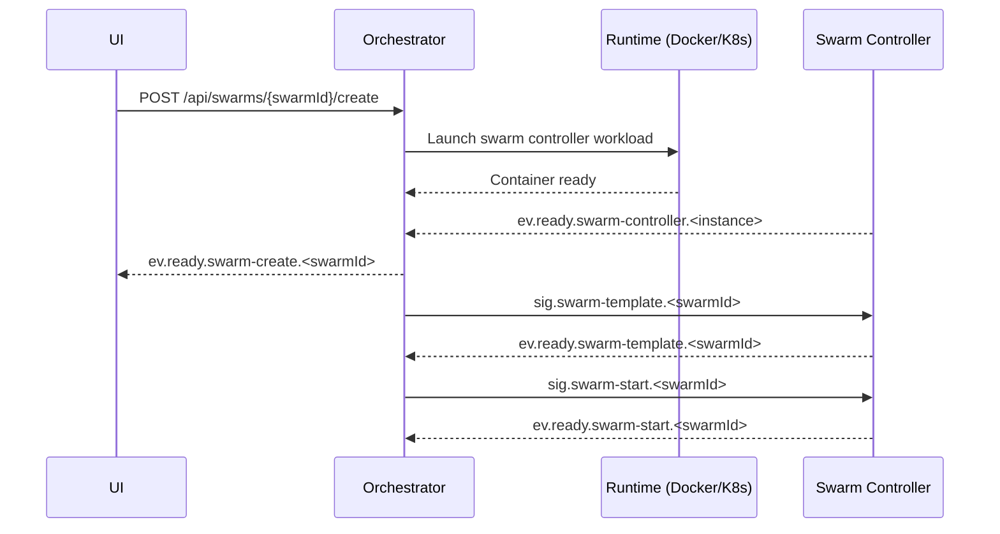
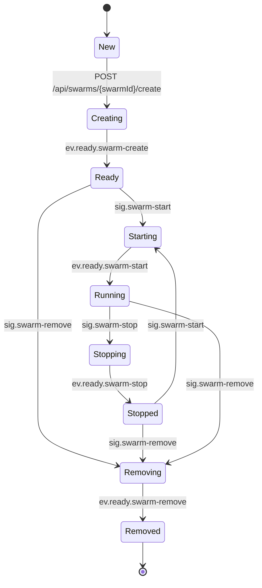

# PocketHive

PocketHive is a portable transaction swarm. It orchestrates containerised components that generate, moderate, process and analyse workloads through durable queues.

## Architecture

### Swarm at a glance

```mermaid
flowchart LR
  SM[Scenario Manager] --> UI[UI]
  UI <--> O["Orchestrator (Queen)"]
  O -. REST .-> OAPI[/POST /api/swarms/{swarmId}/create/]
  O --> SW[Swarm]
  subgraph SW
    direction TB
    M["Swarm Controller (Marshal)"] --> W["Workers (Bees)"]
  end
  M -. AMQP .-> W
  W --> SUT[(System Under Test)]
  W --> OBS[Observability]
```

### How a swarm comes to life



### Swarm lifecycle states



## Quick start
1. Install Docker.
2. Run `./start-hive.sh` (Linux/macOS) or `start-hive.bat` (Windows) to clean previous runs, build the images and launch RabbitMQ, services and the UI. Use `--help` to run individual stages (clean, build, start) when needed.
   - Alternatively run `docker compose up -d` directly to start the stack with your existing images.
3. Open <http://localhost:8088>. Only the Orchestrator (Queen) runs initially. Create and start swarms from the Hive view by selecting a scenario.

## Documentation
- [Docs index](docs/README.md)
- [Architecture reference](docs/ARCHITECTURE.md)
- [Roadmap](docs/ROADMAP.md)
- [Usage guide](docs/USAGE.md)
- [Contributor guide](CONTRIBUTING.md)

---

PocketHive · portable transaction · swarm
