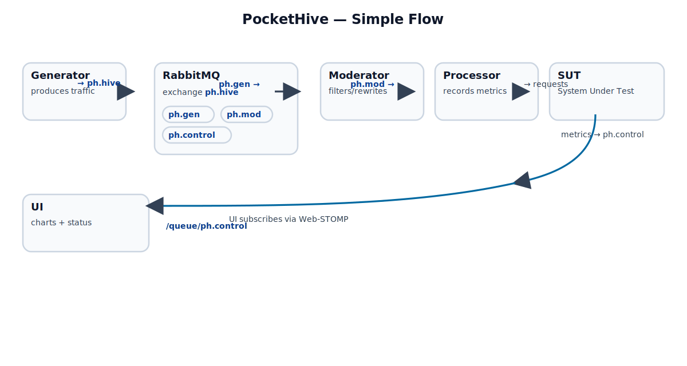

# PocketHive

<p align="center">
  
</p>

**PocketHive** is a portable transaction swarm: compact, composable components that let you generate, moderate, process, and test workloads with clear boundaries and durable queues.

<p align="center">
  
</p>

### Architecture

- UI connects to RabbitMQ via same‑origin Web‑STOMP proxy at `/ws`.
- Services publish/consume via the `ph.hive` exchange and `ph.gen`/`ph.mod` queues.
- Metrics/status flow back on the `ph.control` exchange, with each service auto-declaring its own `ph.control.<role>.<instance>` queue for broadcasts and direct signals.

### Control-plane Events & Signals

- Events (topic): `ev.{kind}.{role}.{instance}`
  - `kind`: `status-full`, `status-delta`, `lifecycle.*`, `metric.*`, `alert`
  - `role`: `generator|moderator|processor`
  - `instance`: UUID/unique ID
  - Envelope fields: `event, kind, version, role, instance, messageId, timestamp, queues{in,out}? , data`
- Signals (topic-friendly): `sig.<type>[.<role>[.<instance>]]`
  - Types are single-segment (no dots): `status-request`, `config-update`, `ping`, `link-request`
  - Bindings examples:
    - Global: `sig.status-request.#`
    - Role: `sig.status-request.<role>.#`
    - Instance: `sig.status-request.<role>.<instance>`
  - UI broadcast sends: `/exchange/ph.control/sig.status-request`

See also: Control Bindings page (Menu → Control Bindings) and `ui/spec/asyncapi.yaml`.

### Views

- Control View: existing dashboard with charts, event log, and system log.
- Hive View: auto-discovers components from Control messages and draws a simple graph:
  - Nodes appear when the first message from a service is received (generator, moderator, processor). SUT appears when processor is seen.
  - Default hold time is 3s (3× of 1s status schedule); toolbar lets you adjust hold time and Clear & Restart.
- Edges are built strictly from `queues.in/out` found in `status-full` events.

### Demo mode (no WebSocket)

- To host on static pages or preview without RabbitMQ, enable demo mode:
  - Set `"demo": true` in `ui/config.json`, or open with query `?demo=1`.
  - UI won’t auto-connect or ping `/healthz`, and connection controls are inert.

## Stack & Ports

- `rabbitmq` (with Web-STOMP): 5672 (AMQP), 15672 (Mgmt UI), 15674 (Web-STOMP, internal only)
- `ui` (nginx static site): 8088 → serves UI, proxies WebSocket at `/ws` to RabbitMQ
- `generator`, `moderator`, `processor`, `postprocessor`: Spring Boot services using AMQP
- `prometheus` (metrics store): 9090
- `grafana` (dashboard): 3000 (admin / admin)
- `loki` (log store): 3100
- `promtail` (log shipper): 9080

## Quick Start

Prereqs: Docker and Docker Compose.

1) Build and start

```
docker compose up -d --build
```

2) Open the UI

- UI: http://localhost:8088
- Click "Connect". The UI connects to RabbitMQ via same-origin WebSocket `ws://localhost:8088/ws` using StompJS (same client as the built‑in Generator).

3) RabbitMQ Management (optional)

- http://localhost:15672 (guest / guest)
- Web-STOMP plugin is enabled in the RabbitMQ image.

4) Metrics and Dashboards (optional)

- Prometheus: http://localhost:9090
- Grafana: http://localhost:3000 (admin / admin) with Prometheus and Loki datasources and a "Loki Logs" dashboard for viewing application logs
- Prometheus scrapes metrics from `postprocessor` at `/actuator/prometheus`.

## WebSocket Proxy (UI ←→ RabbitMQ)

- The UI does not connect directly to `localhost:15674`. Instead, nginx proxies `/ws` → `rabbitmq:15674/ws`.
- This avoids cross-origin/origin/CORS issues and works when the UI is accessed from a remote host.

Relevant files:

- `ui/nginx.conf` — reverse proxy for `/ws` and `/healthz`
- `docker-compose.yml` — mounts nginx config and exposes port 8088; adds healthcheck for UI
- `ui/assets/js/app.js` — defaults WS URL to same-origin `/ws`, includes system logs and health ping, and uses StompJS for Events handling.

## Healthchecks

- `rabbitmq`: built-in healthcheck via `rabbitmq-diagnostics ping`
- `ui`: HTTP `GET /healthz` returns `200 ok` (nginx). Compose healthcheck pings it every 10s.

Manual checks:

- UI health: `curl -s http://localhost:8088/healthz` → `ok`
- Mgmt UI: visit `http://localhost:15672`

## UI Panels

- Backgrounds: selector for Bees / Network / Old; only the active background renders (others paused to save CPU).
- Event Log: shows application events/messages from STOMP subscriptions.
- System Logs: shows system and user actions:
  - Connect/Disconnect clicks, edits of URL/username/password (password length only)
  - WebSocket lifecycle (connecting URL, CONNECTED, subscriptions, errors, close)
  - UI health transitions based on `/healthz`
- HAL eyes: status indicators for UI and WS (green slow pulse = healthy/connected; blue modem pulse = connecting; red fast pulse = failed/closed/idle).

## Troubleshooting

- WebSocket error in UI:
  - Ensure UI health shows "healthy" (see System Logs) and `/healthz` returns `ok`.
  - Verify RabbitMQ is healthy and Web-STOMP is enabled (Mgmt UI → Plugins).
  - Check browser devtools → Network → WS for the `/ws` handshake (should be 101 Switching Protocols).
  - If serving the UI over HTTPS, the app will use `wss://…/ws` automatically; ensure any reverse proxy forwards upgrades.
  - Avoid manually pointing to `ws://localhost:15674/ws` unless you expose that port and handle origins.

- Authentication / `guest` user:
  - RabbitMQ blocks remote logins for the built‑in `guest` user by default. If you access the UI from a remote host, either use the UI’s same‑origin `/ws` proxy (recommended) or create a non‑guest user.
  - Default: use built‑in `guest`/`guest`. The UI connects through a same‑origin proxy so remote logins work without creating a new user.
  - Optional: to create a dedicated non‑guest user, set `RABBITMQ_DEFAULT_USER`/`RABBITMQ_DEFAULT_PASS` in Compose and pass matching creds to services.
  - Alternative (dev only): relax `guest` loopback restriction via `rabbitmq.conf` mount if connecting directly without the proxy.

- Cannot access UI: ensure port 8088 is free or adjust the mapping in `docker-compose.yml`.

## Development Notes

- Static UI is served from `ui/`. Changes to HTML/CSS/JS are picked up on reload.
- Nginx config lives in `ui/nginx.conf` and is mounted into the `ui` container. After changing it, restart just the UI:

```
docker compose up -d --build ui
```

- Services use environment `RABBITMQ_HOST=rabbitmq` inside the Compose network.


---

PocketHive · portable transaction · swarm
