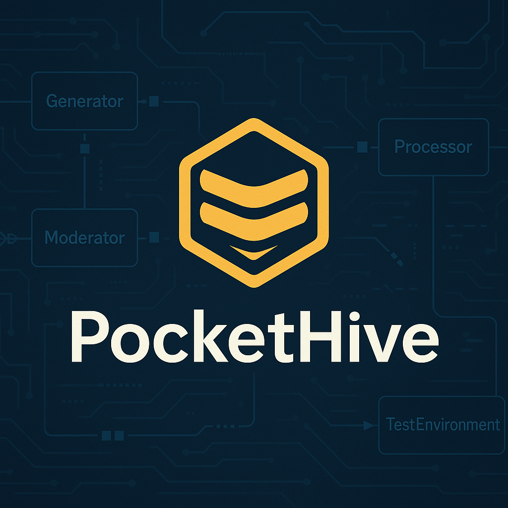

# PocketHive



## Overview
**PocketHive** is a lightweight, portable **transaction swarm simulator**.  
It is designed to generate realistic loads against payment and API processing systems, with support for multiple protocols such as **ISO-8583**, **SOAP**, and **REST**.

PocketHive focuses on being:
- **Scalable**: Easily run multiple generators, moderators, and processors.
- **Lightweight**: Packaged with Docker for portability.
- **Observable**: Integrated with OpenTelemetry and Grafana dashboards for real-time monitoring.
- **Extensible**: Components can be swapped or extended (e.g., different moderators, custom processors).

## Architecture
The core architecture consists of the following pipeline:

```
[ Generator(s) ] --> [ Queue ] --> [ Moderator ] --> [ Queue ] --> [ Processor ] --> [ Test Environment ]
```

- **Generator**: Produces messages (ISO-8583, SOAP, REST, etc.).
- **Moderator**: Shapes and controls throughput (e.g., bursts, throttling).
- **Processor**: Handles traffic routing into the target environment.
- **Test Environment**: The system under test (mock or real).

All components communicate asynchronously through AMQP (RabbitMQ).

## User Interface
PocketHive comes with a simple **web UI** that connects to RabbitMQ via Web-STOMP.  
The UI provides live status of:
- Generator throughput
- Moderator throughput
- Processor throughput

## Observability
- **OpenTelemetry** for distributed tracing and metrics.
- **Grafana Dashboards** for monitoring test activity.

---
