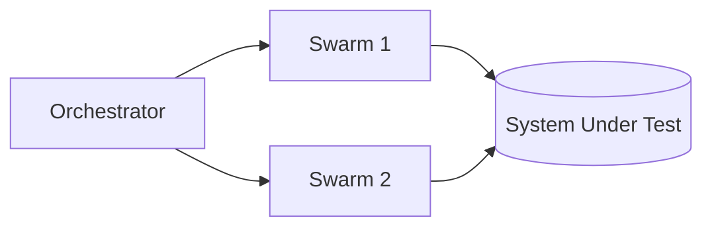

# PocketHive

PocketHive is a portable transaction swarm. It orchestrates containerised components that generate, moderate, process and analyse workloads through durable queues.

## Architecture

## Quick start
1. Install Docker.
2. Run `docker compose up -d` to launch RabbitMQ, services and the UI.
3. Open <http://localhost:8088> to explore the swarm.

## Documentation
- [Docs index](docs/README.md)
- [Architecture reference](docs/ARCHITECTURE.md)
- [Roadmap](docs/ROADMAP.md)
- [Usage guide](docs/USAGE.md)
- [Contributor guide](CONTRIBUTING.md)

---

PocketHive · portable transaction · swarm
