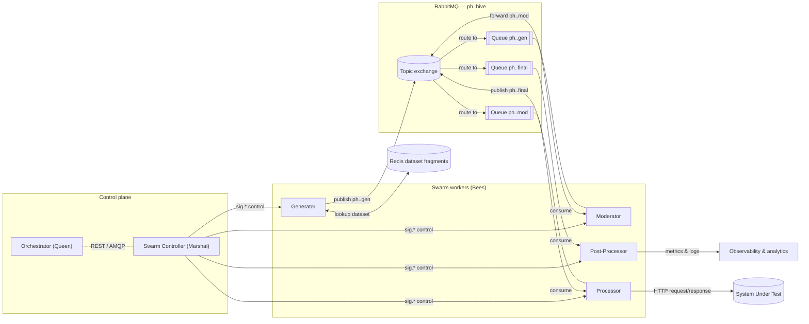

# PocketHive

PocketHive is a portable transaction swarm. It orchestrates containerised components that generate, moderate, process and analyse workloads through durable queues.

## Architecture

### Swarm data flow

The Orchestrator drives each swarm through the Swarm Controller, which applies the plan, enables roles in dependency order, an
d relays `sig.*` control signals. Transaction messages move left to right through RabbitMQ queues: the Generator produces into
`ph.<swarmId>.gen`, the Moderator conditions and forwards to `ph.<swarmId>.mod`, the Processor relays each call to the System 
Under Test (SUT) and publishes responses into `ph.<swarmId>.final`, where the Post-Processor captures metrics and observability
streams. Generators can hydrate payload templates from Redis-backed dataset fragments to diversify traffic.

## Quick start
1. Install Docker.
2. Run `./start-hive.sh` (Linux/macOS) or `start-hive.bat` (Windows) to clean previous runs, build the images and launch RabbitMQ, services and the UI. Use `--help` to run individual stages (clean, build, start) when needed.
   - Alternatively run `docker compose up -d` directly to start the stack with your existing images.
3. Open <http://localhost:8088>. Only the Orchestrator (Queen) runs initially. Create and start swarms from the Hive view by selecting a scenario.

## Documentation
- [Docs index](docs/README.md)
- [Architecture reference](docs/ARCHITECTURE.md)
- [Roadmap](docs/ROADMAP.md)
- [Usage guide](docs/USAGE.md)
- [Contributor guide](CONTRIBUTING.md)

---

PocketHive · portable transaction · swarm
