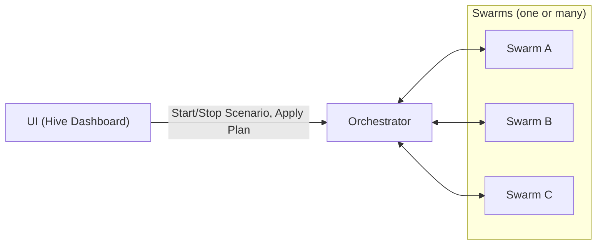
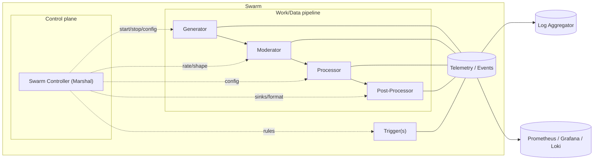
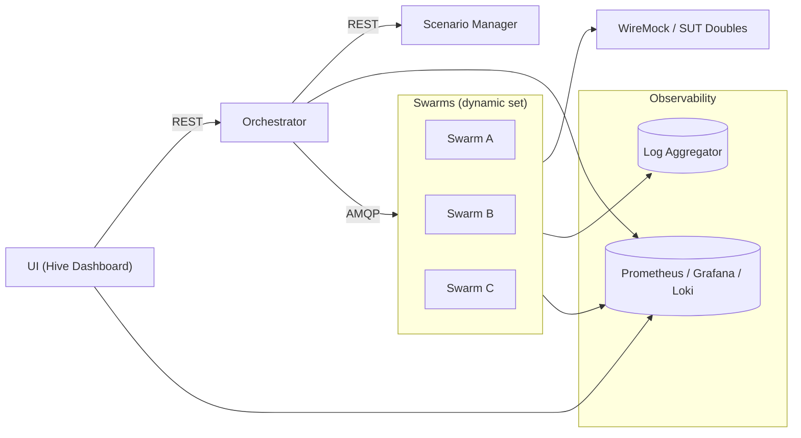

# PocketHive

PocketHive is a RabbitMQ‑centric load & behavior simulator that orchestrates swarms of modular workers (“bees”) to generate traffic, transform data, and emit results and telemetry. It is useful for repeatable performance testing, scenario‑driven demos, and production‑like simulations for APIs and message‑driven systems (ISO‑8583, REST, SOAP, custom protocols).

> TL;DR: **UI → Orchestrator → Swarms**. The **Orchestrator** applies a **Scenario Plan** and manages swarms. **Swarms** are pipelines of small services (Generator → Moderator → Processor → Post‑Processor + optional Triggers).

---

## Contents

- [Why PocketHive?](#why-pockethive)
- [Key Ideas](#key-ideas)
- [High‑level Architecture](#high-level-architecture)
  - [1) Product flow (no queues)](#1-product-flow-no-queues)
  - [2) Swarm composition & internal queues](#2-swarm-composition--internal-queues)
  - [3) Deployment view](#3-deployment-view)
- [Core Components](#core-components)
- [Configuration](#configuration)
- [Observability](#observability)
- [Contributing](#contributing)
- [License](#license)

---

## Why PocketHive?

- **Scenario‑driven**: Reproduce realistic workloads with shareable, versioned plans.
- **Composable**: Mix and match modular workers (generator/moderator/processor/post‑processor/trigger).
- **Deterministic or chaotic—your choice**: Shape traffic precisely or inject controlled randomness.
- **Production‑adjacent**: Glue to real brokers, real service mocks, real sinks; watch metrics & logs like in prod.
- **Fast iteration**: Start/stop/adjust swarms on demand from a simple UI.

---

## Key Ideas

- **Scenario Plan**: A declarative plan the Orchestrator applies to create/configure swarms.
- **Swarm**: A unit of execution made of small services forming a pipeline (see below).
- **Control vs Work/Data**:
  - **Control**: Commands/lifecycle/config (lightweight, low‑cardinality).
  - **Work/Data**: The main data stream through the pipeline.
- **Observability first**: Every component emits structured logs/metrics for fast feedback.

---

## High‑level Architecture

### 1) Product flow

**What this says**: The UI asks the Orchestrator to run a scenario; the Orchestrator spins up/configures swarms; swarms run and report back; the UI shows live status/results.

---

### 2) Swarm composition & internal queues

Reading guide:
- **Control**: dashed arrows from **Swarm Controller** to components.
- **Work/Data**: left→right stream—`Generator → Moderator → Processor → Post‑Processor`. **Trigger** can inject/react to events.
- **Telemetry**: components emit to a shared telemetry hub that feeds logs/metrics.

---

### 3) Deployment view

---

## Core Components

### UI (Hive Dashboard)
- Start/stop scenarios, apply plans, inspect status.
- Live metrics and logs dashboards (links to Grafana/Loki).

### Orchestrator
- Applies **Scenario Plans** and manages a dynamic set of swarms.
- Creates/updates/destroys swarms; pushes control/config; aggregates status.

### Scenario Manager
- Source of truth for reusable **Scenario Plans** and datasets.
- Versionable artifacts that the Orchestrator can fetch/apply.

### Swarm
A single unit of execution composed of:
- **Swarm Controller (Marshal)** – the control brain for the swarm.
- **Generator** – emits traffic/messages (shaped by the plan).
- **Moderator** – gates, validates, and shapes throughput.
- **Processor** – transforms, enriches, routes.
- **Post‑Processor** – sinks results (files, HTTP, MQ, DB, etc.).
- **Trigger(s)** – reacts to events or schedules, may inject control or data.

> Swarms are **independent** and **composable**; scale them horizontally across scenarios or tenants.

---

## Configuration

All services read environment variables (see each service’s README/Dockerfile). Typical knobs:
- `RABBITMQ_HOST`, `RABBITMQ_USER`, `RABBITMQ_PASSWORD`
- `POCKETHIVE_CONTROL_PLANE_EXCHANGE` (control plane, direct)
- `POCKETHIVE_CONTROL_PLANE_TRAFFIC_EXCHANGE` / queues for work/data paths
- Logging: `LOG_LEVEL`, structured log toggles
- Metrics scraping endpoints for Prometheus

Keep configuration **explicit**—favor declaring values over hidden defaults.

---

## Observability

- **Metrics**: each component exposes counters/histograms (throughput, errors, latencies). Scraped by Prometheus, visualized in Grafana.
- **Logs**: structured JSON logs ingested by the log aggregator and browsed via Loki.
- **Events**: optionally surfaced to UI for human‑readable timelines.

---

## Quick start

### Local Development
1. Install Docker.
2. Run `./start-hive.sh` (Linux/macOS) or `start-hive.bat` (Windows) to clean previous runs, build the images and launch RabbitMQ, services and the UI. Use `--help` to run individual stages (clean, build, start) when needed.
   - Alternatively run `docker compose up -d` directly to start the stack with your existing images.
3. Open <http://localhost:8088>. Only the Orchestrator (Queen) runs initially. Create and start swarms from the Hive view by selecting a scenario.

### Service Proxies
The UI container fronted by Nginx proxies several internal services so browsers never talk to container hostnames directly. Useful routes:

- `/orchestrator/*` → Orchestrator REST API
- `/scenario-manager/*` → Scenario Manager REST API
- `/rabbitmq/` → RabbitMQ management UI (STOMP WebSocket available at `/ws`)
- `/prometheus/` → Prometheus console
- `/grafana/` → Grafana dashboards
- `/wiremock/` → WireMock admin endpoints

When accessing PocketHive from another machine, keep using the UI origin and these prefixed paths; the reverse proxy handles service discovery inside the compose network.

### External Deployment (Portainer/Production)
1. Create deployment package: `./package-deployment.sh` (or `package-deployment.bat` on Windows)
2. Copy `pockethive-deployment-<version>.tar.gz` to target environment
3. Extract: `tar xzf pockethive-deployment-<version>.tar.gz`
4. Deploy: `cd pockethive && ./start.sh`
5. Or import the Compose stack into Portainer via **Stacks → Add Stack** using `docker-compose.yml`

---

## Documentation
- [Docs index](docs/README.md)
- [Architecture reference](docs/ARCHITECTURE.md)
- [Usage guide](docs/USAGE.md)
- [Contributor guide](CONTRIBUTING.md)

---

## Contributing

Issues and PRs are welcome. Please align PRs to the component boundaries and keep architecture docs up‑to‑date (diagrams above are copy‑paste‑ready).

---

## License

This project is licensed under the project’s repository license. See `LICENSE` in the root for details.
