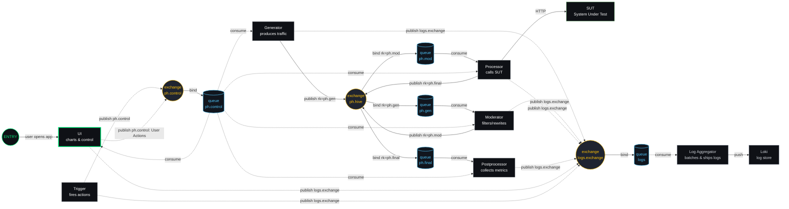

# PocketHive

<p align="center">
  
</p>

**PocketHive** is a portable transaction swarm: compact, composable components that let you generate, moderate, process, and test workloads with clear boundaries and durable queues. An orchestrator service manages swarm containers via Docker and communicates with all services over AMQP. Swarm templates in `orchestrator-service/src/main/resources/templates` define container images to launch.

### Implementation Status

- **Completed**: Phase 1 – Orchestrator Foundation (dynamic swarm creation, control-plane hooks, Docker integration)
- **In Progress**: Phase 2 – Multi-Swarm Support



The UI is built with React 18 + Vite and resides in `/ui`.

### Architecture

- UI connects to RabbitMQ via same‑origin Web‑STOMP proxy at `/ws`.
- Services publish/consume via the `ph.hive` exchange and `ph.gen`/`ph.mod` queues.
- Metrics/status flow back on the `ph.control` exchange, with each service auto-declaring a durable `ph.control.<role>.<instance>` queue for broadcasts and direct signals.
- Logs emitted by the services are routed to `logs.exchange` and consumed by the log‑aggregator, which batches them to Loki.
- Services propagate an `x-ph-trace` header to record trace IDs and hop timing across the flow.

### Control-plane Events & Signals

- Events (topic): `ev.{kind}.{role}.{instance}`
  - `kind`: `status-full`, `status-delta`, `lifecycle.*`, `metric.*`, `alert`
  - `role`: `generator|moderator|processor`
  - `instance`: bee name generated on startup
  - Envelope fields: `event, kind, version, role, instance, messageId, timestamp, queues{in,out}? , data`
- Signals (topic-friendly): `sig.<type>[.<role>[.<instance>]]`
  - Types are single-segment (no dots): `status-request`, `config-update`, `ping`, `link-request`
  - Bindings examples:
    - Global: `sig.status-request.#`
    - Role: `sig.status-request.<role>.#`
    - Instance: `sig.status-request.<role>.<instance>`
  - UI broadcast sends: `/exchange/ph.control/sig.status-request`

See also: Control Bindings page (Menu → Control Bindings) and `docs/spec/asyncapi.yaml`.

### Views

- Control View: existing dashboard with charts, event log, and system log.
- Hive View: auto-discovers components from Control messages and draws an interactive graph.
  - Drag nodes; zoom and pan the canvas.
  - Hover a node to view queue metadata.
  - Nodes appear when the first message from a service is received (generator, moderator, processor). SUT appears when processor is seen.
  - Default hold time is 3s (3× of 1s status schedule); toolbar lets you adjust hold time and Clear & Restart.
  - Click a node to view component details.
- Edges are built strictly from `queues.in/out` found in `status-full` events.

## Stack & Ports

- `rabbitmq` (with Web-STOMP): 5672 (AMQP), 15672 (Mgmt UI), 15674 (Web-STOMP, internal only)
- `ui` (nginx static site): 8088 → serves UI, proxies WebSocket at `/ws` to RabbitMQ
- `generator`, `moderator`, `processor`, `postprocessor`, `trigger`: Spring Boot services using AMQP
- `prometheus` (metrics store): 9090
- `grafana` (dashboard): 3000 (admin / admin)
- `loki` (log store): 3100
- `promtail` (legacy log shipper; disabled—logs are routed via RabbitMQ)
- `log-aggregator` (RabbitMQ → Loki): internal
- `wiremock` (HTTP stub server for NFT tests; journal disabled): 8080

## Quick Start

Prereqs: Docker and Docker Compose.

1) Build and start

```
docker compose up -d --build
```

2) Open the UI

- UI: http://localhost:8088
- Click "Connect". The UI connects to RabbitMQ via same-origin WebSocket `ws://localhost:8088/ws` using StompJS (same client as the built‑in Generator).
- The top bar hosts icon links to RabbitMQ, Prometheus, Grafana, and WireMock. The WireMock icon opens the admin console (`/__admin/`) in a new tab.

3) RabbitMQ Management (optional)

- http://localhost:15672 (guest / guest)
- Web-STOMP plugin is enabled in the RabbitMQ image.

4) Metrics and Dashboards (optional)

- Prometheus: http://localhost:9090
- Grafana: http://localhost:3000 (admin / admin) with Prometheus and Loki datasources
- Prometheus scrapes metrics from `postprocessor` at `/actuator/prometheus`.
- The log‑aggregator service consumes log events from RabbitMQ and pushes them to Loki.

## Service Naming

Every service generates a whimsical "bee name" when it starts to make log lines and metrics
easier to trace back to a specific instance. Names follow the pattern
`<bee-role>-bee-<funny1>-<funny2>-<id>` where `bee-role` is a themed alias for the component type and `id`
is a random four character segment of a UUID for uniqueness. The mapping is:

- generator → seeder
- moderator → guardian
- processor → worker
- postprocessor → forager
- trigger → herald
- log-aggregator → scribe

The two `funny` parts are chosen from predefined lists to maximize variety while avoiding spaces
or `. # *`. The chosen name is logged on startup and exposed through the `/actuator/info` endpoint
under `beeName`. Future services should call `BeeNameGenerator.generate("<role>")` from the
`observability` module; the utility applies the mapping automatically to stay consistent.

## Service Configuration

Services accept `config-update` messages on the control exchange to adjust behaviour at runtime:

- **Generator** builds HTTP requests from `ph.gen.message.*` settings. Defaults send a `POST /api/test` with body `hello-world` and no headers. Config updates can start or stop generation, change `ratePerSec`, fire a one-off request, or modify the request method, path, headers, and body.
- **Moderator** forwards messages from the generator when enabled. A `config-update` can toggle moderation on or off.
- **Processor** reads `ph.proc.base-url` to determine the downstream base URL, defaulting to `http://wiremock`,  and forwards moderated messages unchanged to the system under test using the message's path and headers. Config updates may enable/disable processing or override `baseUrl` without restarts.
- **Postprocessor** records hop and total latency metrics and error counts before emitting them as metric events. It can also be disabled via `config-update`.
- **Trigger** executes shell commands or REST calls based on `ph.trigger.*` settings. Config updates can enable or disable triggering, adjust `intervalMs` and `actionType`, or fire a one-off action.
- All services propagate an `x-ph-trace` header to capture trace IDs and hop timing across the pipeline.
- The UI exposes dedicated sections for generator and processor settings, and changes take effect only after pressing **Confirm Changes**.

## WebSocket Proxy (UI ←→ RabbitMQ)

- The UI does not connect directly to `localhost:15674`. Instead, nginx proxies `/ws` → `rabbitmq:15674/ws`.
- This avoids cross-origin/origin/CORS issues and works when the UI is accessed from a remote host.

Relevant files:

- `ui/nginx.conf` — reverse proxy for `/ws` and `/healthz`
- `docker-compose.yml` — mounts nginx config and exposes port 8088; adds healthcheck for UI
- `ui/src/main.tsx` — React entry point that wires providers, routing, and WebSocket connection logic.

## Healthchecks

- `rabbitmq`: built-in healthcheck via `rabbitmq-diagnostics ping`
- `ui`: HTTP `GET /healthz` returns `200 ok` (nginx). Compose healthcheck pings it every 10s.

Manual checks:

- UI health: `curl -s http://localhost:8088/healthz` → `ok`
- Mgmt UI: visit `http://localhost:15672`

## UI Panels

- Backgrounds: selector for Bees / Network / Old; only the active background renders (others paused to save CPU).
- Buzz panel: logs STOMP traffic with separate IN, OUT and Other views and lists current binds and URLs in a Config tab:
  - **OUT** logs every `publish` with the destination routing key and a pretty-printed JSON body so the full payload is visible.
  - **IN** records each message received from subscriptions, summarising `event`, `role`, and `instance` fields (or truncating the body) to keep lines readable.
  - **Other** captures UI events and diagnostics.
- System Logs: shows system and user actions:
  - Connect/Disconnect clicks, edits of URL/username/password (password length only)
  - UI health transitions based on `/healthz`
- Hive panel: lists live components and queue stats and includes an interactive topology tab with type-based shapes and legend.
- Orchestrator panel: start new swarms by providing an ID and container image.
- HAL eyes: status indicators for UI and WS (green slow pulse = healthy/connected; blue modem pulse = connecting; red fast pulse = failed/closed/idle).

## UI Controls

- **View tabs** — switch between Hive, Buzz, Orchestrator and Nectar panels.
- **Menu (☰)** — links to README, Buzz bindings, changelog and API docs.
- **WebSocket eye** — click to connect or disconnect from RabbitMQ.
- **Monolith button** — broadcasts a global `status-request` signal; the publish shows in the OUT log.
- **Buzz view** — IN, OUT and Other logs with a Config tab and Topic Sniffer; subscriptions are editable.
- **Hive view** — searchable component list with start/stop toggles, a topology tab for draggable nodes, queue tooltips, and a legend of component shapes; selecting an item opens a detail drawer showing enabled state with editable settings and a confirmable config-update action.
- **Orchestrator view** — form for launching swarms by ID and image.
- **Nectar view** — metric dropdown (TPS, latency, hops) and points input to adjust chart history.

## Troubleshooting

- WebSocket error in UI:
  - Ensure UI health shows "healthy" (see System Logs) and `/healthz` returns `ok`.
  - Verify RabbitMQ is healthy and Web-STOMP is enabled (Mgmt UI → Plugins).
  - Check browser devtools → Network → WS for the `/ws` handshake (should be 101 Switching Protocols).
  - If serving the UI over HTTPS, the app will use `wss://…/ws` automatically; ensure any reverse proxy forwards upgrades.
  - Avoid manually pointing to `ws://localhost:15674/ws` unless you expose that port and handle origins.

- Authentication / `guest` user:
  - RabbitMQ blocks remote logins for the built‑in `guest` user by default. If you access the UI from a remote host, either use the UI’s same‑origin `/ws` proxy (recommended) or create a non‑guest user.
  - Default: use built‑in `guest`/`guest`. The UI connects through a same‑origin proxy so remote logins work without creating a new user.
  - Optional: to create a dedicated non‑guest user, set `RABBITMQ_DEFAULT_USER`/`RABBITMQ_DEFAULT_PASS` in Compose and pass matching creds to services.
  - Alternative (dev only): relax `guest` loopback restriction via `rabbitmq.conf` mount if connecting directly without the proxy.

- Cannot access UI: ensure port 8088 is free or adjust the mapping in `docker-compose.yml`.

## Development Notes

- The React UI lives in `ui/` (Vite + TypeScript). Assets remain under `ui/assets/`.
- Run `cd ui && npm install` once, then `npm run dev` for development or `npm run build` for production.
- Nginx config lives in `ui/nginx.conf` and is mounted into the `ui` container. After changing it, restart just the UI:

```
docker compose up -d --build ui
```

- Services use environment `RABBITMQ_HOST=rabbitmq` inside the Compose network.

- Node tooling (linting/tests) lives in `package.json` at the repo root:
  - `npm install` installs dev dependencies.
  - `npm run lint` runs ESLint.
  - `npm test` executes Vitest.

---

PocketHive · portable transaction · swarm
