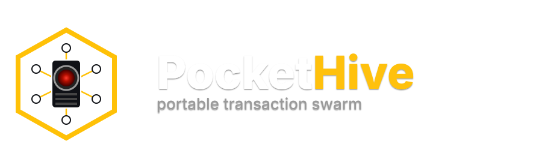
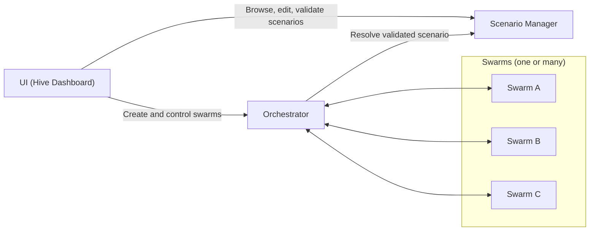
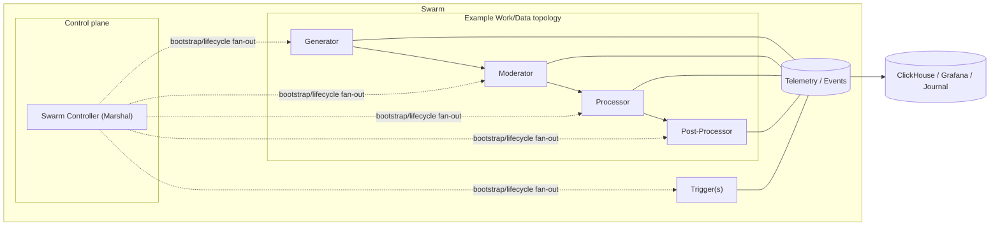
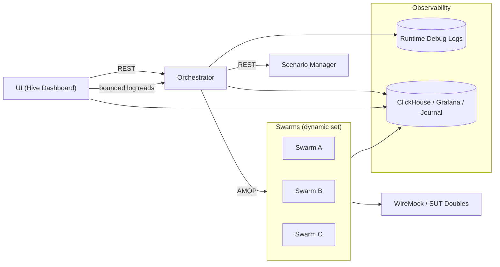

# PocketHive

| Reader context | Details |
| --- | --- |
| Audience | Customers, evaluators, operators, scenario authors, contributors, and AI agents |
| Prerequisites | None for orientation; task guides state their own runtime and tooling requirements |
| Expected outcome | Understand what PocketHive does and reach the correct customer, operator, or contributor path |
| Candidate source tested | `rewrite/lifecycle-control-plane` at `0524165e` (unreleased; build version `0.15.35`) |

PocketHive is a scenario-driven load and behavior simulation platform. It
orchestrates swarms of modular workers (“bees”) to generate traffic, transform
data, exercise systems under test, and emit results and telemetry. It is useful
for repeatable performance testing, scenario-driven demos, and production-like
simulations for APIs and message-driven systems.

> TL;DR: **UI → Orchestrator → Swarms**. The **Orchestrator** applies a
> **Scenario Plan** and manages swarms. Each swarm is a topology-defined graph
> of workers; Generator → Moderator → Processor → Post‑Processor is one common
> example, not a fixed pipeline.

---

## Contents

- [Why PocketHive?](#why-pockethive)
- [Key Ideas](#key-ideas)
- [Glossary](docs/GLOSSARY.md)
- [High-level Architecture](#high-level-architecture)
  - [1) Product flow (no queues)](#1-product-flow-no-queues)
  - [2) Swarm composition & internal queues](#2-swarm-composition--internal-queues)
  - [3) Deployment view](#3-deployment-view)
- [Core Components](#core-components)
- [Configuration](#configuration)
- [Observability](#observability)
- [Quick start](#quick-start)
- [Documentation](#documentation)
- [Branching Strategy](#branching-strategy)
- [Contributing](#contributing)
- [License](#license)

---

## Why PocketHive?

- **Scenario‑driven**: Reproduce realistic workloads with shareable, versioned plans.
- **Composable**: Mix and match modular workers (generator/moderator/processor/post‑processor/trigger).
- **Deterministic or chaotic—your choice**: Shape traffic precisely or inject controlled randomness.
- **Production‑adjacent**: Glue to real brokers, real service mocks, real sinks; watch metrics & logs like in prod.
- **Fast iteration**: Start/stop/adjust swarms on demand from a simple UI.

---

## Key Ideas

The [PocketHive glossary](docs/GLOSSARY.md) owns the shared definitions used by
customer, operator, and contributor documentation. Start with:

- [scenario bundle, template, and plan](docs/GLOSSARY.md#pockethive-glossary);
- [swarm, Swarm Controller, and worker](docs/GLOSSARY.md#pockethive-glossary);
- [control plane and work plane](docs/GLOSSARY.md#pockethive-glossary);
- [acceptance, dispatch, and convergence](docs/GLOSSARY.md#pockethive-glossary).

Exact routes, fields, and validation rules remain in the contracts linked from
the glossary.

---

## High-level Architecture

### 1) Product flow (no queues)

```mermaid
flowchart LR
  UI["UI (Hive Dashboard)"]
  SM["Scenario Manager"]
  ORCH[Orchestrator]
  S1["Swarm A"]
  S2["Swarm B"]
  S3["Swarm C"]

  %% Left-to-right main flow
  UI -->|Browse, edit, validate scenarios| SM
  UI -->|Create and control swarms| ORCH
  ORCH -->|Resolve validated scenario| SM
  ORCH <--> S1
  ORCH <--> S2
  ORCH <--> S3

  %% Group the swarms AFTER layout is established (keeps them on the right)
  subgraph SWARMS["Swarms (one or many)"]
    direction LR
    S1
    S2
    S3
  end
```

**What this says**: The UI asks the Orchestrator to run a scenario; the Orchestrator spins up/configures swarms; swarms run and report back; the UI shows live status/results.

---

### 2) Swarm composition & internal queues

The diagram below is an **example REST processing topology**. Worker roles and
connections are scenario-defined; PocketHive does not impose this sequence.

```mermaid
flowchart LR
  %% Swarm boundary
  subgraph SWARM["Swarm <swarmId>"]
    direction LR

    %% Control plane
    subgraph CONTROL["Control plane"]
      MSH["Swarm Controller (Marshal)"]
    end

    %% Components
    GEN[Generator]
    MOD[Moderator]
    PRC[Processor]
    PST[Post‑Processor]
    TRG["Trigger(s)"]

    %% Work/Data pipeline
    subgraph DATA["Example Work/Data topology"]
      GEN --> MOD --> PRC --> PST
    end

    %% Control relationships (dashed)
    MSH -. bootstrap/lifecycle fan-out .-> GEN
    MSH -. bootstrap/lifecycle fan-out .-> MOD
    MSH -. bootstrap/lifecycle fan-out .-> PRC
    MSH -. bootstrap/lifecycle fan-out .-> PST
    MSH -. bootstrap/lifecycle fan-out .-> TRG

    %% Telemetry fan‑in
    TELE[(Telemetry / Events)]
    GEN --- TELE
    MOD --- TELE
    PRC --- TELE
    PST --- TELE
    TRG --- TELE
  end

  %% External observers
  OBS[(ClickHouse / Grafana / Journal)]

  TELE --> OBS
```

Reading guide:
- **Control**: dashed arrows show controller-owned bootstrap and swarm-wide
  lifecycle fan-out. A targeted live worker update routes directly from the
  Orchestrator to that worker; the controller is not a relay for that path.
- **Work/Data example**: `Generator → Moderator → Processor → Post‑Processor`.
  Other scenarios may use different roles and connections. **Trigger** can
  inject/react to events when present.
- **Telemetry**: components emit to a shared telemetry hub that feeds metrics and events.

---

### 3) Deployment view

```mermaid
flowchart LR
  %% Left-to-right layout with UI on the far left
  UI["UI (Hive Dashboard)"]
  ORCH[Orchestrator]
  SCEN[Scenario Manager]
  WM[WireMock / SUT Doubles]

  subgraph SWARMS["Swarms (dynamic set)"]
    direction LR
    SA[Swarm A]
    SB[Swarm B]
    SC[Swarm C]
  end

  %% Observability cluster to the far right
  subgraph OBSV["Observability"]
    direction TB
    LOGS[(Runtime Debug Logs)]
    OBS[(ClickHouse / Grafana / Journal)]
  end

  %% Core flow
  UI -- REST --> ORCH -- AMQP --> SWARMS
  ORCH -- REST --> SCEN
  SWARMS --> WM

  %% Telemetry
  UI -- bounded log reads --> ORCH
  ORCH --> LOGS
  SWARMS --> OBS
  ORCH --> OBS
  UI --> OBS
```

---

## Core Components

### UI (Hive Dashboard)
- Browse and edit scenarios; create, start, stop, inspect, and remove swarms.
- Inspect lifecycle, topology, Journal evidence, metrics, and bounded runtime logs.

### Orchestrator
- Applies **Scenario Plans** and manages a dynamic set of swarms.
- Creates, updates, and removes swarms; pushes control/config; receives the
  swarm-level aggregate produced by each Swarm Controller. Controllers—not the
  Orchestrator—aggregate individual worker status.

### Scenario Manager
- Owns reusable scenario bundle workspaces, static validation, capabilities,
  and SUT/network metadata.
- Prepares validated scenario artifacts that the Orchestrator can resolve for a swarm.

### Swarm
A single unit of execution composed from the scenario topology. A common REST
example contains:
- **Swarm Controller (Marshal)** – the control brain for the swarm.
- **Generator** – emits traffic/messages (shaped by the plan).
- **Moderator** – gates, validates, and shapes throughput.
- **Request Builder** – builds typed HTTP, TCP, or ISO8583 requests when the
  selected topology needs that step.
- **Processor** – executes typed HTTP, TCP, or ISO8583 calls against the SUT.
- **Post‑Processor** – projects terminal outcomes and metrics, optionally to
  ClickHouse.
- **Trigger(s)** – reacts to events or schedules, may inject control or data.

> Swarms are **independent**, **composable**, and not restricted to these example roles.

---

## Configuration

All services read environment variables (see each service’s README/Dockerfile). Typical knobs:
- `RABBITMQ_HOST`, `RABBITMQ_USER`, `RABBITMQ_PASSWORD`
- `POCKETHIVE_CONTROL_PLANE_EXCHANGE` (RabbitMQ topic exchange for control-plane routing)
- Work/data connections declared explicitly through scenario
  `template.bees[].work` and worker `inputs`/`outputs` configuration; see
  `docs/scenarios/SCENARIO_CONTRACT.md`
- Logging: `LOG_LEVEL`, structured log toggles
- Metrics adapter settings: `POCKETHIVE_METRICS_ADAPTER`, ClickHouse endpoint,
  table, batching, and label bounds.

Keep configuration **explicit**—favor declaring values over hidden defaults.

---

## Observability

- **Metrics**: components publish counters, timers, and gauges through the
  explicit metrics adapter. Product metrics are stored in ClickHouse
  (`ph_metrics_samples`, 30-day TTL) and visualized in Grafana.
- **Logs**: services write to container stdout/stderr. UI and MCP log reads go through the Orchestrator runtime debug API as bounded, redacted Docker/Swarm log reads. Error alerts can also attach a bounded runtime log snapshot as a separate Journal entry.
- **Events**: optionally surfaced to UI for human‑readable timelines.

---

## Quick start

### Choose a deployment path

| Goal | Path | Current status at tested source (`0524165e`) |
| --- | --- | --- |
| Develop or evaluate from source | `build-hive.sh` | **Candidate**; build succeeds, but the tested lifecycle rewrite is blocked at the UI Connectivity gate. |
| Evaluate on one host | Compose/Portainer package | **Candidate**; creation commands are available, but the archive is not clean-host qualified. |
| Prepare a managed Docker Swarm release | HiveForge | **Recommended direction**; current actions prepare and validate but do not execute deployment. |

See the canonical [deployment paths](docs/guides/operators/deployment.md) page
for the definitions of **working**, **available**, **candidate**,
**supported**, **recommended direction**, and **production-like**.

### Local source development
1. Install Bash, Docker with Compose V2 and Buildx, Java 21, and Maven.
2. Run `./build-hive.sh` to rebuild the local jars + images and redeploy RabbitMQ, services and the UI in one go.
   - Run `docker compose up -d` directly only when the required local images
     and configuration already exist.
   - Useful flags:
     - `--quick` skips tests during Maven build, but for full-stack runs it still tears down and restarts the local compose stack.
     - `--service <name>` or `--module <module>` rebuilds targeted services (e.g., `--service generator --module orchestrator-service`), independent of `--restart`.
3. Open <http://localhost:8088>, then open **Connectivity** before creating a
   swarm. At tested source `0524165e`, Connectivity reports a schema-resolution
   error for `swarm-lifecycle.schema.json#/$defs/RuntimeMetadata`; stop there
   and do not use **Create** or **Start**. Continue with the
   [15-minute quickstart](docs/guides/onboarding/quickstart-15min.md) only after
   every required Connectivity gate reports OK.

### Service Proxies
The UI container fronted by Nginx proxies several internal services so browsers never talk to container hostnames directly. Useful routes:

- `/orchestrator/*` → Orchestrator REST API
- `/scenario-manager/*` → Scenario Manager REST API
- `/rabbitmq/` → RabbitMQ management UI (STOMP WebSocket available at `/ws`)
- `/grafana/` → Grafana dashboards
- `/wiremock/` → WireMock admin endpoints

When accessing PocketHive from another machine, keep using the UI origin and these prefixed paths; the reverse proxy handles service discovery inside the compose network.

> [!WARNING]
> The heading and four-step procedure below are retained for compatibility.
> The generated archive is currently a **candidate**, not a supported
> production distribution. Set an explicit image version and review the
> canonical [Compose package status and gate](docs/guides/operators/deployment.md#compose-package)
> before using these commands.

### External Deployment (Production)

**Current tested-source status: candidate compatibility workflow—not a supported
production distribution.** The heading is retained so existing links and
runbooks remain recognizable.

1. Create the matching archive:
   - Linux/macOS: `./package-deployment.sh`
   - Windows PowerShell: `& .\package-deployment.bat`, then require
     `$LASTEXITCODE -eq 0`; verify the non-empty archive and record its SHA-256
     with the exact PowerShell commands in
     [Deployment Package](DEPLOYMENT_PACKAGE.md#creating-the-package).
   - The current Linux/macOS script can print `du: cannot access ...` and a
     blank `Size` after it has created the archive. Verify the repository-root
     file with `test -s pockethive-deployment-<version>.tar.gz` and
     `sha256sum pockethive-deployment-<version>.tar.gz`; the display defect is
     neither deployment evidence nor proof that the archive is absent.
2. Copy `pockethive-deployment-<version>.tar.gz` on Linux/macOS or
   `pockethive-deployment-<version>.zip` on Windows to the target environment.
3. Extract it with `tar xzf pockethive-deployment-<version>.tar.gz` on
   Linux/macOS or, in PowerShell,
   `Expand-Archive -LiteralPath .\pockethive-deployment-<version>.zip -DestinationPath .`.
4. Run the package-relative bind-source audit in
   [Deployment Package](DEPLOYMENT_PACKAGE.md#audit-the-archive-on-a-target-host).
   The current archive fails that audit; stop before image pulls, startup, or
   Portainer import.

The archive creation workflow is retained for compatibility and qualification;
the generated candidate is not deployable as delivered. Read **Distribution
status** below before treating either package format as a supported release.

### HiveForge Managed Deployment (Recommended Direction; Validation Only Today)

> [!WARNING]
> Current HiveForge deploy/update actions render and validate a stack but do
> not change the target runtime. The remove action fails deliberately.

**Current behavior:** HiveForge accepts an approved PocketHive git ref,
explicit registry/version inputs, and `swarm-reduced` or `swarm-full`; its
journal records preparation, rendering, and validation. This proves neither
runtime deployment nor ingress health.

**Intended workflow:** after the execution gate is implemented and qualified,
HiveForge will govern deploy, update, verification through official ingress,
and removal for an immutable PocketHive release.

See the canonical [HiveForge path status](docs/guides/operators/deployment.md#hiveforge)
and the detailed [HiveForge integration contract](docs/HIVEFORGE.md).

### Distribution status

The chooser above is a summary. The canonical
[deployment paths](docs/guides/operators/deployment.md) page owns the current
status, terminology, expected evidence, recovery guidance, and completion
gates for all three paths.

---

## Documentation
- [Customer overview](docs/guides/presentation/interactive-pockethive-overview.mdx)
- [Choose your path](docs/guides/onboarding/start-here.md)
- [Application guide](docs/guides/ui/application-guide.md)
- [PocketHive glossary](docs/GLOSSARY.md)
- [Docs router](docs/README.md)
- [Project map for contributors and AI](docs/PROJECT_MAP.md)
- [Architecture reference](docs/ARCHITECTURE.md)
- [Contributor guide](CONTRIBUTING.md)

---

## Branching Strategy

- **main** is the integration branch and carries the **experimental** line (odd minor versions, e.g. `0.15.x`).
- **release/<major>.<minor>** branches carry **stable** lines (even minor versions, e.g. `release/0.14`).
- Feature branches merge into `main`; when the experimental line is ready, bump `main` to the next even minor and cut a `release/<major>.<minor>` branch.
- These stable/experimental labels describe branch and version policy only; GHCR publishes no `stable` or `experimental` channel tags. See [GHCR Setup](docs/GHCR_SETUP.md#published-tags) for the actual image tags.

---

## Contributing

Issues and PRs are welcome. Please align PRs to the component boundaries and keep architecture docs up‑to‑date (diagrams above are copy‑paste‑ready).

---

## License

This project is licensed under the project’s repository license. See `LICENSE` in the root for details.
