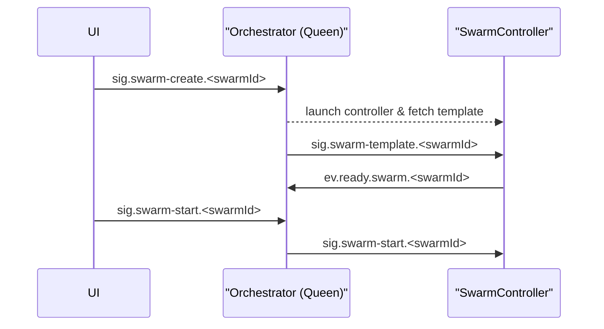

# SwarmController Integration Plan

## Swarm creation sequence
1. UI publishes `sig.swarm-create.<swarmId>` with body `{ "templateId": "rest" }`.
2. Queen resolves the template from `scenario-manager-service`, launches the SwarmController and sends `sig.swarm-template.<swarmId>` containing the full `SwarmPlan` (all bees have `enabled: false`).
3. SwarmController provisions queues and containers, then emits `ev.ready.swarm.<swarmId>`.
4. UI starts the swarm later by sending `sig.swarm-start.<swarmId>` (empty body).

## Phase 1 – Control channel handshake
- Subscribe to the `ph.control` exchange and declare `ph.control.swarm-controller.<instance>`.
- Queen sends `sig.swarm-template.<swarmId>` carrying the SwarmPlan.
- After provisioning, emit `ev.ready.swarm.<swarmId>`.

## Phase 2 – Plan expansion and queue provisioning
- Parse the SwarmPlan to resolve bee roles and queue suffixes.
- Declare `ph.<swarmId>.hive` and bind all `work.in/out` queues.

## Phase 3 – Bee lifecycle management
- Launch bee containers using the images from the plan.
- Fan-out `sig.config-update.<role>.<instance>` and `sig.status-request.<role>.<instance>` to individual bees as needed.

## Phase 4 – Swarm shutdown
- Handle `sig.swarm-stop.<swarmId>` by stopping bees and deleting queues.

## Phase 5 – Observability and UI integration
- Tag metrics with `swarm_id`, `service`, and `instance` and emit traceable logs.
- Surface controller status in the UI and wire create/start/stop controls.
- Extend integration tests to cover swarm start/stop through SwarmController.

---

## Scenario Manager Service

Templates are stored in `scenario-manager-service`. The UI lists them via `GET /scenarios` and `GET /scenarios/{id}`. When `sig.swarm-create` is issued, the Queen fetches the selected template to build the `SwarmPlan` sent to the controller.

## Orchestrator–swarm-controller ready-start handshake

On startup the swarm-controller declares `ph.control.swarm-controller.<instance>`. The orchestrator sends `sig.swarm-template.<swarmId>` with the SwarmPlan. After provisioning queues and disabled bees it publishes `ev.ready.swarm.<swarmId>`. The swarm remains idle until a later `sig.swarm-start.<swarmId>` enables the bees.

## SwarmPlan parsing, queue provisioning, and bee container lifecycle

After receiving `sig.swarm-template`, the controller expands the SwarmPlan, declares the `ph.<swarmId>.hive` exchange, provisions all `work.in/out` queues, and creates bee containers in a disabled state. When `sig.swarm-start` arrives, it starts those containers.

## Swarm shutdown cleanup and observability/UI hooks

Handling `sig.swarm-stop.<swarmId>` stops bee containers, deletes queues, and flushes swarm metrics. Resulting events allow the UI to remove the swarm from its dashboards. See the [MVP Roadmap](MVP_ROADMAP.md#swarmcontroller-lifecycle) for the broader execution flow.
