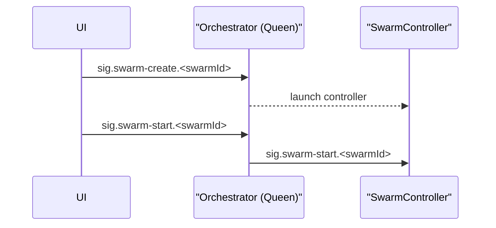

# SwarmController Integration Plan

## Swarm creation sequence
1. UI publishes `sig.swarm-create.<swarmId>` with body `{ "template": { "image": "<image>", "bees": [] } }`.
2. Queen launches the SwarmController and responds with `sig.swarm-template.<swarmId>`.
3. UI starts the swarm by sending `sig.swarm-start.<swarmId>`.

## Phase 1 – Control channel handshake
- Subscribe to the `ph.control` exchange and declare `ph.control.swarm-controller.<instance>`.
- Emit `ev.ready.swarm-controller.<instance>` on startup.
- Queen responds with `sig.swarm-start.<swarmId>` carrying the SwarmPlan.

## Phase 2 – Plan expansion and queue provisioning
- Parse the SwarmPlan to resolve bee roles and queue suffixes.
- Declare `ph.<swarmId>.hive` and bind all `work.in/out` queues.

## Phase 3 – Bee lifecycle management
- Launch bee containers using the images from the plan.
- Fan-out `sig.config-update.<role>.<instance>` and `sig.status-request.<role>.<instance>` to individual bees as needed.

## Phase 4 – Swarm shutdown
- Handle `sig.swarm-stop.<swarmId>` by stopping bees and deleting queues.

## Phase 5 – Observability and UI integration
- Tag metrics with `swarm_id`, `service`, and `instance` and emit traceable logs.
- Surface controller status in the UI and wire create/start/stop controls.
- Extend integration tests to cover swarm start/stop through SwarmController.

---

## Scenario Manager Service

SwarmController retrieves SwarmPlans from the `scenario-manager-service` REST API. The service exposes:

- `POST /scenarios` – create scenario definitions
- `GET /scenarios/{id}` – fetch a scenario
- `PUT /scenarios/{id}` – update a stored scenario
- `DELETE /scenarios/{id}` – remove a scenario

Refer to the [MVP Roadmap](MVP_ROADMAP.md#scenario-manager-service) for delivery milestones.

## Orchestrator–swarm-controller ready-start handshake

On startup the swarm-controller declares `ph.control.swarm-controller.<instance>` and publishes `ev.ready.swarm-controller.<instance>`. The orchestrator responds with `sig.swarm-start.<swarmId>` containing the target SwarmPlan.

## SwarmPlan parsing, queue provisioning, and bee container lifecycle

After receiving `sig.swarm-start`, the controller expands the SwarmPlan, declares the `ph.<swarmId>.hive` exchange, provisions all `work.in/out` queues, and launches bee containers for each role. Bees receive `sig.config-update` and `sig.status-request` messages to manage their lifecycle.

## Swarm shutdown cleanup and observability/UI hooks

Handling `sig.swarm-stop.<swarmId>` stops bee containers, deletes queues, and flushes swarm metrics. Resulting events allow the UI to remove the swarm from its dashboards. See the [MVP Roadmap](MVP_ROADMAP.md#swarmcontroller-lifecycle) for the broader execution flow.
