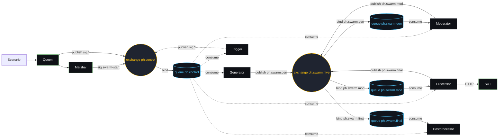
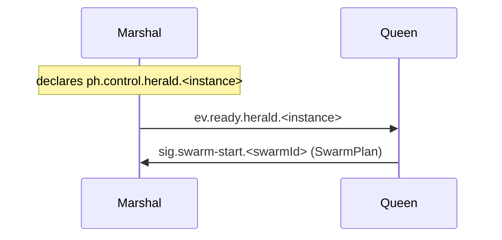
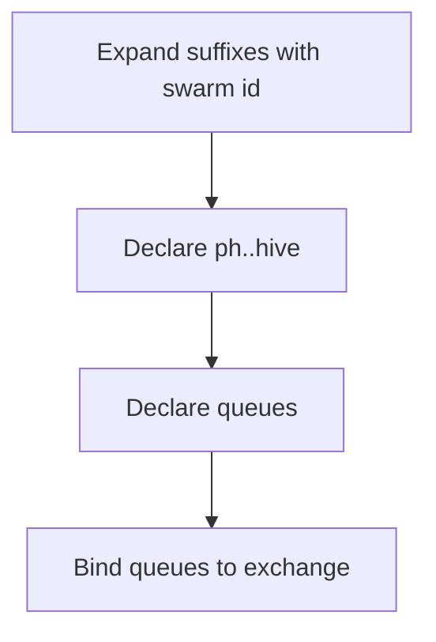
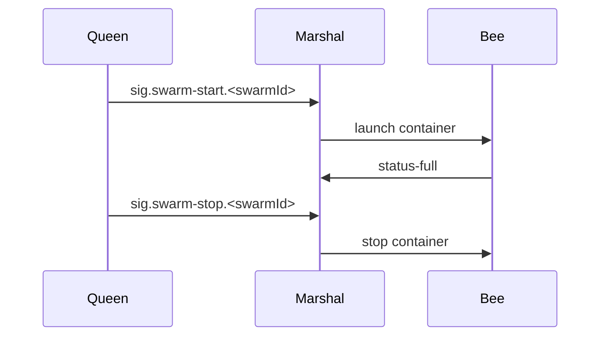

# Architecture

## Goal
PocketHive delivers modular Java microservices and a React UI that together handle event processing and moderation.

## System context
Services communicate over HTTP and AMQP. Each service exposes APIs and consumes messages while remaining independent.

### Overall topology



## Orchestration hierarchy
PocketHive coordinates work through a layered control plane:

- **Queen** – global scheduler that creates and stops swarms.
- **Marshal** – per-swarm controller started by the Queen; it provisions message queues and launches worker containers.
- **Bees** – the worker services inside each swarm.

### Queen (Orchestrator)
The Queen coordinates the entire hive. It loads scenario plans, spins up or tears down swarms, and hands each Marshal the fragment of the plan it should execute.

### Marshal (Swarm Controller)
A Marshal governs one swarm. After receiving its plan from the Queen it declares the swarm's exchanges and queues, launches the bee containers described in the template and fans out config signals to individual bees.

## Swarm coordination

### Handshake
1. Marshal declares its control queue `ph.control.herald.<instance>` bound to `ph.control` for `sig.*` and `ev.*` topics.
2. Marshal emits `ev.ready.herald.<instance>` to signal readiness.
3. Queen waits for the ready event and publishes `sig.swarm-start.<swarmId>` to the Marshal queue with the resolved **SwarmPlan**.



### Queue provisioning
- Marshal expands queue suffixes with the swarm id.
- Declares `ph.<swarmId>.hive` and all required queues.
- Binds each queue to the exchange using its suffix as the routing key.



### Container lifecycle
- Marshal launches the bee containers defined in the plan.
- Runtime adjustments or shutdowns use signals such as `sig.swarm-stop.<swarmId>` on `ph.control`.



### Swarm Plan Template
Queens hand Marshals a resolved plan describing the swarm composition:

```yaml
id: rest
exchange: hive
bees:
  - role: generator
    image: generator-service:latest
    work:
      out: gen
  - role: moderator
    image: moderator-service:latest
    work:
      in: gen
      out: mod
  - role: processor
    image: processor-service:latest
    work:
      in: mod
      out: final
  - role: postprocessor
    image: postprocessor-service:latest
    work:
      in: final
```

Marshal prefixes each `work.in/out` with the swarm id to form queues like `ph.<swarmId>.gen` and binds them to the `ph.<swarmId>.hive` exchange using the same suffix as routing key.

### Control-plane signals
Communication between the Queen and Marshal uses these topics on `ph.control`:

| Direction | Routing key | Body | Purpose |
|-----------|-------------|------|---------|
| Queen → Marshal | `sig.swarm-start.<swarmId>` | `SwarmPlan` | Start swarm |
| Queen → Marshal | `sig.swarm-stop.<swarmId>` | _(empty)_ | Stop swarm |
| Queen → Marshal (optional) | `sig.config-update...` | Partial plan | Adjust running swarm |
| Queen → Marshal (optional) | `sig.status-request...` | _(empty)_ | Request status |
| Marshal → Queen | `ev.ready.herald.<instance>` | _(empty)_ | Marshal is listening |
| Marshal → Queen | `ev.status-full.swarm-controller.<instance>` | Status snapshot | Report state |

## Multi-Region & Queue Adapters
PocketHive will support swarms running in multiple geolocations. Each swarm connects to a region-local broker while the Queen coordinates them through the control plane. Regions remain isolated from each other’s traffic yet share common naming and signalling conventions.

To enable broker diversity, messaging will flow through pluggable queue adapters. The core interface will expose publish and consume operations and minimal lifecycle hooks. Implementations for AMQP, Kafka, SQS and others can plug in without altering domain code.

### Adding a new driver
1. Implement the adapter interface for the target broker.
2. Provide configuration mapping and wiring inside the swarm controller.
3. Register the driver with the Queen so swarms may select it at launch time.

## Layers
Every service follows a hexagonal layout:
- **api** – inbound ports and DTOs.
- **app** – use cases and orchestration.
- **domain** – business rules, framework-free.
- **infra** – adapters for persistence, messaging and external systems.

## Boundaries
Cross-service calls go through API or message contracts only. Shared libraries live outside the domain to keep it pure.

## Testing strategy
- JUnit 5 for unit and integration tests.
- Cucumber for behaviour specs when features require it.
- ArchUnit guards package boundaries.

## Security
Principle of least privilege, encrypted transport, no secrets in code or logs.

## Versioning
Semantic Versioning with per-service change logs.
