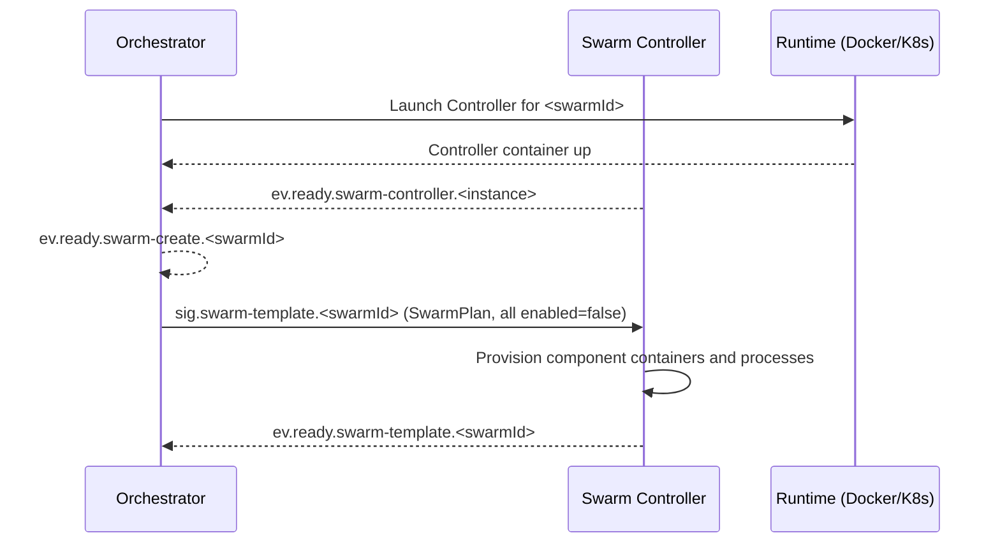
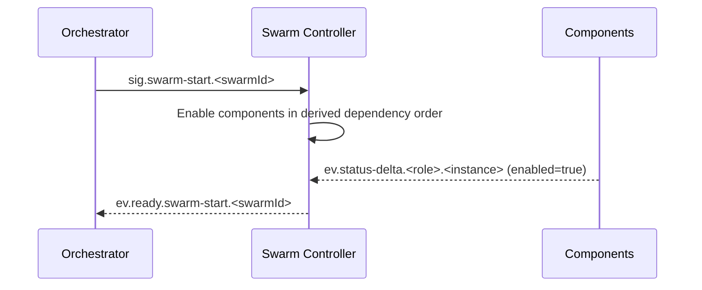
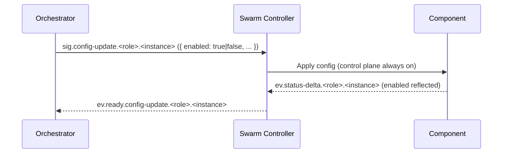
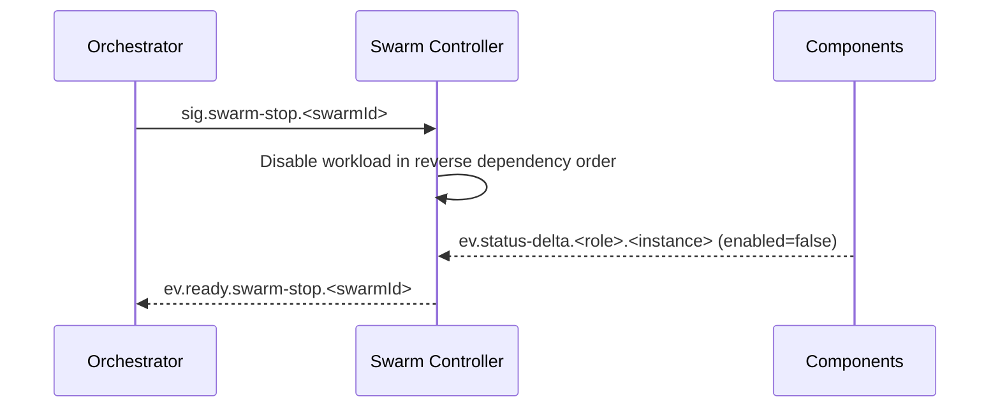
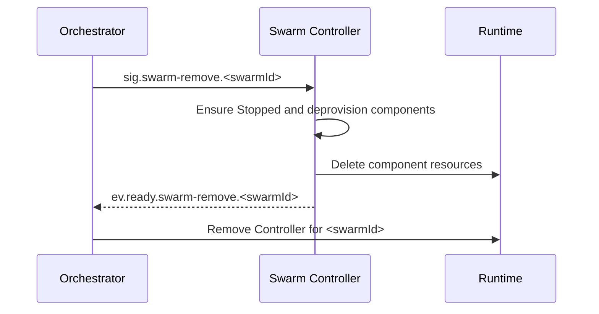
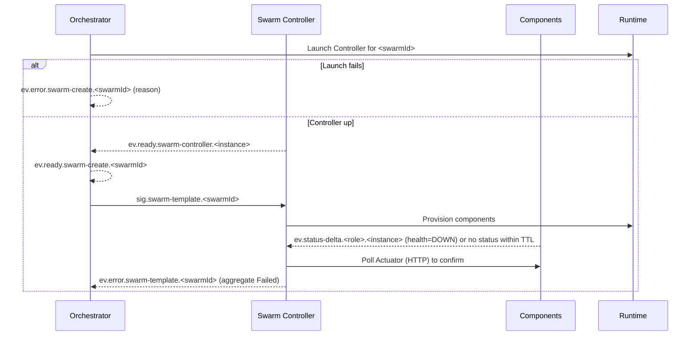

# PocketHive — ARCHITECTURE

> **Status:** Authoritative architecture specification (reference for agents).  
> **Scope:** Universal runtime (Docker Compose or Kubernetes).  
> **Compatibility:** Control‑plane names remain as in the repo; this file is the single source of truth.

---

## 1. Overview

PocketHive orchestrates message-driven swarms of components (generators, processors, post‑processors, triggers, etc.) coordinated by an **Orchestrator** and a per‑swarm **Swarm Controller**. Communication is over **AMQP** (RabbitMQ). **Health** and **readiness** are validated via per‑component **Actuator** HTTP endpoints, with **AMQP status** events treated as equivalent heartbeats.

**Design principles**

- **Single source of truth** for desired state: **Orchestrator**.
- **Aggregate state** per swarm: **Swarm Controller**.
- **Per‑component state**: emitted by **components themselves**, consumed by the **Controller**, **not** by the Orchestrator in steady state.
- **Control plane always on**: status and config are accepted even when workloads are disabled.
- **Non‑destructive defaults**: failures never auto‑delete resources; Stop ≠ Remove.
- **Deterministic ordering** derived from queue I/O topology, not hard‑coded by role.
- **Command → Confirmation pattern**: Every control signal results in **exactly one**
  **success** (`ev.ready.*`) **or** **error** (`ev.error.*`), correlated via `correlationId` and `idempotencyKey`.

---

## 2. Core roles

### 2.1 Orchestrator (Queen)
- Owns the **desired state** and lifecycle intents per swarm (`SwarmPlan`).
- Launches a **Swarm Controller** for a new swarm (runtime), and upon controller handshake emits **`ev.ready.swarm-create.<swarmId>`** (success for create).
- Issues **template / start / stop / remove** at swarm scope, and **config updates** at component scope.
- **Monitors** to **Ready / Running**, marks **Failed** on timeout/error, **never auto‑deletes**.
- Consumes **only swarm‑level aggregates** and lifecycle events from the Swarm Controller (low fan‑in).

### 2.2 Swarm Controller (Marshal)
- Applies the plan locally; **provisions** components; maintains an **aggregate** swarm view.
- Derives **start/stop** order from **queue I/O** (producers → transformers → consumers).
- Emits **swarm‑level** status and lifecycle confirmations; publishes periodic **heartbeats**.
- Treats AMQP `status-{delta|full}` as **equivalent to Actuator heartbeats**; polls **Actuator** on staleness.
- Control plane is always enabled; honors start/stop/remove/status/config even when workload is disabled.

### 2.3 Components
- Expose **Actuator** readiness via HTTP.
- Emit **their own** `ev.status-{full|delta}` events.
- Apply `sig.config-update…` (`enabled: true|false`) to control **workload** only; keep control plane responsive.

---

## 3. Exchanges & naming (wire contract)

> The AsyncAPI defines a **single control signal shape** and unified confirmations.

### 3.1 Control (signals) — **unified `ControlSignal` payload**
- `sig.swarm-template.<swarmId>` — send/replace `SwarmPlan` (all components initially `enabled=false`)
- `sig.swarm-start.<swarmId>`
- `sig.swarm-stop.<swarmId>` — **non‑destructive stop** (workloads disabled; resources kept)
- `sig.swarm-remove.<swarmId>` — explicit deprovision/delete
- `sig.status-request.<role>.<instance>`
- `sig.config-update.<role>.<instance>` — update config (incl. `enabled`)

**`ControlSignal` fields (excerpt):**
- `correlationId` *(uuid)* — **new per attempt**  
- `idempotencyKey` *(uuid)* — **stable across retries** of the same action  
- `swarmId` / `role` / `instance` / optional `args` as required by each signal

### 3.2 Confirmations (events)
- **Success:**  
  - `ev.ready.swarm-create.<swarmId>` — **emitted by Orchestrator** once it observes `ev.ready.swarm-controller.<instance>`
  - `ev.ready.swarm-template.<swarmId>` — Controller
  - `ev.ready.swarm-start.<swarmId>` — Controller
  - `ev.ready.swarm-stop.<swarmId>` — Controller
  - `ev.ready.swarm-remove.<swarmId>` — Controller
  - `ev.ready.config-update.<role>.<instance>` — Controller
- **Error:**  
  - `ev.error.swarm-create.<swarmId>` — Orchestrator (runtime launch failed)
  - `ev.error.swarm-template.<swarmId>` — Controller
  - `ev.error.swarm-start.<swarmId>` — Controller
  - `ev.error.swarm-stop.<swarmId>` — Controller
  - `ev.error.swarm-remove.<swarmId>` — Controller
  - `ev.error.config-update.<role>.<instance>` — Controller

> **Removed:** `ev.ready.swarm-template.<swarmId>` and `ev.ready.swarm-remove.<swarmId>` milestones. Success is always a **`ev.ready.*`** confirmation.

### 3.3 Status streams
- **Swarm aggregates (Controller):**  
  `ev.status-full.swarm-controller.<instance>` and `ev.status-delta.swarm-controller.<instance>`
- **Per‑component status:**  
  `ev.status-full.<role>.<instance>` and `ev.status-delta.<role>.<instance>`
- **Controller bootstrap handshake:**  
  `ev.ready.swarm-controller.<instance>` (control plane up)

---

## 4. Health & heartbeat model

- **Actuator** (HTTP) is the **readiness authority** for components.
- **AMQP `status-{delta|full}` events are treated as equivalent to heartbeats.**
- If **no AMQP status** arrives within a **TTL** for a component included in the aggregate, the Controller **polls the component’s Actuator** before asserting Ready/Running.
- Every **swarm aggregate** carries a **watermark timestamp** and **max-staleness**; if stale or incomplete, the Controller emits **Degraded/Unknown**.

---

## 5. Lifecycle & states

### 5.1 Swarm lifecycle (Orchestrator view)
```
New → Creating → Ready → Starting → Running
                     ↘ Failed ↙        → Stopping → Stopped → Removing → Removed
```
- **Creating:** Controller launched; success signalled by **`ev.ready.swarm-create`**.
- **Ready:** plan applied; all desired components Healthy (`Actuator=UP`) with `enabled=false`.
- **Failed:** an error or timeout occurred; **resources are preserved** for debugging.

### 5.2 Component lifecycle (aggregate perspective)
```
New → Provisioning → Healthy(enabled=false) → Starting → Running(enabled=true)
                                               ↘ Failed ↙               → Stopping → Stopped
```
> Per‑component transitions are **emitted by components**; the Controller **aggregates** only.

---

## 6. Dependency ordering (queue I/O graph)

Construct a directed graph where **A → B** if **A produces** to a queue that **B consumes**.

- **Create/Start order:** producers → transformers → consumers (topological order).
- **Stop order:** reverse of start order.
- Cycles/ambiguity → choose a stable order and emit a **warning** event with the heuristic used.

---

## 7. Sequences

> Rendering note: Mermaid messages avoid semicolons to prevent parser hiccups.

### 7.1 Create → Template (no auto‑start)


### 7.2 Start whole swarm


### 7.3 Per‑component enable/disable (via config‑update)


### 7.4 Stop whole swarm (non‑destructive)


### 7.5 Remove swarm (explicit delete)


### 7.6 Failure during create/start (no deletion)


---

## 8. Timeouts & cadence (defaults)

> Applied unless stricter values exist in code or plan.

- **Provisioning timeout (per component):** 120s  
- **Ready timeout (swarm total):** 5m  
- **Start timeout (per component):** 60s  
- **Start timeout (swarm total):** 3m  
- **Graceful stop timeout (per component):** 30s, then force‑stop (report degraded)  
- **Controller heartbeats:** `ev.status-{delta|full}.swarm-controller.<instance>` on **state change** + **every 10s** (aggregate watermark).

---

## 9. Idempotency & delivery

- Control messages carry an **idempotency key** (UUID) and `correlationId`; delivery is **at‑least‑once**.
- Swarm Controller **deduplicates** within a rolling window per `{swarmId, action[, component]}`.
- On duplicate, emit a “duplicate ignored” event referencing the original `correlationId` when known.

---

## 10. Observability & metrics

**Controller aggregates** include:
- `ts` (watermark), `swarmId`, and `{total, healthy, running, enabled}` counts.
- **Max staleness** and, when applicable, **Degraded/Unknown** reason.
- Recent **error summaries** (role/instance, reason, correlationId) for operator drill‑down.

**Orchestrator** surfaces:
- Provision/ready/start durations, failure counts by reason, current running/enabled counts, queue connection summaries.

---

## 11. Security & audit

- Only the **Orchestrator** issues swarm lifecycle signals; UI proxies via Orchestrator.
- All actions/events are stamped with `correlationId`; per‑swarm audit logs are retained.
- Controller subscribes/publishes strictly within its `{swarmId}` namespace.
- UI AMQP creds are **read‑only**; all writes via Orchestrator REST.

---

## 12. Command confirmation envelopes

### Success (`ev.ready.*`)
```json
{
  "ts": "2025-09-12T12:34:56Z",
  "correlationId": "uuid-from-signal-or-runtime-op",
  "idempotencyKey": "uuid-from-signal",
  "signal": "swarm-create|swarm-start|swarm-stop|swarm-template|swarm-remove|config-update",
  "scope": {"swarmId":"...", "role":null, "instance":null},
  "result": "success",
  "state": "Ready|Running|Stopped|Removed",
  "notes": "optional text"
}
```

### Error (`ev.error.*`)
```json
{
  "ts": "2025-09-12T12:34:56Z",
  "correlationId": "uuid-from-signal-or-runtime-op",
  "idempotencyKey": "uuid-from-signal",
  "signal": "swarm-create|swarm-start|swarm-stop|swarm-template|swarm-remove|config-update",
  "scope": {"swarmId":"...", "role":null, "instance":null},
  "result": "error",
  "phase": "create|template|start|stop|remove|runtime",
  "code": "SHORT_CODE",
  "message": "Human-readable summary",
  "retryable": true,
  "details": {"context": "last logs, probe, etc."}
}
```

---

## 13. Changelog (normative changes)

- **Create flow:** no `sig.swarm-create`; success is **`ev.ready.swarm-create.<swarmId>`** emitted by the Orchestrator after controller handshake.  
- **Removed milestones:** `ev.ready.swarm-template.<swarmId>` and `ev.ready.swarm-remove.<swarmId>` are replaced by **`ev.ready.swarm-template`** and **`ev.ready.swarm-remove`** confirmations respectively.  
- **Remove flow:** upon **`ev.ready.swarm-remove.<swarmId>`**, the Orchestrator **removes the Swarm Controller** runtime unit.  
- **Unified envelopes:** all commands use `ControlSignal`; confirmations echo `correlationId` and `idempotencyKey`.
