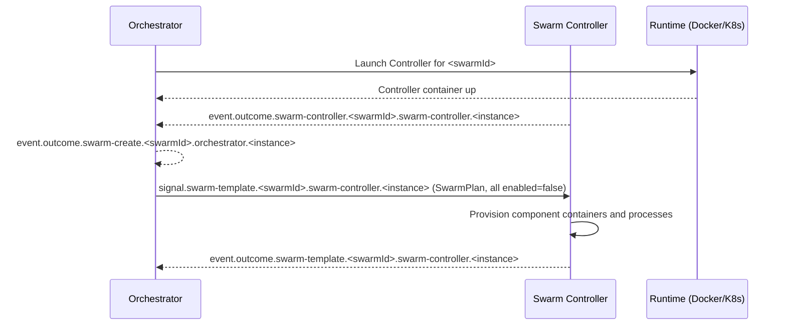
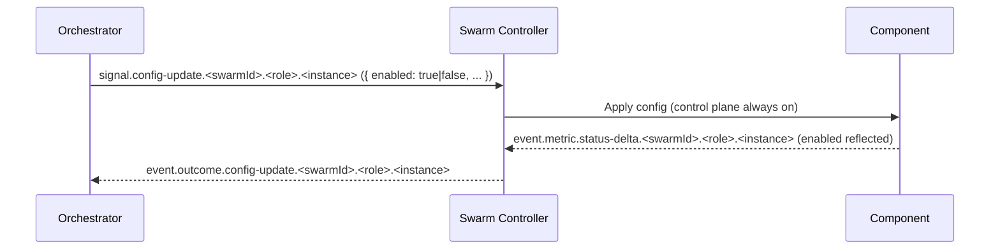
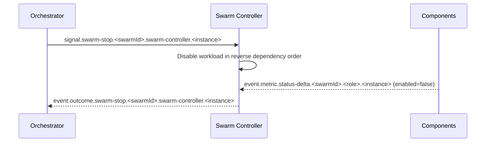
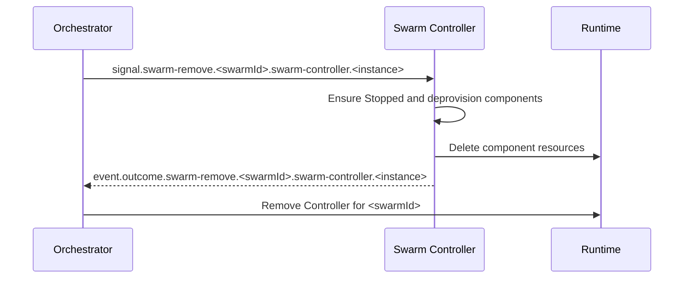
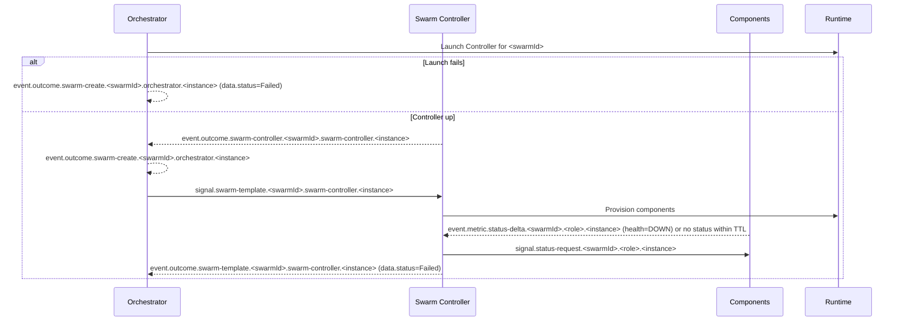

# PocketHive — ARCHITECTURE

> **Status:** Authoritative architecture specification (reference for agents).  
> **Scope:** Universal runtime (Docker Compose or Kubernetes).  
> **Compatibility:** Control‑plane names remain as in the repo; this file is the single source of truth.

---

## 1. Overview

PocketHive orchestrates message-driven swarms of components (generators, processors, post‑processors, triggers, etc.) coordinated by an **Orchestrator** and a per‑swarm **Swarm Controller**. Communication is over **AMQP** (RabbitMQ). **Health** and **readiness** are inferred from **AMQP status** events; controllers and the orchestrator cannot reach component Actuator endpoints and rely exclusively on control-plane heartbeats.

**Design principles**

- **Single source of truth** for desired state: **Orchestrator**.
- **Aggregate state** per swarm: **Swarm Controller**.
- **Per‑component state**: emitted by **components themselves**, consumed by the **Controller**, **not** by the Orchestrator in steady state.
- **Control plane always on**: status and config are accepted even when workloads are disabled.
- **Scoped config updates**: `signal.config-update` targets a concrete `scope` via routing key and envelope fields; no extra targeting metadata is used.
- **Non‑destructive defaults**: failures never auto‑delete resources; Stop ≠ Remove.
- **Deterministic ordering** derived from queue I/O topology, not hard‑coded by role.
- **Command → Outcome pattern**: Every control signal results in **exactly one** outcome event
  (`event.outcome.*`) that is either success or error, correlated via `correlationId` and `idempotencyKey`.
  Runtime/IO errors also emit `event.alert.alert` for operator visibility.

---

## 2. Roles (Managers vs. Workers)

PocketHive splits the control plane into **managers** (orchestrator + swarm controllers) and **workers** (generators, moderators, processors, post-processors, triggers, etc.). Managers shape desired state and publish control signals; workers execute workloads and echo health back through the same exchange.

### 2.1 Managers

#### Orchestrator (Queen)
- Owns the **desired state** and lifecycle intents per swarm (`SwarmPlan`).
- Launches a **Swarm Controller** for a new swarm (runtime) and, after the controller handshake, emits **`event.outcome.swarm-create.{swarmId}.orchestrator.<instance>`**.
- Publishes swarm-scoped lifecycle commands such as `signal.swarm-template.{swarmId}.swarm-controller.<instance>`, `signal.swarm-plan.{swarmId}.swarm-controller.<instance>`, `signal.swarm-start.{swarmId}.swarm-controller.<instance>`, `signal.swarm-stop.{swarmId}.swarm-controller.<instance>`, and `signal.swarm-remove.{swarmId}.swarm-controller.<instance>` (lifecycle commands always target a concrete controller instance).
- Issues **controller config updates** by addressing each controller instance via `signal.config-update.{swarmId}.swarm-controller.<instance>` (and `signal.config-update.ALL.swarm-controller.ALL` when broadcasting fleet-wide toggles).
- **Monitors** swarms to **Ready / Running**, marks **Failed** on timeout/error, and **never auto‑deletes** resources.
- Consumes **only swarm-level aggregates** and lifecycle outcomes, keeping fan-in small.

#### Swarm Controller (Marshal)
- Applies the plan locally; **provisions** components; maintains the **aggregate** swarm view.
- Declares the control queue `ph.control.<swarmId>.swarm-controller.<instance>` (instance ids already embed the swarm name) and binds it to `signal.swarm-template.{swarmId}.swarm-controller.<instance>`, `signal.swarm-plan.{swarmId}.swarm-controller.<instance>`, `signal.swarm-start.{swarmId}.swarm-controller.<instance>`, `signal.swarm-stop.{swarmId}.swarm-controller.<instance>`, `signal.swarm-remove.{swarmId}.swarm-controller.<instance>`, `signal.config-update.{swarmId}.swarm-controller.<instance>`, `signal.config-update.ALL.swarm-controller.ALL`, `signal.config-update.{swarmId}.ALL.ALL`, and the relevant status-request routes (`signal.status-request.{swarmId}.swarm-controller.<instance>`, `signal.status-request.{swarmId}.swarm-controller.ALL`, `signal.status-request.ALL.swarm-controller.ALL`).
- Declares the shared hive exchange `ph.{swarmId}.hive` and **exclusively** provisions the `ph.work.{swarmId}.*` queues plus their bindings; worker services consume through the autoconfigured topology and must not override these declarations. See §3 and the [AsyncAPI spec](spec/asyncapi.yaml) for the canonical routing definitions.
- Emits **swarm-level** lifecycle outcomes (`event.outcome.swarm-template.{swarmId}.swarm-controller.<instance>`, `event.outcome.swarm-plan.{swarmId}.swarm-controller.<instance>`, `event.outcome.swarm-start.{swarmId}.swarm-controller.<instance>`, `event.outcome.swarm-stop.{swarmId}.swarm-controller.<instance>`, `event.outcome.swarm-remove.{swarmId}.swarm-controller.<instance>`) plus controller config outcomes (`event.outcome.config-update.{swarmId}.swarm-controller.<instance>`) and periodic status metrics.
- Consumes every component heartbeat within the swarm via `event.metric.status-{delta|full}.{swarmId}.*.*` to keep aggregate health and enablement up-to-date.
- Treats AMQP `event.metric.status-{delta|full}` as the **sole heartbeat source**; if a component goes silent it issues `signal.status-request.{swarmId}.ALL.ALL` and marks the component stale if no response arrives.
- May propagate workload enablement via `signal.config-update.{swarmId}.ALL.ALL` while keeping the control plane responsive.
- Control plane stays enabled even when workloads are paused; start/stop/remove/status/config are always honored.

### 2.2 Workers (Bees)
- Declare their own control queues on startup using the `ph.control.<swarmId>.<role>.<instance>` naming pattern (instance ids embed the swarm prefix) and bind to `signal.config-update.{swarmId}.{role}.ALL`, `signal.config-update.{swarmId}.{role}.{instance}`, `signal.config-update.{swarmId}.ALL.ALL`, plus the corresponding status-request bindings (`signal.status-request.{swarmId}.{role}.ALL`, `signal.status-request.{swarmId}.{role}.{instance}`, `signal.status-request.{swarmId}.ALL.ALL`).
- Consume workloads from queues named `ph.work.<swarmId>.<queueName>` that hang off the swarm's shared work exchange.
- Accept config updates from both the orchestrator (role/instance routing keys) and their controller (swarm broadcast) without relying on implicit routing conventions.
- Emit **their own** status streams (`event.metric.status-{full|delta}.{swarmId}.{role}.{instance}`) and respond to manager `signal.status-request.{swarmId}.{role}.{instance}` heartbeats.
- Apply `signal.config-update.{swarmId}.{role}.{instance}` (`data.enabled: true|false`) to control **workload** state only while keeping control listeners responsive.
- Runtime behaviour, worker interfaces, and adoption guidance are covered in the [Worker SDK quick start](sdk/worker-sdk-quickstart.md).

### 2.3 HTTP Builder worker

- Optional worker that sits between **Data Providers** (or other producers) and the **processor** in the work topology.
- **Input:** generic `WorkItem` from RabbitMQ with:
  - payload: arbitrary text/JSON produced upstream (for example, a per-customer dataset row from Redis),
  - headers: including `x-ph-call-id` (required) and optional `x-ph-service-id`.
- **Templates:** disk-backed HTTP call definitions under a configurable `templateRoot`:
  - organised as `(serviceId, callId)` pairs,
  - define `method`, `pathTemplate`, `headersTemplate`, and `bodyTemplate`,
  - rendered via the shared Pebble+SpEL templating engine using `payload`, `headers`, and `workItem` as context.
- **Behaviour:**
  - On each message, resolves `(serviceId, callId)` to a template and appends an HTTP envelope step:
    - `{ path, method, headers, body }` – exactly what `processor-service` expects.
  - Missing `callId` or template is handled explicitly via config:
    - `passThroughOnMissingTemplate: true` → log and return the original `WorkItem` unchanged.
    - `passThroughOnMissingTemplate: false` → log and drop the message (no output).
  - Publishes status data per role via the control plane (template root, service id, `errorCount`, `errorTps`) so operators can see template issues without inspecting logs.

Workers source their queue/exchange bindings from the IO sections, not from the control-plane block:

```yaml
pockethive:
  inputs:
    rabbit:
      queue: ph.work.swarm-1.mod
  outputs:
    rabbit:
      exchange: ph.swarm-1.hive
      routing-key: ph.work.swarm-1.final
```

The Swarm Controller injects the same values into each container via `POCKETHIVE_INPUT_RABBIT_QUEUE` /
`POCKETHIVE_OUTPUT_RABBIT_*`, and the Worker SDK fails fast when any required field is missing.

---

## 3. Control-plane envelope & routing (SSOT)

Control-plane payloads are defined by `docs/spec/control-events.schema.json` and routed as specified in `docs/spec/asyncapi.yaml`.

### 3.1 Envelope fields (SSOT)

| Field | Type | Required | Description |
|---|---|---|---|
| `timestamp` | string | Yes | RFC-3339 time when the message was emitted by its origin. |
| `version` | string | Yes | Schema version of the envelope and its structured `data` section. Bump only for incompatible changes. |
| `kind` | string | Yes | Message category: `signal`, `outcome`, `event`, `metric`. |
| `type` | string | Yes | Concrete name within the `kind` category. For `signal`/`outcome` this is the command name. For `event` the current spec uses `alert`. For `metric` the current spec uses `status-full` and `status-delta`. |
| `origin` | string | Yes | Logical emitter identity (for example `orchestrator-1`, `swarm-controller:abc`, `processor:bee-1`). Never blank. |
| `scope` | object | Yes | `{ swarmId, role, instance }` describing the subject of the message. |
| `scope.swarmId` | string | Yes | Swarm the message relates to. Use `ALL` for fan-out; never `null`. |
| `scope.role` | string | Yes | Role of the subject. This is intentionally not an enum. Use `ALL` for fan-out; never `null`. |
| `scope.instance` | string | Yes | Instance identifier of the subject. Use `ALL` for fan-out; never `null`. |
| `correlationId` | string\|null | Yes | Join related messages. For `signal`/`outcome` this must be non-empty and identical across the command and its outcomes. For `event`/`metric` it is `null` unless explicitly documented. |
| `idempotencyKey` | string\|null | Yes | Stable identifier reused across retries of the same logical operation. For external commands it should be non-empty; for internal, non-retriable messages it may be `null`. |

### 3.2 Structured `data` rules

- `data` is always an object on-wire. Commands without args still send `data: {}`.
- Outcomes must include at least `data.status`.
- Targeting never lives in `data`; it is described only by `scope` and the routing key.
- The required shape of `data` is defined per (`kind`, `type`) in `docs/spec/control-events.schema.json`.

### 3.3 Routing key families

- **Signals:** `signal.<type>.<swarmId>.<role>.<instance>`.
  - `<type>` is the command name (`swarm-start`, `config-update`, `status-request`, ...).
  - `<swarmId>.<role>.<instance>` must match `scope`.
  - Use `ALL` only for intentional fan-out. Lifecycle commands addressed at the swarm controller
    (`swarm-template`, `swarm-plan`, `swarm-start`, `swarm-stop`, `swarm-remove`) must target a
    concrete controller instance once a controller exists (no `ALL`).
- **Outcomes:** `event.outcome.<type>.<swarmId>.<role>.<instance>`.
  - `<type>` matches the originating command name.
  - `scope` describes the concrete subject that processed the command.
- **Metrics:** `event.metric.status-full.<swarmId>.<role>.<instance>` and
  `event.metric.status-delta.<swarmId>.<role>.<instance>`.
- **Alerts:** `event.alert.alert.<swarmId>.<role>.<instance>`.

### 3.4 Control-plane commands & outcomes

**Command signals (`kind=signal`)**

| `type` | Purpose / effect | Required `data` |
|---|---|---|
| `swarm-template` | Apply swarm template (`SwarmPlan`). | `data` contains the full `SwarmPlan` object. |
| `swarm-plan` | Push resolved scenario plan timeline. | `data` contains the resolved plan object. |
| `swarm-start` | Start workloads inside a running controller. | No args; send `data: {}`. |
| `swarm-stop` | Stop workloads (non-destructive). | No args; send `data: {}`. |
| `swarm-remove` | Tear down queues and controller runtime. | No args; send `data: {}`. |
| `config-update` | Apply config patch / enablement to a scope. | `data` contains the config patch (including `enabled`). |
| `status-request` | Ask a component to emit `status-full`. | No args; send `data: {}`. Response is `event.metric.status-full` (no outcome). |

**Command outcomes (`kind=outcome`)**

- Outcomes are published on `event.outcome.<type>.<swarmId>.<role>.<instance>` (except `status-request`, which responds with `event.metric.status-full`).
- `data.status` is always required.
- `data.retryable` is set only for commands with defined retry semantics.
- Structured post-command detail belongs in `data.context` (no generic `state.*` fields).

### 3.5 Status metrics semantics

**Required fields**

| `type` | Required fields in `data` | Notes |
|---|---|---|
| `status-full` | `config`, `io`, `ioState`, `startedAt`, `enabled` | Heavy snapshot. Emit on startup and on `signal.status-request`. |
| `status-delta` | `ioState`, `enabled` | Delta only. Must omit `config`, `io`, `startedAt`. |

Additional rules:
- `data.tps` is optional (workers only; managers may omit).
- `data.ioState` represents workload/local IO only (for example `ioState.work`, `ioState.filesystem`). It does not represent control-plane health.
- `data.context` carries role-specific context. For swarm-controller:
  - `status-delta` carries a small aggregate only (no worker list).
  - `status-full` carries the full aggregate snapshot, including `data.context.workers[]`.
- Workers must never emit `workers[]`.

**IO state conventions**

- Input states: `ok`, `out-of-data`, `backpressure`, `upstream-error`, `unknown`.
- Output states: `ok`, `blocked`, `throttled`, `downstream-error`, `unknown`.
- `out-of-data` is a logical source-exhausted condition and should be emitted explicitly by inputs/generators (not inferred from queue depth).

### 3.6 Alert events (`event.alert.alert`)

| `data` field | Required | Description |
|---|---|---|
| `level` | Yes | `info`, `warn`, `error`. |
| `code` | Yes | Short, stable alert code (for filtering and dashboards). |
| `message` | Yes | Human-readable alert message. |
| `errorType` | No | Exception class name (for runtime errors). |
| `errorDetail` | No | Best-effort detail string (root cause, truncated stack trace). |
| `logRef` | No | Opaque pointer to logs or traces (do not embed full stack traces). |
| `context` | No | Type-specific structured context (for example IO backend or dataset identifiers). |

### 3.7 Journal and UI projections

- Journal entries are derived directly from envelopes:
  - Signals: `timestamp`, `kind`, `type`, `scope`, `origin`, `data`, plus direction from routing.
  - Outcomes: use `data.status` and `data.context` (no stringified payloads in `details`).
  - Alerts: record `data.code`, `data.message`, `data.context`, and `logRef`.
  - Metrics: do not log every `status-*` tick; record only state transitions.
- `actor` is redundant and must not be required by UI or new tooling.
- UI should rely on `origin` + routing for "from -> to" and on typed `data` fields for display.

### 3.8 Wire format and serialization rules

- Required envelope fields must be present on-wire even when values are `null`
  (avoid `NON_NULL` serialization for control-plane envelopes).
- Commands without args still include `data: {}`.
- `correlationId` and `idempotencyKey` semantics follow the envelope rules in §3.1.

### 3.9 UI consumption constraints

- UI-v2 must subscribe to:
  - `event.metric.status-delta.<swarmId>.swarm-controller.*`
  - `event.alert.alert.#`
  - `event.outcome.#`
- Avoid per-worker status fan-out; worker lists come from swarm-controller `status-full`.

### 3.10 Topology-first: logical topology vs adapter config vs runtime bindings

Goal: give UI a stable "what to draw" graph that does not depend on transport details, while still exposing runtime wiring.

**A) Logical topology (scenario SSOT; UI drawing contract)**

- Stored in scenario templates (see `docs/scenarios/SCENARIO_CONTRACT.md`), not in status messages.
- `template.bees[]` is the SSOT for nodes (identity + role + optional UI metadata + optional port declarations).
- `topology` is the SSOT for edges, referencing bees by `beeId` and ports by `port`.
- `template.bees[].id` and `topology.edges[].id` are stable identifiers within the template.

Example (scenario template fragment):

```yaml
template:
  bees:
    - id: genA
      role: generator
      ui:
        label: "Generator A"
      ports:
        - { id: out, direction: out }
    - id: modA
      role: moderator
      ui:
        label: "Moderator A"
      ports:
        - { id: in, direction: in }
        - { id: out, direction: out }

topology:
  version: 1
  edges:
    - id: e1
      from: { beeId: genA, port: out }
      to:   { beeId: modA, port: in }
```

**B) IO adapter config (runtime behavior; per-module configuration)**

- Lives in worker config (`status-full.data.config` for worker scope).
- Can include adapter types and settings (CSV/Redis/HTTP/etc). This is not a graph and must not replace topology.

**C) Runtime bindings (materialization)**

- Emitted by swarm-controller in `status-full` only so UI can map logical edges/ports to work-plane routing.
- Captures exchange, routing keys, and queues for the current swarm.

Example (inside swarm-controller `status-full.data.context`):

```json
{
  "bindings": {
    "work": {
      "exchange": "ph.<swarm>.traffic",
      "edges": [
        {
          "edgeId": "e1",
          "from": { "role": "generator", "instance": "gen-1", "routingKey": "ph.<swarm>.gen" },
          "to": { "role": "moderator", "instance": "mod-1", "queue": "ph.<swarm>.mod" }
        }
      ]
    }
  }
}
```

**D) UI join strategy**

- UI obtains `template + topology` via Scenario Manager REST (SSOT).
- UI uses swarm-controller `status-full` for `workers[]`, runtime `bindings`, and queue stats.

---

## 4. Health & heartbeat model

- **AMQP `event.metric.status-{delta|full}` events are the only heartbeat source.**
- If **no AMQP status** arrives within a **TTL** for a component included in the aggregate, the Controller **issues `signal.status-request.{swarmId}.ALL.ALL`** and marks the component **Degraded/Unknown** if no response arrives in time.
- Every **swarm aggregate** carries a **watermark timestamp** and **max-staleness**; if stale or incomplete, the Controller emits **Degraded/Unknown**.

---

## 5. Lifecycle & states

### 5.1 Swarm lifecycle (Orchestrator view)
```
New → Creating → Ready → Starting → Running
                     ↘ Failed ↙        → Stopping → Stopped → Removing → Removed
```
- **Creating:** Controller launched; success signalled by **`event.outcome.swarm-create.{swarmId}.orchestrator.<instance>`**.
- **Ready:** plan applied; all desired components reporting Healthy via AMQP status events with `enabled=false`.
- **Failed:** an error or timeout occurred; **resources are preserved** for debugging.

### 5.2 Component lifecycle (aggregate perspective)
```
New → Provisioning → Healthy(enabled=false) → Starting → Running(enabled=true)
                                               ↘ Failed ↙               → Stopping → Stopped
```
> Per‑component transitions are **emitted by components**; the Controller **aggregates** only.

### 5.3 Initialization and readiness gates

- Initialization is satisfied after the controller has successfully processed both `swarm-template` and `swarm-plan`.
- Readiness is `isReadyForWork == true` and `hasPendingConfigUpdates == false`.
- Commands allowed before initialization: `swarm-template`, `swarm-plan`, `status-request`, `swarm-remove` (abort).
- `swarm-start` is rejected unless initialization + readiness are satisfied.
- `swarm-stop` and controller-targeted `config-update` are rejected unless initialization + readiness are satisfied and the swarm is already `RUNNING`.
- Rejections emit outcomes with `data.status = "NotReady"` and a `data.context` payload capturing the gating flags.

---

## 6. Dependency ordering (queue I/O graph)

Construct a directed graph where **A → B** if **A produces** to a queue that **B consumes**.

- **Create/Start order:** producers → transformers → consumers (topological order).
- **Stop order:** reverse of start order.
- Cycles/ambiguity → choose a stable order and emit a **warning** event with the heuristic used.

---

## 7. Sequences

> Rendering note: Mermaid messages avoid semicolons to prevent parser hiccups.

### 7.1 Create → Template (no auto‑start)


### 7.2 Start whole swarm


### 7.3 Per‑component enable/disable (via config‑update)


### 7.4 Stop whole swarm (non‑destructive)


### 7.5 Remove swarm (explicit delete)


### 7.6 Failure during create/start (no deletion)


---

## 8. Timeouts & cadence (defaults)

> Applied unless stricter values exist in code or plan.

- **Provisioning timeout (per component):** 120s  
- **Ready timeout (swarm total):** 5m  
- **Start timeout (per component):** 60s  
- **Start timeout (swarm total):** 3m  
- **Graceful stop timeout (per component):** 30s, then force‑stop (report degraded)  
- **Controller heartbeats:** `event.metric.status-{delta|full}.{swarmId}.swarm-controller.{instance}` on **state change** + **every 10s** (aggregate watermark).

---

## 9. Idempotency & delivery

- Control messages carry an **idempotency key** (UUID) and `correlationId`; delivery is **at‑least‑once**.
- The Swarm Controller now executes **every attempt**. It no longer caches outcomes, so callers must avoid reusing `idempotencyKey`
  values unless they intentionally want the command re-applied.
- Upstream components may still perform their own idempotency checks, but the controller simply emits a fresh outcome for
  each attempt.

---

## 10. Observability & metrics

**Controller aggregates** include:
- `ts` (watermark), `swarmId`, and `{total, healthy, running, enabled}` counts.
- **Max staleness** and, when applicable, **Degraded/Unknown** reason.
- Recent **error summaries** (role/instance, reason, correlationId) for operator drill‑down.
- Optional **queueStats** with per-queue depth/consumer counts (and `oldestAgeSec` when brokers expose it) to highlight backlog pressure.

**Orchestrator** surfaces:
- Provision/ready/start durations, failure counts by reason, current running/enabled counts, queue connection summaries.

---

## 11. Security & audit

- Only the **Orchestrator** issues swarm lifecycle signals; UI proxies via Orchestrator.
- All actions/events are stamped with `correlationId`; per‑swarm audit logs are retained.
- Controller subscribes/publishes strictly within its `{swarmId}` namespace.
- UI AMQP creds are **read‑only**; all writes via Orchestrator REST.

---

## 12. Contract validation expectations

- Schema validation tests must validate control-plane payloads against `docs/spec/control-events.schema.json`.
- E2E capture audits must validate `ph.control` traffic against the schema (blocking in CI).
- Semantic guards must enforce "no heavy fields in status-delta" and "workers never emit workers[]".
- Manual verification should cover lifecycle commands, `signal.status-request` -> `event.metric.status-full`,
  config-update success/failure, and alert emission for runtime or IO errors.

---

## 13. Envelope examples

### Signal (`kind=signal`)
```json
{
  "timestamp": "2025-09-12T12:34:56Z",
  "version": "1",
  "kind": "signal",
  "type": "config-update",
  "origin": "orchestrator-1",
  "scope": { "swarmId": "alpha", "role": "generator", "instance": "alpha-generator-bee-1" },
  "correlationId": "uuid-from-orchestrator",
  "idempotencyKey": "uuid-reused-for-retries",
  "data": { "enabled": true }
}
```

### Outcome (`kind=outcome`)
```json
{
  "timestamp": "2025-09-12T12:35:12Z",
  "version": "1",
  "kind": "outcome",
  "type": "swarm-start",
  "origin": "swarm-controller:alpha-1",
  "scope": { "swarmId": "alpha", "role": "swarm-controller", "instance": "alpha-1" },
  "correlationId": "uuid-from-orchestrator",
  "idempotencyKey": "uuid-reused-for-retries",
  "data": {
    "status": "Running",
    "retryable": false,
    "context": { "initialized": true, "ready": true }
  }
}
```

### Metric (`kind=metric`)
```json
{
  "timestamp": "2025-09-12T12:36:00Z",
  "version": "1",
  "kind": "metric",
  "type": "status-full",
  "origin": "processor:alpha-1",
  "scope": { "swarmId": "alpha", "role": "processor", "instance": "alpha-processor-1" },
  "correlationId": null,
  "idempotencyKey": null,
  "data": {
    "enabled": true,
    "startedAt": "2025-09-12T12:00:00Z",
    "tps": 12,
    "config": {},
    "io": {},
    "ioState": { "work": { "input": "ok", "output": "ok" } }
  }
}
```

### Alert (`kind=event`, `type=alert`)
```json
{
  "timestamp": "2025-09-12T12:36:30Z",
  "version": "1",
  "kind": "event",
  "type": "alert",
  "origin": "processor:alpha-1",
  "scope": { "swarmId": "alpha", "role": "processor", "instance": "alpha-processor-1" },
  "correlationId": null,
  "idempotencyKey": null,
  "data": {
    "level": "error",
    "code": "worker.runtime-error",
    "message": "Unhandled exception in handler",
    "errorType": "NullPointerException",
    "logRef": "loki://pockethive?swarm=alpha&instance=alpha-processor-1",
    "context": { "stage": "process" }
  }
}
```

---

## 14. Legacy field mapping (migration)

| Legacy field | New location | Notes |
|---|---|---|
| `state.status` | `data.status` | Required on outcomes. |
| `state.enabled` | Removed | Enablement lives in `data.enabled` for config-update outcomes and in status metrics. |
| `state.details` | `data.context` | Structured per-command context. |
| `phase` | Alert `data.context.phase` | No generic outcome field. |
| `code` | Alert `data.code` | Outcomes do not carry error codes. |
| `message` | Alert `data.message` | Outcomes do not carry error messages. |
| `retryable` | `data.retryable` | Only on outcomes where retry semantics are defined. |
| `details` | `data.context` | No nested stringified payloads. |
