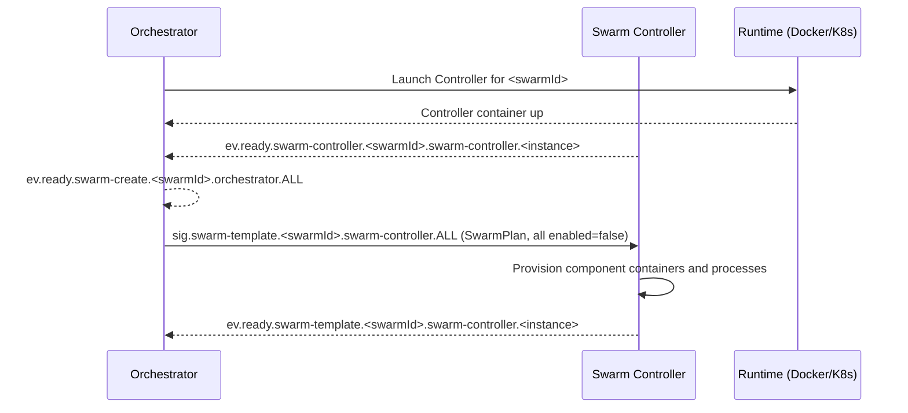
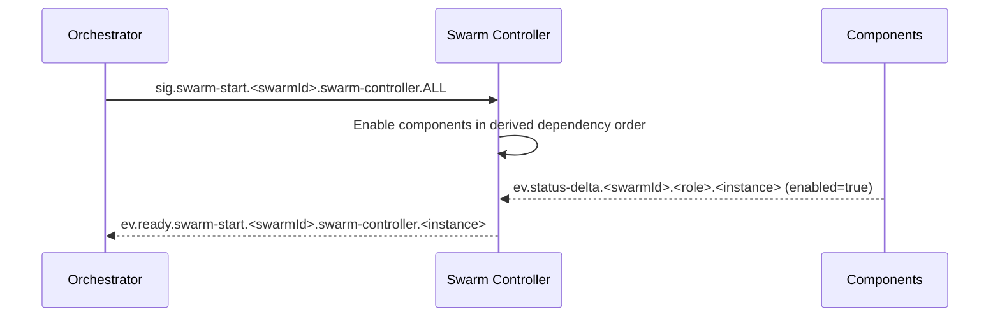
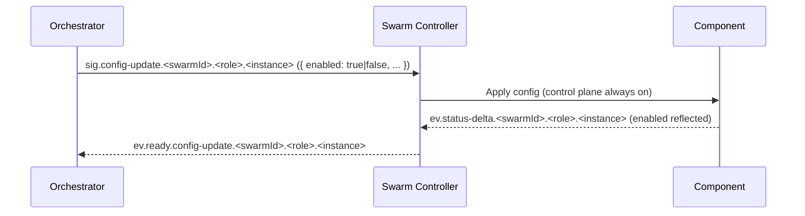
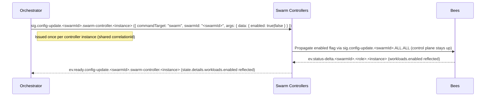
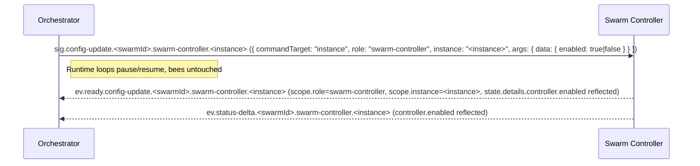
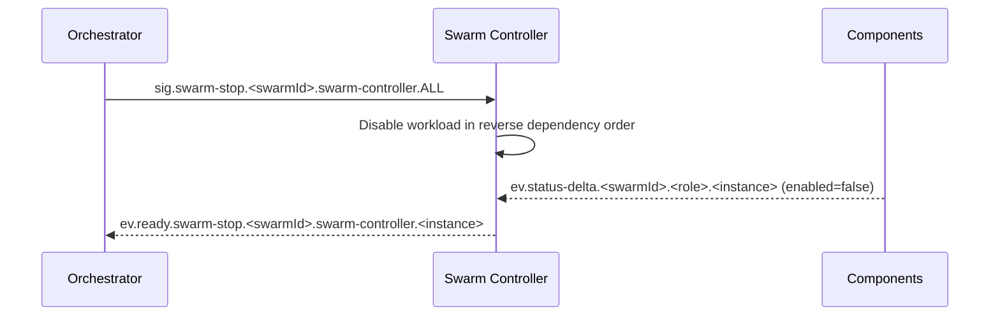
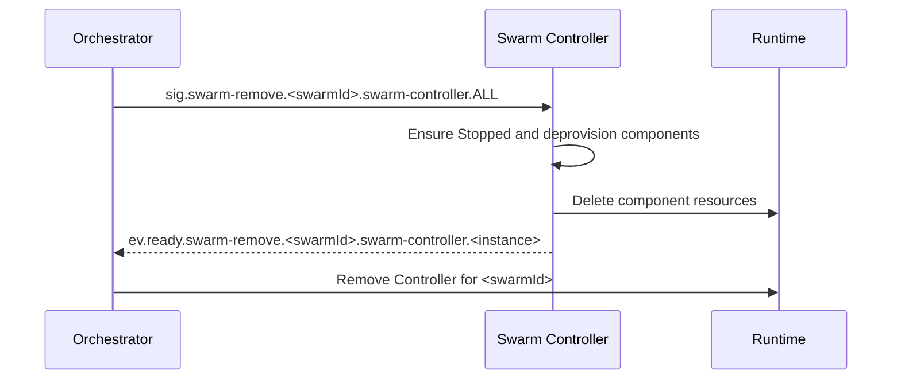
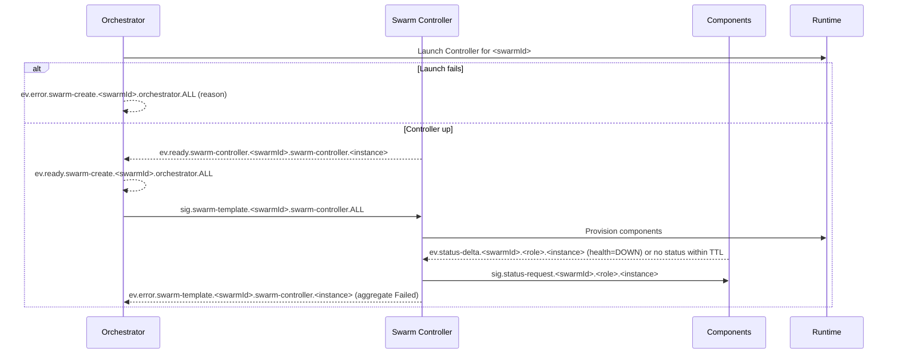

# PocketHive — ARCHITECTURE

> **Status:** Authoritative architecture specification (reference for agents).  
> **Scope:** Universal runtime (Docker Compose or Kubernetes).  
> **Compatibility:** Control‑plane names remain as in the repo; this file is the single source of truth.

---

## 1. Overview

PocketHive orchestrates message-driven swarms of components (generators, processors, post‑processors, triggers, etc.) coordinated by an **Orchestrator** and a per‑swarm **Swarm Controller**. Communication is over **AMQP** (RabbitMQ). **Health** and **readiness** are inferred from **AMQP status** events; controllers and the orchestrator cannot reach component Actuator endpoints and rely exclusively on control-plane heartbeats.

**Design principles**

- **Single source of truth** for desired state: **Orchestrator**.
- **Aggregate state** per swarm: **Swarm Controller**.
- **Per‑component state**: emitted by **components themselves**, consumed by the **Controller**, **not** by the Orchestrator in steady state.
- **Control plane always on**: status and config are accepted even when workloads are disabled.
- **Scoped controller toggles**: Operators set top-level `commandTarget` metadata together with explicit `swarmId`/`role`/`instance` fields on controller config updates. `commandTarget=swarm` with the swarm identifier toggles every workload the controller manages, while `commandTarget=instance` with `role=swarm-controller` and the controller's instance ID pauses/resumes only the controller runtime. In both cases `enabled` governs work processing while the control plane stays reachable.
- **Non‑destructive defaults**: failures never auto‑delete resources; Stop ≠ Remove.
- **Deterministic ordering** derived from queue I/O topology, not hard‑coded by role.
- **Command → Confirmation pattern**: Every control signal results in **exactly one**
  **success** (`ev.ready.*`) **or** **error** (`ev.error.*`), correlated via `correlationId` and `idempotencyKey`.

---

## 2. Roles (Managers vs. Workers)

PocketHive splits the control plane into **managers** (orchestrator + swarm controllers) and **workers** (generators, moderators, processors, post-processors, triggers, etc.). Managers shape desired state and publish control signals; workers execute workloads and echo health back through the same exchange.

### 2.1 Managers

#### Orchestrator (Queen)
- Owns the **desired state** and lifecycle intents per swarm (`SwarmPlan`).
- Launches a **Swarm Controller** for a new swarm (runtime) and, after the controller handshake, emits **`ev.ready.swarm-create.{swarmId}.orchestrator.ALL`**.
- Publishes swarm-scoped lifecycle commands such as `sig.swarm-template.{swarmId}.swarm-controller.ALL`, `sig.swarm-start.{swarmId}.swarm-controller.ALL`, `sig.swarm-stop.{swarmId}.swarm-controller.ALL`, and `sig.swarm-remove.{swarmId}.swarm-controller.ALL`.
- Issues **controller config updates** with top-level `commandTarget` metadata by addressing each controller instance via `sig.config-update.{swarmId}.swarm-controller.{instance}` (and `sig.config-update.ALL.swarm-controller.ALL` when broadcasting fleet-wide toggles).
- **Monitors** swarms to **Ready / Running**, marks **Failed** on timeout/error, and **never auto‑deletes** resources.
- Consumes **only swarm-level aggregates** and lifecycle confirmations, keeping fan-in small.

#### Swarm Controller (Marshal)
- Applies the plan locally; **provisions** components; maintains the **aggregate** swarm view.
- Declares the control queue `ph.control.<swarmId>.swarm-controller.<instance>` (instance ids already embed the swarm name) and binds it to `sig.swarm-template.{swarmId}.swarm-controller.ALL`, `sig.swarm-start.{swarmId}.swarm-controller.ALL`, `sig.swarm-stop.{swarmId}.swarm-controller.ALL`, `sig.swarm-remove.{swarmId}.swarm-controller.ALL`, `sig.config-update.{swarmId}.swarm-controller.{instance}`, `sig.config-update.ALL.swarm-controller.ALL`, `sig.config-update.{swarmId}.ALL.ALL`, and the relevant status-request routes (`sig.status-request.{swarmId}.swarm-controller.{instance}`, `sig.status-request.{swarmId}.swarm-controller.ALL`, `sig.status-request.ALL.swarm-controller.ALL`).
- Declares the shared hive exchange `ph.{swarmId}.hive` and **exclusively** provisions the `ph.work.{swarmId}.*` queues plus their bindings; worker services consume through the autoconfigured topology and must not override these declarations. See §3 and the [AsyncAPI spec](spec/asyncapi.yaml) for the canonical routing definitions.
- Emits **swarm-level** lifecycle confirmations (`ev.ready.swarm-template.{swarmId}.swarm-controller.{instance}`, `ev.ready.swarm-start.{swarmId}.swarm-controller.{instance}`, `ev.ready.swarm-stop.{swarmId}.swarm-controller.{instance}`, `ev.ready.swarm-remove.{swarmId}.swarm-controller.{instance}`) plus controller config acknowledgements (`ev.ready.config-update.{swarmId}.swarm-controller.{instance}`) and periodic status events.
- Consumes every component heartbeat within the swarm via `ev.status-{delta|full}.{swarmId}.*.*` to keep aggregate health and enablement up-to-date.
- Treats AMQP `ev.status-{delta|full}` as the **sole heartbeat source**; if a component goes silent it issues `sig.status-request.{swarmId}.ALL.ALL` and marks the component stale if no response arrives.
- When targeted by `sig.config-update.{swarmId}.swarm-controller.{instance}` it inspects the top-level `commandTarget` together with the `swarmId`/`role`/`instance` tuple: `commandTarget=swarm` with the controller's swarm ID → keep the control plane alive and **fan the new workload state out to every bee** via `sig.config-update.{swarmId}.ALL.ALL`; `commandTarget=instance` with `role=swarm-controller` and the local instance ID → pause/resume only its reconciliation loops while emitting controller-specific state (`state.details.controller.enabled`).
- Control plane stays enabled even when workloads are paused; start/stop/remove/status/config are always honored.

### 2.2 Workers (Bees)
- Declare their own control queues on startup using the `ph.control.<swarmId>.<role>.<instance>` naming pattern (instance ids embed the swarm prefix) and bind to `sig.config-update.{swarmId}.{role}.ALL`, `sig.config-update.{swarmId}.{role}.{instance}`, `sig.config-update.{swarmId}.ALL.ALL`, plus the corresponding status-request bindings (`sig.status-request.{swarmId}.{role}.ALL`, `sig.status-request.{swarmId}.{role}.{instance}`, `sig.status-request.{swarmId}.ALL.ALL`).
- Consume workloads from queues named `ph.work.<swarmId>.<queueName>` that hang off the swarm's shared work exchange.
- Accept config updates from both the orchestrator (role/instance routing keys) and their controller (swarm broadcast) without relying on implicit routing conventions.
- Emit **their own** status streams (`ev.status-{full|delta}.{swarmId}.{role}.{instance}`) and respond to manager `sig.status-request.{swarmId}.{role}.{instance}` heartbeats.
- Apply `sig.config-update.{swarmId}.{role}.{instance}` (`enabled: true|false`) to control **workload** state only while keeping control listeners responsive.
- Runtime behaviour, worker interfaces, and adoption guidance are covered in the [Worker SDK quick start](sdk/worker-sdk-quickstart.md).

Workers source their queue/exchange bindings from the IO sections, not from the control-plane block:

```yaml
pockethive:
  inputs:
    rabbit:
      queue: ph.work.swarm-1.mod
  outputs:
    rabbit:
      exchange: ph.swarm-1.hive
      routing-key: ph.work.swarm-1.final
```

The Swarm Controller injects the same values into each container via `POCKETHIVE_INPUT_RABBIT_QUEUE` /
`POCKETHIVE_OUTPUT_RABBIT_*`, and the Worker SDK fails fast when any required field is missing.

---

## 3. Exchanges & routing (wire contract)

> The AsyncAPI defines a **single swarm-aware control signal shape** and unified confirmations/events.

### 3.1 Routing key patterns
- Every control-plane topic is swarm-aware: `sig.{command}.{swarmId}.{role}.{instance}` for signals and `ev.{type}.{swarmId}.{role}.{instance}` for events. `ALL` is the only wildcard and may appear in any position to indicate broadcast.
- **Lifecycle:** `sig.swarm-template.{swarmId}.swarm-controller.ALL`, `sig.swarm-start.{swarmId}.swarm-controller.ALL`, `sig.swarm-stop.{swarmId}.swarm-controller.ALL`, `sig.swarm-remove.{swarmId}.swarm-controller.ALL`.
- **Controller config:** `sig.config-update.{swarmId}.swarm-controller.{instance}` for targeted toggles, plus `sig.config-update.{swarmId}.swarm-controller.ALL` (role-wide) and `sig.config-update.ALL.swarm-controller.ALL` (fleet broadcast).
- **Worker config:** `sig.config-update.{swarmId}.{role}.{instance}` (orchestrator → component) with swarm broadcasts (`sig.config-update.{swarmId}.ALL.ALL`) issued by the controller.
- **Status requests:** `sig.status-request.{swarmId}.{role}.{instance}` with the same broadcast semantics (`ALL`).
- **Telemetry & confirmations:** `ev.ready.<command>.{swarmId}.{role}.{instance}`, `ev.error.<command>.{swarmId}.{role}.{instance}`, `ev.status-{full|delta}.{swarmId}.{role}.{instance}`, `ev.lifecycle.{swarmId}.{role}.{instance}`, `ev.metric.{swarmId}.{role}.{instance}`, `ev.alert.{swarmId}.{role}.{instance}`.
- **Payload metadata:** Every `ControlSignal` carries `swarmId`, `role`, `instance`, and `commandTarget` fields regardless of routing key so consumers can resolve scope without topic parsing.

### 3.2 Required bindings

| Actor | Declared control queue | Required bindings |
|---|---|---|
| **Swarm controller** | `ph.control.<swarmId>.swarm-controller.<instance>` | `sig.swarm-template.{swarmId}.swarm-controller.ALL`<br>`sig.swarm-start.{swarmId}.swarm-controller.ALL`<br>`sig.swarm-stop.{swarmId}.swarm-controller.ALL`<br>`sig.swarm-remove.{swarmId}.swarm-controller.ALL`<br>`sig.config-update.{swarmId}.swarm-controller.{instance}`<br>`sig.config-update.ALL.swarm-controller.ALL`<br>`sig.config-update.{swarmId}.ALL.ALL`<br>`sig.status-request.{swarmId}.swarm-controller.{instance}`<br>`sig.status-request.{swarmId}.swarm-controller.ALL`<br>`sig.status-request.ALL.swarm-controller.ALL`<br>`ev.status-full.{swarmId}.*.*`<br>`ev.status-delta.{swarmId}.*.*` |
| **Generator / Moderator / Processor / Post-processor / Trigger** | `ph.control.<swarmId>.<role>.<instance>` | `sig.config-update.{swarmId}.{role}.ALL`<br>`sig.config-update.{swarmId}.{role}.{instance}`<br>`sig.config-update.{swarmId}.ALL.ALL`<br>`sig.status-request.{swarmId}.{role}.ALL`<br>`sig.status-request.{swarmId}.{role}.{instance}`<br>`sig.status-request.{swarmId}.ALL.ALL` |
| **Observers (read-only)** | n/a | Subscribe to `ev.ready.*`, `ev.error.*`, `ev.status-*.*`, `ev.lifecycle.*`, `ev.metric.*`, `ev.alert.*` as needed |

> Workers receive controller fan-outs via `sig.config-update.{swarmId}.ALL.ALL` and role/instance-specific commands via `sig.config-update.{swarmId}.{role}[.{instance}]`; managers MAY bind to the same subjects when they need read/write visibility.

### 3.3 Control signals (managers publish)
All control subjects follow `sig.{command}.{swarmId}.{role}.{instance}`. Use `ALL` to broadcast across a dimension (e.g. every controller instance within a swarm).

- `sig.swarm-template.{swarmId}.swarm-controller.ALL` — send or replace the `SwarmPlan` (components start `enabled=false`).
- `sig.swarm-start.{swarmId}.swarm-controller.ALL` — start workloads in dependency order.
- `sig.swarm-stop.{swarmId}.swarm-controller.ALL` — **non-destructive stop** (disable workloads, keep resources).
- `sig.swarm-remove.{swarmId}.swarm-controller.ALL` — explicit deprovision/delete.
- `sig.config-update.{swarmId}.swarm-controller.{instance}` — toggle a specific controller (`commandTarget=instance` for runtime enablement, `commandTarget=swarm` when broadcasting workload state).
- `sig.config-update.ALL.swarm-controller.ALL` — orchestrator fan-out to every controller in the fleet.
- `sig.config-update.{swarmId}.ALL.ALL` — controller broadcast to all bees within a swarm.
- `sig.config-update.{swarmId}.{role}.{instance}` — orchestrator-issued worker config update (`commandTarget=role|instance`).
- `sig.status-request.{swarmId}.{role}.{instance}` — request an immediate `status-full` (use `ALL` when targeting multiple roles or instances).

**`ControlSignal` essentials:** `correlationId` *(uuid, new per attempt)*, `idempotencyKey` *(uuid, stable across retries)*, explicit `swarmId`/`role`/`instance` fields (even when the routing key uses `ALL`), `commandTarget` (`all|swarm|role|instance`), and an `args` object for command-specific data (patch payloads remain unchanged).

### 3.4 Confirmations (events)
Events mirror the same shape: `ev.{type}.{swarmId}.{role}.{instance}` where `{type}` captures both the phase (`ready|error|status-*|lifecycle|metric|alert`) and the underlying command when relevant.

- **Success (`ev.ready.*`):**
  - `ev.ready.swarm-create.{swarmId}.orchestrator.ALL` — emitted by the Orchestrator after controller handshake.
  - `ev.ready.swarm-template.{swarmId}.swarm-controller.{controllerInstance}` — Controller.
  - `ev.ready.swarm-start.{swarmId}.swarm-controller.{controllerInstance}` — Controller.
  - `ev.ready.swarm-stop.{swarmId}.swarm-controller.{controllerInstance}` — Controller.
  - `ev.ready.swarm-remove.{swarmId}.swarm-controller.{controllerInstance}` — Controller.
  - `ev.ready.config-update.{swarmId}.swarm-controller.{controllerInstance}` — Controller runtime/workload toggle acknowledgements.
  - `ev.ready.config-update.{swarmId}.{role}.{instance}` — Worker confirmations (`commandTarget=role|instance`).
- **Error (`ev.error.*`):** mirror the success topics with `error` in place of `ready`, preserving the same `{swarmId}.{role}.{instance}` segments.

> Controller config confirmations mirror the top-level `commandTarget`, keep the authoritative scope in the confirmation envelope, and surface enablement data via `state.enabled` plus `state.details.workloads.enabled` or `state.details.controller.enabled` so observers can distinguish workload and controller toggles without duplicated scope fields.

### 3.5 Status & telemetry streams
- **Swarm aggregates (Controller):** `ev.status-full.{swarmId}.swarm-controller.{instance}` and `ev.status-delta.{swarmId}.swarm-controller.{instance}`.
- **Per-component status:** `ev.status-full.{swarmId}.{role}.{instance}` and `ev.status-delta.{swarmId}.{role}.{instance}`.
- **Controller bootstrap handshake:** `ev.ready.swarm-controller.{swarmId}.swarm-controller.{instance}`.
- **Lifecycle milestones:** `ev.lifecycle.{swarmId}.{role}.{instance}`.
- **Metrics & alerts:** `ev.metric.{swarmId}.{role}.{instance}` / `ev.alert.{swarmId}.{role}.{instance}`.

---

## 4. Health & heartbeat model

- **AMQP `status-{delta|full}` events are the only heartbeat source.**
- If **no AMQP status** arrives within a **TTL** for a component included in the aggregate, the Controller **issues `sig.status-request.{swarmId}.ALL.ALL`** and marks the component **Degraded/Unknown** if no response arrives in time.
- Every **swarm aggregate** carries a **watermark timestamp** and **max-staleness**; if stale or incomplete, the Controller emits **Degraded/Unknown**.

---

## 5. Lifecycle & states

### 5.1 Swarm lifecycle (Orchestrator view)
```
New → Creating → Ready → Starting → Running
                     ↘ Failed ↙        → Stopping → Stopped → Removing → Removed
```
- **Creating:** Controller launched; success signalled by **`ev.ready.swarm-create.{swarmId}.orchestrator.ALL`**.
- **Ready:** plan applied; all desired components reporting Healthy via AMQP status events with `enabled=false`.
- **Failed:** an error or timeout occurred; **resources are preserved** for debugging.

### 5.2 Component lifecycle (aggregate perspective)
```
New → Provisioning → Healthy(enabled=false) → Starting → Running(enabled=true)
                                               ↘ Failed ↙               → Stopping → Stopped
```
> Per‑component transitions are **emitted by components**; the Controller **aggregates** only.

---

## 6. Dependency ordering (queue I/O graph)

Construct a directed graph where **A → B** if **A produces** to a queue that **B consumes**.

- **Create/Start order:** producers → transformers → consumers (topological order).
- **Stop order:** reverse of start order.
- Cycles/ambiguity → choose a stable order and emit a **warning** event with the heuristic used.

---

## 7. Sequences

> Rendering note: Mermaid messages avoid semicolons to prevent parser hiccups.

### 7.1 Create → Template (no auto‑start)


### 7.2 Start whole swarm


### 7.3 Per‑component enable/disable (via config‑update)


### 7.3b Bulk controller suspend/resume (`commandTarget=swarm`)


### 7.3c Controller runtime pause/resume (`commandTarget=instance`)


### 7.4 Stop whole swarm (non‑destructive)


### 7.5 Remove swarm (explicit delete)


### 7.6 Failure during create/start (no deletion)


---

## 8. Timeouts & cadence (defaults)

> Applied unless stricter values exist in code or plan.

- **Provisioning timeout (per component):** 120s  
- **Ready timeout (swarm total):** 5m  
- **Start timeout (per component):** 60s  
- **Start timeout (swarm total):** 3m  
- **Graceful stop timeout (per component):** 30s, then force‑stop (report degraded)  
- **Controller heartbeats:** `ev.status-{delta|full}.{swarmId}.swarm-controller.{instance}` on **state change** + **every 10s** (aggregate watermark).

---

## 9. Idempotency & delivery

- Control messages carry an **idempotency key** (UUID) and `correlationId`; delivery is **at‑least‑once**.
- The Swarm Controller now executes **every attempt**. It no longer caches outcomes, so callers must avoid reusing `idempotencyKey`
  values unless they intentionally want the command re-applied.
- Upstream components may still perform their own idempotency checks, but the controller simply emits a fresh confirmation for
  each attempt.

---

## 10. Observability & metrics

**Controller aggregates** include:
- `ts` (watermark), `swarmId`, and `{total, healthy, running, enabled}` counts.
- **Max staleness** and, when applicable, **Degraded/Unknown** reason.
- Recent **error summaries** (role/instance, reason, correlationId) for operator drill‑down.
- Optional **queueStats** with per-queue depth/consumer counts (and `oldestAgeSec` when brokers expose it) to highlight backlog pressure.

**Orchestrator** surfaces:
- Provision/ready/start durations, failure counts by reason, current running/enabled counts, queue connection summaries.

---

## 11. Security & audit

- Only the **Orchestrator** issues swarm lifecycle signals; UI proxies via Orchestrator.
- All actions/events are stamped with `correlationId`; per‑swarm audit logs are retained.
- Controller subscribes/publishes strictly within its `{swarmId}` namespace.
- UI AMQP creds are **read‑only**; all writes via Orchestrator REST.

---

## 12. Command envelopes

### Control signal (`sig.*`)
```json
{
  "signal": "config-update",
  "correlationId": "uuid-from-orchestrator",
  "idempotencyKey": "uuid-reused-for-retries",
  "swarmId": "alpha",
  "role": "generator",
  "instance": "alpha-generator-bee-1",
  "commandTarget": "role",
  "args": {
    "data": {
      "enabled": true
    }
  }
}
```

### Success (`ev.ready.*`)
```json
{
  "ts": "2025-09-12T12:34:56Z",
  "correlationId": "uuid-from-signal-or-runtime-op",
  "idempotencyKey": "uuid-from-signal",
  "signal": "swarm-create|swarm-start|swarm-stop|swarm-template|swarm-remove|config-update",
  "scope": {"swarmId":"alpha", "role":"generator", "instance":"alpha-generator-bee-1"},
  "result": "success",
  "state": {
    "status": "Running",
    "enabled": true,
    "details": {
      "workloads": { "enabled": true }
    }
  }
}
```

### Error (`ev.error.*`)
```json
{
  "ts": "2025-09-12T12:34:56Z",
  "correlationId": "uuid-from-signal-or-runtime-op",
  "idempotencyKey": "uuid-from-signal",
  "signal": "swarm-create|swarm-start|swarm-stop|swarm-template|swarm-remove|config-update",
  "scope": {"swarmId":"alpha", "role":"generator", "instance":"alpha-generator-bee-1"},
  "result": "error",
  "state": {
    "status": "Stopped",
    "enabled": false,
    "details": {
      "workloads": { "enabled": false }
    }
  },
  "phase": "create|template|start|stop|remove|runtime",
  "code": "SHORT_CODE",
  "message": "Human-readable summary",
  "retryable": true,
  "details": {"context": "last logs, probe, etc."}
}
```

---

## 13. Changelog (normative changes)

- **Create flow:** no `sig.swarm-create`; success is **`ev.ready.swarm-create.{swarmId}.orchestrator.ALL`** emitted by the Orchestrator after controller handshake.
- **Removed milestones:** legacy four-segment events (`ev.ready.swarm-template.<swarmId>`, etc.) are replaced by fully scoped confirmations such as **`ev.ready.swarm-template.{swarmId}.swarm-controller.{instance}`** and **`ev.ready.swarm-remove.{swarmId}.swarm-controller.{instance}`**.  
- **Remove flow:** upon **`ev.ready.swarm-remove.{swarmId}.swarm-controller.{instance}`**, the Orchestrator **removes the Swarm Controller** runtime unit.
- **Unified envelopes:** all commands use `ControlSignal`; confirmations echo `correlationId` and `idempotencyKey`.
- **Signals updated:** drop legacy `type`/`version`/`messageId`/`timestamp` fields; payload is unified `ControlSignal` metadata (`signal`, scope fields, `commandTarget`, and optional `args`).
