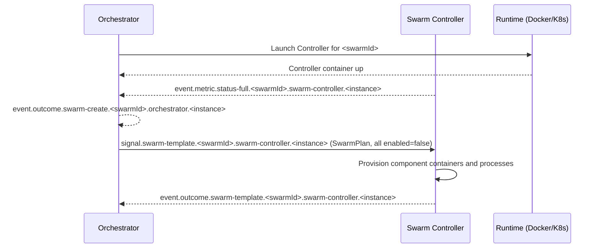
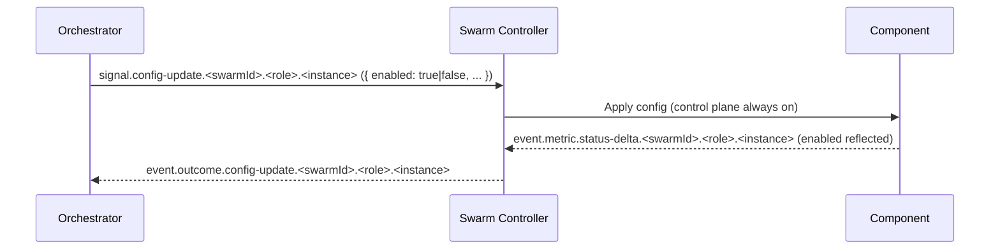
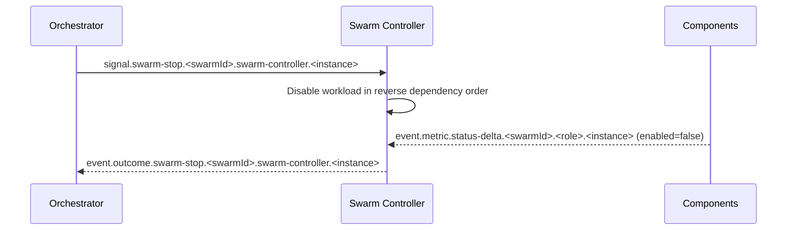
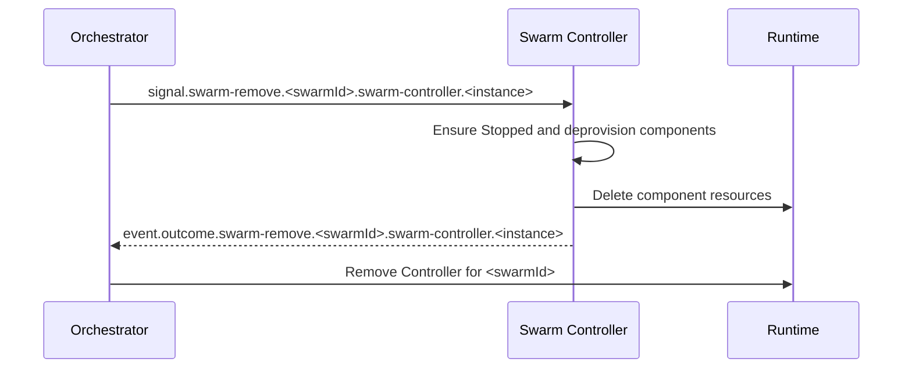
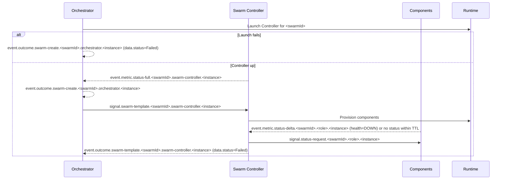

# PocketHive — ARCHITECTURE

> **Status:** Authoritative architecture specification (reference for agents).  
> **Scope:** Universal runtime (Docker Compose or Kubernetes).  
> **Compatibility:** Control‑plane names remain as in the repo; this file is the single source of truth.

---

## 1. Overview

PocketHive orchestrates message-driven swarms of components (generators, processors, post‑processors, triggers, etc.) coordinated by an **Orchestrator** and a per‑swarm **Swarm Controller**. Communication is over **AMQP** (RabbitMQ). **Health** and **readiness** are inferred from **AMQP status** events; controllers and the orchestrator cannot reach component Actuator endpoints and rely exclusively on control-plane heartbeats.

**Design principles**

- **Single source of truth** for desired state: **Orchestrator**.
- **Aggregate state** per swarm: **Swarm Controller**.
- **Per‑component state**: emitted by **components themselves**, consumed by the **Controller**, **not** by the Orchestrator in steady state.
- **Control plane always on**: status and config are accepted even when workloads are disabled.
- **Scoped config updates**: `signal.config-update` targets a concrete `scope` via routing key and envelope fields; no extra targeting metadata is used.
- **Non‑destructive defaults**: failures never auto‑delete resources; Stop ≠ Remove.
- **Deterministic ordering** derived from queue I/O topology, not hard‑coded by role.
- **Command → Outcome pattern**: Every control signal results in **exactly one** outcome event
  (`event.outcome.*`) that is either success or error, correlated via `correlationId` and `idempotencyKey`.
  Runtime/IO errors also emit `event.alert.{type}` for operator visibility.

---

## 2. Roles (Managers vs. Workers)

PocketHive splits the control plane into **managers** (orchestrator + swarm controllers) and **workers** (generators, moderators, processors, post-processors, triggers, etc.). Managers shape desired state and publish control signals; workers execute workloads and echo health back through the same exchange.

### 2.1 Managers

#### Orchestrator (Queen)
- Owns the **desired state** and lifecycle intents per swarm (`SwarmPlan`).
- Launches a **Swarm Controller** for a new swarm (runtime) and, after the first controller `event.metric.status-full.{swarmId}.swarm-controller.<instance>` arrives, emits **`event.outcome.swarm-create.{swarmId}.orchestrator.<instance>`**.
- Publishes swarm-scoped lifecycle commands such as `signal.swarm-template.{swarmId}.swarm-controller.<instance>`, `signal.swarm-plan.{swarmId}.swarm-controller.<instance>`, `signal.swarm-start.{swarmId}.swarm-controller.<instance>`, `signal.swarm-stop.{swarmId}.swarm-controller.<instance>`, and `signal.swarm-remove.{swarmId}.swarm-controller.<instance>` (lifecycle commands always target a concrete controller instance).
- Issues **controller config updates** by addressing each controller instance via `signal.config-update.{swarmId}.swarm-controller.<instance>` (and `signal.config-update.ALL.swarm-controller.ALL` when broadcasting fleet-wide toggles).
- **Monitors** swarms to **Ready / Running**, marks **Failed** on timeout/error, and **never auto‑deletes** resources.
- Consumes **only swarm-level aggregates** and lifecycle outcomes, keeping fan-in small.

#### Swarm Controller (Marshal)
- Applies the plan locally; **provisions** components; maintains the **aggregate** swarm view.
- Declares the control queue `ph.control.<swarmId>.swarm-controller.<instance>` (instance ids already embed the swarm name) and binds it to `signal.swarm-template.{swarmId}.swarm-controller.<instance>`, `signal.swarm-plan.{swarmId}.swarm-controller.<instance>`, `signal.swarm-start.{swarmId}.swarm-controller.<instance>`, `signal.swarm-stop.{swarmId}.swarm-controller.<instance>`, `signal.swarm-remove.{swarmId}.swarm-controller.<instance>`, `signal.config-update.{swarmId}.swarm-controller.<instance>`, `signal.config-update.ALL.swarm-controller.ALL`, `signal.config-update.{swarmId}.ALL.ALL`, and the relevant status-request routes (`signal.status-request.{swarmId}.swarm-controller.<instance>`, `signal.status-request.{swarmId}.swarm-controller.ALL`, `signal.status-request.ALL.swarm-controller.ALL`).
- Declares the shared hive exchange `ph.{swarmId}.hive` and **exclusively** provisions the `ph.work.{swarmId}.*` queues plus their bindings; worker services consume through the autoconfigured topology and must not override these declarations. See §3 and the [AsyncAPI spec](spec/asyncapi.yaml) for the canonical routing definitions.
- Emits **swarm-level** lifecycle outcomes (`event.outcome.swarm-template.{swarmId}.swarm-controller.<instance>`, `event.outcome.swarm-plan.{swarmId}.swarm-controller.<instance>`, `event.outcome.swarm-start.{swarmId}.swarm-controller.<instance>`, `event.outcome.swarm-stop.{swarmId}.swarm-controller.<instance>`, `event.outcome.swarm-remove.{swarmId}.swarm-controller.<instance>`) plus controller config outcomes (`event.outcome.config-update.{swarmId}.swarm-controller.<instance>`) and periodic status metrics.
- Consumes every component heartbeat within the swarm via `event.metric.status-{delta|full}.{swarmId}.*.*` to keep aggregate health and enablement up-to-date.
- Treats AMQP `event.metric.status-{delta|full}` as the **sole heartbeat source**; if a component goes silent it issues `signal.status-request.{swarmId}.ALL.ALL` and marks the component stale if no response arrives.
- May propagate workload enablement via `signal.config-update.{swarmId}.ALL.ALL` while keeping the control plane responsive.
- Control plane stays enabled even when workloads are paused; start/stop/remove/status/config are always honored.

### 2.2 Workers (Bees)
- Declare their own control queues on startup using the `ph.control.<swarmId>.<role>.<instance>` naming pattern (instance ids embed the swarm prefix) and bind to `signal.config-update.{swarmId}.{role}.ALL`, `signal.config-update.{swarmId}.{role}.{instance}`, `signal.config-update.{swarmId}.ALL.ALL`, plus the corresponding status-request bindings (`signal.status-request.{swarmId}.{role}.ALL`, `signal.status-request.{swarmId}.{role}.{instance}`, `signal.status-request.{swarmId}.ALL.ALL`).
- Consume workloads from queues named `ph.work.<swarmId>.<queueName>` that hang off the swarm's shared work exchange.
- Accept config updates from both the orchestrator (role/instance routing keys) and their controller (swarm broadcast) without relying on implicit routing conventions.
- Emit **their own** status streams (`event.metric.status-{full|delta}.{swarmId}.{role}.{instance}`) and respond to manager `signal.status-request.{swarmId}.{role}.{instance}` heartbeats.
- Apply `signal.config-update.{swarmId}.{role}.{instance}` (`data.enabled: true|false`) to control **workload** state only while keeping control listeners responsive.
- Runtime behaviour, worker interfaces, and adoption guidance are covered in the [Worker SDK quick start](sdk/worker-sdk-quickstart.md).

### 2.3 HTTP Builder worker

- Optional worker that sits between **Data Providers** (or other producers) and the **processor** in the work topology.
- **Input:** generic `WorkItem` from RabbitMQ with:
  - payload: arbitrary text/JSON produced upstream (for example, a per-customer dataset row from Redis),
  - headers: including `x-ph-call-id` (required) and optional `x-ph-service-id`.
- **Templates:** disk-backed HTTP call definitions under a configurable `templateRoot`:
  - organised as `(serviceId, callId)` pairs,
  - define `method`, `pathTemplate`, `headersTemplate`, and `bodyTemplate`,
  - rendered via the shared Pebble+SpEL templating engine using `payload`, `headers`, and `workItem` as context.
- **Behaviour:**
  - On each message, resolves `(serviceId, callId)` to a template and appends an HTTP envelope step:
    - `{ path, method, headers, body }` – exactly what `processor-service` expects.
  - Missing `callId` or template is handled explicitly via config:
    - `passThroughOnMissingTemplate: true` → log and return the original `WorkItem` unchanged.
    - `passThroughOnMissingTemplate: false` → log and drop the message (no output).
  - Publishes status data per role via the control plane (template root, service id, `errorCount`, `errorTps`) so operators can see template issues without inspecting logs.

Workers source their queue/exchange bindings from the IO sections, not from the control-plane block:

```yaml
pockethive:
  inputs:
    rabbit:
      queue: ph.work.swarm-1.mod
  outputs:
    rabbit:
      exchange: ph.swarm-1.hive
      routing-key: ph.work.swarm-1.final
```

The Swarm Controller injects the same values into each container via `POCKETHIVE_INPUT_RABBIT_QUEUE` /
`POCKETHIVE_OUTPUT_RABBIT_*`, and the Worker SDK fails fast when any required field is missing.

### 2.4 WorkItem envelope (data plane, SSOT)

The WorkItem on-wire format is a **single JSON envelope** defined in
`docs/spec/workitem-envelope.schema.json`. Transport headers (AMQP/SQS/Kafka) **must not**
carry WorkItem data — the full payload, headers, steps, and observability live inside the JSON body.

Key rules:

- `steps[]` is always present (min 1). Step headers **must** include `ph.step.service` and
  `ph.step.instance` for every step.
- The current payload is always the last step (`steps[-1]`). The `WorkItem` API exposes it via
  `payload()` / `payloadEncoding()`; the on-wire envelope does not duplicate it at the top level.
- Step 0 is explicit (no auto-seeding in builders). Empty payloads are allowed.
- `messageId` and `contentType` are top-level only (do not duplicate in headers).
- `x-ph-service` is deprecated for WorkItem tracking; tests enforce its absence in WorkItem headers.
---

## 3. Control-plane envelope & routing (SSOT)

Control-plane payloads are defined by `docs/spec/control-events.schema.json` and routed as specified in `docs/spec/asyncapi.yaml`.

### 3.1 Envelope fields (SSOT)

| Field | Type | Required | Description |
|---|---|---|---|
| `timestamp` | string | Yes | RFC‑3339 time when the message was emitted by its origin. |
| `version` | string | Yes | Schema version of the envelope and its structured `data` section for this control‑plane message. Bump only for incompatible changes. |
| `kind` | string | Yes | Coarse category of the message: one of `signal`, `outcome`, `event`, `metric`. All routing/consumers should branch on this field first. |
| `type` | string | Yes | Concrete name within the `kind` category. For `kind=signal`/`kind=outcome` this is the command name (`swarm-start`, `config-update`, …); for `kind=event` the current spec covers `alert`; for `kind=metric` the current spec covers `status-full` and `status-delta`. |
| `origin` | string | Yes | Logical emitter identity (e.g. `orchestrator-1`, `swarm-controller:aaa-marshal-…`, `processor:bee-1`, `hive-ui`). Never blank. |
| `scope` | object | Yes | `{ swarmId, role, instance }` describing the entity the message is about. |
| `scope.swarmId` | string | Yes | Swarm the message relates to. Use the literal `ALL` for cross‑swarm or global fan‑out; never `null`. |
| `scope.role` | string | Yes | Role of the **subject** of the message; free‑form logical role id. Core roles include `orchestrator`, `swarm-controller`, `generator`, `moderator`, `processor`, `postprocessor`, `trigger`, but plugins may introduce additional roles. Use the literal `ALL` for cross‑role or fan‑out scopes; never `null`. The envelope schema must **not** hardcode an enum for this field. |
| `scope.instance` | string | Yes | Logical instance identifier of the **subject** of the message (the controller/worker/orchestrator instance the message is about). Use the literal `ALL` for fan‑out across instances; never `null`. This may or may not be the same as the `origin` instance that emitted it. |
| `correlationId` | string\|null | Yes | Correlation token used to join related messages. For `kind=signal` / `kind=outcome`, this field **must** be non‑empty and identical across the command signal and its outcomes. For other kinds (`event`, `metric`) it is either `null` or used only for explicitly documented higher‑level correlations. |
| `idempotencyKey` | string\|null | Yes | Stable identifier reused across retries of the same logical operation. For externally initiated `kind=signal` / `kind=outcome` messages this field **should** be non‑empty; for purely internal, non‑retriable messages it may be `null`. For non‑command kinds (`event`, `metric`) this field is typically `null`. |

### 3.2 Structured `data` rules

- `data` is always an object on-wire. Commands without args still send `data: {}`.
- Outcomes must include at least `data.status`.
- Targeting never lives in `data`; it is described only by `scope` and the routing key.
- The required shape of `data` is defined per (`kind`, `type`) in `docs/spec/control-events.schema.json`.

**Structured sections**

| Section / Field | Type | Applies to | Description |
|---|---|---|---|
| `data` | object | all kinds | Structured payload for the message. On-wire producers always emit an object; commands without args send `{}` and outcomes must include at least `data.status`. For each (`kind`, `type`) combination, the AsyncAPI / JSON Schema specs in `docs/spec` MUST define the required shape of `data` (required fields + optional extension fields). Targeting is never carried inside `data`; targeting is described only by `scope` and the routing key. All additional, best‑effort metadata for that message also lives under `data`. |

- [x] Extend existing specs in `docs/spec`:
  - Update `docs/spec/asyncapi.yaml` channels and schemas, and `docs/spec/control-events.schema.json`, so they describe the canonical routing families and envelope shapes below.

### 3.3 Routing key families

Relationship to routing keys (new prefixes):

- Control‑plane **signals** use the `signal.*` prefix. The canonical pattern after the refactor is:  
  `signal.<commandType>.<swarmId>.<role>.<instance>` where:
  - `<commandType>` is the envelope `type` for `kind = signal` (for example `swarm-start`, `swarm-stop`, `swarm-remove`, `config-update`, `status-request`).
  - `<swarmId>.<role>.<instance>` are the semantic target and must match `scope.swarmId` / `scope.role` / `scope.instance` on the signal. For fan‑out signals the routing key may still use wildcards (for example `ALL`), while `scope` on outcomes will carry concrete values. **Lifecycle commands addressed at the swarm‑controller (`swarm-template`, `swarm-plan`, `swarm-start`, `swarm-stop`, `swarm-remove`) MUST use a concrete controller instance in the `<instance>` segment once a controller exists; using `ALL` for these commands is forbidden in the new model.**

- Control‑plane **events** (everything that is not a command signal) use the `event.*` prefix. The canonical pattern is:  
  `event.<category>.<name>.<swarmId>.<role>.<instance>` where:
  - `<category>` differentiates major event families such as `outcome`, `metric`, `alert` (for example `event.outcome.*`, `event.metric.*`, `event.alert.{type}.*`). The alert family uses `<name>` as the alert type; today the only defined type is `alert`.
  - `<name>` is normally the envelope `type` within that family (for example `status-full`, `status-delta` for metrics, or the command name such as `swarm-start` / `config-update` for outcomes).
  - `<swarmId>.<role>.<instance>` are the semantic subject and must match `scope.swarmId` / `scope.role` / `scope.instance`, normalised so that fan‑out uses the literal `ALL` in both the routing key and `scope` (no `null` placeholders).

- For **command outcomes** (`kind = outcome`), the routing key uses the `event.outcome.*` family:  
  `event.outcome.<commandType>.<swarmId>.<role>.<instance>`. Here `<commandType>` matches the originating signal’s `type` (command name), `scope` describes the concrete subject that actually processed the command, and `correlationId` / `idempotencyKey` join the outcome back to the original `signal.*` message.

### 3.4 Control-plane commands & outcomes

**Known `data` schemas for existing messages (today)**

The tables below describe the canonical `data` shapes for the message kinds/types covered by the current specs in `docs/spec/asyncapi.yaml` / `docs/spec/control-events.schema.json`.

*Commands in the new model always use `kind = signal`, `type = <commandName>` and the `signal.<type>.<swarmId>.<role>.<instance>` routing family. Outcomes always use `kind = outcome`, `type = <commandName>` and the `event.outcome.<type>.<swarmId>.<role>.<instance>` family. The tables below summarise current commands and their `data`/args usage so we can standardise them in the refactor.*

**Command signals (`kind = signal`) — purpose and targeting (today)**

| `type` | Purpose / effect | Typical routing key (refactored) | Target subject (conceptual `scope`) |
|---|---|---|---|
| `swarm-template` | Apply swarm template (bees, images, wiring, config, SUT). | `signal.swarm-template.<swarmId>.swarm-controller.<instance>` | Swarm controller instance for `<swarmId>`. |
| `swarm-plan` | Push resolved scenario plan timeline to controller. | `signal.swarm-plan.<swarmId>.swarm-controller.<instance>` | Swarm controller instance for `<swarmId>`. |
| `swarm-start` | Start workloads inside a running controller. | `signal.swarm-start.<swarmId>.swarm-controller.<instance>` | Swarm controller instance for `<swarmId>`. |
| `swarm-stop` | Stop workloads (non‑destructive). | `signal.swarm-stop.<swarmId>.swarm-controller.<instance>` | Swarm controller instance for `<swarmId>`. |
| `swarm-remove` | Tear down queues and controller runtime. | `signal.swarm-remove.<swarmId>.swarm-controller.<instance>` | Swarm controller instance for `<swarmId>`. |
| `config-update` | Apply config patch / enablement to one or more components. | `signal.config-update.<swarmId>.<role>.<instance>` | Target component(s) addressed by routing key segments (supports ALL wildcards where fan-out is intentional). |
| `status-request` | Ask a component to emit an explicit status snapshot. | `signal.status-request.<swarmId>.<role>.<instance>` | Target component(s) addressed by routing key segments (supports ALL wildcards where fan-out is intentional). |

**Command signals (`kind = signal`) — current `data` / args**

| `type` | `data` / args field | Required | Description |
|---|---|---|---|
| `swarm-template` | `data` | Yes | Entire swarm template/plan as a `SwarmPlan` object (id, bees, traffic policy, sutId, etc.), converted to a JSON object. Shape is defined by the swarm model (`SwarmPlan`); the control envelope does not add extra fields. |
| `swarm-plan` | `data` | Yes | Resolved scenario plan timeline as a JSON object. Shape is defined by scenario manager contracts; control‑plane treats it as opaque. |
| `swarm-start` | — | No | No command‑level args; semantics come from `type`, `scope`/routing, `correlationId` and `idempotencyKey`. On‑wire producers still send an empty `data: {}` to keep envelopes schema‑compliant. |
| `swarm-stop` | — | No | Same as `swarm-start` (no args); on‑wire producers still send an empty `data: {}`. |
| `swarm-remove` | — | No | Same as `swarm-start` (no args); on‑wire producers still send an empty `data: {}`. |
| `config-update` | `data` | Yes | Config payload for the target component(s). Targeting is carried exclusively by the envelope `scope` and routing key. The `data` object carries the config patch and enablement flags. Exact shape is defined in worker/manager config docs. |
| `status-request` | — | No | No command‑level args; the response is a `status-full` metric event instead of a confirmation outcome. On‑wire producers still send an empty `data: {}`. |

**Command outcomes (`kind = outcome`) — current payloads**

For **outcome** messages (`kind = outcome`, `type = <command>`), outcomes use a single `CommandOutcomePayload` envelope shape; the table below captures the field-level mapping from the legacy confirmation shape.

- Outcomes are published on `event.outcome.<type>.<swarmId>.<role>.<instance>` (except `status-request`, which responds with `event.metric.status-full`).
- `data.status` is always required.
- `data.retryable` is set only for commands with defined retry semantics.
- Structured post-command detail belongs in `data.context` (no generic `state.*` fields).
- Legacy confirmation fields are removed: `state.enabled` is gone, and any
  human-readable `message`/`code` belongs in `event.alert.{type}` payloads.

**Current payload mapping (legacy -> envelope)**

| Field (today) | Planned location | Description |
|---|---|---|
| `state.status` | `data.status` | High‑level status after processing the command (for example `Ready`, `Running`, `Stopped`, `Removed`, `Failed`, `Applied`, `NotReady`). |
| `state.enabled` | — (removed) | Removed in the new model. Enablement lives in a single place: `data.enabled` on config‑update outcomes and `data.enabled` in status metrics; there is no generic `state.enabled` field. |
| `state.details` | `data.context` | Structured post‑command state details (for example `workloads.enabled`, scenario changes, worker info), to be defined per command type. No separate `controllerEnabled` field is kept. |
| `phase` | — (removed or mapped to alert) | Error phase will not be carried as a generic outcome field. If needed for debugging, producers include it in alert `data.context.phase` for the corresponding `event.alert.{type}` message. |
| `code` | — (replaced by alert `data.code`) | Command outcomes no longer carry their own error/result code; runtime and IO errors are expressed via `event.alert.{type}` with `data.code`. |
| `message` | — (replaced by alert `data.message`) | Human‑readable error/message text for failures is carried by `event.alert.{type}.data.message` rather than command outcome envelopes. |
| `retryable` | `data.retryable` | Whether this **failed** command attempt is safe to retry. Only set on error outcomes for commands where retry semantics are defined (for example swarm create/start/stop/remove). |
| `details` | — (folded into `data.context`) | Catch‑all details on confirmations are removed. Any structured context that needs to survive goes into `data.context` on the outcome and/or the corresponding `event.alert.{type}`. |

**Initialization + readiness gates (`swarm-start`, `swarm-stop`, `config-update`)**

- Initialization is satisfied after the controller has successfully processed both
  `swarm-template` and `swarm-plan` for the swarm.
- Readiness is defined as: `isReadyForWork == true` AND `hasPendingConfigUpdates == false`.
- Commands allowed before initialization: `swarm-template`, `swarm-plan`, `status-request`,
  and `swarm-remove` (abort).
- `swarm-start` is rejected unless initialization + readiness are satisfied. A rejected
  `swarm-start` emits an outcome with `data.status = "NotReady"` and a `data.context`
  payload that captures the gating flags (for example `initialized=false`, `ready=false`,
  `pendingConfigUpdates=true`).
- `swarm-stop` and controller-targeted `config-update` are rejected unless initialization
  + readiness are satisfied and the swarm is already `RUNNING`. Rejections use the same
  `NotReady` outcome pattern; no side effects occur when rejected.

### 3.5 Status metrics semantics

**Control metrics (`kind=metric`)**

| `type` | `data` field | Required | Description |
|---|---|---|---|
| `status-full` | `enabled` | Yes | Boolean. Indicates whether this component is currently allowed to run workloads for its scope. |
|  | `startedAt` | Yes | RFC‑3339 timestamp when this component started processing workloads for its scope (or when the current process was started). |
|  | `tps` | No | Integer ≥ 0. Throughput sample for the reporting interval. **Workers should emit this**; managers (Orchestrator / Swarm Controller) may omit. |
|  | `config` | Yes | Snapshot of the effective configuration for this scope (role/instance). Must not include secrets. |
|  | `io` | Yes | Object describing IO bindings and queue health. **Workers** should include both planes (`io.work` + `io.control`); **managers** are control‑plane‑only and should include only `io.control` (no `io.work`). `queueStats` is optional and applies only to the work plane. Present only in `status-full`. |
|  | `ioState` | Yes | Coarse IO health summary for workload/local IO only (for example `ioState.work`, `ioState.filesystem`). **Workers** should include `ioState.work` plus any local IO; **managers** include only local IO if applicable. `ioState` does not represent control‑plane health. |
|  | `context` | No | Freeform role‑specific context. For swarm‑controller, `context` carries swarm aggregates (e.g. `swarmStatus`, `totals`, `watermark`, `maxStalenessSec`, scenario progress) and includes `context.workers[]` **only in `status-full`**. For orchestrator, `context` carries at least `swarmCount`; `computeAdapter` is effectively static and belongs in `status-full` (not `status-delta`). |
| `status-delta` | `enabled` | Yes | Boolean. Same semantics as in `status-full`; used to signal enablement changes without resending full status snapshots. |
|  | `tps` | No | Integer ≥ 0. Throughput sample for the interval since the last status event. **Workers should emit this**; managers may omit. |
|  | `ioState` | Yes | Coarse IO health summary (see §6). Same rules as `status-full`: workload/local IO only; managers omit `work`. |
|  | `context` | No | Same semantics as in `status-full`, but only for fields that change frequently (for example recent `swarmStatus`, rolling diagnostics). `data.config`, `data.io`, and `data.startedAt` must be omitted from deltas. |

Additional rules:
- `data.ioState` represents workload/local IO only (for example `ioState.work`, `ioState.filesystem`). It does not represent control-plane health.
- `data.context` carries role-specific context. For swarm-controller:
  - `status-delta` carries a small aggregate only (no worker list).
  - `status-full` carries the full aggregate snapshot, including `data.context.workers[]`.
- For orchestrator, `data.context` carries at least `swarmCount`. The
  `computeAdapter` selection is effectively static and belongs in `status-full`
  only (never in deltas).
- `data.io` describes bindings and queue health:
  - Workers include both planes (`io.work` + `io.control`).
  - Managers are control-plane-only and include just `io.control`.
  - `queueStats` is optional and applies only to the work plane.
- Workers must never emit `workers[]`.

**IO state conventions**

- Input states: `ok`, `out-of-data`, `backpressure`, `upstream-error`, `unknown`.
- Output states: `ok`, `blocked`, `throttled`, `downstream-error`, `unknown`.
- `out-of-data` is a logical source-exhausted condition and should be emitted explicitly by inputs/generators (not inferred from queue depth).

### 3.6 Alert events (`event.alert.{type}`)

**Control events (`kind = event`)**

| `data` field | Required | Description |
|---|---|---|
| `level` | Yes | `info`, `warn`, `error`. |
| `code` | Yes | Short, stable alert code (for filtering and dashboards). |
| `message` | Yes | Human-readable alert message. |
| `errorType` | No | Exception class name (for runtime errors). |
| `errorDetail` | No | Best-effort detail string (root cause, truncated stack trace). |
| `logRef` | No | Opaque pointer to logs or traces (do not embed full stack traces). |
| `context` | No | Object carrying type‑specific structured context. For IO / “out of data” alerts, recommended keys include: `backend` (for example `redis`, `csv`, `kafka`), `resourceId` (dataset id, file path, key prefix, etc.), `loopMode` (`loop`/`no-loop`), and optional limit info such as `limitKind` (`maxMessages`, `maxTime`, `none`) and `limitValue` (numeric/string). For other alert codes, `context` can carry whatever structured fields a producer and UI agree on. |

Recommended `data.code` values include: `worker.runtime-error`, `controller.runtime-error`,
`io.out-of-data`, `io.backpressure`, `io.downstream-error`, `generator.limit-reached`.

### 3.7 Journal and UI projections

- Journal entries are derived directly from envelopes:
  - Signals: `timestamp`, `kind`, `type`, `scope`, `origin`, `data`, plus direction from routing.
  - Outcomes: use `data.status` and `data.context` (no stringified payloads in `details`).
  - Alerts: record `data.code`, `data.message`, `data.context`, and `logRef`.
  - Metrics: do not log every `status-*` tick; record only state transitions.
- `actor` is redundant and must not be required by UI or new tooling.
- UI should rely on `origin` + routing for "from -> to" and on typed `data` fields for display.

### 3.8 Wire format and serialization rules

- Required envelope fields must be present on-wire even when values are `null`
  (avoid `NON_NULL` serialization for control-plane envelopes).
- Commands without args still include `data: {}`.
- `correlationId` and `idempotencyKey` semantics follow the envelope rules in §3.1.

### 3.9 UI consumption constraints

- UI-v2 must subscribe to:
  - `event.metric.status-delta.<swarmId>.swarm-controller.*`
  - `event.alert.{type}.#`
  - `event.outcome.#`
- Avoid per-worker status fan-out; worker lists come from swarm-controller `status-full`.

### 3.10 Topology-first: logical topology vs adapter config vs runtime bindings

Goal: give UI a stable "what to draw" graph that does not depend on transport details, while still exposing runtime wiring.

**A) Logical topology (scenario SSOT; UI drawing contract)**

- Stored in scenario templates (see `docs/scenarios/SCENARIO_CONTRACT.md`), not in status messages.
- `template.bees[]` is the SSOT for nodes (identity + role + optional UI metadata + optional port declarations).
- `topology` is the SSOT for edges, referencing bees by `beeId` and ports by `port`.
- `template.bees[].id` and `topology.edges[].id` are stable identifiers within the template.

Example (scenario template fragment):

```yaml
template:
  bees:
    - id: genA
      role: generator
      ui:
        label: "Generator A"
      ports:
        - { id: out, direction: out }
    - id: modA
      role: moderator
      ui:
        label: "Moderator A"
      ports:
        - { id: in, direction: in }
        - { id: out, direction: out }

topology:
  version: 1
  edges:
    - id: e1
      from: { beeId: genA, port: out }
      to:   { beeId: modA, port: in }
```

**B) IO adapter config (runtime behavior; per-module configuration)**

- Lives in worker config (`status-full.data.config` for worker scope).
- Can include adapter types and settings (CSV/Redis/HTTP/etc). This is not a graph and must not replace topology.

**C) Runtime bindings (materialization)**

- Emitted by swarm-controller in `status-full` only so UI can map logical edges/ports to work-plane routing.
- Captures exchange, routing keys, and queues for the current swarm.

Example (inside swarm-controller `status-full.data.context`):

```json
{
  "bindings": {
    "work": {
      "exchange": "ph.<swarm>.traffic",
      "edges": [
        {
          "edgeId": "e1",
          "from": { "role": "generator", "instance": "gen-1", "port": "out", "routingKey": "ph.<swarm>.gen" },
          "to": { "role": "moderator", "instance": "mod-1", "port": "in", "queue": "ph.<swarm>.mod" }
        }
      ]
    }
  }
}
```

**Multi-input / multi-output notes**

- Multi-IO is expressed as multiple ports per bee and multiple edges in `topology`.
- Runtime bindings should include `from.port` / `to.port` so UI can map edges to the right ports.
- If a worker chooses among outputs (or inputs) via a policy, treat it as optional metadata on the edge; the topology still lists the possible paths.

Example (scenario fragment with multi-IO ports + edges):

```yaml
template:
  bees:
    - id: modA
      role: moderator
      ports:
        - { id: in.http, direction: in }
        - { id: in.audit, direction: in }
        - { id: out.fast, direction: out }
        - { id: out.slow, direction: out }

topology:
  version: 1
  edges:
    - id: e-fast
      from: { beeId: modA, port: out.fast }
      to:   { beeId: procA, port: in.fast }
    - id: e-slow
      from: { beeId: modA, port: out.slow }
      to:   { beeId: procA, port: in.slow }
```

Example (bindings with ports + optional selector hint):

```json
{
  "bindings": {
    "work": {
      "exchange": "ph.<swarm>.traffic",
      "edges": [
        {
          "edgeId": "e-fast",
          "from": { "role": "moderator", "instance": "mod-1", "port": "out.fast", "routingKey": "ph.<swarm>.mod.fast" },
          "to": { "role": "processor", "instance": "proc-1", "port": "in.fast", "queue": "ph.<swarm>.proc.fast" },
          "selector": { "policy": "predicate", "expr": "payload.priority >= 50" }
        }
      ]
    }
  }
}
```

**D) UI join strategy**

- UI obtains `template + topology` via Scenario Manager REST (SSOT).
- UI uses swarm-controller `status-full` for `workers[]`, runtime `bindings`, and queue stats.

---

## 4. Health & heartbeat model

- **AMQP `event.metric.status-{delta|full}` events are the only heartbeat source.**
- If **no AMQP status** arrives within a **TTL** for a component included in the aggregate, the Controller **issues `signal.status-request.{swarmId}.ALL.ALL`** and marks the component **Degraded/Unknown** if no response arrives in time.
- Every **swarm aggregate** carries a **watermark timestamp** and **max-staleness**; if stale or incomplete, the Controller emits **Degraded/Unknown**.

---

## 5. Lifecycle & states

### 5.1 Swarm lifecycle (Orchestrator view)
```
New → Creating → Ready → Starting → Running
                     ↘ Failed ↙        → Stopping → Stopped → Removing → Removed
```
- **Creating:** Controller launched; success signalled by **`event.outcome.swarm-create.{swarmId}.orchestrator.<instance>`**.
- **Ready:** plan applied; all desired components reporting Healthy via AMQP status events with `enabled=false`.
- **Failed:** an error or timeout occurred; **resources are preserved** for debugging.

### 5.2 Component lifecycle (aggregate perspective)
```
New → Provisioning → Healthy(enabled=false) → Starting → Running(enabled=true)
                                               ↘ Failed ↙               → Stopping → Stopped
```
> Per‑component transitions are **emitted by components**; the Controller **aggregates** only.

### 5.3 Initialization and readiness gates

- Initialization is satisfied after the controller has successfully processed both `swarm-template` and `swarm-plan`.
- Readiness is `isReadyForWork == true` and `hasPendingConfigUpdates == false`.
- Commands allowed before initialization: `swarm-template`, `swarm-plan`, `status-request`, `swarm-remove` (abort).
- `swarm-start` is rejected unless initialization + readiness are satisfied.
- `swarm-stop` and controller-targeted `config-update` are rejected unless initialization + readiness are satisfied and the swarm is already `RUNNING`.
- Rejections emit outcomes with `data.status = "NotReady"` and a `data.context` payload capturing the gating flags.

---

## 6. Dependency ordering (queue I/O graph)

Construct a directed graph where **A → B** if **A produces** to a queue that **B consumes**.

- **Create/Start order:** producers → transformers → consumers (topological order).
- **Stop order:** reverse of start order.
- Cycles/ambiguity → choose a stable order and emit a **warning** event with the heuristic used.

---

## 7. Sequences

> Rendering note: Mermaid messages avoid semicolons to prevent parser hiccups.

### 7.1 Create → Template (no auto‑start)


### 7.2 Start whole swarm


### 7.3 Per‑component enable/disable (via config‑update)


### 7.4 Stop whole swarm (non‑destructive)


### 7.5 Remove swarm (explicit delete)


### 7.6 Failure during create/start (no deletion)


---

## 8. Timeouts & cadence (defaults)

> Applied unless stricter values exist in code or plan.

- **Provisioning timeout (per component):** 120s  
- **Ready timeout (swarm total):** 5m  
- **Start timeout (per component):** 60s  
- **Start timeout (swarm total):** 3m  
- **Graceful stop timeout (per component):** 30s, then force‑stop (report degraded)  
- **Controller heartbeats:** `event.metric.status-{delta|full}.{swarmId}.swarm-controller.{instance}` on **state change** + **every 10s** (aggregate watermark).

---

## 9. Idempotency & delivery

- Control messages carry an **idempotency key** (UUID) and `correlationId`; delivery is **at‑least‑once**.
- The Swarm Controller now executes **every attempt**. It no longer caches outcomes, so callers must avoid reusing `idempotencyKey`
  values unless they intentionally want the command re-applied.
- Upstream components may still perform their own idempotency checks, but the controller simply emits a fresh outcome for
  each attempt.

---

## 10. Observability & metrics

**Controller aggregates** include:
- `ts` (watermark), `swarmId`, and `{total, healthy, running, enabled}` counts.
- **Max staleness** and, when applicable, **Degraded/Unknown** reason.
- Recent **error summaries** (role/instance, reason, correlationId) for operator drill‑down.
- Optional **queueStats** with per-queue depth/consumer counts (and `oldestAgeSec` when brokers expose it) to highlight backlog pressure.

**Orchestrator** surfaces:
- Provision/ready/start durations, failure counts by reason, current running/enabled counts, queue connection summaries.

---

## 11. Security & audit

- Only the **Orchestrator** issues swarm lifecycle signals; UI proxies via Orchestrator.
- All actions/events are stamped with `correlationId`; per‑swarm audit logs are retained.
- Controller subscribes/publishes strictly within its `{swarmId}` namespace.
- UI AMQP creds are **read‑only**; all writes via Orchestrator REST.

---

## 12. Contract validation expectations

- Schema validation tests must validate control-plane payloads against `docs/spec/control-events.schema.json`.
- E2E capture audits must validate `ph.control` traffic against the schema (blocking in CI).
- Semantic guards must enforce "no heavy fields in status-delta" and "workers never emit workers[]".
- Manual verification should cover lifecycle commands, `signal.status-request` -> `event.metric.status-full`,
  config-update success/failure, and alert emission for runtime or IO errors.

---

## 13. Envelope examples

### Signal (`kind=signal`)
```json
{
  "timestamp": "2025-09-12T12:34:56Z",
  "version": "1",
  "kind": "signal",
  "type": "config-update",
  "origin": "orchestrator-1",
  "scope": { "swarmId": "alpha", "role": "generator", "instance": "alpha-generator-bee-1" },
  "correlationId": "uuid-from-orchestrator",
  "idempotencyKey": "uuid-reused-for-retries",
  "data": { "enabled": true }
}
```

### Outcome (`kind=outcome`)
```json
{
  "timestamp": "2025-09-12T12:35:12Z",
  "version": "1",
  "kind": "outcome",
  "type": "swarm-start",
  "origin": "swarm-controller:alpha-1",
  "scope": { "swarmId": "alpha", "role": "swarm-controller", "instance": "alpha-1" },
  "correlationId": "uuid-from-orchestrator",
  "idempotencyKey": "uuid-reused-for-retries",
  "data": {
    "status": "Running",
    "retryable": false,
    "context": { "initialized": true, "ready": true }
  }
}
```

### Metric (`kind=metric`)
```json
{
  "timestamp": "2025-09-12T12:36:00Z",
  "version": "1",
  "kind": "metric",
  "type": "status-full",
  "origin": "processor:alpha-1",
  "scope": { "swarmId": "alpha", "role": "processor", "instance": "alpha-processor-1" },
  "correlationId": null,
  "idempotencyKey": null,
  "data": {
    "enabled": true,
    "startedAt": "2025-09-12T12:00:00Z",
    "tps": 12,
    "config": {},
    "io": {},
    "ioState": { "work": { "input": "ok", "output": "ok" } }
  }
}
```

### Alert (`kind=event`, `type=alert`)
```json
{
  "timestamp": "2025-09-12T12:36:30Z",
  "version": "1",
  "kind": "event",
  "type": "alert",
  "origin": "processor:alpha-1",
  "scope": { "swarmId": "alpha", "role": "processor", "instance": "alpha-processor-1" },
  "correlationId": null,
  "idempotencyKey": null,
  "data": {
    "level": "error",
    "code": "worker.runtime-error",
    "message": "Unhandled exception in handler",
    "errorType": "NullPointerException",
    "logRef": "loki://pockethive?swarm=alpha&instance=alpha-processor-1",
    "context": { "stage": "process" }
  }
}
```

---

## 14. Legacy field mapping (migration)

| Legacy field | New location | Notes |
|---|---|---|
| `state.status` | `data.status` | Required on outcomes. |
| `state.enabled` | Removed | Enablement lives in `data.enabled` for config-update outcomes and in status metrics. |
| `state.details` | `data.context` | Structured per-command context. |
| `phase` | Alert `data.context.phase` | No generic outcome field. |
| `code` | Alert `data.code` | Outcomes do not carry error codes. |
| `message` | Alert `data.message` | Outcomes do not carry error messages. |
| `retryable` | `data.retryable` | Only on outcomes where retry semantics are defined. |
| `details` | `data.context` | No nested stringified payloads. |
