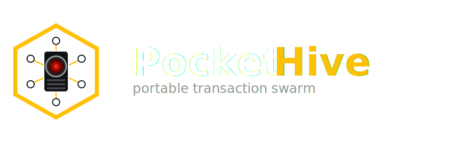
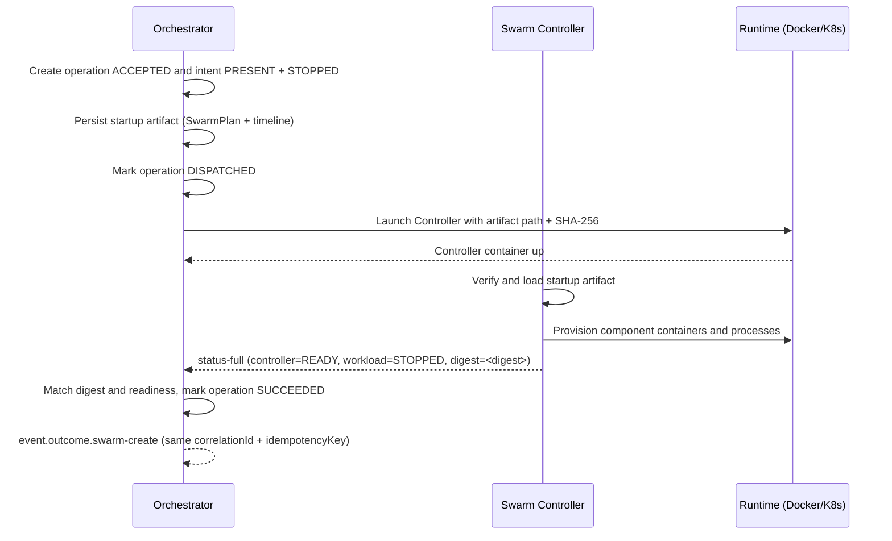
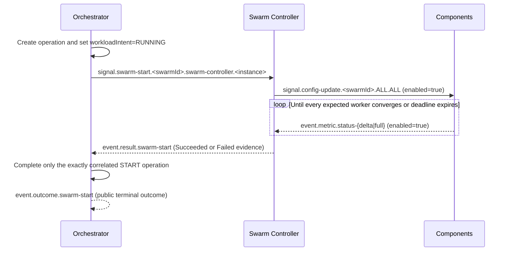
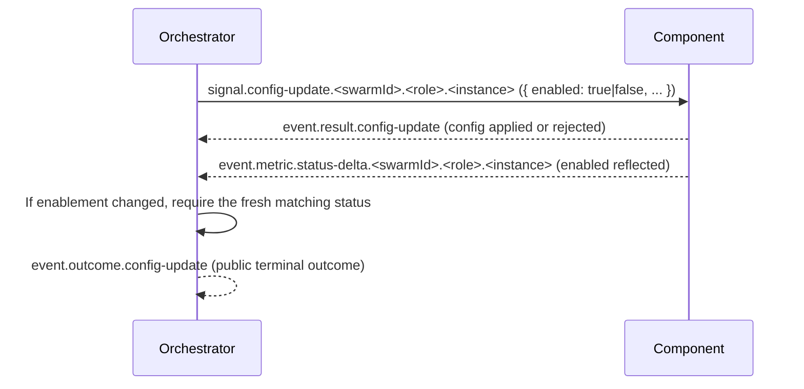
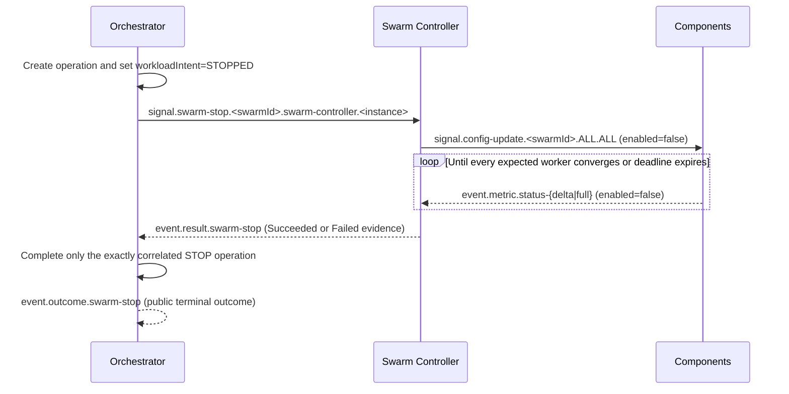
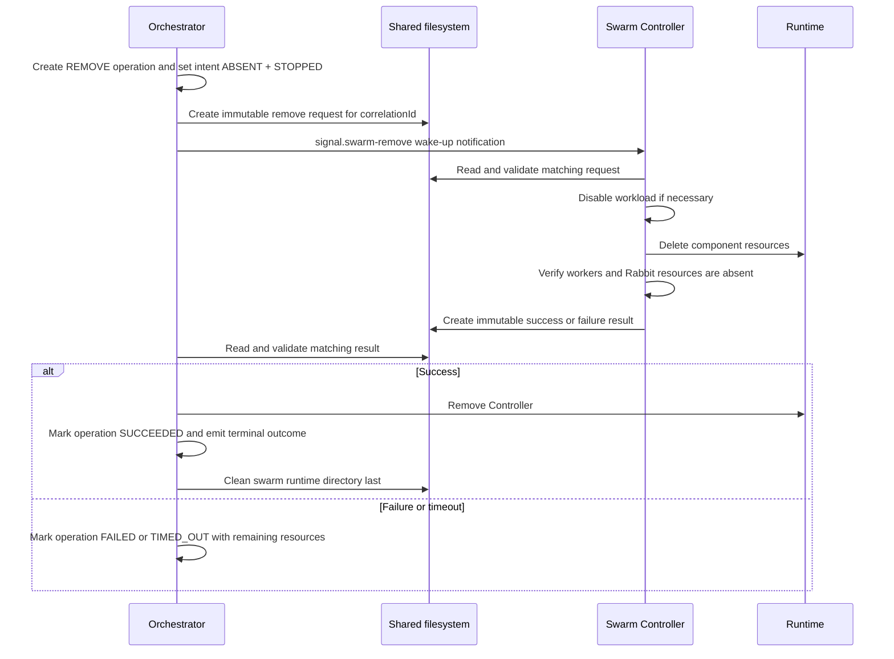
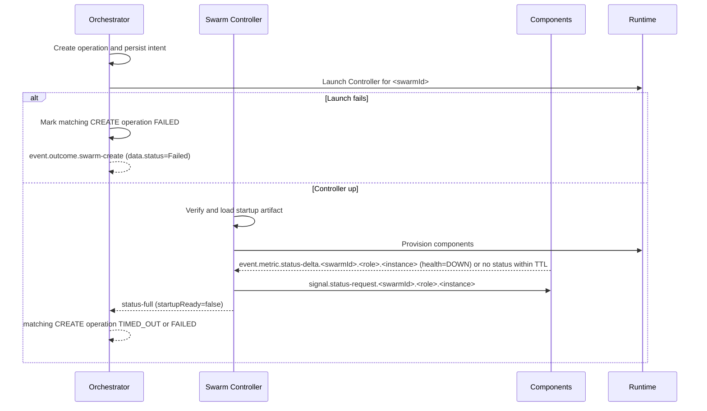

# PocketHive — ARCHITECTURE

> **Status:** Authoritative architecture specification (reference for agents).  
> **Scope:** Universal runtime (Docker Compose or Kubernetes).  
> **Compatibility:** The lifecycle/operation model is a deliberate breaking cut-over. No legacy state or outcome compatibility layer is permitted; this file is the single source of truth.

---

## 1. Overview

PocketHive orchestrates message-driven swarms of components (generators, processors, post‑processors, triggers, etc.) coordinated by an **Orchestrator** and a per‑swarm **Swarm Controller**. Communication is over **AMQP** (RabbitMQ). **Health** and **readiness** are inferred from **AMQP status** events; controllers and the orchestrator cannot reach component Actuator endpoints and rely exclusively on control-plane heartbeats.

**Design principles**

- **Single source of truth for intent and operations:** the **Orchestrator** is the only writer of desired runtime presence, desired workload enablement, and command-operation state.
- **Observed state is evidence, not intent:** the **Swarm Controller** aggregates worker observations but never rewrites Orchestrator intent. The Orchestrator caches that aggregate as a read projection.
- **Per-component state is factual:** each worker is the only writer of its own enablement, health and status timestamp. The Controller consumes and aggregates those facts; the Orchestrator does not consume worker fan-out in steady state.
- **Independent axes:** desired state, observed state, health, operation progress and runtime-resource state are separate contracts. A single lifecycle enum must not represent more than one of these axes.
- **Control plane always on**: status and config are accepted even when workloads are disabled.
- **Scoped config updates**: `signal.config-update` targets a concrete `scope` via routing key and envelope fields; no extra targeting metadata is used.
- **Non‑destructive defaults**: failures never auto‑delete resources; Stop ≠ Remove.
- **Convergence over guessed transitions:** start and stop complete only when fresh worker observations match the requested enablement. They do not complete merely because a broadcast was published.
- **Result is not outcome:** an executor reports correlated evidence on `event.result.*`; only the Orchestrator operation coordinator publishes the one public terminal `event.outcome.*` after accepting that result or declaring timeout.
- **No false cleanup success:** remove succeeds only after every targeted worker runtime and RabbitMQ resource is confirmed removed. Partial cleanup is a failed operation with an explicit remaining-resource list.

---

## 2. Roles (Managers vs. Workers)

PocketHive splits the control plane into **managers** (orchestrator + swarm controllers) and **workers** (generators, moderators, processors, post-processors, triggers, etc.). Managers shape desired state and publish control signals; workers execute workloads and echo health back through the same exchange.

### 2.1 Managers

#### Orchestrator (Queen)
- Owns the **desired runtime presence**, **desired workload enablement** and every asynchronous **operation record** for a swarm.
- Persists one immutable `pockethive/swarm-startup/v1` artifact containing the resolved `SwarmPlan` and scenario timeline before launching a **Swarm Controller**. The controller receives only an absolute mounted path and SHA-256 through required environment variables.
- Emits every public terminal lifecycle/config outcome on `event.outcome.<command>.{swarmId}.orchestrator.<instance>`. Create completes only after Controller status reports readiness with the expected artifact digest.
- Publishes swarm-scoped start/stop commands to a concrete Controller instance. For remove, it first persists the canonical filesystem request; an AMQP `swarm-remove` signal may wake the Controller but is not the source of truth for the operation.
- Issues **controller config updates** by addressing each controller instance via `signal.config-update.{swarmId}.swarm-controller.<instance>` (and `signal.config-update.ALL.swarm-controller.ALL` when broadcasting fleet-wide toggles).
- Maintains observed Controller/workload/resource projections separately from intent. Missing status makes observation `UNKNOWN`; it never deletes the swarm registration automatically.
- Is the only component allowed to transition an operation to a terminal state and the only producer of externally visible command outcomes.
- Consumes **only swarm-level aggregates**, executor results and alerts, keeping fan-in small.

#### Swarm Controller (Marshal)
- Reads exactly one startup artifact from the configured filesystem path, verifies its SHA-256, schema and `swarmId`, then applies the plan locally and **provisions** components. Missing or invalid startup input terminates startup; RabbitMQ is not a fallback transport for the plan.
- Declares the control queue `ph.control.<swarmId>.swarm-controller.<instance>` (instance ids already embed the swarm name) and binds it to `signal.swarm-start.{swarmId}.swarm-controller.<instance>`, `signal.swarm-stop.{swarmId}.swarm-controller.<instance>`, `signal.swarm-remove.{swarmId}.swarm-controller.<instance>`, `signal.config-update.{swarmId}.swarm-controller.<instance>`, `signal.config-update.ALL.swarm-controller.ALL`, `signal.config-update.{swarmId}.ALL.ALL`, and the relevant status-request routes (`signal.status-request.{swarmId}.swarm-controller.<instance>`, `signal.status-request.{swarmId}.swarm-controller.ALL`, `signal.status-request.ALL.swarm-controller.ALL`).
- Declares the shared hive exchange `ph.{swarmId}.hive` and **exclusively** provisions the `ph.work.{swarmId}.*` queues plus their bindings; worker services consume through the autoconfigured topology and must not override these declarations. See §3 and the [AsyncAPI spec](spec/asyncapi.yaml) for the canonical routing definitions.
- Emits correlated start/stop **results** only after all expected workers have published fresh status matching the requested `enabled` value. A worker error produces a failed result; it must not report success early.
- Executes filesystem remove requests and writes one immutable result for the same `correlationId`. It does not claim success when an adapter reports a partial failure and it does not remove its own runtime.
- Publishes Controller aggregate status as observation only. Status metrics never mutate desired state or operation state.
- Consumes every component heartbeat within the swarm via `event.metric.status-{delta|full}.{swarmId}.*.*` to keep aggregate health and enablement up-to-date.
- Treats AMQP `event.metric.status-{delta|full}` as the **sole heartbeat source**; if a component goes silent it issues `signal.status-request.{swarmId}.ALL.ALL` and marks the component stale if no response arrives.
- May propagate workload enablement via `signal.config-update.{swarmId}.ALL.ALL` while keeping the control plane responsive.
- Control plane stays enabled even when workloads are paused; start/stop/remove/status/config are always honored.

### 2.2 Workers (Bees)
- Declare their own control queues on startup using the `ph.control.<swarmId>.<role>.<instance>` naming pattern (instance ids embed the swarm prefix) and bind to `signal.config-update.{swarmId}.{role}.ALL`, `signal.config-update.{swarmId}.{role}.{instance}`, `signal.config-update.{swarmId}.ALL.ALL`, plus the corresponding status-request bindings (`signal.status-request.{swarmId}.{role}.ALL`, `signal.status-request.{swarmId}.{role}.{instance}`, `signal.status-request.{swarmId}.ALL.ALL`).
- Consume workloads from queues named `ph.work.<swarmId>.<queueName>` that hang off the swarm's shared work exchange.
- Accept config updates from both the orchestrator (role/instance routing keys) and their controller (swarm broadcast) without relying on implicit routing conventions.
- Are the only authority for their own observed `enabled`, health, configuration and heartbeat timestamp.
- Emit **their own** status streams (`event.metric.status-{full|delta}.{swarmId}.{role}.{instance}`) and respond to manager `signal.status-request.{swarmId}.{role}.{instance}` heartbeats.
- Apply `signal.config-update.{swarmId}.{role}.{instance}` (`data.enabled: true|false`) to control **workload** state only while keeping control listeners responsive.
- Runtime behaviour, worker interfaces, and adoption guidance are covered in the [Worker SDK quick start](sdk/worker-sdk-quickstart.md).
- Worker capability manifests and capability `config[]` contract are specified in the [Worker Capability Catalogue](architecture/workerCapabilities.md).

### 2.3 Request Builder worker

- Optional worker that sits between **Data Providers** (or other producers) and the **processor** in the work topology.
- **Input:** generic `WorkItem` from RabbitMQ with:
  - payload: arbitrary text/JSON produced upstream (for example, a per-customer dataset row from Redis),
  - headers: including `x-ph-call-id` (required) and optional `x-ph-service-id`.
- **Templates:** disk-backed HTTP call definitions under a configurable `templateRoot`:
  - organised as `(serviceId, callId)` pairs,
  - define `method`, `pathTemplate`, `headersTemplate`, and `bodyTemplate`,
  - rendered via the shared Pebble+SpEL templating engine using `payload`, `headers`, and `workItem` as context.
- **Behaviour:**
  - On each message, resolves `(serviceId, callId)` to a template and appends an HTTP envelope step:
    - `{ path, method, headers, body }` – exactly what `processor-service` expects.
  - Missing `callId` or template is handled explicitly via config:
    - `passThroughOnMissingTemplate: true` → log and return the original `WorkItem` unchanged.
    - `passThroughOnMissingTemplate: false` → log and drop the message (no output).
  - Publishes status data per role via the control plane (template root, service id, `errorCount`, `errorTps`) so operators can see template issues without inspecting logs.

Workers source their queue/exchange bindings from the IO sections, not from the control-plane block:

```yaml
pockethive:
  inputs:
    rabbit:
      queue: ph.work.swarm-1.mod
  outputs:
    rabbit:
      exchange: ph.swarm-1.hive
      routing-key: ph.work.swarm-1.final
```

The Swarm Controller injects the same values into each container via `POCKETHIVE_INPUT_RABBIT_QUEUE` /
`POCKETHIVE_OUTPUT_RABBIT_*`, and the Worker SDK fails fast when any required field is missing.

### 2.4 WorkItem envelope (data plane, SSOT)

The WorkItem on-wire format is a **single JSON envelope** defined in
`docs/spec/workitem-envelope.schema.json`. Transport headers (AMQP/SQS/Kafka) **must not**
carry WorkItem data — the full payload, headers, steps, and observability live inside the JSON body.

Key rules:

- `steps[]` is always present (min 1). Step headers **must** include `ph.step.service` and
  `ph.step.instance` for every step.
- The current payload is always the last step (`steps[-1]`). The `WorkItem` API exposes it via
  `payload()` / `payloadEncoding()`; the on-wire envelope does not duplicate it at the top level.
- Step 0 is explicit (no auto-seeding in builders). Empty payloads are allowed.
- `messageId` and `contentType` are top-level only (do not duplicate in headers).
- `x-ph-service` is deprecated for WorkItem tracking; tests enforce its absence in WorkItem headers.
- Worker runtime exceptions (for example malformed request payloads, missing required call config) are
  **not** encoded as WorkItem steps. They are handled out-of-band: log entry + control-plane alert
  (journal-visible), and the consumed message is dropped (no requeue/redelivery storm).

### 2.5 Debug taps (UI V2)
Operators can inspect data-plane traffic via **debug taps**. A tap is a temporary AMQP queue
bound to the swarm's hive exchange (e.g. `ph.<swarmId>.hive`) using the same routing key as the
target work queue (e.g. `ph.work.<swarmId>.<queueName>`). The Orchestrator owns tap lifecycle
and exposes REST endpoints for UI V2; workers remain AMQP-only and untouched.
---

## 3. Control-plane envelope & routing (SSOT)

Control-plane payloads are defined by `docs/spec/control-events.schema.json` and routed as specified in `docs/spec/asyncapi.yaml`.

### 3.1 Envelope fields (SSOT)

| Field | Type | Required | Description |
|---|---|---|---|
| `timestamp` | string | Yes | RFC‑3339 time when the message was emitted by its origin. |
| `version` | string | Yes | Schema version of the envelope and its structured `data` section. The lifecycle/control-plane cutover is version `2`; version `1` is not accepted by the new producers or consumers. |
| `kind` | string | Yes | Coarse category of the message: one of `signal`, `result`, `outcome`, `journal`, `event`, `metric`. All routing/consumers should branch on this field first. |
| `type` | string | Yes | Concrete name within the `kind` category. For `signal`, `result` and `outcome` this is the command name (`swarm-start`, `config-update`, …); for `kind=event` the current spec covers `alert`; for `kind=metric` it covers `status-full` and `status-delta`. |
| `origin` | string | Yes | Logical emitter identity (e.g. `orchestrator-1`, `swarm-controller:aaa-marshal-…`, `processor:bee-1`, `hive-ui`). Never blank. |
| `scope` | object | Yes | `{ swarmId, role, instance }` describing the entity the message is about. |
| `scope.swarmId` | string | Yes | Swarm the message relates to. Use the literal `ALL` for cross‑swarm or global fan‑out; never `null`. |
| `scope.role` | string | Yes | Role/routing segment of the **subject** of the message; carried for control-plane addressing and human display. For materialized scenario workers, this is the unique `template.bees[].role` scenario node key. It is not the runtime worker id and not a worker type system; worker type/capability is resolved from `image`. Core deployed components use values such as `orchestrator` and `swarm-controller`, while scenario workers use their declared roles. The envelope schema must **not** hardcode an enum for this field. Use the literal `ALL` for cross-role or fan-out scopes; never `null`. |
| `scope.instance` | string | Yes | Logical instance identifier of the **subject** of the message (the controller/worker/orchestrator instance the message is about). For runtime workers, this is the canonical runtime worker id and the only runtime identity clients may use. Use the literal `ALL` for fan‑out across instances; never `null`. This may or may not be the same as the `origin` instance that emitted it. |
| `correlationId` | string\|null | Yes | Correlation token used to join one operation. For `signal`, `result` and `outcome`, this field must be non-empty and identical. For other kinds it is nullable unless explicitly correlated. |
| `idempotencyKey` | string\|null | Yes | Stable identifier for the logical operation. It must be non-empty and identical on its `signal`, executor `result` and public `outcome`. |

### 3.2 Structured `data` rules

- `data` is always an object on-wire. Commands without args still send `data: {}`.
- Results and outcomes must include at least `data.status`.
- Targeting never lives in `data`; it is described only by `scope` and the routing key.
- The required shape of `data` is defined per (`kind`, `type`) in `docs/spec/control-events.schema.json`.

**Structured sections**

| Section / Field | Type | Applies to | Description |
|---|---|---|---|
| `data` | object | all kinds | Structured payload for the message. On-wire producers always emit an object; commands without args send `{}` and results/outcomes include at least `data.status`. For each (`kind`, `type`) combination, the AsyncAPI / JSON Schema specs in `docs/spec` MUST define the required shape of `data`. Targeting is never carried inside `data`; it is described only by `scope` and routing. |

- [x] Extend existing specs in `docs/spec`:
  - Update `docs/spec/asyncapi.yaml` channels and schemas, and `docs/spec/control-events.schema.json`, so they describe the canonical routing families and envelope shapes below.

### 3.3 Routing key families

Relationship to routing keys (new prefixes):

- Control‑plane **signals** use the `signal.*` prefix. The canonical pattern after the refactor is:  
  `signal.<commandType>.<swarmId>.<role>.<instance>` where:
  - `<commandType>` is the envelope `type` for `kind = signal` (for example `swarm-start`, `swarm-stop`, `swarm-remove`, `config-update`, `status-request`).
  - `<swarmId>.<role>.<instance>` are the semantic target and must match `scope.swarmId` / `scope.role` / `scope.instance` on the signal. For fan‑out signals the routing key may still use wildcards (for example `ALL`), while `scope` on outcomes will carry concrete values. **Lifecycle commands addressed at the swarm‑controller (`swarm-start`, `swarm-stop`, `swarm-remove`) MUST use a concrete controller instance in the `<instance>` segment once a controller exists; using `ALL` for these commands is forbidden in the new model.**

- Control‑plane **events** (everything that is not a command signal) use the `event.*` prefix. The canonical pattern is:  
  `event.<category>.<name>.<swarmId>.<role>.<instance>` where:
  - `<category>` differentiates `result`, `outcome`, `journal`, `metric` and `alert` families.
  - `<name>` is normally the envelope `type`: status name for metrics or command name for results/outcomes.
  - `<swarmId>.<role>.<instance>` are the semantic subject and must match `scope.swarmId` / `scope.role` / `scope.instance`, normalised so that fan‑out uses the literal `ALL` in both the routing key and `scope` (no `null` placeholders).

- An AMQP executor reports a command **result** with `kind=result` on `event.result.<commandType>.<swarmId>.<executorRole>.<executorInstance>`. Scope identifies the executor that produced the evidence. Remove is the filesystem-only result exception defined below.
- The Orchestrator reports the sole public terminal **outcome** with `kind=outcome` on `event.outcome.<commandType>.<swarmId>.orchestrator.<orchestratorInstance>`. Scope identifies the operation owner, while `data.context.target` identifies the original target when needed.
- Correlated non-terminal worker evidence uses `kind=journal` on `event.journal.work-journal.<swarmId>.<role>.<instance>`. It is persisted for observability and can never complete or mutate an operation.

### 3.4 Control-plane commands, executor results and outcomes

**Canonical `data` schemas**

The tables below define the canonical `data` shapes that `docs/spec/asyncapi.yaml` and `docs/spec/control-events.schema.json` must implement.

Commands use `kind=signal` and the `signal.*` routing family. AMQP command executors answer with internal `kind=result` evidence on `event.result.*`. `swarm-remove` is the explicit exception: its authoritative executor result is the matching immutable filesystem `result.json`, never a second AMQP result. The Orchestrator operation coordinator alone publishes public `kind=outcome` messages on `event.outcome.*`.

**Command signals (`kind = signal`) — purpose and targeting**

| `type` | Purpose / effect | Typical routing key (refactored) | Target subject (conceptual `scope`) |
|---|---|---|---|
| `swarm-start` | Start workloads inside a running controller. | `signal.swarm-start.<swarmId>.swarm-controller.<instance>` | Swarm controller instance for `<swarmId>`. |
| `swarm-stop` | Stop workloads (non‑destructive). | `signal.swarm-stop.<swarmId>.swarm-controller.<instance>` | Swarm controller instance for `<swarmId>`. |
| `swarm-remove` | Wake the Controller for a canonical filesystem remove request. The signal is repeatable and carries no cleanup payload. | `signal.swarm-remove.<swarmId>.swarm-controller.<instance>` | Swarm controller instance for `<swarmId>`. |
| `config-update` | Apply config patch / enablement to one or more components. | `signal.config-update.<swarmId>.<role>.<instance>` | Target component(s) addressed by routing key segments (supports ALL wildcards where fan-out is intentional). |
| `status-request` | Ask a component to emit an explicit status snapshot. | `signal.status-request.<swarmId>.<role>.<instance>` | Target component(s) addressed by routing key segments (supports ALL wildcards where fan-out is intentional). |

**Command signals (`kind = signal`) — `data` / args**

| `type` | `data` / args field | Required | Description |
|---|---|---|---|
| `swarm-start` | — | No | No command‑level args; semantics come from `type`, `scope`/routing, `correlationId` and `idempotencyKey`. On‑wire producers still send an empty `data: {}` to keep envelopes schema‑compliant. |
| `swarm-stop` | — | No | Same as `swarm-start` (no args); on‑wire producers still send an empty `data: {}`. |
| `swarm-remove` | — | No | Same as `swarm-start` (no args); on‑wire producers still send an empty `data: {}`. |
| `config-update` | `data` | Yes | Config payload for the target component(s). Targeting is carried exclusively by the envelope `scope` and routing key. The `data` object carries the config patch and enablement flags. Exact shape is defined in worker/manager config docs. |
| `status-request` | — | No | No command‑level args; the response is a `status-full` metric event instead of a confirmation outcome. On‑wire producers still send an empty `data: {}`. |

**Filesystem startup artifact (`pockethive/swarm-startup/v1`)**

The startup artifact is the sole initialization input for a Swarm Controller. Its canonical DTO is `SwarmStartupArtifact` in `common/swarm-model` and contains:

- `schema`: exactly `pockethive/swarm-startup/v1`;
- `swarmPlan`: the fully resolved `SwarmPlan`, including worker images, configuration and bound SUT context;
- `scenarioPlan`: the resolved scenario timeline object.

The Orchestrator writes the JSON under the explicitly configured `POCKETHIVE_STARTUP_ARTIFACT_WRITE_ROOT` using a content-addressed filename. In container deployments this is the Orchestrator-side mount destination (`/app/scenarios-runtime`), while `POCKETHIVE_SCENARIOS_RUNTIME_ROOT` remains the host bind-mount source passed to the runtime adapter. The controller container receives the required `POCKETHIVE_STARTUP_ARTIFACT_PATH` and `POCKETHIVE_STARTUP_ARTIFACT_SHA256`. It permits the file only under the controller read root, fixed to `/app/scenarios-runtime` in production; an isolated harness may explicitly override that root with `POCKETHIVE_STARTUP_ARTIFACT_READ_ROOT`. It reads only that file, verifies SHA-256 and requires `swarmPlan.id` to equal its configured swarm id. Missing files, unknown schema versions, checksum mismatches and identity mismatches fail startup. There is no AMQP, registry or default-file fallback.

Controller `status-full` reports `data.context.startupReady` and `data.context.startupArtifactSha256`. The Orchestrator completes `swarm-create` only when readiness is true and the reported digest equals the digest stored in the swarm launch metadata.

**Runtime config-update safety**

- `inputs.*` and `outputs.*` define IO wiring: adapters, protocols, endpoints, source files/lists,
  credentials, routing, and output target selection. Treat these fields as **unsafe for live mutation**.
- A running worker may accept only an explicit allowlist of operational live fields. Current safe IO
  fields are scheduler `inputs.scheduler.ratePerSec`, `inputs.scheduler.maxMessages`,
  `inputs.scheduler.reset`, Redis dataset `inputs.redis.ratePerSec`, and CSV dataset
  `inputs.csv.ratePerSec`. Redis dataset `inputs.redis.listName` is the sole disabled-only IO exception:
  it may change only for an already-disabled, single-source worker, and the patch must not change any
  other unsafe IO field. UI clients must block this patch unless workload intent and workload observation are both explicitly `STOPPED`.
  MCP agents must verify workload observation `STOPPED` with `swarm_get`; dispatch acceptance of `swarm_stop` is not completion
  evidence. Enable/disable remains controlled by the config-update `enabled` flag.
- Capability manifests must mark each config entry with explicit `liveMutable: true|false`.
  Runtime UI may offer only `liveMutable: true` entries. For `inputs.*` / `outputs.*`, `true` is
  valid only for the operational live IO fields listed above; all IO wiring entries must be
  `liveMutable: false`.
- Changing `inputs.type`, `outputs.type`, IO endpoints, multi-source datasets, output routes, protocols,
  or credentials requires restarting/rematerializing the worker or swarm. The explicit disabled-only
  `inputs.redis.listName` exception changes a single-source selection without changing the adapter,
  endpoint, or source mode. Do not emulate other changes with fallback adapter switches or partial live
  rewiring.

**Executor results and public outcomes — terminal operation contract**

Results and outcomes share the canonical terminal-operation payload so the Orchestrator can validate and project executor evidence without lossy mapping.

- Executor results for `swarm-start`, `swarm-stop` and `config-update` are published on `event.result.<type>.<swarmId>.<executorRole>.<executorInstance>`. Remove terminal evidence uses only the filesystem result described in §5.4.
- Public outcomes are published on `event.outcome.<type>.<swarmId>.orchestrator.<orchestratorInstance>`.
- `data.status` is always required and is one of `Succeeded`, `Rejected`, `Failed`, or `TimedOut`.
- `data.retryable` is set only for commands with defined retry semantics.
- `data.context` contains command-specific terminal evidence such as desired/observed values, non-converged workers or remaining resources. Domain observations such as `RUNNING` and `STOPPED` are never encoded as operation status.
- Human-readable `message` and stable diagnostic `code` belong in the correlated `event.alert.{type}` payload.

**Canonical terminal outcome mapping**

| Fact | Location | Description |
|---|---|---|
| Operation result | `data.status` | `Succeeded`, `Rejected`, `Failed`, or `TimedOut`; never a workload/resource state. |
| Retry policy | `data.retryable` | Whether a new execution with a new idempotency key is allowed after this terminal result. |
| Terminal evidence | `data.context` | Typed command-specific evidence. Start/stop include requested and observed workload values; remove includes removed and remaining resources. |
| Operation identity | envelope `correlationId`, `idempotencyKey`, `type`, `scope` | Exact identity used by the Orchestrator operation coordinator. |
| Diagnostic code/message | alert `data.code`, `data.message` | Human-readable and machine-filterable diagnostic detail. |

**Initialization + readiness gates (`swarm-start`, `swarm-stop`, `config-update`)**

- Controller readiness and start/stop convergence are defined normatively in §5.3.
- Commands allowed before Controller readiness are `status-request` and filesystem-backed `swarm-remove` (abort).
- A command that cannot start without side effects emits `data.status="Rejected"` with typed reasons in `data.context`.
- Rejection is terminal for that operation and is distinct from `Failed` and `TimedOut`.

**Config-update fan-out + acknowledgements**

- Swarm Controller uses `ConfigFanout` to broadcast `signal.config-update` (enable/disable + config patches).
- Bootstrap delivery and enablement convergence are tracked separately. Bootstrap acknowledgement is driven by worker status. Start/stop convergence requires fresh worker status after the operation dispatch timestamp; config results alone are insufficient.

### 3.5 Status metrics semantics

**Control metrics (`kind=metric`)**

| `type` | `data` field | Required | Description |
|---|---|---|---|
| `status-full` | `enabled` | Workers: Yes; managers: No | Worker-observed workload enablement. Managers do not impersonate aggregate workload enablement with this field. |
|  | `startedAt` | Yes | RFC‑3339 timestamp when this component started processing workloads for its scope (or when the current process was started). |
|  | `tps` | No | Integer ≥ 0. Throughput sample for the reporting interval. **Workers should emit this**; managers (Orchestrator / Swarm Controller) may omit. |
|  | `config` | Yes | Snapshot of the effective configuration for this scope (role/instance). Must not include secrets. |
|  | *(none)* | — | Runtime/infra metadata lives in the envelope as `runtime` (see below). |
|  | `io` | Yes | Object describing IO bindings and queue health. **Workers** should include both planes (`io.work` + `io.control`); **managers** are control‑plane‑only and should include only `io.control` (no `io.work`). `queueStats` is optional and applies only to the work plane. Present only in `status-full`. |
|  | `ioState` | Yes | Coarse IO health summary for workload/local IO only (for example `ioState.work`, `ioState.filesystem`). **Workers** should include `ioState.work` plus any local IO; **managers** include only local IO if applicable. `ioState` does not represent control‑plane health. |
|  | `context` | No | Freeform role-specific context. Swarm Controller carries `controllerState`, `workloadState`, `health`, totals, watermark, staleness and `workers[]` only in `status-full`. It never publishes Orchestrator intent. For Orchestrator, `context` carries at least `swarmCount`; `computeAdapter` belongs in `status-full`. |
| `status-delta` | `enabled` | Workers: Yes; managers: No | Same worker-observation semantics as in `status-full`. |
|  | `tps` | No | Integer ≥ 0. Throughput sample for the interval since the last status event. **Workers should emit this**; managers may omit. |
|  | `ioState` | Yes | Coarse IO health summary (see §6). Same rules as `status-full`: workload/local IO only; managers omit `work`. |
|  | `context` | No | Same semantics as in `status-full`, but only for fields that change frequently (for example Controller/workload observation, health and rolling diagnostics). `data.config`, `data.io`, and `data.startedAt` must be omitted from deltas. |

Additional rules:
- `runtime` is an envelope field, not a `data` field. It is required for all swarm-scoped messages (that is, `scope.swarmId != ALL`) and must be omitted for global broadcasts (`scope.swarmId = ALL`).
- `data.ioState` represents workload/local IO only (for example `ioState.work`, `ioState.filesystem`). It does not represent control-plane health.
- `data.context` carries role-specific context. For swarm-controller:
  - `status-delta` carries a small aggregate only (no worker list).
  - `status-full` carries the full aggregate snapshot, including `data.context.workers[]`.
  - `controllerState`, `workloadState` and `health` use the canonical observation enums from §5.1. The removed `swarmStatus` field must not be reintroduced.
  - `data.context.workers[]` is the canonical swarm-controller worker
    aggregate consumed by UI/runtime clients.
  - Every `data.context.workers[]` entry must include `role`, `instance`,
    `enabled`, `tps`, `lastSeenAt`, `stale`, and `ioState`. `instance` is the
    canonical runtime worker id. `role` is the scenario node key and the routing
    segment required by component actions.
  - `data.context.workers[]` entries may include a `runtime` object with the same shape as the envelope `runtime`.
  - `data.context.workers[]` entries must carry the last known public worker
    `status-full.data.config` as `config` after the worker has reported a
    `status-full`. An explicit empty object (`config: {}`) means the worker
    reported an empty effective config. Later worker `status-delta` events
    omit `data.config` and must not erase the last reported config from the
    swarm-controller aggregate.
  - Runtime worker status must not emit or require a second runtime worker id.
    `data.context.beeId` is not part of the runtime contract.
  - Live mutation requests must address the worker by `role` plus
    `data.context.workers[].instance`. Clients must not fall back to array order,
    topology position, label, queue name, image name, or removed authoring ids.
- For orchestrator, `data.context` carries at least `swarmCount`. The
  `computeAdapter` selection is effectively static and belongs in `status-full`
  only (never in deltas).
- `data.io` describes bindings and queue health:
  - Workers include both planes (`io.work` + `io.control`).
  - Managers are control-plane-only and include just `io.control`.
  - `queueStats` is optional and applies only to the work plane.
- Workers must never emit `workers[]`.

**IO state conventions**

- Input states: `ok`, `out-of-data`, `backpressure`, `upstream-error`, `unknown`.
- Output states: `ok`, `blocked`, `throttled`, `downstream-error`, `unknown`.
- `out-of-data` is a logical source-exhausted condition and should be emitted explicitly by inputs/generators (not inferred from queue depth).

### 3.6 Alert events (`event.alert.{type}`)

**Control events (`kind = event`)**

| `data` field | Required | Description |
|---|---|---|
| `level` | Yes | `info`, `warn`, `error`. |
| `code` | Yes | Short, stable alert code (for filtering and dashboards). |
| `message` | Yes | Human-readable alert message. |
| `errorType` | No | Exception class name (for runtime errors). |
| `errorDetail` | No | Best-effort detail string (root cause, truncated stack trace). |
| `logRef` | No | Opaque pointer to logs or traces (currently `null`; do not embed full stack traces). |
| `context` | No | Object carrying type‑specific structured context. For IO / “out of data” alerts, recommended keys include: `backend` (for example `redis`, `csv`, `kafka`), `resourceId` (dataset id, file path, key prefix, etc.), `loopMode` (`loop`/`no-loop`), and optional limit info such as `limitKind` (`maxMessages`, `maxTime`, `none`) and `limitValue` (numeric/string). For other alert codes, `context` can carry whatever structured fields a producer and UI agree on. |

Recommended `data.code` values include: `worker.runtime-error`, `controller.runtime-error`,
`io.out-of-data`, `io.backpressure`, `io.downstream-error`, `generator.limit-reached`.

### 3.7 Journal and UI projections

- Journal entries are derived directly from envelopes:
  - Signals: `timestamp`, `kind`, `type`, `scope`, `origin`, `data`, plus direction from routing.
  - Results: record executor evidence and its exact operation identity; results are not shown as a second terminal operation.
  - Outcomes: use `data.status` and `data.context` (no stringified payloads in `details`).
  - Alerts: record `data.code`, `data.message`, `data.context`, and `logRef`.
  - Error alerts may produce a separate Orchestrator-local `runtime-debug` entry
    of type `runtime-log-snapshot` or `runtime-log-snapshot-unavailable`. The
    snapshot uses the alert scope and the Orchestrator runtime debug path; it
    must not mutate the alert envelope or revive central log aggregation.
  - Metrics: do not log every `status-*` tick; record only state transitions.
- `actor` is redundant and must not be required by UI or new tooling.
- UI should rely on `origin` + routing for "from -> to" and on typed `data` fields for display.

### 3.8 Wire format and serialization rules

- Required envelope fields must be present on-wire even when values are `null`
  (avoid `NON_NULL` serialization for control-plane envelopes).
- Commands without args still include `data: {}`.
- `correlationId` and `idempotencyKey` semantics follow the envelope rules in §3.1.

### 3.9 UI consumption constraints

- UI-v2 must subscribe to:
  - `event.metric.status-delta.<swarmId>.swarm-controller.*`
  - `event.alert.{type}.#`
  - `event.outcome.#`
- Avoid per-worker status fan-out; worker lists come from swarm-controller `status-full`.

### 3.10 Topology-first: logical topology vs adapter config vs runtime bindings

Goal: give UI a stable "what to draw" graph that does not depend on transport details, while still exposing runtime wiring.

**A) Logical topology (scenario SSOT; UI drawing contract)**

- Stored in scenario templates (see `docs/scenarios/SCENARIO_CONTRACT.md`), not in status messages.
- `template.bees[]` is the authoring SSOT for declared worker definitions.
  `role` is required and unique within the scenario. It is the scenario node key
  used by topology endpoints and by runtime control-plane routing.
- `template.bees[].id` is not part of the contract.
- `topology` is the SSOT for authoring-time graph edges. Endpoints reference
  declared bee roles. These roles are not a second runtime worker id.
- Runtime worker identity is the materialised worker `instance`, exposed as
  `status-full.data.context.workers[].instance`.

Example (scenario template fragment):

```yaml
template:
  bees:
    - role: generator-a
      image: generator:latest
      ports:
        - { id: out, direction: out }
    - role: moderator-a
      image: moderator:latest
      ports:
        - { id: in, direction: in }
        - { id: out, direction: out }

topology:
  version: 1
  edges:
    - id: e1
      from: { role: generator-a, port: out }
      to:   { role: moderator-a, port: in }
```

**B) IO adapter config (runtime behavior; per-module configuration)**

- Lives in worker config (`status-full.data.config` for worker scope).
- Can include adapter types and settings (CSV/Redis/HTTP/etc). This is not a graph and must not replace topology.

**C) Runtime bindings (materialization)**

- Emitted by swarm-controller in `status-full` only so UI can map logical edges/ports to work-plane routing.
- Captures exchange, routing keys, and queues for the current swarm.

Example (inside swarm-controller `status-full.data.context`):

```json
{
  "bindings": {
    "work": {
      "exchange": "ph.<swarm>.traffic",
      "edges": [
        {
          "edgeId": "e1",
          "from": { "role": "generator-a", "instance": "gen-1", "port": "out", "routingKey": "ph.<swarm>.gen" },
          "to": { "role": "moderator-a", "instance": "mod-1", "port": "in", "queue": "ph.<swarm>.mod" }
        }
      ]
    }
  }
}
```

**Multi-input / multi-output notes**

- Multi-IO is expressed as multiple ports per bee and multiple edges in `topology`.
- Runtime bindings should include `from.port` / `to.port` so UI can map edges to the right ports.
- If a worker chooses among outputs (or inputs) via a policy, treat it as optional metadata on the edge; the topology still lists the possible paths.

Example (scenario fragment with multi-IO ports + edges):

```yaml
template:
  bees:
    - role: moderator-a
      image: moderator:latest
      ports:
        - { id: in.http, direction: in }
        - { id: in.audit, direction: in }
        - { id: out.fast, direction: out }
        - { id: out.slow, direction: out }
    - role: processor-a
      image: processor:latest
      ports:
        - { id: in.fast, direction: in }
        - { id: in.slow, direction: in }

topology:
  version: 1
  edges:
    - id: e-fast
      from: { role: moderator-a, port: out.fast }
      to:   { role: processor-a, port: in.fast }
    - id: e-slow
      from: { role: moderator-a, port: out.slow }
      to:   { role: processor-a, port: in.slow }
```

Example (bindings with ports + optional selector hint):

```json
{
  "bindings": {
    "work": {
      "exchange": "ph.<swarm>.traffic",
      "edges": [
        {
          "edgeId": "e-fast",
          "from": { "role": "moderator-a", "instance": "mod-1", "port": "out.fast", "routingKey": "ph.<swarm>.mod.fast" },
          "to": { "role": "processor-a", "instance": "proc-1", "port": "in.fast", "queue": "ph.<swarm>.proc.fast" },
          "selector": { "policy": "predicate", "expr": "payload.priority >= 50" }
        }
      ]
    }
  }
}
```

**D) UI join strategy**

- UI obtains `template + topology` via Scenario Manager REST for authoring
  context.
- UI uses swarm-controller `status-full` for `workers[]`, runtime `bindings`,
  queue stats, and runtime identity.
- UI joins selected scenario bees to runtime workers by exact unique `role`.
- UI edit-targets runtime workers by `role` and
  `data.context.workers[].instance`.
- If a selected scenario bee has no matching runtime worker, or more than one
  runtime worker reports the same role, UI must show an explicit invalid-runtime
  state and disable live mutation for that item.

---

## 4. Health & heartbeat model

- **AMQP `event.metric.status-{delta|full}` events are the only heartbeat source.**
- If **no AMQP status** arrives within a **TTL** for a component included in the aggregate, the Controller **issues `signal.status-request.{swarmId}.ALL.ALL`** and reports health `DEGRADED` or `UNKNOWN` if no response arrives in time.
- Every **swarm aggregate** carries a **watermark timestamp** and **max-staleness**; if stale or incomplete, the Controller emits health `DEGRADED` or `UNKNOWN` independently of workload observation.
- Health values never stand in for lifecycle values: `HEALTHY`, not `RUNNING`; `FAILED` health does not overwrite intent, resource state or operation history.

---

## 5. Lifecycle, operations and ownership

PocketHive has no single authoritative "swarm state". A swarm is described by independent facts with one writer per fact. UI badges may collapse these facts into a friendly label, but that label is a projection and must never drive domain behaviour.

### 5.1 Canonical axes and writers

| Axis | Canonical values | Sole writer | Consumers |
|---|---|---|---|
| Runtime intent | `PRESENT`, `ABSENT` | Orchestrator | operation coordinator, REST/UI |
| Workload intent | `RUNNING`, `STOPPED` | Orchestrator | Controller command dispatch, REST/UI |
| Controller observation | `PROVISIONING`, `READY`, `FAILED`, `UNKNOWN` | Controller status projection | Orchestrator, UI |
| Workload observation | `UNAVAILABLE`, `STARTING`, `RUNNING`, `STOPPING`, `STOPPED`, `UNKNOWN` | Controller aggregate projection | Orchestrator, UI, operation evaluator |
| Health | `HEALTHY`, `DEGRADED`, `FAILED`, `UNKNOWN` | Controller aggregate projection | Orchestrator, UI, alerts |
| Runtime resource state | `PRESENT`, `REMOVING`, `ABSENT`, `UNKNOWN` | Configured compute/topology adapter | Controller and Orchestrator cleanup coordinators |
| Operation state | `ACCEPTED`, `DISPATCHED`, `SUCCEEDED`, `REJECTED`, `FAILED`, `TIMED_OUT` | Orchestrator operation coordinator | REST/UI, outcomes, journal |

The canonical operation types are `CREATE`, `START`, `STOP`, `REMOVE` and `CONFIG_UPDATE`. Every operation record contains at least `swarmId`, type, concrete `target` (`role` + `instance`), `correlationId`, `idempotencyKey`, state, creation/deadline timestamps and an optional terminal result.

`FAILED` on one axis must not overwrite another axis. For example, a failed `START` operation may coexist with runtime intent `PRESENT`, workload intent `RUNNING`, workload observation `STOPPED`, health `HEALTHY` and runtime resources `PRESENT`.

The machine-readable SSOT is `docs/spec/swarm-lifecycle.schema.json`. Its Java representation lives only in `common/swarm-model` under `io.pockethive.swarm.model.lifecycle`: the six axis enums, operation/result types, `ControlRequest`, `SwarmCreateRequest`, `ControlResponse`, `SwarmOperation`, `SwarmStateView`, `RemoveRequest` and `RemoveResult`. Services and Java clients must import those types; local lifecycle/status enums or wire DTO copies are forbidden. Control-plane envelopes remain in `common/topology-core`: `CommandResult` represents internal executor evidence and `CommandOutcome` represents the Orchestrator-owned public terminal event.

### 5.2 Invariants

- `runtimeIntent=ABSENT` requires `workloadIntent=STOPPED`.
- Only the Orchestrator changes intent or operation state.
- Controller and worker status updates only their observed projections.
- Only one non-terminal lifecycle operation (`CREATE`, `START`, `STOP`, `REMOVE`) may exist for a swarm. A conflicting command is rejected explicitly; it does not replace the active operation.
- An executor result may complete only the operation with the same `swarmId`, type, concrete target, `correlationId` and `idempotencyKey`. A late result after timeout is journaled but never changes the terminal operation or emits another outcome.
- A duplicate request with the same `(swarmId, type, target, idempotencyKey)` returns the existing operation and replays its terminal outcome when available. It is never silently discarded. Reusing an idempotency key for another target is a distinct operation rather than an accidental replay.
- A new execution after a terminal retryable failure uses a new `idempotencyKey`.
- Missing or stale evidence produces `UNKNOWN` or a timeout. It never produces inferred success.
- `REMOVED` is not a persistent swarm lifecycle state. Successful remove sets runtime observation/resources to `ABSENT`, emits and journals the terminal result, then removes the active swarm registration. Historical evidence lives in the operation/journal record.

### 5.3 Controller readiness and workload convergence

Controller readiness is satisfied when:

1. the configured startup artifact has been loaded and verified;
2. the expected worker set has been materialised from that artifact;
3. every expected worker has reported a fresh status;
4. bootstrap configuration has been acknowledged; and
5. every expected worker reports `enabled=false`.

Start and stop use broadcast enablement. PocketHive does not promise dependency-ordered activation because workers are independently connected to durable queues and the current contract does not define a safe per-edge activation handshake.

- `START` succeeds only when every expected worker has published a status newer than the operation dispatch timestamp with `enabled=true`.
- `STOP` succeeds only when every expected worker has published a status newer than the operation dispatch timestamp with `enabled=false`.
- An empty expected-worker set converges immediately once the Controller is `READY`.
- Worker health is independent of enablement. A workload can be observed `RUNNING` and health `DEGRADED`; this must not be collapsed into a failed start unless the command-specific contract explicitly requires health.
- While observations are mixed, the Controller projects `STARTING` or `STOPPING` according to its active correlated command. If command context or evidence is unavailable, it projects `UNKNOWN`.
- A Controller deadline without convergence produces a failed executor result containing the non-converged workers. If no result arrives by the Orchestrator deadline, the coordinator produces `TimedOut`. The Controller must not report success early.

### 5.4 Remove request/result contract

Remove uses the shared filesystem as its authoritative command/result channel:

```text
<runtime-root>/<swarmId>/operations/remove/<correlationId>/request.json
<runtime-root>/<swarmId>/operations/remove/<correlationId>/result.json
```

The immutable request contains schema version, `swarmId`, `runId`, Controller instance, `correlationId`, `idempotencyKey` and request timestamp. The immutable result echoes all identities and contains terminal success/failure, removed resources, remaining resources, errors and completion timestamp.

The Orchestrator writes the request before notifying the Controller. AMQP `signal.swarm-remove` is a wake-up notification and may be safely repeated for the same request; it is not the remove payload or completion record. The Controller reads and validates the request, disables workload as necessary, removes worker runtime and RabbitMQ resources, verifies the resulting resource set, and writes exactly one result. Adapter failures must propagate into that result rather than being logged and swallowed.

The Orchestrator emits the public terminal remove outcome only after it has read and validated the matching result. On success it removes the Controller runtime, records the operation/journal result, then cleans the swarm runtime directory last. A missing result reaches `TIMED_OUT`; it never becomes success. Controller/Orchestrator crash recovery and cross-restart reconciliation are explicitly outside this version of the contract.

### 5.5 Create and config-update completion

- `CREATE` succeeds when Controller observation is `READY`, the reported startup artifact digest matches the stored launch reference, and the readiness conditions in §5.3 hold.
- A configuration-only update completes from the matching target result.
- A config update that changes `enabled` additionally requires a fresh target status reflecting the requested value.
- Alerts are diagnostic evidence. They may fail the matching operation when correlated, but they never mutate intent or unrelated operations.

---

## 6. Sequences

> Rendering note: Mermaid messages avoid semicolons to prevent parser hiccups.

### 6.1 Create from filesystem artifact (no auto-start)

```mermaid
sequenceDiagram
  participant QN as Orchestrator
  participant MSH as Swarm Controller
  participant RT as Runtime (Docker/K8s)

  QN->>QN: Create operation ACCEPTED and intent PRESENT + STOPPED
  QN->>QN: Persist startup artifact (SwarmPlan + timeline)
  QN->>QN: Mark operation DISPATCHED
  QN->>RT: Launch Controller with artifact path + SHA-256
  RT-->>QN: Controller container up
  MSH->>MSH: Verify and load startup artifact
  MSH->>RT: Provision component containers and processes
  MSH-->>QN: status-full (controller=READY, workload=STOPPED, digest=<digest>)
  QN->>QN: Match digest and readiness, mark operation SUCCEEDED
  QN-->>QN: event.outcome.swarm-create (same correlationId + idempotencyKey)
```

### 6.2 Start whole swarm

```mermaid
sequenceDiagram
  participant QN as Orchestrator
  participant MSH as Swarm Controller
  participant CMP as Components

  QN->>QN: Create operation and set workloadIntent=RUNNING
  QN->>MSH: signal.swarm-start.<swarmId>.swarm-controller.<instance>
  MSH->>CMP: signal.config-update.<swarmId>.ALL.ALL (enabled=true)
  loop Until every expected worker converges or deadline expires
    CMP-->>MSH: event.metric.status-{delta|full} (enabled=true)
  end
  MSH-->>QN: event.result.swarm-start (Succeeded or Failed evidence)
  QN->>QN: Complete only the exactly correlated START operation
  QN-->>QN: event.outcome.swarm-start (public terminal outcome)
```

### 6.3 Per-component enable/disable (via config-update)

```mermaid
sequenceDiagram
  participant QN as Orchestrator
  participant CMP as Component

  QN->>CMP: signal.config-update.<swarmId>.<role>.<instance> ({ enabled: true|false, ... })
  CMP-->>QN: event.result.config-update (config applied or rejected)
  CMP-->>QN: event.metric.status-delta.<swarmId>.<role>.<instance> (enabled reflected)
  QN->>QN: If enablement changed, require the fresh matching status
  QN-->>QN: event.outcome.config-update (public terminal outcome)
```

### 6.4 Stop whole swarm (non-destructive)

```mermaid
sequenceDiagram
  participant QN as Orchestrator
  participant MSH as Swarm Controller
  participant CMP as Components

  QN->>QN: Create operation and set workloadIntent=STOPPED
  QN->>MSH: signal.swarm-stop.<swarmId>.swarm-controller.<instance>
  MSH->>CMP: signal.config-update.<swarmId>.ALL.ALL (enabled=false)
  loop Until every expected worker converges or deadline expires
    CMP-->>MSH: event.metric.status-{delta|full} (enabled=false)
  end
  MSH-->>QN: event.result.swarm-stop (Succeeded or Failed evidence)
  QN->>QN: Complete only the exactly correlated STOP operation
  QN-->>QN: event.outcome.swarm-stop (public terminal outcome)
```

### 6.5 Remove swarm (filesystem request/result)

```mermaid
sequenceDiagram
  participant QN as Orchestrator
  participant FS as Shared filesystem
  participant MSH as Swarm Controller
  participant RT as Runtime

  QN->>QN: Create REMOVE operation and set intent ABSENT + STOPPED
  QN->>FS: Create immutable remove request for correlationId
  QN->>MSH: signal.swarm-remove wake-up notification
  MSH->>FS: Read and validate matching request
  MSH->>MSH: Disable workload if necessary
  MSH->>RT: Delete component resources
  MSH->>MSH: Verify workers and Rabbit resources are absent
  MSH->>FS: Create immutable success or failure result
  QN->>FS: Read and validate matching result
  alt Success
    QN->>RT: Remove Controller
    QN->>QN: Mark operation SUCCEEDED and emit terminal outcome
    QN->>FS: Clean swarm runtime directory last
  else Failure or timeout
    QN->>QN: Mark operation FAILED or TIMED_OUT with remaining resources
  end
```

### 6.6 Failure during create/start (no deletion)

```mermaid
sequenceDiagram
  participant QN as Orchestrator
  participant MSH as Swarm Controller
  participant CMP as Components
  participant RT as Runtime

  QN->>QN: Create operation and persist intent
  QN->>RT: Launch Controller for <swarmId>
  alt Launch fails
    QN->>QN: Mark matching CREATE operation FAILED
    QN-->>QN: event.outcome.swarm-create (data.status=Failed)
  else Controller up
    MSH->>MSH: Verify and load startup artifact
    MSH->>RT: Provision components
    CMP-->>MSH: event.metric.status-delta.<swarmId>.<role>.<instance> (health=DOWN) or no status within TTL
    MSH->>CMP: signal.status-request.<swarmId>.<role>.<instance>
    MSH-->>QN: status-full (startupReady=false)
    QN-->>QN: matching CREATE operation TIMED_OUT or FAILED
  end
```

---

## 7. Timeouts & cadence (defaults)

> Applied unless stricter values exist in code or plan.

- **Provisioning timeout (per component):** 120s
- **Ready timeout (swarm total):** 5m
- **Start timeout (per component):** 60s
- **Start timeout (swarm total):** 3m
- **Graceful stop timeout (per component):** 30s; timeout fails the operation and reports non-converged workers. It does not silently force success.
- **Remove timeout:** 3m; a missing or failed filesystem result is terminal failure/timeout, never success.
- **Controller heartbeats:** `event.metric.status-{delta|full}.{swarmId}.swarm-controller.{instance}`
  on **state change** plus a fixed **5s** controller status tick (aggregate
  watermark), as scheduled by `SwarmSignalListener`.

---

## 8. Idempotency & delivery

- Control messages carry an **idempotency key** (UUID) and `correlationId`; delivery is **at‑least‑once**.
- `correlationId` identifies the one accepted operation execution. `idempotencyKey` identifies the caller's logical request.
- The Orchestrator reserves `(swarmId, operationType, target, idempotencyKey)` before dispatch. A duplicate returns the same operation and correlation id; if terminal, it returns/replays the stored public outcome.
- Receivers deduplicate by operation type plus idempotency key, but a duplicate is never silently dropped. They continue the existing in-flight execution or replay its executor result.
- A failed publish rolls back only an operation that was never dispatched. Once dispatch may have occurred, retry reuses the same operation identity.
- Operation completion requires exact target, `correlationId` and `idempotencyKey` equality. Status without command identity updates observation but cannot complete start/stop/remove by itself.
- Retention must cover at least the longest command timeout plus delivery jitter. Cross-process recovery after Orchestrator or Controller restart is outside the current version.

---

## 9. Observability & metrics

**Controller aggregates** include:
- `ts` (watermark), `swarmId`, and `{total, healthy, running, enabled}` counts.
- **Max staleness** and, when applicable, `DEGRADED`/`UNKNOWN` reason.
- Recent **error summaries** (role/instance, reason, correlationId) for operator drill‑down.
- Optional **queueStats** with per-queue depth/consumer counts (and `oldestAgeSec` when brokers expose it) to highlight backlog pressure.

**Orchestrator** surfaces:
- Provision/ready/start durations, failure counts by reason, current running/enabled counts, queue connection summaries.

---

## 10. Security & audit

- Only the **Orchestrator** issues swarm lifecycle signals; UI proxies via Orchestrator.
- All actions/events are stamped with `correlationId`; per‑swarm audit logs are retained.
- Controller subscribes/publishes strictly within its `{swarmId}` namespace.
- UI AMQP creds are **read‑only**; all writes via Orchestrator REST.

---

## 11. Contract validation expectations

- Schema validation tests must validate control-plane payloads against `docs/spec/control-events.schema.json`.
- E2E capture audits must validate `ph.control` traffic against the schema (blocking in CI).
- Semantic guards must enforce "no heavy fields in status-delta" and "workers never emit workers[]".
- Manual verification should cover lifecycle commands, `signal.status-request` -> `event.metric.status-full`,
  config-update success/failure, and alert emission for runtime or IO errors.

### 11.1 Validation ownership (authoring vs admission)

- **Scenario Manager** is responsible for **static authoring validation** of scenario/template contracts
  (shape/schema, required fields, and contract-level references). Its runtime preparation endpoint is
  also the final static-bundle gate before materializing runtime files.
- **Orchestrator** is responsible for **admission/runtime validation** as the final gate before execution
  (deployment policy, composition constraints, and run eligibility), but it must not duplicate or preflight
  Scenario Manager static bundle validation.
- Shared compatibility rules should live in one reusable validation module/profile set so Scenario Manager
  and Orchestrator do not diverge.

### 11.2 Binding provenance and versioning

- Runtime-impacting binding edits must create a new binding version; running swarms use frozen snapshots captured at run start.
- Non-runtime metadata edits may be updated in place (for example labels/notes/owner).
- Binding and simulation configuration should support Git-backed provenance (local and/or remote) for reviewability and reproducibility.

### 11.3 Dataset registry scope

- **Scenario Manager** owns dataset/SUT registry metadata (definitions, contracts, references).
- **Scenario Manager** is not a data-plane executor and must not perform runtime dataset mutations.
- Seeding, data generation, migrations, and record movement/refill are executed by swarms/workers dedicated to data-plane tasks.

### 11.4 Contract version matching

- Scenario-to-SUT contract matching uses SemVer constraints as a single model.
- Exact matching is represented as a strict constraint (for example `=1.34.0`), while broader compatibility uses ranges.
- Any future governance tightening (for example requiring exact pins in selected workflows) should be implemented as validation policy/rules, not as a separate matching mechanism.

---

## 12. Envelope examples

### Signal (`kind=signal`)
```json
{
  "timestamp": "2025-09-12T12:34:56Z",
  "version": "2",
  "kind": "signal",
  "type": "swarm-start",
  "origin": "orchestrator-1",
  "scope": { "swarmId": "alpha", "role": "swarm-controller", "instance": "alpha-1" },
  "correlationId": "uuid-from-orchestrator",
  "idempotencyKey": "uuid-reused-for-retries",
  "data": {}
}
```

### Executor result (`kind=result`)
```json
{
  "timestamp": "2025-09-12T12:35:11Z",
  "version": "2",
  "kind": "result",
  "type": "swarm-start",
  "origin": "swarm-controller:alpha-1",
  "scope": { "swarmId": "alpha", "role": "swarm-controller", "instance": "alpha-1" },
  "correlationId": "uuid-from-orchestrator",
  "idempotencyKey": "uuid-reused-for-retries",
  "data": {
    "status": "Succeeded",
    "retryable": false,
    "context": {
      "target": { "role": "swarm-controller", "instance": "alpha-1" },
      "requestedWorkloadState": "RUNNING",
      "observedWorkloadState": "RUNNING",
      "nonConvergedWorkers": []
    }
  }
}
```

### Outcome (`kind=outcome`)
```json
{
  "timestamp": "2025-09-12T12:35:12Z",
  "version": "2",
  "kind": "outcome",
  "type": "swarm-start",
  "origin": "orchestrator-1",
  "scope": { "swarmId": "alpha", "role": "orchestrator", "instance": "orchestrator-1" },
  "correlationId": "uuid-from-orchestrator",
  "idempotencyKey": "uuid-reused-for-retries",
  "data": {
    "status": "Succeeded",
    "retryable": false,
    "context": {
      "target": { "role": "swarm-controller", "instance": "alpha-1" },
      "requestedWorkloadState": "RUNNING",
      "observedWorkloadState": "RUNNING",
      "nonConvergedWorkers": []
    }
  }
}
```

### Metric (`kind=metric`)
```json
{
  "timestamp": "2025-09-12T12:36:00Z",
  "version": "2",
  "kind": "metric",
  "type": "status-full",
  "origin": "processor:alpha-1",
  "scope": { "swarmId": "alpha", "role": "processor", "instance": "alpha-processor-1" },
  "correlationId": null,
  "idempotencyKey": null,
  "runtime": {
    "templateId": "processor-demo",
    "runId": "run-2025-09-12-01",
    "containerId": "alpha-processor-1",
    "image": "ghcr.io/pockethive/processor:0.14.0",
    "stackName": "ph-alpha"
  },
  "data": {
    "enabled": true,
    "startedAt": "2025-09-12T12:00:00Z",
    "tps": 12,
    "config": {},
    "io": {},
    "ioState": { "work": { "input": "ok", "output": "ok" } }
  }
}
```

### Alert (`kind=event`, `type=alert`)
```json
{
  "timestamp": "2025-09-12T12:36:30Z",
  "version": "2",
  "kind": "event",
  "type": "alert",
  "origin": "processor:alpha-1",
  "scope": { "swarmId": "alpha", "role": "processor", "instance": "alpha-processor-1" },
  "correlationId": null,
  "idempotencyKey": null,
  "data": {
    "level": "error",
    "code": "worker.runtime-error",
    "message": "Unhandled exception in handler",
    "errorType": "NullPointerException",
    "logRef": null,
    "context": { "stage": "process" }
  }
}
```

---

## 13. Legacy field mapping (migration)

| Legacy field | New location | Notes |
|---|---|---|
| `state.status` | `data.status` | Required terminal operation result; domain states move to typed `data.context` evidence or status observations. |
| `state.enabled` | Removed | Worker enablement lives only in worker status metrics; manager outcomes do not duplicate it. |
| `state.details` | `data.context` | Structured per-command context. |
| `phase` | Alert `data.context.phase` | No generic outcome field. |
| `code` | Alert `data.code` | Outcomes do not carry error codes. |
| `message` | Alert `data.message` | Outcomes do not carry error messages. |
| `retryable` | `data.retryable` | Only on outcomes where retry semantics are defined. |
| `details` | `data.context` | No nested stringified payloads. |
