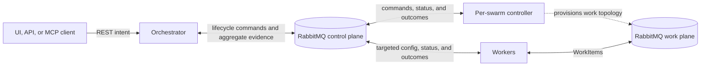
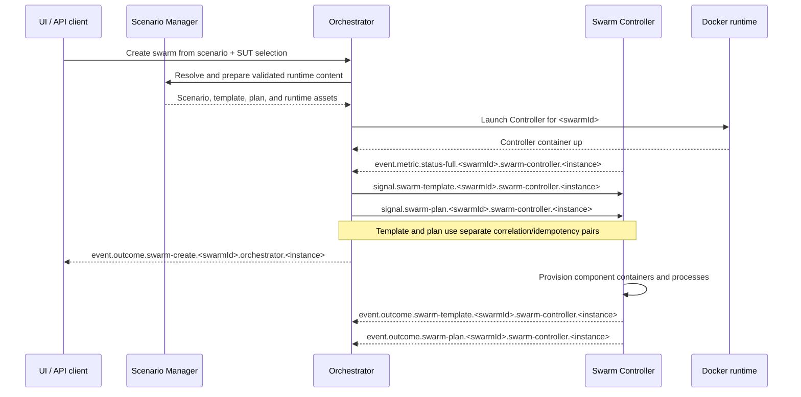
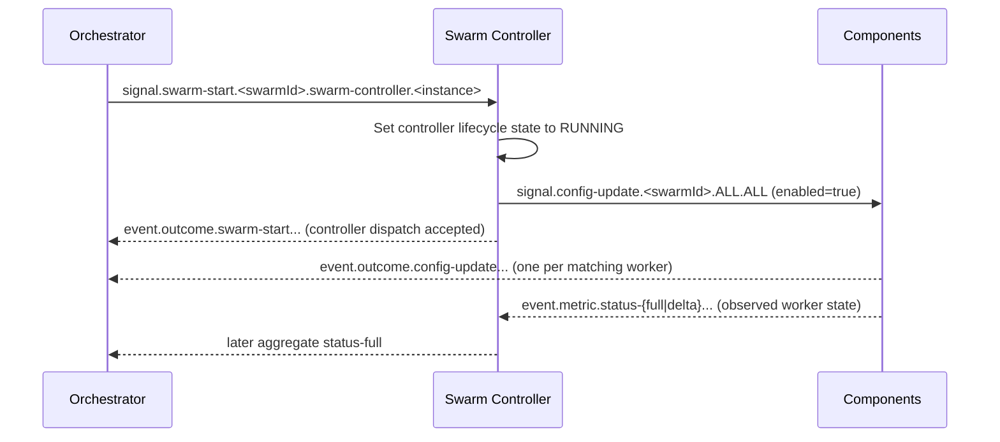
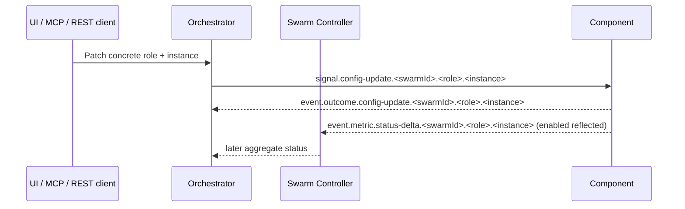
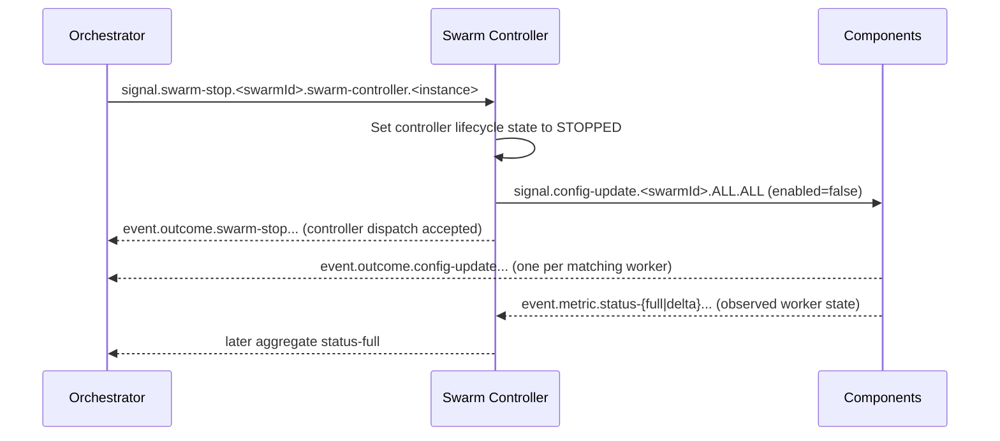
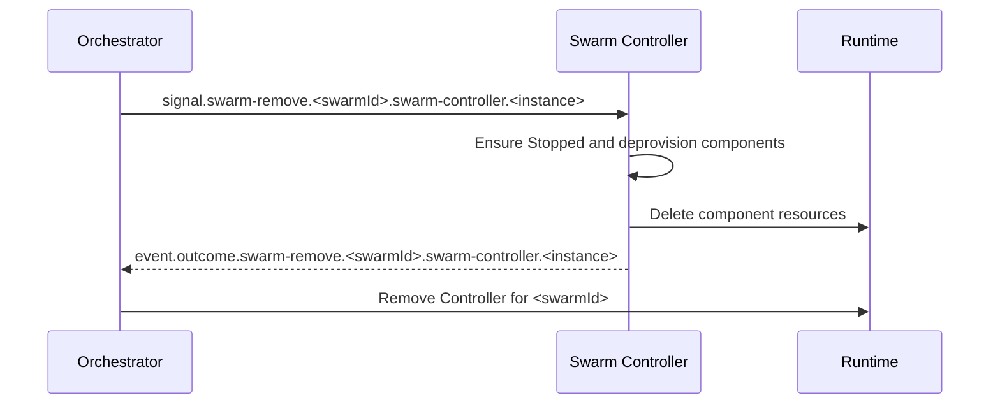
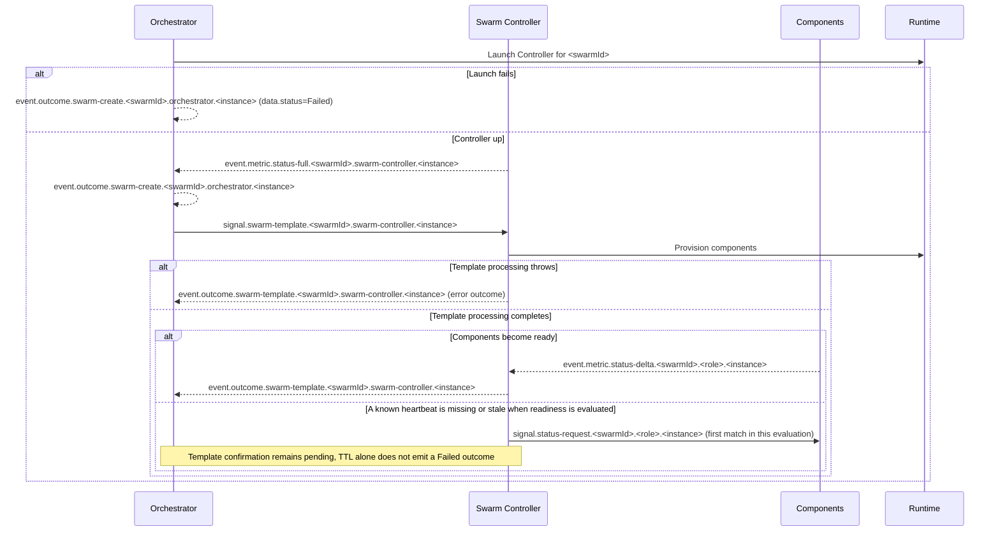

# PocketHive — ARCHITECTURE

| Reader context | Details |
| --- | --- |
| Audience | Contributors, maintainers, reviewers, and AI agents changing PocketHive |
| Prerequisites | A PocketHive repository checkout and basic familiarity with scenarios, swarms, and the control plane |
| Expected outcome | Locate the owning component, canonical contract, implementation entry point, and focused evidence for a system change |
| Last verified PocketHive version | PocketHive `v0.15.35`; repository baseline `86f57af7` |

> **Status:** Current implementation map and architecture reference for contributors and agents.
> **Scope:** The implemented runtime adapters are Docker single-node (used by local/Compose flows) and Docker Swarm. Kubernetes is not currently supported.
> **Reading rule:** Unless a section is explicitly labelled as a target, proposal, or open decision, it describes the current repository implementation.

## Choose the shortest reading path

1. Use [workflow traceability](#12-workflow-traceability) to find the owner,
   canonical contract, implementation entry point, and focused evidence.
2. Read only the matching reference section below.
3. Use the [project map](PROJECT_MAP.md) when you need repository orientation
   rather than architecture semantics.

| If you need to… | Continue with… |
| --- | --- |
| Understand component ownership | [Roles](#2-roles-managers-vs-workers) |
| Change a signal, route, or envelope | [Control-plane envelope and routing](#3-control-plane-envelope--routing-ssot) |
| Follow create, start, stop, remove, or readiness | [Lifecycle and states](#5-lifecycle--states), then [sequences](#7-sequences) |
| Change work-plane queues or runtime bindings | [Topology-first configuration](#310-topology-first-logical-topology-vs-adapter-config-vs-runtime-bindings) and [dependency dispatch](#6-dependency-graph-and-lifecycle-dispatch) |
| Diagnose missing or stale evidence | [Health and heartbeat](#4-health--heartbeat-model), then [observability](#10-observability--metrics) |
| Validate a contract or wire example | [Contract validation](#12-contract-validation-expectations), [envelope examples](#13-envelope-examples), and [legacy mapping](#14-legacy-field-mapping-migration) |

The remainder of this page is the canonical reference. Exact schema and route
syntax remain canonical in the linked JSON Schema and AsyncAPI files; this page
defines how those contracts fit the running system.

---

## 1. Overview

PocketHive orchestrates message-driven swarms of components (generators, processors, post‑processors, triggers, etc.) coordinated by an **Orchestrator** and a per‑swarm **Swarm Controller**. Communication is over **AMQP** (RabbitMQ). **Health** and **readiness** are inferred from **AMQP status** events; controllers and the orchestrator cannot reach component Actuator endpoints and rely exclusively on control-plane heartbeats.

**Design principles**

- **Single source of truth** for desired state: **Orchestrator**.
- **Aggregate state** per swarm: **Swarm Controller**.
- **Per‑component state**: emitted by **components themselves**, consumed by the **Controller**, **not** by the Orchestrator in steady state.
- **Control plane always on**: status and config are accepted even when workloads are disabled.
- **Scoped config updates**: current producers target `signal.config-update`
  through the routing key and envelope `scope`. The worker SDK still accepts
  legacy `worker` / `workerBean` / `bean` / `target` fields for compatibility;
  new producers must not use them.
- **Non‑destructive defaults**: failures never auto‑delete resources; Stop ≠ Remove.
- **Topology-derived dependency information**, not hard-coded role order. The
  current runtime computes this graph, but provisioning/removal are bulk
  adapter operations and start/stop use swarm-wide broadcasts; see §6.
- **Command → evidence pattern**: a concrete lifecycle/config command normally
  produces one correlated `event.outcome.*` from its processor. Fan-out config
  can produce one worker outcome per matching worker. `status-request` produces
  `status-full`, not an outcome. Runtime/IO errors can also emit
  `event.alert.{type}`.

### System at a glance


```mermaid
flowchart LR
  CLIENT[UI, API, or MCP client] -->|REST intent| ORCH[Orchestrator]
  ORCH <-->|lifecycle commands and aggregate evidence| CONTROL[(RabbitMQ control plane)]
  CONTROL <-->|commands, status, and outcomes| CTRL[Per-swarm controller]
  CONTROL <-->|targeted config, status, and outcomes| WORKERS[Workers]
  CTRL -. provisions work topology .-> WORK[(RabbitMQ work plane)]
  WORKERS <-->|WorkItems| WORK
```

The Orchestrator owns intent, each Swarm Controller owns one swarm's runtime
coordination and aggregate view, and workers own workload execution and their
own status. RabbitMQ carries both the control-plane evidence and the separate
work-plane traffic; it does not own desired state.

### 1.1 Status labels used in this document

| Label | Meaning |
| --- | --- |
| **Current** | Observed in the referenced `v0.15.35` implementation and its focused evidence. |
| **Limited** | Implemented, but with an explicit boundary or known projection gap. |
| **Legacy compatibility** | Still accepted by current code; new producers or documentation must not adopt it. |
| **Target / proposed** | Intended future behavior that must not be read as implemented. |
| **Open decision** | Current behavior is documented, but ownership or the desired long-term contract still requires a product decision. |

### 1.2 Workflow traceability

Use this table to enter the architecture at the narrowest relevant seam. File
and class names are repository locations, not additional contracts.

| Workflow | Owning component(s) | Canonical contract | Implementation entry point | Behavior guide | Focused evidence |
| --- | --- | --- | --- | --- | --- |
| Resolve a scenario and create a swarm | Orchestrator, with Scenario Manager preparation | [Orchestrator REST](ORCHESTRATOR-REST.md) and [scenario contract](scenarios/SCENARIO_CONTRACT.md) | `orchestrator-service/src/main/java/io/pockethive/orchestrator/app/SwarmController.java`, `orchestrator-service/src/main/java/io/pockethive/orchestrator/infra/scenario/ScenarioManagerClient.java`, `scenario-manager-service/src/main/java/io/pockethive/scenarios/ScenarioController.java` | [System workflows](guides/concepts/system-workflows.md) | `SwarmControllerTest`, Scenario Manager validation tests |
| Apply a template and plan, then materialize one swarm | Swarm Controller | [Control-event schema](spec/control-events.schema.json), [AsyncAPI](spec/asyncapi.yaml), and [scenario contract](scenarios/SCENARIO_CONTRACT.md) | `swarm-controller-service/src/main/java/io/pockethive/swarmcontroller/SwarmSignalListener.java`, `swarm-controller-service/src/main/java/io/pockethive/swarmcontroller/SwarmLifecycleManager.java`, `swarm-controller-service/src/main/java/io/pockethive/swarmcontroller/infra/amqp/SwarmWorkTopologyManager.java` | [System workflows](guides/concepts/system-workflows.md) | `SwarmSignalListenerTest`, `SwarmLifecycleManager*Test` |
| Start or stop a swarm | Orchestrator owns intent; Swarm Controller owns dispatch and aggregate state | [Orchestrator REST](ORCHESTRATOR-REST.md), [control-event schema](spec/control-events.schema.json), and [AsyncAPI](spec/asyncapi.yaml) | `orchestrator-service/src/main/java/io/pockethive/orchestrator/app/SwarmController.java`, `orchestrator-service/src/main/java/io/pockethive/orchestrator/app/ContainerLifecycleManager.java`; `swarm-controller-service/src/main/java/io/pockethive/swarmcontroller/SwarmSignalListener.java`, `swarm-controller-service/src/main/java/io/pockethive/swarmcontroller/SwarmLifecycleManager.java` | [Swarm lifecycle](guides/operators/swarm-lifecycle.md) | Orchestrator lifecycle tests, control-plane contract tests, and controller lifecycle tests |
| Remove a swarm | Orchestrator owns the public request and controller teardown; Swarm Controller owns worker/topology removal | [Orchestrator REST](ORCHESTRATOR-REST.md), [control-event schema](spec/control-events.schema.json), and [AsyncAPI](spec/asyncapi.yaml) | `orchestrator-service/src/main/java/io/pockethive/orchestrator/app/SwarmController.java`, `orchestrator-service/src/main/java/io/pockethive/orchestrator/app/ContainerLifecycleManager.java`; `swarm-controller-service/src/main/java/io/pockethive/swarmcontroller/SwarmSignalListener.java`, `swarm-controller-service/src/main/java/io/pockethive/swarmcontroller/SwarmLifecycleManager.java` | [Swarm lifecycle](guides/operators/swarm-lifecycle.md) | removal lifecycle tests and correlated outcome evidence |
| Patch one live worker | Orchestrator routes the request directly; the selected worker applies it | [Orchestrator REST](ORCHESTRATOR-REST.md), [worker capabilities](architecture/workerCapabilities.md), and [control-event schema](spec/control-events.schema.json) | `orchestrator-service/src/main/java/io/pockethive/orchestrator/app/ComponentController.java`; `common/worker-sdk/src/main/java/io/pockethive/worker/sdk/runtime/WorkerControlPlaneRuntime.java` | [Configuration propagation](guides/concepts/system-workflows.md#targeted-component-update) | `ComponentControllerTest`, `WorkerControlPlaneRuntimeTest` |
| Add or change a control-plane signal, route, or envelope | `common/control-plane-core`, plus each producing and consuming service | [AsyncAPI](spec/asyncapi.yaml) and [control-event schema](spec/control-events.schema.json) | `common/control-plane-core/src/main/java/io/pockethive/controlplane/routing/ControlPlaneRouting.java`, `common/control-plane-core/src/main/java/io/pockethive/controlplane/topology/ControlPlaneRouteCatalog.java`, `common/control-plane-core/src/main/java/io/pockethive/controlplane/ControlPlaneSignals.java`, then the relevant service listener | [Control-plane signals and evidence](guides/concepts/system-workflows.md#2-control-plane-signals) | `ControlPlaneRoutingTest`, `ControlPlaneWireShapeTest`, `ControlEventsSchemaValidationTest` |
| Change work-plane topology | Scenario Manager validates; Swarm Controller provisions | [Scenario contract](scenarios/SCENARIO_CONTRACT.md) | `scenario-manager-service/src/main/java/io/pockethive/scenarios/validation/ScenarioBundleValidator.java`; `swarm-controller-service/src/main/java/io/pockethive/swarmcontroller/infra/amqp/SwarmWorkTopologyManager.java` | [Lifecycle and topology flow](guides/concepts/system-workflows.md#1-swarm-lifecycle) | topology and scenario-contract tests |
| Change status, Journal, or UI projection | Worker emits; Swarm Controller aggregates; Orchestrator and UI project | [Control-event schema](spec/control-events.schema.json), [Orchestrator REST](ORCHESTRATOR-REST.md), and [observability](observability.md) | `common/worker-sdk/src/main/java/io/pockethive/worker/sdk/runtime/WorkerStatusPublisher.java`, `swarm-controller-service/src/main/java/io/pockethive/swarmcontroller/SwarmWorkersAggregator.java`, `orchestrator-service/src/main/java/io/pockethive/orchestrator/app/ControllerStatusListener.java`, `orchestrator-service/src/main/java/io/pockethive/orchestrator/infra/PostgresHiveJournal.java`, `ui-v2/src/pages/HivePage.tsx` | [Swarm lifecycle](guides/operators/swarm-lifecycle.md) | status, Journal, and lifecycle feedback tests |

### 1.3 Current limitation ledger

These entries keep known behavior visible without presenting it as the intended
long-term design.

| Area | Current documented behavior | Status |
| --- | --- | --- |
| Dependency order | The topology-derived order is computed, while provisioning/removal are bulk operations and start/stop use swarm-wide broadcasts. | **Open decision** |
| `READY` ownership | The Orchestrator can project `READY` from the template outcome before independently finalizing plan readiness; the controller still enforces the stricter start gate. | **Limited / open decision** |
| Aggregate-only UI | The main Hive path uses the controller aggregate; the compact Swarm View still has a broad read-only worker-status exception. | **Legacy exception / open decision** |
| Stale controller projection | A stale controller is pruned from the cached projection after about 40 seconds without deleting runtime resources. | **Limited / open decision** |

---

## 2. Roles (Managers vs. Workers)

PocketHive splits the control plane into **managers** (orchestrator + swarm controllers) and **workers** (generators, moderators, processors, post-processors, triggers, etc.). Managers shape desired state and publish control signals; workers execute workloads and echo health back through the same exchange.

### 2.1 Managers

#### Orchestrator (Queen)
- Owns the **desired state** and lifecycle intents per swarm (`SwarmPlan`).
- Launches a **Swarm Controller** for a new swarm (runtime) and, after the first controller `event.metric.status-full.{swarmId}.swarm-controller.<instance>` arrives, emits **`event.outcome.swarm-create.{swarmId}.orchestrator.<instance>`**.
- Publishes swarm-scoped lifecycle commands such as `signal.swarm-template.{swarmId}.swarm-controller.<instance>`, `signal.swarm-plan.{swarmId}.swarm-controller.<instance>`, `signal.swarm-start.{swarmId}.swarm-controller.<instance>`, `signal.swarm-stop.{swarmId}.swarm-controller.<instance>`, and `signal.swarm-remove.{swarmId}.swarm-controller.<instance>` (lifecycle commands always target a concrete controller instance).
- Issues **controller config updates** by addressing each controller instance via `signal.config-update.{swarmId}.swarm-controller.<instance>` (and `signal.config-update.ALL.swarm-controller.ALL` when broadcasting fleet-wide toggles).
- **Monitors** tracked lifecycle operations to **Ready / Running**, marks
  **Failed** on their timeout/error, and **never auto-deletes** resources.
  Controller projections that go stale are currently pruned after 40 seconds
  rather than retained as `FAILED`/`UNKNOWN`; see §5.
- Binds all `event.outcome.#` and `event.alert.#` events on its control queue,
  and binds Swarm Controller `status-full`/`status-delta` aggregates on a
  separate status queue. It does not bind direct worker status metrics.
  Lifecycle state projection is driven primarily by controller outcomes and
  controller aggregates.

#### Swarm Controller (Marshal)
- Applies the plan locally; **provisions** components; maintains the **aggregate** swarm view.
- Each controller instance is responsible for one configured `swarmId`.
  Its queue also has fleet-wide controller-role config/status bindings such as
  `ALL.swarm-controller.ALL`; those bindings do not make it an owner of other
  swarms, and handlers still apply local-swarm scope checks.
- Declares the control queue
  `ph.control.<swarmId>.swarm-controller.<instance>`. Lifecycle routes target
  that concrete instance. Config routes are
  `signal.config-update.ALL.swarm-controller.ALL`,
  `signal.config-update.<swarmId>.swarm-controller.ALL`,
  `signal.config-update.<swarmId>.swarm-controller.<instance>`, and
  `signal.config-update.<swarmId>.ALL.ALL`; status-request uses the same four
  scopes. The shared topology descriptor is the executable route catalogue.
- Declares the shared hive exchange `ph.<swarmId>.hive` and **exclusively**
  provisions queues and routing keys named
  `ph.<swarmId>.<queueName>`. Worker services consume through the
  autoconfigured topology and must not override these declarations. See §3 and
  the [AsyncAPI spec](spec/asyncapi.yaml) for the canonical control-plane
  routing definitions.
- Emits **swarm-level** lifecycle outcomes
  (`swarm-template`, `swarm-plan`, `swarm-start`, `swarm-stop`,
  `swarm-remove`) plus controller config outcomes. `status-delta` is periodic.
  `status-full` is emitted on startup, on `status-request`, and after template,
  plan, start, and stop processing. A start/stop lifecycle outcome records that
  the controller dispatched the swarm-wide enable/disable update and changed
  its own lifecycle state; it does not prove that every worker converged.
  The later start/stop full snapshot may wait up to 5s for fresh worker status,
  but that bounded wait is snapshot collection, not a convergence gate. Remove
  does not use the same queued full-snapshot path.
- Consumes every component heartbeat within the swarm via `event.metric.status-{delta|full}.{swarmId}.*.*` to keep aggregate health and enablement up-to-date.
- Treats AMQP `event.metric.status-{delta|full}` as the **sole heartbeat
  source**. When readiness is evaluated and a known worker heartbeat is
  missing or stale, the tracker issues a targeted
  `signal.status-request.{swarmId}.<role>.<instance>` for the first matching
  worker in that evaluation. This is not a scheduled sweep over every stale
  worker.
- May propagate workload enablement via `signal.config-update.{swarmId}.ALL.ALL` while keeping the control plane responsive.
- The control plane stays enabled even when workloads are paused, so
  start/stop/remove/status/config commands are still received and evaluated.
  Readiness and lifecycle gates may reject start, stop, or config with a
  `NotReady` outcome as described in section 5.3.

### 2.2 Workers (Bees)
- Declare their own control queues on startup using
  `ph.control.<swarmId>.<role>.<instance>`. Both config-update and
  status-request bind the four implemented scopes:
  `ALL.<role>.ALL`, `<swarmId>.<role>.ALL`,
  `<swarmId>.<role>.<instance>`, and `<swarmId>.ALL.ALL`.
- Consume workloads from queues named `ph.<swarmId>.<queueName>` that hang off
  the swarm's shared work exchange.
- Accept config updates from both the orchestrator (role/instance routing keys)
  and their controller (swarm broadcast) without relying on implicit routing
  conventions. Worker `config-update` outcomes route to the Orchestrator;
  worker status metrics route to the Swarm Controller for aggregation.
- Emit **their own** status streams (`event.metric.status-{full|delta}.{swarmId}.{role}.{instance}`) and respond to manager `signal.status-request.{swarmId}.{role}.{instance}` heartbeats.
- Apply `signal.config-update.{swarmId}.{role}.{instance}` (`data.enabled: true|false`) to control **workload** state only while keeping control listeners responsive.
- Runtime behaviour, worker interfaces, and adoption guidance are covered in the [Worker SDK quick start](sdk/worker-sdk-quickstart.md).
- Worker capability manifests and capability `config[]` contract are specified in the [Worker Capability Catalogue](architecture/workerCapabilities.md).

### 2.3 Request Builder worker

- Optional worker that sits between **Data Providers** (or other producers) and the **processor** in the work topology.
- **Input:** generic `WorkItem` from RabbitMQ with:
  - payload: arbitrary text/JSON produced upstream (for example, a per-customer dataset row from Redis),
  - headers: including `x-ph-call-id` (required) and optional `x-ph-service-id`.
- **Templates:** disk-backed HTTP call definitions under a configurable `templateRoot`:
  - organised as `(serviceId, callId)` pairs,
  - define `method`, `pathTemplate`, `headersTemplate`, and `bodyTemplate`,
  - rendered via the shared Pebble+SpEL templating engine using `payload`, `headers`, and `workItem` as context.
- **Behaviour:**
  - On each message, resolves `(serviceId, callId)` to a template and appends an HTTP envelope step:
    - `{ path, method, headers, body }` – exactly what `processor-service` expects.
  - Missing `callId` or template is handled explicitly via config:
    - `passThroughOnMissingTemplate: true` → log and return the original `WorkItem` unchanged.
    - `passThroughOnMissingTemplate: false` → log and drop the message (no output).
  - Publishes status data per role via the control plane (template root, service id, `errorCount`, `errorTps`) so operators can see template issues without inspecting logs.

Workers source their queue/exchange bindings from the IO sections, not from the control-plane block:

```yaml
pockethive:
  inputs:
    rabbit:
      queue: ph.swarm-1.mod
  outputs:
    rabbit:
      exchange: ph.swarm-1.hive
      routing-key: ph.swarm-1.final
```

The Swarm Controller injects the same values into each container via `POCKETHIVE_INPUT_RABBIT_QUEUE` /
`POCKETHIVE_OUTPUT_RABBIT_*`, and the Worker SDK fails fast when any required field is missing.

### 2.4 WorkItem envelope (data plane, SSOT)

The WorkItem on-wire format is a **single JSON envelope** defined in
`docs/spec/workitem-envelope.schema.json`. Transport headers (AMQP/SQS/Kafka) **must not**
carry WorkItem data — the full payload, headers, steps, and observability live inside the JSON body.

Key rules:

- `steps[]` is always present (min 1). Step headers **must** include `ph.step.service` and
  `ph.step.instance` for every step.
- The current payload is always the last step (`steps[-1]`). The `WorkItem` API exposes it via
  `payload()` / `payloadEncoding()`; the on-wire envelope does not duplicate it at the top level.
- Step 0 is explicit (no auto-seeding in builders). Empty payloads are allowed.
- `messageId` and `contentType` are top-level only (do not duplicate in headers).
- `x-ph-service` is deprecated for WorkItem tracking; tests enforce its absence in WorkItem headers.
- Worker runtime exceptions (for example malformed request payloads, missing required call config) are
  **not** encoded as WorkItem steps. They are handled out-of-band: log entry + control-plane alert
  (journal-visible), and the consumed message is dropped (no requeue/redelivery storm).

### 2.5 Debug taps (UI V2)
Operators can inspect data-plane traffic via **debug taps**. A tap is a temporary AMQP queue
bound to the swarm's hive exchange (e.g. `ph.<swarmId>.hive`) using the same routing key as the
target work queue (e.g. `ph.<swarmId>.<queueName>`). The Orchestrator owns tap lifecycle
and exposes REST endpoints for UI V2; workers remain AMQP-only and untouched.
---

## 3. Control-plane envelope & routing (SSOT)

Control-plane payloads are defined by `docs/spec/control-events.schema.json` and routed as specified in `docs/spec/asyncapi.yaml`.

### 3.1 Envelope fields (SSOT)

| Field | Type | Required | Description |
|---|---|---|---|
| `timestamp` | string | Yes | RFC‑3339 time when the message was emitted by its origin. |
| `version` | string | Yes | Schema version of the envelope and its structured `data` section for this control‑plane message. Bump only for incompatible changes. |
| `kind` | string | Yes | Coarse category of the message: one of `signal`, `outcome`, `event`, `metric`. All routing/consumers should branch on this field first. |
| `type` | string | Yes | Concrete name within the `kind` category. For `kind=signal` this is the command name (`swarm-start`, `config-update`, …). Most outcomes repeat the command name; `work-journal` is the current non-command outcome used for informational worker journal records. For `kind=event` the current spec covers `alert`; for `kind=metric` it covers `status-full` and `status-delta`. |
| `origin` | string | Yes | Logical emitter instance identity (e.g. `orchestrator-1`, `aaa-marshal-…`, `alpha-processor-1`, `hive-ui`). Never blank. The role is carried separately in `scope.role`. |
| `scope` | object | Yes | `{ swarmId, role, instance }` describing the entity the message is about. |
| `scope.swarmId` | string | Yes | Swarm the message relates to. Use the literal `ALL` for cross‑swarm or global fan‑out; never `null`. |
| `scope.role` | string | Yes | Role/routing segment of the **subject** of the message; carried for control-plane addressing and human display. For materialized scenario workers, this is the unique `template.bees[].role` scenario node key. It is not the runtime worker id and not a worker type system; worker type/capability is resolved from `image`. Core deployed components use values such as `orchestrator` and `swarm-controller`, while scenario workers use their declared roles. The envelope schema must **not** hardcode an enum for this field. Use the literal `ALL` for cross-role or fan-out scopes; never `null`. |
| `scope.instance` | string | Yes | Logical instance identifier of the **subject** of the message (the controller/worker/orchestrator instance the message is about). For runtime workers, this is the canonical runtime worker id and the only runtime identity clients may use. Use the literal `ALL` for fan‑out across instances; never `null`. This may or may not be the same as the `origin` instance that emitted it. |
| `correlationId` | string\|null | Yes | Correlation token used to join related messages. For command signals/outcomes it must be non-empty and identical across the signal and its outcomes. A `work-journal` outcome also requires a non-empty lifecycle correlation, but it has no originating signal. For `event` and `metric` it is otherwise `null` unless a higher-level correlation is explicitly documented. |
| `idempotencyKey` | string\|null | Yes | Stable identifier reused across retries of the same logical command. Externally initiated command signals/outcomes should carry it; purely internal or non-retriable records may use `null`. Current `work-journal` outcomes use `null` because they are informational records rather than command attempts. |

### 3.2 Structured `data` rules

- `data` is always an object on-wire. Commands without args still send `data: {}`.
- Outcomes must include at least `data.status`.
- Canonical producer targeting lives in `scope` and the routing key. The worker
  SDK still reads legacy `worker`, `workerBean`, `bean`, or `target` fields from
  config-update arguments/data as a compatibility exception, then removes
  them before applying config. New producers must not rely on that path.
- `docs/spec/control-events.schema.json` enforces the common envelope,
  runtime-scope rules, generic signal data object, generic outcome
  `data.status`, and the detailed status/alert shapes. It does not currently
  use per-command conditionals to validate every signal/outcome `data` shape;
  the tables below and the referenced runtime models define those semantics.

**Structured sections**

| Section / Field | Type | Applies to | Description |
|---|---|---|---|
| `data` | object | all kinds | Structured payload for the message. On-wire producers always emit an object; commands without args send `{}` and outcomes must include at least `data.status`. The JSON Schema machine-validates detailed metric/alert payloads but only generic signal/outcome requirements; per-command semantics are documented below. Current producers use `scope` and routing for targeting. Legacy worker config-target fields remain a read-only compatibility exception, not a producer contract. |

- [x] `docs/spec/asyncapi.yaml` and
  `docs/spec/control-events.schema.json` describe the canonical routing
  families and common envelope shapes below. Per-command signal/outcome data
  conditionals remain outside the current machine-enforced schema.

### 3.3 Routing key families

Current routing-key relationship:

- Control‑plane **signals** use the `signal.*` prefix. The current canonical pattern is:
  `signal.<commandType>.<swarmId>.<role>.<instance>` where:
  - `<commandType>` is the envelope `type` for `kind = signal` (for example `swarm-start`, `swarm-stop`, `swarm-remove`, `config-update`, `status-request`).
  - `<swarmId>.<role>.<instance>` are the semantic target and must match `scope.swarmId` / `scope.role` / `scope.instance` on the signal. For fan‑out signals the routing key may use the literal `ALL`, while outcomes carry the concrete processor scope. The current Orchestrator addresses lifecycle commands (`swarm-template`, `swarm-plan`, `swarm-start`, `swarm-stop`, `swarm-remove`) to a concrete controller instance.

- Control‑plane **events** (everything that is not a command signal) use the `event.*` prefix. The canonical pattern is:  
  `event.<category>.<name>.<swarmId>.<role>.<instance>` where:
  - `<category>` differentiates major event families such as `outcome`, `metric`, `alert` (for example `event.outcome.*`, `event.metric.*`, `event.alert.{type}.*`). The alert family uses `<name>` as the alert type; today the only defined type is `alert`.
  - `<name>` is normally the envelope `type` within that family (for example `status-full`, `status-delta` for metrics, or the command name such as `swarm-start` / `config-update` for outcomes).
  - `<swarmId>.<role>.<instance>` are the semantic subject and must match `scope.swarmId` / `scope.role` / `scope.instance`, normalised so that fan‑out uses the literal `ALL` in both the routing key and `scope` (no `null` placeholders).

- For **outcomes** (`kind = outcome`), the routing key uses the
  `event.outcome.*` family:
  `event.outcome.<outcomeType>.<swarmId>.<role>.<instance>`. For command
  outcomes, `<outcomeType>` matches the originating signal's command name,
  `scope` describes the concrete processor, and correlation/idempotency fields
  join it to the signal. `work-journal` is the current exception: it is an
  informational worker outcome with no originating `signal.work-journal`.

### 3.4 Control-plane commands & outcomes

**Known `data` schemas for current messages**

The tables below describe the canonical `data` shapes for the message kinds/types covered by the current specs in `docs/spec/asyncapi.yaml` / `docs/spec/control-events.schema.json`.

Commands use `kind = signal`, `type = <commandName>` and the
`signal.<type>.<swarmId>.<role>.<instance>` routing family. Outcomes use
`kind = outcome` and the
`event.outcome.<type>.<swarmId>.<role>.<instance>` family. Command outcomes use
`type = <commandName>`; the informational `work-journal` outcome is the
non-command exception.

**Command signals (`kind = signal`) — current purpose and targeting**

| `type` | Purpose / effect | Current routing key | Target subject (`scope`) |
|---|---|---|---|
| `swarm-template` | Apply swarm template (bees, images, wiring, config, SUT). | `signal.swarm-template.<swarmId>.swarm-controller.<instance>` | Swarm controller instance for `<swarmId>`. |
| `swarm-plan` | Push resolved scenario plan timeline to controller. | `signal.swarm-plan.<swarmId>.swarm-controller.<instance>` | Swarm controller instance for `<swarmId>`. |
| `swarm-start` | Start workloads inside a running controller. | `signal.swarm-start.<swarmId>.swarm-controller.<instance>` | Swarm controller instance for `<swarmId>`. |
| `swarm-stop` | Stop workloads (non‑destructive). | `signal.swarm-stop.<swarmId>.swarm-controller.<instance>` | Swarm controller instance for `<swarmId>`. |
| `swarm-remove` | Tear down queues and controller runtime. | `signal.swarm-remove.<swarmId>.swarm-controller.<instance>` | Swarm controller instance for `<swarmId>`. |
| `config-update` | Apply config patch / enablement to one or more components. | `signal.config-update.<swarmId>.<role>.<instance>` | Target component(s) addressed by routing key segments (supports ALL wildcards where fan-out is intentional). |
| `status-request` | Ask a component to emit an explicit status snapshot. | `signal.status-request.<swarmId>.<role>.<instance>` | Target component(s) addressed by routing key segments (supports ALL wildcards where fan-out is intentional). |

**Command signals (`kind = signal`) — current `data` / args**

| `type` | `data` / args field | Required | Description |
|---|---|---|---|
| `swarm-template` | `data` | Yes | Entire swarm template/plan as a `SwarmPlan` object (id, bees, traffic policy, sutId, etc.), converted to a JSON object. Shape is defined by the swarm model (`SwarmPlan`); the control envelope does not add extra fields. |
| `swarm-plan` | `data` | Yes | Resolved scenario plan timeline as a JSON object. Shape is defined by scenario manager contracts; control‑plane treats it as opaque. |
| `swarm-start` | — | No | No command‑level args; semantics come from `type`, `scope`/routing, `correlationId` and `idempotencyKey`. On‑wire producers still send an empty `data: {}` to keep envelopes schema‑compliant. |
| `swarm-stop` | — | No | Same as `swarm-start` (no args); on‑wire producers still send an empty `data: {}`. |
| `swarm-remove` | — | No | Same as `swarm-start` (no args); on‑wire producers still send an empty `data: {}`. |
| `config-update` | `data` | Yes | Config payload for the target component(s). Current producers target through envelope `scope` and routing. The worker SDK also accepts legacy `worker`, `workerBean`, `bean`, or `target` selectors in arguments/data for compatibility and strips them before applying the patch; new producers must not use them. Exact config shape is defined in worker/manager config docs. |
| `status-request` | — | No | No command‑level args; the response is a `status-full` metric event instead of a confirmation outcome. On‑wire producers still send an empty `data: {}`. |

**Runtime config-update safety**

- `inputs.*` and `outputs.*` define IO wiring: adapters, protocols, endpoints, source files/lists,
  credentials, routing, and output target selection. Treat these fields as **unsafe for live mutation**.
- A running worker may accept only an explicit allowlist of operational live fields. Current safe IO
  fields are scheduler `inputs.scheduler.ratePerSec`, `inputs.scheduler.maxMessages`,
  `inputs.scheduler.reset`, Redis dataset `inputs.redis.ratePerSec`, and CSV dataset
  `inputs.csv.ratePerSec`. Redis dataset `inputs.redis.listName` is the sole disabled-only IO exception:
  it may change only for an already-disabled, single-source worker, and the patch must not change any
  other unsafe IO field. UI clients must block this patch unless swarm status is explicitly `STOPPED`.
  MCP agents must verify `STOPPED` with `swarm_get`; dispatch acceptance of `swarm_stop` is not completion
  evidence. Enable/disable remains controlled by the config-update `enabled` flag.
- Capability manifests must mark each config entry with explicit `liveMutable: true|false`.
  Runtime UI may offer only `liveMutable: true` entries. For `inputs.*` / `outputs.*`, `true` is
  valid only for the operational live IO fields listed above; all IO wiring entries must be
  `liveMutable: false`.
- Changing `inputs.type`, `outputs.type`, IO endpoints, multi-source datasets, output routes, protocols,
  or credentials requires restarting/rematerializing the worker or swarm. The explicit disabled-only
  `inputs.redis.listName` exception changes a single-source selection without changing the adapter,
  endpoint, or source mode. Do not emulate other changes with fallback adapter switches or partial live
  rewiring.

**Command outcomes (`kind = outcome`) — current payloads**

Outcome messages use the common `CommandOutcomePayload` envelope shape. Most
have `type = <command>`. The `work-journal` non-command outcome uses the same
shape for informational worker lifecycle records without classifying them as
alerts. The producer emits this outcome, but the current Orchestrator outcome
classifier does not track or persist `work-journal`; projection into Journal is
a known implementation gap.

- Outcomes are published on
  `event.outcome.<type>.<swarmId>.<role>.<instance>` (except
  `status-request`, which responds with `event.metric.status-full`).
- `data.status` is always required.
- `data.retryable` is set only for commands with defined retry semantics.
- Structured post-command detail belongs in `data.context` (no generic `state.*` fields).
- Legacy confirmation fields are removed: `state.enabled` is gone, and any
  human-readable `message`/`code` belongs in `event.alert.{type}` payloads.

`work-journal` has no corresponding control signal. Current
Clearing Export records non-error operational events with
`type = "work-journal"`, `data.status = "recorded"`, and context such as
`worker`, `callId`, `messageId`, `traceId`, and event-specific details. Its
policy failure status is `failed` and it is not retryable.

**Current payload mapping (legacy -> envelope)**

| Legacy field | Current envelope location | Description |
|---|---|---|
| `state.status` | `data.status` | High‑level status after processing the command (for example `Ready`, `Running`, `Stopped`, `Removed`, `Failed`, `Applied`, `NotReady`). |
| `state.enabled` | — (removed) | Enablement lives in `data.enabled` on config‑update outcomes and in status metrics; there is no generic `state.enabled` field. |
| `state.details` | `data.context` | Structured post‑command state details (for example `workloads.enabled`, scenario changes, worker info), to be defined per command type. No separate `controllerEnabled` field is kept. |
| `phase` | — (removed or mapped to alert) | Error phase will not be carried as a generic outcome field. If needed for debugging, producers include it in alert `data.context.phase` for the corresponding `event.alert.{type}` message. |
| `code` | — (replaced by alert `data.code`) | Command outcomes no longer carry their own error/result code; runtime and IO errors are expressed via `event.alert.{type}` with `data.code`. |
| `message` | — (replaced by alert `data.message`) | Human‑readable error/message text for failures is carried by `event.alert.{type}.data.message` rather than command outcome envelopes. |
| `retryable` | `data.retryable` | Whether this **failed** command attempt is safe to retry. Only set on error outcomes for commands where retry semantics are defined (for example swarm create/start/stop/remove). |
| `details` | — (folded into `data.context`) | Catch‑all details on confirmations are removed. Any structured context that needs to survive goes into `data.context` on the outcome and/or the corresponding `event.alert.{type}`. |

**Initialization + readiness gates (`swarm-start`, `swarm-stop`, `config-update`)**

- Initialization is satisfied after the controller has successfully processed both
  `swarm-template` and `swarm-plan` for the swarm.
- Readiness is defined as: `isReadyForWork == true` AND `hasPendingConfigUpdates == false`.
- Commands allowed before initialization: `swarm-template`, `swarm-plan`, `status-request`,
  and `swarm-remove` (abort).
- `swarm-start` is rejected unless initialization + readiness are satisfied. A rejected
  `swarm-start` emits an outcome with `data.status = "NotReady"` and a `data.context`
  payload that captures the gating flags (for example `initialized=false`, `ready=false`,
  `pendingConfigUpdates=true`).
- `swarm-stop` and normal controller-targeted `config-update` are rejected
  unless initialization + readiness are satisfied and the swarm is already
  `RUNNING`. A controller-only patch containing only `sutId`, `networkMode`,
  and/or `networkProfileId` is the current exception: it still requires
  initialization + readiness with no pending bootstrap updates, but it does
  not require `RUNNING`. Rejections use the same `NotReady` outcome pattern;
  no side effects occur when rejected.

**Config-update fan-out + acknowledgements**
- Swarm Controller uses `ConfigFanout` to broadcast `signal.config-update` (enable/disable + config patches).
- `pendingConfigUpdates` tracks **bootstrap config** deliveries; it is cleared when each worker
  **reports status** (either `status-delta` or `status-full`). The acknowledgement is driven by
  worker status events, **not** by outcomes.

### 3.5 Status metrics semantics

**Control metrics (`kind=metric`)**

| `type` | `data` field | Required | Description |
|---|---|---|---|
| `status-full` | `enabled` | Yes | Boolean. Indicates whether this component is currently allowed to run workloads for its scope. |
|  | `startedAt` | Yes | RFC‑3339 timestamp when this component started processing workloads for its scope (or when the current process was started). |
|  | `tps` | No | Integer ≥ 0. Throughput sample for the reporting interval. **Workers should emit this**; managers (Orchestrator / Swarm Controller) may omit. |
|  | `config` | Yes | Snapshot of the effective configuration for this scope (role/instance). Must not include secrets. |
|  | *(none)* | — | Runtime/infra metadata lives in the envelope as `runtime` (see below). |
|  | `io` | Yes | Object describing IO bindings. **Workers** include both planes (`io.work` + `io.control`); **managers** are control‑plane‑only and include only `io.control` (no `io.work`). Present only in `status-full`. |
|  | `ioState` | Yes | Coarse IO health summary for workload/local IO only (for example `ioState.work`, `ioState.filesystem`). **Workers** should include `ioState.work` plus any local IO; **managers** include only local IO if applicable. `ioState` does not represent control‑plane health. |
|  | `context` | No | Freeform role‑specific context. For swarm‑controller, `status-full` context carries the full aggregate (`swarmStatus`, `totals`, `watermark`, `maxStalenessSec`, scenario progress) and the canonical runtime worker aggregate `context.workers[]`. For orchestrator, `context` carries at least `swarmCount`; `computeAdapter` is effectively static and belongs in `status-full` (not `status-delta`). |
| `status-delta` | `enabled` | Yes | Boolean. Same semantics as in `status-full`; used to signal enablement changes without resending full status snapshots. |
|  | `tps` | No | Integer ≥ 0. Throughput sample for the interval since the last status event. **Workers should emit this**; managers may omit. |
|  | `ioState` | Yes | Coarse IO health summary (see §6). Same rules as `status-full`: workload/local IO only; managers omit `work`. |
|  | `context` | No | Same role-specific semantics as in `status-full`, but only for fields that change frequently (for example `swarmStatus`, totals, watermark, scenario progress, and rolling diagnostics). `maxStalenessSec`, `context.workers[]`, `data.config`, `data.io`, and `data.startedAt` are omitted from current swarm-controller deltas. |

Additional rules:
- `runtime` is an envelope field, not a `data` field. Current runtime-aware
  emitters attach it to component/controller status metrics and command
  outcomes (and to error alerts emitted through the same path). Command signals
  do not universally carry `runtime`, so consumers must not require it on every
  swarm-scoped signal.
- `data.ioState` represents workload/local IO only (for example `ioState.work`, `ioState.filesystem`). It does not represent control-plane health.
- `data.context` carries role-specific context. For swarm-controller:
  - `status-delta` carries a small aggregate only (no worker list).
  - `status-full` carries the full aggregate snapshot, including `data.context.workers[]`.
  - `data.context.workers[]` is the canonical swarm-controller worker
    aggregate consumed by UI/runtime clients.
  - Every `data.context.workers[]` entry must include `role`, `instance`,
    `enabled`, `tps`, `lastSeenAt`, `stale`, and `ioState`. `instance` is the
    canonical runtime worker id. `role` is the scenario node key and the routing
    segment required by component actions.
  - `data.context.workers[]` entries may include a `runtime` object with the same shape as the envelope `runtime`.
  - `data.context.workers[]` entries must carry the last known public worker
    `status-full.data.config` as `config` after the worker has reported a
    `status-full`. An explicit empty object (`config: {}`) means the worker
    reported an empty effective config. Later worker `status-delta` events
    omit `data.config` and must not erase the last reported config from the
    swarm-controller aggregate.
  - Runtime worker status must not emit or require a second runtime worker id.
    `data.context.beeId` is not part of the runtime contract.
  - Live mutation requests must address the worker by `role` plus
    `data.context.workers[].instance`. Clients must not fall back to array order,
    topology position, label, queue name, image name, or removed authoring ids.
- For orchestrator, `data.context` carries at least `swarmCount`. The
  `computeAdapter` selection is effectively static and belongs in `status-full`
  only (never in deltas).
- `data.io` describes configured bindings:
  - Workers include both planes (`io.work` + `io.control`).
  - Managers are control-plane-only and include just `io.control`.
- Workers must never emit `workers[]`.

**IO state conventions**

- Input states: `ok`, `out-of-data`, `backpressure`, `upstream-error`, `unknown`.
- Output states: `ok`, `blocked`, `throttled`, `downstream-error`, `unknown`.
- `out-of-data` is a logical source-exhausted condition and should be emitted explicitly by inputs/generators (not inferred from queue depth).

### 3.6 Alert events (`event.alert.{type}`)

**Control events (`kind = event`)**

| `data` field | Required | Description |
|---|---|---|
| `level` | Yes | `info`, `warn`, `error`. |
| `code` | Yes | Short, stable alert code (for filtering and dashboards). |
| `message` | Yes | Human-readable alert message. |
| `errorType` | No | Exception class name (for runtime errors). |
| `errorDetail` | No | Best-effort detail string (root cause, truncated stack trace). |
| `logRef` | No | Opaque pointer to logs or traces (currently `null`; do not embed full stack traces). |
| `context` | No | Object carrying type‑specific structured context. For IO / “out of data” alerts, recommended keys include: `backend` (for example `redis`, `csv`, `kafka`), `resourceId` (dataset id, file path, key prefix, etc.), `loopMode` (`loop`/`no-loop`), and optional limit info such as `limitKind` (`maxMessages`, `maxTime`, `none`) and `limitValue` (numeric/string). For other alert codes, `context` can carry whatever structured fields a producer and UI agree on. |

The checked-in canonical alert factory emits `runtime.exception` and
`io.out-of-data` for worker/runtime paths. The swarm controller's command-error
path currently passes the exception's simple class name as `data.code` (for
example `IllegalStateException`); this dynamic-code path is a current contract
gap, so consumers must not assume a two-value enum. Codes such as
`io.backpressure`, `io.downstream-error`, and `generator.limit-reached`
describe possible future alert categories and are not emitted by the canonical
factory in `v0.15.35`.

### 3.7 Journal and UI projections

- Supported Journal entries are derived directly from envelopes:
  - Signals: `timestamp`, `kind`, `type`, `scope`, `origin`, `data`, plus direction from routing.
  - Tracked command outcomes use `data.status` and `data.context` (no
    stringified payloads in `details`). The current tracker excludes
    `work-journal`, so those emitted outcomes are not yet persisted or
    projected.
  - Alerts: record `data.code`, `data.message`, `data.context`, and `logRef`.
  - Error alerts may produce a separate Orchestrator-local `runtime-debug` entry
    of type `runtime-log-snapshot` or `runtime-log-snapshot-unavailable`. The
    snapshot uses the alert scope and the Orchestrator runtime debug path; it
    must not mutate the alert envelope or revive central log aggregation.
  - Metrics: do not log every `status-*` tick; record only state transitions.
- `actor` is redundant and must not be required by UI or new tooling.
- UI should rely on `origin` + routing for "from -> to" and on typed `data` fields for display.

### 3.8 Wire format and serialization rules

- Required envelope fields must be present on-wire even when values are `null`
  (avoid `NON_NULL` serialization for control-plane envelopes).
- Commands without args still include `data: {}`.
- `correlationId` and `idempotencyKey` semantics follow the envelope rules in §3.1.

### 3.9 UI consumption constraints

- The primary Hive page reads the Orchestrator-cached Swarm Controller
  `status-full`; its worker list and runtime bindings come from that aggregate.
- UI-v2 also has a broad read-only control-plane subscription for notices and
  local state projection.
- The compact `/hive/<swarmId>/view` page currently consumes direct worker
  metric scopes from that subscription. This is a known exception to the
  aggregate-only target and needs an explicit product decision: filter/fix the
  compact view or retain and document the additional fan-out.

### 3.10 Topology-first: logical topology vs adapter config vs runtime bindings

The current UI/runtime contract separates a stable logical graph from adapter
configuration and materialized runtime bindings:

**A) Logical topology (scenario SSOT; UI drawing contract)**

- Stored in scenario templates (see `docs/scenarios/SCENARIO_CONTRACT.md`), not in status messages.
- `template.bees[]` is the authoring SSOT for declared worker definitions.
  `role` is required and unique within the scenario. It is the scenario node key
  used by topology endpoints and by runtime control-plane routing.
- `template.bees[].id` is not part of the contract.
- `topology` is the SSOT for authoring-time graph edges. Endpoints reference
  declared bee roles. These roles are not a second runtime worker id.
- Runtime worker identity is the materialised worker `instance`, exposed as
  `status-full.data.context.workers[].instance`.

Example (scenario template fragment):

```yaml
template:
  bees:
    - role: generator-a
      image: generator:latest
      ports:
        - { id: out, direction: out }
    - role: moderator-a
      image: moderator:latest
      ports:
        - { id: in, direction: in }
        - { id: out, direction: out }

topology:
  version: 1
  edges:
    - id: e1
      from: { role: generator-a, port: out }
      to:   { role: moderator-a, port: in }
```

**B) IO adapter config (runtime behavior; per-module configuration)**

- Lives in worker config (`status-full.data.config` for worker scope).
- Can include adapter types and settings (CSV/Redis/HTTP/etc). This is not a graph and must not replace topology.

**C) Runtime bindings (materialization)**

- Emitted by swarm-controller in `status-full` only so UI can map logical edges/ports to work-plane routing.
- Captures exchange, routing keys, and queues for the current swarm.

Example (inside swarm-controller `status-full.data.context`):

```json
{
  "bindings": {
    "work": {
      "exchange": "ph.<swarm>.hive",
      "edges": [
        {
          "edgeId": "e1",
          "from": { "role": "generator-a", "instance": "gen-1", "port": "out", "routingKey": "ph.<swarm>.gen" },
          "to": { "role": "moderator-a", "instance": "mod-1", "port": "in", "queue": "ph.<swarm>.mod" }
        }
      ]
    }
  }
}
```

**Multi-input / multi-output notes**

- Multi-IO is expressed as multiple ports per bee and multiple edges in `topology`.
- Runtime bindings should include `from.port` / `to.port` so UI can map edges to the right ports.
- If a worker chooses among outputs (or inputs) via a policy, treat it as optional metadata on the edge; the topology still lists the possible paths.

Example (scenario fragment with multi-IO ports + edges):

```yaml
template:
  bees:
    - role: moderator-a
      image: moderator:latest
      ports:
        - { id: in.http, direction: in }
        - { id: in.audit, direction: in }
        - { id: out.fast, direction: out }
        - { id: out.slow, direction: out }
    - role: processor-a
      image: processor:latest
      ports:
        - { id: in.fast, direction: in }
        - { id: in.slow, direction: in }

topology:
  version: 1
  edges:
    - id: e-fast
      from: { role: moderator-a, port: out.fast }
      to:   { role: processor-a, port: in.fast }
    - id: e-slow
      from: { role: moderator-a, port: out.slow }
      to:   { role: processor-a, port: in.slow }
```

Example (bindings with ports + optional selector hint):

```json
{
  "bindings": {
    "work": {
      "exchange": "ph.<swarm>.hive",
      "edges": [
        {
          "edgeId": "e-fast",
          "from": { "role": "moderator-a", "instance": "mod-1", "port": "out.fast", "routingKey": "ph.<swarm>.mod.fast" },
          "to": { "role": "processor-a", "instance": "proc-1", "port": "in.fast", "queue": "ph.<swarm>.proc.fast" },
          "selector": { "policy": "predicate", "expr": "payload.priority >= 50" }
        }
      ]
    }
  }
}
```

**D) UI join strategy**

- UI obtains `template + topology` via Scenario Manager REST for authoring
  context.
- UI uses swarm-controller `status-full` for `workers[]`, runtime `bindings`,
  and runtime identity. The current controller aggregate does not provide a
  `queueStats` payload.
- UI joins selected scenario bees to runtime workers by exact unique `role`.
- UI edit-targets runtime workers by `role` and
  `data.context.workers[].instance`.
- If a selected scenario bee has no matching runtime worker, or more than one
  runtime worker reports the same role, UI must show an explicit invalid-runtime
  state and disable live mutation for that item.

---

## 4. Health & heartbeat model

- **AMQP `event.metric.status-{delta|full}` events are the only heartbeat source.**
- TTL expiry immediately degrades the aggregate metrics, but the periodic
  metrics calculation does not itself sweep workers with status requests.
  When readiness is evaluated (for example during template/start completion,
  a gated command, or a worker status update), the tracker issues a targeted
  `signal.status-request.{swarmId}.<role>.<instance>` for the first known
  missing/stale worker it encounters and returns. Later readiness evaluations
  can request the next one. Once no readiness operation or gated command is
  evaluating the tracker, the scheduled status tick alone does not fan out
  refresh requests.
- Both full and delta **swarm aggregates** carry a **watermark timestamp**,
  health, and totals. `maxStalenessSec` is static context emitted only in
  `status-full`. If the tracked state is stale or incomplete, the Controller
  reports **Degraded/Unknown** in its aggregate.

---

## 5. Lifecycle & states

### 5.1 Swarm lifecycle (Orchestrator view)
```
New → Creating → Ready → Starting → Running
                     ↘ Failed ↙        → Stopping → Stopped → Removing → Removed
```
- **Creating:** Controller launched; success signalled by **`event.outcome.swarm-create.{swarmId}.orchestrator.<instance>`**.
- **Controller ready-to-start:** template and plan were applied, bootstrap
  config is acknowledged, and required components report ready with workloads
  disabled.
- **Current Orchestrator `READY` projection:** the registry advances on the
  successful `swarm-template` outcome and does not independently process the
  `swarm-plan` outcome. It can therefore appear before the controller's stricter
  start gate is satisfied. A `NotReady` start outcome means the controller is
  still authoritative for readiness. This lifecycle-ownership gap is unresolved.
- **Current `RUNNING` / `STOPPED` projection:** the lifecycle outcome confirms
  controller-side dispatch and state transition. It does not confirm that every
  worker has reported the requested enabled value; use later controller
  aggregates to inspect observed worker state.
- **Failed:** an error or timeout occurred; **resources are preserved** for debugging.
- **Stale controller exception:** after roughly 40 seconds without a controller
  projection, the current Orchestrator removes the cached swarm entry without
  deleting runtime resources. Whether the intended UX should retain
  `FAILED`/`UNKNOWN` requires a lifecycle decision.

### 5.2 Component lifecycle (aggregate perspective)
```
New → Provisioning → Healthy(enabled=false) → Starting → Running(enabled=true)
                                               ↘ Failed ↙               → Stopping → Stopped
```
> Per‑component transitions are **emitted by components**; the Controller **aggregates** only.

### 5.3 Initialization and readiness gates

- Initialization is satisfied after the controller has successfully processed both `swarm-template` and `swarm-plan`.
- Readiness is `isReadyForWork == true` and `hasPendingConfigUpdates == false`.
- Commands allowed before initialization: `swarm-template`, `swarm-plan`, `status-request`, `swarm-remove` (abort).
- `swarm-start` is rejected unless initialization + readiness are satisfied.
- `swarm-stop` and normal controller-targeted `config-update` are rejected
  unless initialization + readiness are satisfied and the swarm is already
  `RUNNING`. A controller-only network-context patch containing only `sutId`,
  `networkMode`, and/or `networkProfileId` does not require `RUNNING`, but it
  still requires initialization + readiness and no pending bootstrap updates.
- Rejections emit outcomes with `data.status = "NotReady"` and a `data.context` payload capturing the gating flags.
- These are the Swarm Controller gates. They are stricter than the current
  Orchestrator `READY` registry transition described in §5.1.

---

## 6. Dependency graph and lifecycle dispatch

Construct a directed graph where **A → B** if **A produces** to a queue that **B consumes**.

- The controller computes a stable topological `startOrder` and its reverse for
  diagnostics/planning.
- Current provisioning and removal call the compute adapter in bulk.
- Current start/stop uses one swarm-wide
  `signal.config-update.<swarmId>.ALL.ALL` enable/disable broadcast; it does not
  dispatch one worker at a time in the computed order.
- A cycle currently produces a controller log warning, not a control-plane
  warning event.

The intended contract is unresolved: either enforce dependency-ordered
lifecycle dispatch, or keep the current bulk/broadcast behavior and treat the
computed order as descriptive only.

---

## 7. Sequences

> Rendering note: Mermaid messages avoid semicolons to prevent parser hiccups.

### 7.1 Resolve → Create → Template + Plan (no auto-start)

```mermaid
sequenceDiagram
  participant CL as UI / API client
  participant SM as Scenario Manager
  participant QN as Orchestrator
  participant MSH as Swarm Controller
  participant RT as Docker runtime

  CL->>QN: Create swarm from scenario + SUT selection
  QN->>SM: Resolve and prepare validated runtime content
  SM-->>QN: Scenario, template, plan, and runtime assets
  QN->>RT: Launch Controller for <swarmId>
  RT-->>QN: Controller container up
  MSH-->>QN: event.metric.status-full.<swarmId>.swarm-controller.<instance>
  QN->>MSH: signal.swarm-template.<swarmId>.swarm-controller.<instance>
  QN->>MSH: signal.swarm-plan.<swarmId>.swarm-controller.<instance>
  Note over QN,MSH: Template and plan use separate correlation/idempotency pairs
  QN-->>CL: event.outcome.swarm-create.<swarmId>.orchestrator.<instance>
  MSH->>MSH: Provision component containers and processes
  MSH-->>QN: event.outcome.swarm-template.<swarmId>.swarm-controller.<instance>
  MSH-->>QN: event.outcome.swarm-plan.<swarmId>.swarm-controller.<instance>
```

The current Orchestrator emits the create outcome after the first controller
status and dispatches both template and plan. Its registry advances to `READY`
on the template outcome; see the readiness ownership gap in §5.1.

### 7.2 Start whole swarm

```mermaid
sequenceDiagram
  participant QN as Orchestrator
  participant MSH as Swarm Controller
  participant CMP as Components

  QN->>MSH: signal.swarm-start.<swarmId>.swarm-controller.<instance>
  MSH->>MSH: Set controller lifecycle state to RUNNING
  MSH->>CMP: signal.config-update.<swarmId>.ALL.ALL (enabled=true)
  MSH-->>QN: event.outcome.swarm-start... (controller dispatch accepted)
  CMP-->>QN: event.outcome.config-update... (one per matching worker)
  CMP-->>MSH: event.metric.status-{full|delta}... (observed worker state)
  MSH-->>QN: later aggregate status-full
```

The lifecycle outcome is not a worker-convergence result. Worker processing is
asynchronous, so individual config outcomes and status events may interleave
with it. The follow-up controller `status-full` waits for fresh worker
`status-full` snapshots for at most 5s, then publishes the best available
aggregate.

### 7.3 Per‑component enable/disable (via config‑update)

```mermaid
sequenceDiagram
  participant CL as UI / MCP / REST client
  participant QN as Orchestrator
  participant MSH as Swarm Controller
  participant CMP as Component

  CL->>QN: Patch concrete role + instance
  QN->>CMP: signal.config-update.<swarmId>.<role>.<instance>
  CMP-->>QN: event.outcome.config-update.<swarmId>.<role>.<instance>
  CMP-->>MSH: event.metric.status-delta.<swarmId>.<role>.<instance> (enabled reflected)
  MSH-->>QN: later aggregate status
```

The Swarm Controller is not a relay for a targeted live worker patch. It owns
concrete bootstrap config and swarm-wide lifecycle fan-out as separate paths.

### 7.4 Stop whole swarm (non‑destructive)

```mermaid
sequenceDiagram
  participant QN as Orchestrator
  participant MSH as Swarm Controller
  participant CMP as Components

  QN->>MSH: signal.swarm-stop.<swarmId>.swarm-controller.<instance>
  MSH->>MSH: Set controller lifecycle state to STOPPED
  MSH->>CMP: signal.config-update.<swarmId>.ALL.ALL (enabled=false)
  MSH-->>QN: event.outcome.swarm-stop... (controller dispatch accepted)
  CMP-->>QN: event.outcome.config-update... (one per matching worker)
  CMP-->>MSH: event.metric.status-{full|delta}... (observed worker state)
  MSH-->>QN: later aggregate status-full
```

As with start, the stop outcome does not prove that every worker has converged
to `enabled=false`; the later aggregate is the observed evidence.

### 7.5 Remove swarm (explicit delete)

```mermaid
sequenceDiagram
  participant QN as Orchestrator
  participant MSH as Swarm Controller
  participant RT as Runtime

  QN->>MSH: signal.swarm-remove.<swarmId>.swarm-controller.<instance>
  MSH->>MSH: Ensure Stopped and deprovision components
  MSH->>RT: Delete component resources
  MSH-->>QN: event.outcome.swarm-remove.<swarmId>.swarm-controller.<instance>
  QN->>RT: Remove Controller for <swarmId>
```

### 7.6 Failure or pending readiness during create (no deletion)

```mermaid
sequenceDiagram
  participant QN as Orchestrator
  participant MSH as Swarm Controller
  participant CMP as Components
  participant RT as Runtime

  QN->>RT: Launch Controller for <swarmId>
  alt Launch fails
    QN-->>QN: event.outcome.swarm-create.<swarmId>.orchestrator.<instance> (data.status=Failed)
  else Controller up
    MSH-->>QN: event.metric.status-full.<swarmId>.swarm-controller.<instance>
    QN-->>QN: event.outcome.swarm-create.<swarmId>.orchestrator.<instance>
    QN->>MSH: signal.swarm-template.<swarmId>.swarm-controller.<instance>
    MSH->>RT: Provision components
    alt Template processing throws
      MSH-->>QN: event.outcome.swarm-template.<swarmId>.swarm-controller.<instance> (error outcome)
    else Template processing completes
      alt Components become ready
        CMP-->>MSH: event.metric.status-delta.<swarmId>.<role>.<instance>
        MSH-->>QN: event.outcome.swarm-template.<swarmId>.swarm-controller.<instance>
      else A known heartbeat is missing or stale when readiness is evaluated
        MSH->>CMP: signal.status-request.<swarmId>.<role>.<instance> (first match in this evaluation)
        Note over MSH,QN: Template confirmation remains pending, TTL alone does not emit a Failed outcome
      end
    end
  end
```

---

## 8. Action timeouts and status cadence

The Orchestrator REST actions return asynchronous control metadata with these
current `timeoutMs` values:

- `swarm-start`: **180s**
- `swarm-stop`: **90s**
- `swarm-remove`: **180s**

The Orchestrator registers start and stop with its lifecycle tracker, using the
advertised timeout as the controller-outcome deadline. It does **not** currently
register remove with that tracker: remove's 180s value is response and Journal
metadata, not an enforced missing-outcome deadline. Removal completion must be
confirmed from the controller outcome and the later registry
projection/disappearance. None of these values is a per-worker convergence
deadline. The repository does not currently define the previously documented
generic per-component provisioning/start/stop defaults.

The Swarm Controller emits a `status-delta` on a fixed **5s** schedule. After
start or stop it also queues a `status-full` and waits up to **5s** for fresh
worker full snapshots. Expiry only releases the best-available aggregate
snapshot; it does not turn that snapshot into convergence proof.

---

## 9. Idempotency & delivery

- Command signals normally carry an **idempotency key** (UUID) and
  `correlationId`; broker delivery is **at-least-once**.
- The Swarm Controller keeps a 256-entry, one-minute duplicate cache keyed by
  command type plus `idempotencyKey` (falling back to `correlationId` when the
  idempotency key is absent).
- A duplicate seen within that window is dropped before its handler runs. The
  controller does not replay the earlier outcome and does not emit a fresh
  outcome for the suppressed delivery. Callers waiting for evidence must keep
  the original correlation in view; a deliberate new attempt needs a new
  idempotency key and correlation ID.

---

## 10. Observability & metrics

**Current Swarm Controller status payloads**

- `status-full` includes the aggregate state/health, watermark and
  `maxStalenessSec`, desired/healthy/running/enabled totals, worker snapshots,
  worker diagnostics, scenario progress, work bindings, controller config, and
  runtime/network context.
- `status-delta` carries the smaller changing aggregate (including totals,
  lifecycle/health, scenario progress, and relevant network/traffic context);
  it omits the full worker list, bindings, and controller config.
- Queue depth/consumer samples feed the configured metrics adapter. The current
  controller status envelope does not advertise a `queueStats` payload, and it
  does not contain a separate recent-error-summary list.

**Current Orchestrator status payloads**

- Both full and delta status carry `swarmCount`; the full snapshot also carries
  the selected `computeAdapter`.
- Swarm details exposed by the Orchestrator are cached Swarm Controller
  aggregates. Do not infer provisioning-duration, failure-count, or queue
  summary fields that are not present in those envelopes.

---

## 11. Security & audit

- Only the **Orchestrator** issues swarm lifecycle signals; UI proxies via Orchestrator.
- Command signals and outcomes carry their operation `correlationId` and
  `idempotencyKey`. Periodic status metrics normally use `null`; alerts preserve
  a command correlation when one exists.
- The controller journal records selected control-plane activity per swarm/run;
  persistence and retention depend on the configured journal backend.
- A controller owns one configured swarm, while its queue also binds explicit
  fleet-wide controller config/status routes. Worker metric and alert bindings
  are restricted to its configured swarm, and handlers reject non-local
  lifecycle/status scope.
- UI AMQP creds are **read‑only**; all writes via Orchestrator REST.

---

## 12. Contract validation expectations

- Schema validation tests must validate control-plane payloads against `docs/spec/control-events.schema.json`.
- E2E capture audits must validate `ph.control` traffic against the schema (blocking in CI).
- Semantic guards must enforce "no heavy fields in status-delta" and "workers never emit workers[]".
- Manual verification should cover lifecycle commands, `signal.status-request` -> `event.metric.status-full`,
  config-update success/failure, and alert emission for runtime or IO errors.

### 12.1 Validation ownership (authoring vs admission)

- **Scenario Manager** is responsible for **static authoring validation** of scenario/template contracts
  (shape/schema, required fields, and contract-level references). Its runtime preparation endpoint is
  also the final static-bundle gate before materializing runtime files.
- **Orchestrator** is responsible for **admission/runtime validation** as the final gate before execution
  (deployment policy, composition constraints, and run eligibility), but it must not duplicate or preflight
  Scenario Manager static bundle validation.
- Shared compatibility rules should live in one reusable validation module/profile set so Scenario Manager
  and Orchestrator do not diverge.

### 12.2 Target binding provenance and versioning (not a verified current runtime contract)

- Runtime-impacting binding edits must create a new binding version; running swarms use frozen snapshots captured at run start.
- Non-runtime metadata edits may be updated in place (for example labels/notes/owner).
- Binding and simulation configuration should support Git-backed provenance (local and/or remote) for reviewability and reproducibility.

### 12.3 Scenario assets and proposed Dataset Space

- Current **Scenario Manager** owns scenario workspaces, static validation,
  capability metadata, SUT/network metadata, and bundle-local assets used for
  runtime preparation.
- It is not a data-plane executor and does not perform runtime dataset
  mutations. Seeding, generation, migration, and record movement/refill are
  worker responsibilities.
- A shared Dataset Space registry and shared compatibility-validation model are
  proposal-level design in
  `docs/architecture/sut-dataset-simulation-model.md`; they are not current
  implementation.

### 12.4 Contract version matching

- Scenario-to-SUT contract matching uses SemVer constraints as a single model.
- Exact matching is represented as a strict constraint (for example `=1.34.0`), while broader compatibility uses ranges.
- Any future governance tightening (for example requiring exact pins in selected workflows) should be implemented as validation policy/rules, not as a separate matching mechanism.

---

## 13. Envelope examples

### Signal (`kind=signal`)
```json
{
  "timestamp": "2025-09-12T12:34:56Z",
  "version": "1",
  "kind": "signal",
  "type": "config-update",
  "origin": "orchestrator-1",
  "scope": { "swarmId": "alpha", "role": "generator", "instance": "alpha-generator-bee-1" },
  "correlationId": "uuid-from-orchestrator",
  "idempotencyKey": "uuid-reused-for-retries",
  "data": { "enabled": true }
}
```

### Outcome (`kind=outcome`)
```json
{
  "timestamp": "2025-09-12T12:35:12Z",
  "version": "1",
  "kind": "outcome",
  "type": "swarm-start",
  "origin": "alpha-1",
  "scope": { "swarmId": "alpha", "role": "swarm-controller", "instance": "alpha-1" },
  "correlationId": "uuid-from-orchestrator",
  "idempotencyKey": "uuid-reused-for-retries",
  "runtime": {
    "templateId": "scenario-template",
    "runId": "run-2025-09-12-01",
    "containerId": "alpha-controller-1",
    "image": "ghcr.io/pockethive/swarm-controller:0.15.35",
    "stackName": "ph-alpha"
  },
  "data": {
    "status": "Running"
  }
}
```

### Metric (`kind=metric`)
```json
{
  "timestamp": "2025-09-12T12:36:00Z",
  "version": "1",
  "kind": "metric",
  "type": "status-full",
  "origin": "alpha-processor-1",
  "scope": { "swarmId": "alpha", "role": "processor", "instance": "alpha-processor-1" },
  "correlationId": null,
  "idempotencyKey": null,
  "runtime": {
    "templateId": "processor-demo",
    "runId": "run-2025-09-12-01",
    "containerId": "alpha-processor-1",
    "image": "ghcr.io/pockethive/processor:0.15.35",
    "stackName": "ph-alpha"
  },
  "data": {
    "enabled": true,
    "startedAt": "2025-09-12T12:00:00Z",
    "tps": 12,
    "config": {},
    "io": {
      "work": {
        "queues": {
          "in": ["ph.alpha.processor-in"],
          "routes": ["ph.alpha.processor-in"],
          "out": ["ph.alpha.processor-out"]
        }
      },
      "control": {
        "queues": {
          "in": ["ph.control.alpha.processor.alpha-processor-1"],
          "routes": [
            "signal.config-update.alpha.processor.alpha-processor-1",
            "signal.status-request.alpha.processor.alpha-processor-1"
          ]
        }
      }
    },
    "ioState": { "work": { "input": "ok", "output": "ok" } }
  }
}
```

### Alert (`kind=event`, `type=alert`)
```json
{
  "timestamp": "2025-09-12T12:36:30Z",
  "version": "1",
  "kind": "event",
  "type": "alert",
  "origin": "alpha-processor-1",
  "scope": { "swarmId": "alpha", "role": "processor", "instance": "alpha-processor-1" },
  "correlationId": null,
  "idempotencyKey": null,
  "runtime": {
    "templateId": "processor-demo",
    "runId": "run-2025-09-12-01",
    "containerId": "alpha-processor-1",
    "image": "ghcr.io/pockethive/processor:0.15.35",
    "stackName": "ph-alpha"
  },
  "data": {
    "level": "error",
    "code": "runtime.exception",
    "message": "Unhandled exception in handler",
    "errorType": "java.lang.NullPointerException",
    "errorDetail": "Unhandled exception in handler",
    "logRef": null,
    "context": { "phase": "process" }
  }
}
```

---

## 14. Legacy field mapping (migration)

| Legacy field | Current location | Notes |
|---|---|---|
| `state.status` | `data.status` | Required on outcomes. |
| `state.enabled` | Removed | Enablement lives in `data.enabled` for config-update outcomes and in status metrics. |
| `state.details` | `data.context` | Structured per-command context. |
| `phase` | Alert `data.context.phase` | No generic outcome field. |
| `code` | Alert `data.code` | Outcomes do not carry error codes. |
| `message` | Alert `data.message` | Outcomes do not carry error messages. |
| `retryable` | `data.retryable` | Only on outcomes where retry semantics are defined. |
| `details` | `data.context` | No nested stringified payloads. |
