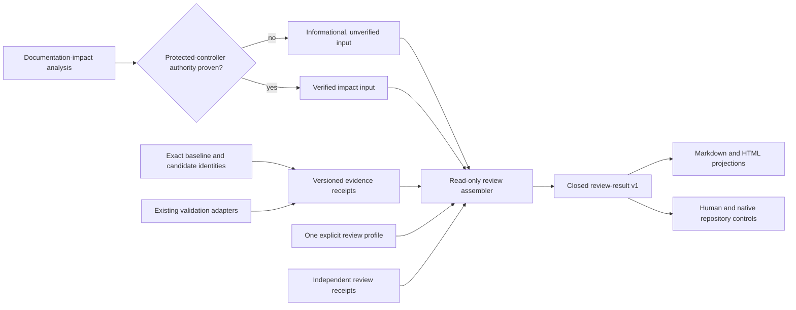

# Completed-work review architecture

| Field | Decision |
| --- | --- |
| Status | Local schema-v1 foundation; not a merge, publication, or deployment authority |
| Primary scope | PocketHive documentation and documentation automation |
| Profile policy | [`completed-work-review-profiles.json`](../ci/completed-work-review-profiles.json) |
| Profile schema | [`completed-work-review-profiles.schema.json`](../ci/completed-work-review-profiles.schema.json) |
| Wire contracts | `tools/completed-work-review/contracts/` |
| Delivery tracker | Repository-only `docs/inProgress/completed-work-review-plan.md` |

This architecture turns exact identities, validation receipts, and independent
review judgments into an evidence-backed comparison. It does not decide
documentation impact, execute product code, grant approval, merge, publish, or
deploy.

Schema v1 is closed. Unknown fields, enum values, profiles, identity modes, and
adapters fail explicitly. There is no `MIXED` profile and no profile, adapter,
identity, or authority fallback.

## 1. Responsibility and flow



| Owner | Authoritative responsibility |
| --- | --- |
| Global Compare Completed Work skill | Review lifecycle, shared scoring scale, regression and readiness rules, report order |
| Documentation-impact analyser | Which documentation, publication validation, and governance actions an exact committed diff implies |
| Validation adapter | Its own measured execution and artifact receipt |
| Completed-work profile | Dimensions, weights, evidence kinds, required gates, reviewer passes, and freshness policy |
| Review assembler | Contract validation, identity binding, arithmetic, blocker propagation, and result construction |
| Report renderer | Deterministic projection of the review result; it makes no decisions |
| Human and repository controls | Approval, merge, publication, and deployment authority |

The assembler consumes documentation-impact output. It must not reimplement its
path inventory, graph, obligation, publication, or governance classification.

## 2. Canonical contracts

`tools/completed-work-review/contracts/values.json` is the single source for
schema v1 enums, limits, canonical repository paths, the evaluator-provenance
blocker ID, and the evaluator-provenance statement. JSON schemas contain
readable projections of those values. `contracts/projections.mjs` rejects
projection drift before data is validated.

| Contract | Purpose |
| --- | --- |
| `candidate-identity.schema.json` | Exact committed candidate or exact dirty-worktree snapshot |
| `evidence-receipt.schema.json` | One measured check or independent reviewer judgment bound to an identity and profile |
| `producer-registry.schema.json` | Explicit producer allow-list, producer digests, evidence kinds, and local authority state |
| `review-request.schema.json` | One explicit profile, identity/evidence paths, scored facts, gates, findings, and output target |
| `review-result.schema.json` | Bound trust-control state, dimensions, Overall, gates, blockers, regressions, gaps, readiness, confidence, and authority boundary |
| `decision-receipt.schema.json` | Advisory human decision bound to an immutable completed-work bundle; never a repository-host decision |

All core fields are required. A fact that is not applicable is represented by
an explicit enum, `null`, or empty collection permitted by its contract; it is
not omitted or inferred.

### 2.1 Candidate identity

The caller must select one mode:

| Mode | Required identity |
| --- | --- |
| `COMMITTED_GIT` | Base and merge-base commits, candidate commit and Git tree, canonical candidate snapshot digest; patch and untracked manifests must be `null`; worktree cleanliness is required when the verification target is `LIVE_WORKTREE` |
| `DIRTY_WORKTREE` | Base and merge-base commits, canonical snapshot digest, tracked-patch digest, untracked-manifest digest, and the path, digest, and byte size of every non-ignored untracked regular file; candidate commit/tree must be `null` |

Every request also declares one verification target. `LIVE_WORKTREE` requires
the live worktree to match the candidate exactly and is mandatory for
`DIRTY_WORKTREE`. `GIT_OBJECT` is allowed only for `COMMITTED_GIT` historical
reviews; it verifies the exact commit/tree objects and reconstructs their patch
without pretending that the historical candidate is checked out. Repository
evidence is data, never an executable adapter. The Git capture adapter rejects
stable repository configuration, attributes, and metadata that could execute
candidate commands or omit captured state.

The dirty mode exists because PocketHive agents normally cannot commit. It is
not treated as equivalent to a committed candidate, and it cannot silently
upgrade publication scope.

Repository evidence, identities, profiles, receipts, and bundle files reject
hard-linked aliases. Runtime executables are different: Git for Windows may
install the core executable with multiple hard links, so Git and Node use the
explicit `ALLOW_STABLE_IDENTITY` policy and remain bound by canonical path,
stable handle capture, externally supplied expected digest, and before/after
checks. There is no implicit policy selection.

The local Git adapter is deliberately narrow. It requires a non-shallow,
complete local object store; rejects promisor packs, object alternates, grafts,
command-bearing local configuration, unbound `info/attributes`, and
worktree-conversion attributes; and uses an attribute-free base with
deterministic diff settings. Dirty/live-worktree capture additionally rejects
submodules, tracked symbolic links, and hidden index flags. Non-ignored
untracked discovery honors only per-directory `.gitignore` files, not
repository-local `info/exclude`. These controls are verified before and after
capture where applicable.

This local process does not claim OS-level isolation from another same-account
process that mutates Git metadata during a Git invocation. Such active local
concurrency remains outside the v1 authority boundary and is one reason the
local evaluator remains `NOT_READY` until a protected launcher/controller is
separately approved.

Candidate identity-object validation and evidence subject matching are separate
checks. Identity-object validation proves that the declared mode is
schema-valid and internally consistent with the recomputed repository snapshot.
`freshness.candidateIdentityMatch` only reports whether every bound receipt's
subject ID matches that already-validated candidate identity ID. A `MATCH` does
not prove that the identity producer or evidence producer was trusted.

The result therefore carries an explicit `trustControl` object. It binds the
producer-registry digest, a stable post-load filesystem snapshot of the review
tool source, and the source-plus-runtime tool digest. It labels registry
authority as either
candidate-controlled and unverified (`CANDIDATE_UNVERIFIED`) or supplied
explicitly by the operator (`OPERATOR_SUPPLIED`). Neither value claims a
protected controller, merge authority, publication authority, or deployment
authority.

`trustControl.evaluatorExecutionProvenance` states the present execution limit
without inference. Its status is `NOT_VERIFIED`, its method is
`POST_LOAD_FILESYSTEM_SNAPSHOT`, and both `executedSourceDigest` and
`controllerAttestationRef` are `null`. The canonical statement is:

> The digest covers a stable filesystem snapshot captured after Node loaded evaluator modules; it does not prove the bytes that executed.

The corresponding material blocker is
`evaluator-execution-provenance-unverified`. A matching source snapshot is
useful for reconstruction and drift detection, but cannot close that blocker or
be described as an executed-source attestation.

### 2.2 Evidence receipt

Each receipt binds:

- the subject identity and complete profile digest;
- producer ID, version, and digest;
- one explicit execution kind and adapter;
- sanitized entrypoint arguments and whether official ingress was used;
- `PASS`, `FAIL`, `SKIP`, `ERROR`, or `TIMEOUT`;
- exact artifact digests and structured observations;
- a UTC creation time.

Evidence adapters are closed in v1. A missing adapter is a configuration error,
not a reason to run another command. PocketHive runtime checks must use the
official ingress/API contract. Static checks and independent document review
state `officialIngress: false` because ingress is not applicable to those
executions.

Producer-registry authority is exact, not ambient:

- a registry inside the candidate repository must declare
  `CANDIDATE_UNVERIFIED`; it can describe expected producers and receipts but
  cannot establish trust for any receipt;
- an external registry may declare `OPERATOR_SUPPLIED`, but each trusted
  receipt still requires one exact `receiptAuthorizations` entry matching that
  receipt's `receiptId`, `evidenceId`, and `producer.id`;
- the authorized producer ID and digest, adapter, execution kind, evidence kind,
  exact gate/check/configuration tuple, reviewer ID, profile digest, and
  tool-source digest must also match the closed registry and receipt contracts;
- a receipt timestamp must be on or after its bound subject-identity capture
  and on or before the operator registry's generation time.

There is no registry-wide “trust all receipts” interpretation. An omitted or
mismatched receipt authorization remains untrusted and cannot unlock a required
gate.

Freshness reports these trust checks separately:

- `candidateIdentityMatch` binds candidate/review receipt subjects to the
  verified candidate identity;
- `producerAuthorizationMatch` reports exact registry authorization of the
  bound receipt/evidence/producer tuples;
- `toolSourceSnapshotMatch` reports equality with the registry-pinned stable
  post-load review-tool source snapshot digest;
- `profileIdentityMatch` reports equality with the bound profile digest.

The previous generic “tool identity match” label is intentionally not used;
source authorization and runtime-inclusive tool identity are distinct facts.

### 2.3 Review result

The result keeps these decisions independent:

- `comparisonStatus`: `IMPROVED`, `DECREASED`, `UNCHANGED`, or `UNVERIFIED`;
- `readinessVerdict`: `READY` or `NOT_READY` for the declared verdict scope;
- `publicationBoundary`: the maximum verified scope plus externally evidenced
  merge, publication, and deployment authority;
- canonical confidence and freshness, which describe evidence quality rather
  than product quality;
- `submittedConfidence`, which preserves the request assertion only as an
  audit-only quarantined value and cannot drive the canonical confidence label,
  readiness, or verdict.

A result also contains structured gates, open/resolved blockers, regressions,
remaining gaps, unlock requirements, independent-review state, and an evidence
manifest digest. Report views must render these fields; they must not
recalculate or reinterpret them.

Request-submitted dimension values remain visible only in the quarantined
`submittedBaseline`, `submittedCurrent`, `submittedDelta`,
`submittedComparisonStatus`, and `submittedOverall` audit fields. The canonical
dimension and Overall fields stay `null` / `UNVERIFIED` unless trusted passing
receipt score attestations verify the exact values. Submitted values are never
an alternate scorecard and cannot contribute to readiness or the verdict.

Canonical confidence is assembled from fresh, externally authorized,
identity-bound evidence used by required gates. It is `HIGH` only when score
evidence is verified and no required gate is unverified; incomplete but fresh
and score-verified gate coverage is at most `MEDIUM`; all other states are
`LOW` with generated limitations. Request confidence is never promoted.

Independent-review state is derived only from trusted passing evidence-receipt
claims (`claims.independentReview`). Reviewer IDs and pass kinds are not
request-side assertions, and a request cannot declare or promote independent
review status.

Every bundle also carries the exact tracked reconstruction patch, every
untracked candidate byte, a reconstruction manifest, and every reviewer-source
file bound by the post-load `toolSourceDigest` snapshot. This lets a blind
recipient inspect the exact candidate delta and the retained evaluator-source
snapshot after the live workspace is unavailable. It does not establish that
those source bytes were the bytes Node executed. The bundle remains an
integrity and inspection artifact, not semantic re-execution or protected
repository authority.

## 3. Initial PocketHive profiles

The first release contains exactly two non-composable profiles.

| Profile | Dimensions and weights | Independent passes |
| --- | --- | --- |
| `POCKETHIVE_DOCUMENTATION_V1` | Orientation, actionability, correctness, safety, and navigation/visual usability at 20% each | Novice, expert, UX |
| `POCKETHIVE_DOCS_AUTOMATION_V1` | Correctness, determinism, trust-boundary safety, maintainability, and operational readiness at 20% each | Expert, security |

Every dimension is an explicit required `SCORE`, uses
`HIGHER_IS_BETTER`, declares its accepted evidence kinds, and participates in
an exact 100% equal-weight total. Both profiles use `ANCHORED_RUBRIC_V1`: every
dimension declares one digest-bound criterion and the complete ordered `0`,
`5`, and `10` anchor set. The review result, scorecard, Markdown, and HTML carry
the same method, criterion, and anchors so a recipient never has to infer which
rubric produced a score. A change that spans both domains runs both profiles
and produces two results. Scores from unlike profiles are never averaged.

Both initial profiles produce `LOCAL_CANDIDATE` readiness only. Extending a
profile to merge, publication, or deployment is a contract change with its own
required authority and evidence. It cannot be inferred from a strong local
score.

The documentation profile also requires an explicit search and AI-discovery
impact result. Indexing, canonical routes, crawler directives, structured data,
server-rendered content, internal-link context, and truthful public claims are
reported separately from the five-score rubric. Unsupported indexing, ranking,
citation, traffic, or model-inclusion outcomes remain unverified.

## 4. Scoring and fail-closed rules

Verified scores use the Compare Completed Work `0.0` to `10.0` scale and are
stored to one decimal place. Canonical Overall is the weighted mean of the
verified displayed dimension scores. Delta is candidate minus baseline.
Request-provided values are retained separately as submitted audit inputs.

For `ANCHORED_RUBRIC_V1`, a scorer evaluates the exact bound criterion against
the retained evidence, uses `0`, `5`, and `10` as the explicit deficient,
partial, and complete reference states, and may select an intermediate
one-decimal value only when the receipt or a bound artifact explains the
evidence-based position between anchors. Anchors are not ambient reviewer
guidance: changing a criterion or anchor changes the profile digest and
invalidates receipts created for the previous rubric. The assembler does not
invent, interpolate, or normalize reviewer scores.

The assembler must enforce these rules:

1. A missing required baseline or current score makes comparison
   `UNVERIFIED`; a missing required current score also creates a material open
   blocker and makes readiness `NOT_READY`.
2. Every required gate must be `VERIFIED`. `FAILED` and `NOT_VERIFIED` are
   distinct and both block readiness when the gate is required.
3. `FAIL`, `SKIP`, `ERROR`, and `TIMEOUT` are retained exactly. They are never
   normalized into `PASS` or silently retried through another adapter.
4. Any open material blocker makes readiness `NOT_READY`, regardless of score.
5. A decreased dimension creates a regression entry. Its disposition must be
   `FIXED`, `ACCEPTED_TRADE_OFF`, or `BLOCKER`.
6. Stale evidence, candidate-subject mismatch, producer-authorization mismatch,
   tool-source-snapshot mismatch, or profile-digest mismatch makes the
   dependent gate `NOT_VERIFIED`.
7. A dimension with `scoreStatus: NOT_VERIFIED` exposes `N/V` canonical scores
   and `UNVERIFIED` canonical comparison status. Its submitted values remain in
   the quarantined audit projection only, and canonical Overall is likewise
   `N/V` / `UNVERIFIED`.
8. Confidence follows the shared bands: high `0.85-1.00`, medium `0.60-0.84`,
   and low `0.00-0.59`. The label and value must agree.
9. The result scoring method, every dimension criterion, and every ordered
   score anchor must equal the selected profile exactly; projection drift or
   anchor reordering fails closed.
10. The local v1 evaluator reports execution provenance as `NOT_VERIFIED` and
    emits the material `evaluator-execution-provenance-unverified` blocker. A
    post-load digest match cannot promote this status or make readiness
    `READY`.

The assembler is the one result calculator. Markdown, HTML, CI annotations,
and future MCP views are read-only projections.

Closing evaluator execution provenance is future protected-controller work. A
trusted launcher must authenticate its policy and evaluator inputs before any
candidate-controlled evaluator module is loaded, launch the pinned evaluator
under that policy, and emit an externally verifiable attestation bound to the
executed-source digest, controller identity, result, and candidate identity.
That launcher requires a new explicit contract state; the local
`POST_LOAD_FILESYSTEM_SNAPSHOT` method must never auto-upgrade or fall back to
it.

## 5. Documentation-impact authority

Documentation-impact input declares one of three states:

| State | Meaning |
| --- | --- |
| `NOT_SUPPLIED` | The review makes no documentation-impact completeness claim |
| `INFORMATIONAL_UNVERIFIED` | Local output may inform findings but cannot prove obligation, publication, or governance completeness |
| `PROTECTED_CONTROLLER_VERIFIED` | A trusted controller proved that tool, schema, policy, lockfile, repository, Git, and runtime identities came from the protected authority |

The present local documentation-impact foundation is
`INFORMATIONAL_UNVERIFIED`. A passing local analysis cannot be relabelled as
protected evidence. The completed-work reviewer records this limitation; it
does not compensate by reclassifying changed paths.

## 6. Output and authority boundary

The intended ignored output is:

```text
.test-results/completed-work-review/<review-id>/
  candidate-identity.json
  evidence-manifest.json
  review.json
  scorecard.json
  readiness.json
  report.md
  index.html
  bundle.sha256
  inputs/
    review-request.json
    producer-registry.json
  evidence/
```

The evidence manifest records both the raw-file hash and canonical digest for
the review request and producer registry, and the bundle contains canonical
copies under `inputs/`. Every output file is bound by digest. A future decision receipt may record a
human choice, but remains advisory. Native GitHub review, CODEOWNERS, release
controls, and deployment systems remain authoritative.

## 7. Edenred reuse boundary

The reusable layer is limited to candidate identity, evidence receipts,
score/result contracts, profile loading, arithmetic, blocker propagation, and
report rendering. Each Edenred application owns explicit profiles and adapters
for its ingress, contracts, protected paths, security roles, package formats,
and deployment identities.

PocketHive-specific adapters include documentation validation,
documentation-impact consumption, Docusaurus rendering, package/image checks,
PocketHive MCP evidence, `build-hive.sh`, and HiveForge deployment evidence.
They must not become defaults for another repository. A sibling application
that adopts the core must declare its own profile and adapters without a
PocketHive fallback.

## 8. Run locally

### Capture a v2 identity

Create identity files only under the ignored `.test-results` tree. The output
must be an absolute, repository-contained, Git-ignored path that does not
already exist, and its direct non-link parent directory must already exist.
On Git for Windows, `--git-executable` must name the core
`mingw64/bin/git.exe`, not either delegating `bin/git.exe` or `cmd/git.exe`
shim. `--git-executable-sha256` is a mandatory lowercase digest obtained from a
trusted external channel and is checked from a stable file handle before the
first Git command. For a committed candidate, replace all placeholders with
exact values:

```text
node tools/completed-work-review/cli.mjs capture-identity --repo "<absolute-repository-root>" --git-executable "<absolute-git-executable>" --git-executable-sha256 "<trusted-git-executable-sha256>" --output "<absolute-repository-root>/.test-results/completed-work-review/identities/<identity-name>.json" --repository-id "sepa79/PocketHive" --remote-name "origin" --remote-url "https://github.com/sepa79/PocketHive.git" --mode "COMMITTED_GIT" --base-commit "<full-base-commit>" --candidate-commit "<full-candidate-commit>" --captured-at "<UTC-timestamp>"
```

For an exact dirty-worktree snapshot, omit `--candidate-commit` and declare the
mode explicitly:

```text
node tools/completed-work-review/cli.mjs capture-identity --repo "<absolute-repository-root>" --git-executable "<absolute-git-executable>" --git-executable-sha256 "<trusted-git-executable-sha256>" --output "<absolute-repository-root>/.test-results/completed-work-review/identities/<identity-name>.json" --repository-id "sepa79/PocketHive" --remote-name "origin" --remote-url "https://github.com/sepa79/PocketHive.git" --mode "DIRTY_WORKTREE" --base-commit "<full-base-commit>" --captured-at "<UTC-timestamp>"
```

Both commands bind the absolute repository and exact Git adapter path and
digest, repository ID, remote name and URL, mode, base commit, capture time, and
output. The expected Git digest must not be copied from the candidate identity
or another candidate-controlled file. Committed mode also requires the exact
candidate commit; dirty-worktree mode forbids it. The CLI writes a canonical
candidate-identity-v2 file and refuses to overwrite an existing path.

Assembly verification is role-specific. A `COMMITTED_GIT` identity used as the
candidate must equal repository `HEAD`, and the non-ignored live worktree must
have no tracked patch or untracked files relative to that commit. This prevents
an old committed object from standing in for the live candidate. Committed
baseline and deployment identities are verified as exact repository objects but
do not have to equal the live worktree. A `DIRTY_WORKTREE` candidate remains an
exact live snapshot and cannot be used as a baseline.

### Assemble a review

The current schema-v1 assembler requires all routing paths explicitly. The
review request itself must be a direct, non-link file inside the repository;
the producer registry may be external when it declares `OPERATOR_SUPPLIED`.
From the repository root, replace every placeholder with an absolute path:

```text
node tools/completed-work-review/cli.mjs assemble --repo "<absolute-repository-root>" --request "<absolute-review-request.json>" --request-schema "<absolute-review-request.schema.json>" --producer-registry "<absolute-producer-registry.json>" --producer-registry-schema "<absolute-producer-registry.schema.json>" --git-executable "<absolute-git-executable>" --git-executable-sha256 "<trusted-git-executable-sha256>" --repository-id "sepa79/PocketHive" --remote-name "origin" --remote-url "https://github.com/sepa79/PocketHive.git" --evaluation-time "<current-UTC-timestamp>" --producer-registry-digest "<trusted-producer-registry-sha256>" --candidate-identity-id "<trusted-candidate-identity-id>" --baseline-identity-id "<trusted-baseline-identity-id-or-NONE>" --deployment-identity-id "<trusted-deployment-identity-id-or-NONE>"
```

For the retained PR 511 migration, point `--request` at
`<absolute-repository-root>/tools/completed-work-review/fixtures/pr-511/request.json`
and `--request-schema` at
`<absolute-repository-root>/tools/completed-work-review/contracts/review-request.schema.json`.
Point `--producer-registry-schema` at
`<absolute-repository-root>/tools/completed-work-review/contracts/producer-registry.schema.json`.
The request declares its profile, identity, evidence, contract, and output
paths; the other flags bind the repository, request schema, producer registry,
producer-registry schema, and exact externally digest-pinned Git executable
without inference. The
request output path must be ignored by Git and must not already exist; the
assembler will not overwrite a prior bundle. Its direct non-link parent must
already exist so directory creation is never inferred during publication.

All fifteen assemble settings are required. The first six are absolute paths;
the remaining values explicitly bind the PocketHive repository, evaluation
time, producer registry, and candidate/baseline/deployment identities. Use the
literal `NONE` only when the request intentionally has no baseline or deployment
identity.

The expected Git-executable digest, producer-registry digest, and identity IDs
must come from a trusted external channel, not from the candidate-controlled
request, registry, identity files, or generated bundle. The evaluation time
must be current trusted UTC time. These independent pins prevent candidate
files from authorizing themselves.

### Verify a bundle

Verification also requires an independently obtained expected bundle digest:

```text
node tools/completed-work-review/cli.mjs verify --bundle "<absolute-bundle-directory>" --expected-digest "<trusted-expected-bundle-sha256>"
```

A successful check reports `EXPECTED_DIGEST_MATCH`. Reading the expected digest
from `bundle.sha256` inside the bundle would only prove internal consistency and
does not satisfy this external pin.

This is the current local invocation and may evolve when an approved protected
controller is designed. No protected-controller, GitHub decision, publication,
or deployment authority is implied by running it.

## 9. Deliberate exclusions

Schema v1 does not authorize:

- GitHub workflow, ruleset, CODEOWNERS, security, or protected-contract changes;
- intentional candidate code execution by the review assembler; active
  same-account mutation requires the future protected launcher boundary;
- merge, publication, deployment, or production mutation;
- automatic documentation writing;
- heuristic profile selection or adapter switching;
- treating reviewer judgment as measured evidence;
- treating local documentation-impact output as protected authority.

Those capabilities require separate architecture, approval, and evidence.
