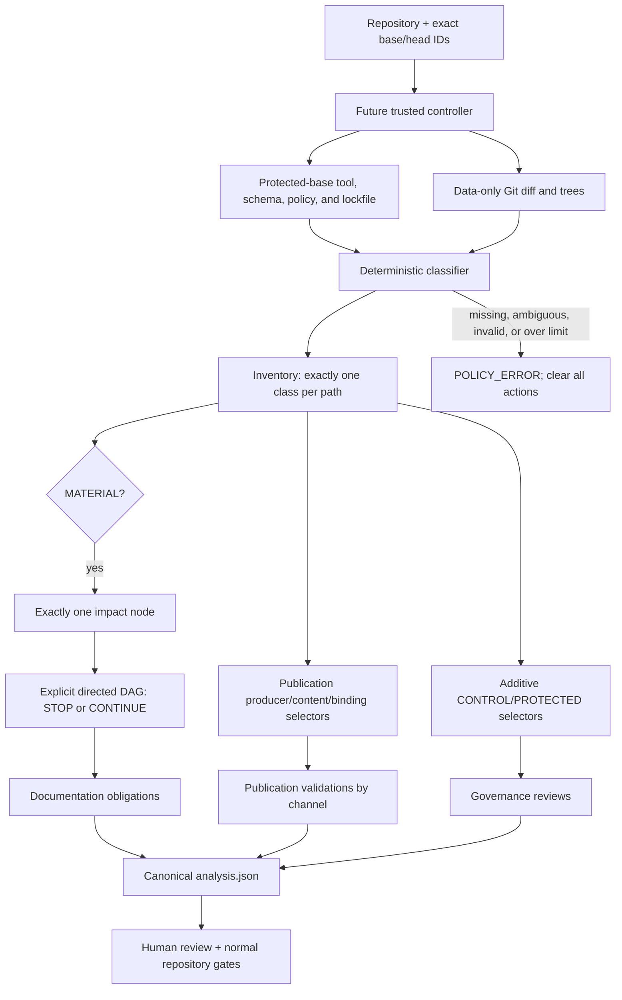

# Documentation impact automation architecture

| Field | Decision |
| --- | --- |
| Status | Proposed schema-v2 architecture with an unmerged local foundation implementation |
| Mode | `SHADOW` only; no workflow, check, or enforcement is enabled |
| Scope | All PocketHive repository paths, applications, services, workers, shared contracts, delivery surfaces, documentation channels, and their declared integration seams |
| Architecture authority | This page owns only the documentation-impact automation design |
| Policy candidate | `docs/ci/docs-impact-map.yaml` |
| Implementation candidate | `tools/docs-impact/` |
| Delivery tracker | `docs/inProgress/automated-documentation-foundation-plan.md` |
| Merge status | Blocked; the candidate is not protected-base authority and cannot yet be merged or promoted |

This analyser answers which documentation, publication, and governance actions
need review for an exact Git base/head comparison. It does not write
documentation, decide that prose is correct, approve a pull request, or replace
normal Edenred/PocketHive security, ownership, testing, and release controls.

Schema v2 is intentionally incompatible with the former flat schema-v1 pilot.
There is no fallback from v2 to v1.

## 1. Architecture in one view



The three action lanes are independent:

| Lane | Trigger | Output | What it does not prove |
| --- | --- | --- | --- |
| Documentation impact | A material or canonical-document source reaches a rule through an explicit node/edge route | `documentationObligations[]` | That the changed documentation is correct |
| Publication impact | A changed path matches a protected publication producer, content input, or registered document binding | `publicationValidations[]` | That an artifact was built or inspected |
| Governance impact | A changed path matches one or more protected/control selectors | `governanceReviews[]` | That approval was granted |

No lane suppresses another. A single change may produce all three.

## 2. Trust boundary

The non-negotiable security invariant is:

> No component may both execute pull-request-controlled content and possess
> repository authority.

The classifier is data-only. It reads committed Git objects, parses protected
schema/policy data, and emits canonical JSON. It does not execute candidate
MDX, npm scripts, Maven plugins, shell files, containers, or package producers.

A future authoritative controller must:

1. create a pristine repository and own its Git metadata;
2. pin the repository identity, full base/head commit IDs, and merge base;
3. load the executable, schemas, policy, and dependency lockfile from the
   protected base, never from the candidate tree;
4. use an administrator-selected absolute Git executable outside the analysed
   repository;
5. reject shallow history, alternates, promisor configuration, grafts, replace
   objects, hooks, object corruption, invalid UTF-8, ambiguous paths, and
   incomplete history without fetching;
6. bind tool, policy, repository, Git, and runtime identities into the result;
7. have no repository-write credential.

Candidate-controlled validation may be added only in a later disposable,
secret-free, network-denied sandbox. Its evidence must be written by a trusted
outer process after the sandbox exits.

## 3. Policy model

### 3.1 Inventory

Every current base, merge-base, and head path resolves to exactly one class:

| Class | Meaning |
| --- | --- |
| `MATERIAL` | The path can change a PocketHive contract, application, integration, delivery result, or documentation system and must resolve to one impact node |
| `DOCUMENTATION` | The path is documentation; it may resolve to zero or one impact node, and publication/governance selectors still apply independently |
| `NO_DOC_IMPACT` | The exact reviewed path has no impact node; publication or governance selectors may still require action |

There is no catch-all impact node. An unclassified path, overlapping inventory
rules, or a material path with zero or multiple nodes is `POLICY_ERROR`.

### 3.2 Components and impact nodes

A component gives a stable owner and kind to one or more exact impact nodes.
Nodes own path selectors and explicitly partition all four change kinds between
`evaluateChangeKinds` and `noDocumentationChangeKinds`.

The candidate represents these PocketHive areas:

| Area | Components |
| --- | --- |
| Customer and authoring apps | UI, MCP server, VS Code extension, Docusaurus site, TCP Mock |
| Platform services | Auth, Scenario Manager, Network Proxy Manager, Orchestrator, Swarm Controller |
| Workers | Generator, Moderator, Request Builder, Processor, HTTP Sequence, DB Query, Postprocessor, Clearing Export, Trigger |
| Shared contracts and adapters | Lifecycle, scenario/SUT, capabilities, control plane, WorkItem/Worker SDK, auth, topology, templating, request templates, observability, persistence, Docker/manager adapters |
| Infrastructure | RabbitMQ, Grafana, ClickHouse, HAProxy/Toxiproxy, WireMock, scenario catalogue |
| Delivery and control | Local delivery, managed delivery, UI ingress/image delivery, repository build/generators, CI workflows, client integrations, local development environment |
| Focused tools | Auth proving, diagnostics, documentation validation/automation, scenario migration/templating, container tooling, outcome storage |

Selectors must be split when one broad directory contains responsibilities with
different documentation effects. Current examples are the separate UI runtime
and UI delivery nodes, the separate local-development node, and WireMock code
selectors that exclude its own README.

### 3.3 Directed integration graph

Every edge declares:

- one provider node;
- one consumer node;
- one relation type;
- an explicit `STOP` or `CONTINUE` decision covering each of `ADD`, `MODIFY`,
  `DELETE`, and `TYPE_CHANGE` exactly once.

`STOP` reaches the destination and ends that route. `CONTINUE` permits another
declared hop. There is no default and no edge inferred from a Maven dependency,
npm import, HTTP client, AMQP binding, naming similarity, or architecture
diagram.

When two routes reach the same node, the direct route wins; otherwise the
shortest route and then lexicographically smallest edge-ID sequence wins.
Rules must explicitly opt into `SELF`, `DIRECT`, or `TRANSITIVE` depth.

Safety rule for review: contract/projection edges may continue when the same
public contract is re-exposed. Implementation, runtime, API-client,
observability, and tool-adapter edges should stop unless evidence proves that
the destination re-exposes that exact concern. The live candidate still has
continuing non-contract edges that require gold labels before merge.

### 3.4 Documentation obligations

Each documentation rule names exact source nodes/depths/change kinds, target
documents, checks, and owners. A target is satisfied as candidate-change
evidence only by `MODIFY`; deleting a required target is a policy error and can
never satisfy an obligation.

The source path that triggered a rule cannot satisfy a target inside its own
source selector. This prevents a README or contract edit from proving its own
required update.

Document and publication ownership is closed: every rule must include all
trigger-component owners, target-document owners, publication owners, and
their fixed check IDs.

## 4. Publication model

Publication is a separate concern from upstream documentation impact. A new
page can require a channel build even before it has a document registry ID, and
a package producer can change without changing prose.

Each publication declares:

| Field | Meaning |
| --- | --- |
| `kind` | Repository, docs site, package, or client configuration |
| `locatorKind` | The path grammar for that channel, such as Docusaurus route, archive entry, npm path, VSIX path, classpath resource, or image filesystem path |
| `contentRoot` | Physical root inside the destination |
| `artifactSelector` | The artifact/build output to inspect later |
| `producerPaths` | Protected files that create or select the channel |
| `contentInputPaths` | Protected source selectors whose changes require channel validation, including future additions under declared prefixes |
| document binding | Optional exact source-document to route/artifact-path evidence |
| `checkIds` and `ownerIds` | Fixed future validation stage and accountable owners |

Publication validation is channel-scoped. One action is emitted per affected
publication and aggregates deterministic triggers with these reasons:

- `CONTENT_INPUT` - the changed path is consumed by the channel;
- `PRODUCER_INPUT` - the changed path controls the channel build/package;
- `DOCUMENT_BINDING` - the changed registered document has an exact destination
  binding.

An unregistered new file can therefore have an empty `documentBindings` array
and still require validation. Matching does not depend on the impact graph or
inventory class.

### 4.1 Declared publication channels

| ID | Locator | Destination/root | Current manifest posture |
| --- | --- | --- | --- |
| `repository` | `REPOSITORY_PATH` | exact protected head tree | Registered documents plus repository documentation content selectors |
| `docs-site` | `DOCUSAURUS_ROUTE` | `docs-site/build`, routes rooted at `/` | All 46 currently published source pages are bound; future included paths trigger by selector |
| `ui-image-docs` | `IMAGE_FS_PATH` | GHCR UI image, site served below `/docs/` | Trigger-only declaration: UI Dockerfile/workflow plus docs/docs-site inputs require validation; exact image-file bindings wait for artifact inspection |
| `deployment-archive-posix` | `ARCHIVE_ENTRY` | `pockethive/` in the versioned tarball | All 16 current source Markdown files are bound; copied material and producer changes trigger validation |
| `deployment-archive-windows` | `ARCHIVE_ENTRY` | `pockethive/` in the versioned zip | All 5 current source Markdown files are bound; copied material and producer changes trigger validation |
| `pockethive-mcp-npm` | `NPM_PACKAGE_PATH` | `package/` in the npm tarball | All 3 current packaged Markdown files are bound; package source/producer changes trigger validation |
| `pockethive-vscode-vsix` | `VSIX_EXTENSION_PATH` | `extension/` in the VSIX | README is bound; extension source/producer changes trigger validation |
| `tcp-mock-jar-docs` | `CLASSPATH_RESOURCE` | `BOOT-INF/classes/docs/` | All 15 TCP docs are bound |
| `tcp-mock-image-docs` | `IMAGE_FS_PATH` | `/app/docs/` in the GHCR runtime image | All 15 TCP docs are bound |

The generated POSIX and Windows `DEPLOY.md` files have no source-document
binding because the scripts generate them. Producer changes now trigger the
archive channels, but only later artifact checks can prove generated content
and Windows/POSIX parity.

`producerPaths`, `contentInputPaths`, locators, and selectors are declarations.
They are not evidence that an artifact was built. Every publication check is
currently `PLANNED`.

The standalone `docs-site` channel treats its Pages workflow, Docusaurus
configuration, package/lockfile, type configuration, rendered-route checker,
source components/styles, and static assets as producer or content inputs. The
UI image has no source-document bindings yet because the build transforms routes
into generated files below `/usr/share/nginx/html/docs/`; AD-01D must inspect
that actual filesystem before exact bindings can be approved.

## 5. Result contract

The closed result contains three action arrays:

```json
{
  "classification": "ACTION_REQUIRED",
  "documentationObligations": [],
  "publicationValidations": [
    {
      "actionType": "PUBLICATION_VALIDATION",
      "publicationId": "docs-site",
      "triggers": [
        {
          "path": "docs/guides/new-page.md",
          "changeKind": "ADD",
          "triggerKinds": ["CONTENT_INPUT"],
          "documentBindings": []
        }
      ],
      "candidateState": "ACTION_REQUIRED"
    }
  ],
  "governanceReviews": []
}
```

| Classification | Meaning |
| --- | --- |
| `NO_ACTION_REQUIRED` | Evaluation succeeded and all three action arrays are empty; this is not merge approval |
| `ACTION_REQUIRED` | At least one documentation, publication, or governance action exists |
| `POLICY_ERROR` | A safe answer cannot be derived; all authoritative action arrays are empty |

Every action ID is a canonical digest bound to the exact analysis identity and
action payload. Output is deterministic and bounded before allocation or
hashing.

## 6. PocketHive integration review

The graph must cover these evidence families without assuming that every
runtime dependency propagates documentation:

| Family | Providers | Direct consumers/projections |
| --- | --- | --- |
| Lifecycle | lifecycle schema, Java model, TypeScript projection | Orchestrator, Controller, UI, VS Code, worker lifecycle handling |
| Scenario/SUT | scenario schemas, model, validation, templating | Scenario Manager, Orchestrator, Network Proxy Manager, UI, MCP, VS Code, relevant workers/tools |
| Control plane and WorkItem | AsyncAPI/events, control modules, Worker SDK | Orchestrator, Controller, all nine workers, UI/MCP projections |
| Authentication | auth API/contracts/client and worker auth integration | Auth Service, managers, UI, MCP, exact auth-capable workers |
| Service APIs | Auth, Scenario Manager, Network Proxy Manager, Orchestrator | direct UI/MCP/VS Code clients and only proven re-exposures |
| Runtime orchestration | Orchestrator and Controller | compute/topology adapters and nine workers |
| Messaging | RabbitMQ/control topology | Controller, workers, UI diagnostics, MCP diagnostics |
| Observability | telemetry, journal, ClickHouse | services/workers, UI Journal, MCP evidence, Grafana |
| Test/SUT adapters | WireMock and TCP Mock | authoring/MCP projections; each adapter retains its own docs |
| Delivery | Compose, HiveForge, package scripts, ingress, image workflows | operator docs plus affected publication channels |

Evidence-backed fixes already made during this review include:

- an explicit Network Proxy Manager to UI edge;
- local development separated from MCP/client configuration;
- UI runtime separated from UI ingress/image delivery;
- WireMock implementation mapped to WireMock's packaged README instead of TCP
  Mock documentation;
- MCP-owned documentation separated from the downstream VS Code projection;
- `.amazonq/agents/default.json`, `.amazonq/rules/**`, RabbitMQ,
  `.devcontainer/devcontainer.json`, and UI ingress protected explicitly;
- lifecycle/scenario generator scripts represented as exact sources.

## 7. Fail-closed invariants

Schema and semantic validation reject:

- incomplete or overlapping inventory and impact-node coverage;
- duplicate, dangling, cyclic, self, or change-kind-incomplete edges;
- an evaluated node/change kind with no matching documentation decision;
- unknown or duplicate owner, check, component, node, document, publication,
  rule, or protection references;
- unsafe repository paths, routes, image paths, content inputs, producers, or
  ambiguous publication destinations;
- a document binding outside its publication content inputs;
- a required document missing in the protected base or candidate head;
- a target that can point back into its own triggering source selector;
- malformed Git identity/history/object/path data;
- route, trigger, action, policy, tree, path, error, or output limits above the
  canonical bounds.

On any policy error, documentation obligations, publication validations, and
governance reviews are cleared.

## 8. Stress-test result and remaining gates

The candidate currently covers all 2,042 non-ignored candidate paths exactly
once and declares 68 components, 71 impact nodes, 110 directed edges, 95
registered documents, 40 documentation rules, 12 protection rules, and 9
publication channels. These counts describe the local review candidate, not an
approved architecture.

The following issues block merge and authoritative shadow execution:

1. **Edge provenance and exclusions.** The Maven reactor exposes dependency
   relationships that are not all represented as impact edges. Conversely,
   several non-contract edges still use `CONTINUE`. Each seam needs a human
   gold label: add an exact edge, record a reviewed exclusion, or split a broad
   implementation node from its public contract.
2. **Document impact disposition.** Forty-four registered publication documents
   are not upstream rule targets. Some are intentional index/changelog/package
   validation only; others, including scenario, quickstart, moderator, SUT, and
   Worker SDK guidance, likely need exact upstream mappings. The schema must
   record `TARGETED` versus `VALIDATION_ONLY` explicitly before approval.
3. **Publication checks.** All 17 checks are `PLANNED`. Docusaurus static
   validation has passed locally, but package/JAR/image checks are not wired as
   trusted evidence. VSIX packaging is currently blocked by stale generated
   lifecycle output.
4. **Generated/parity content.** POSIX and Windows package scripts generate
   different `DEPLOY.md` content, and `HIVEFORGE.md` is Windows-only. Owners
   must approve the difference or move generation to reviewed canonical
   sources.
5. **Documentation authority conflicts.** Checked-in MCP client/plugin pages
   disagree on stdio versus HTTP authority; UI Help links `main` while the
   runtime provides version-matched `/docs/`; legacy `docs/index.md` and plugin
   authority claims need disposition; HTTP Sequence and DB Query lack focused
   README entry points.
6. **Trust and ownership.** The protected controller/runtime, Linux/Windows
   parity, independent reviewer identities, and one-time protected bootstrap
   are not implemented or approved.

Until these gates close, the safe outcome is a local foundation candidate and
review artifact only. No merge, push, workflow, check, model writer, MCP
adapter, publisher, or repository-ruleset change is authorized by this design.
