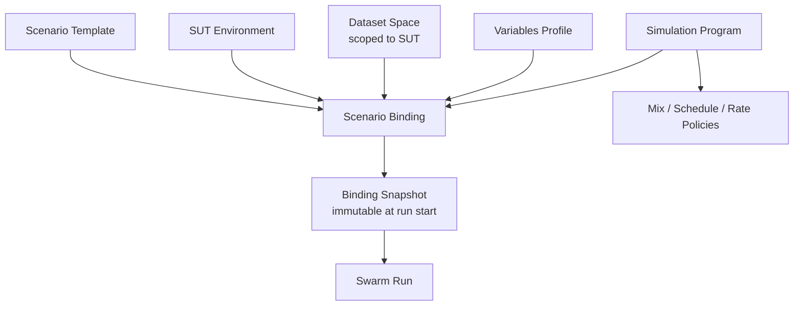
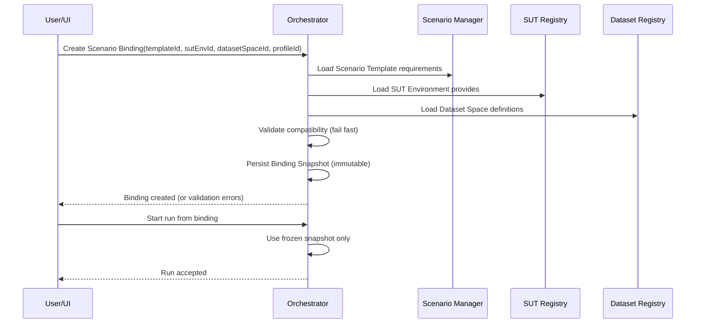
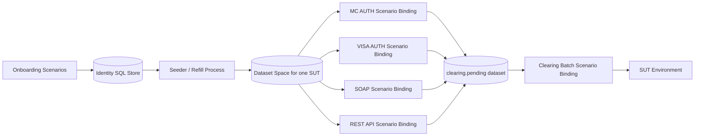

# SUT, Dataset Space, and Simulation Program Model (Proposal)

## 1) Purpose

Define a high-level model that separates:

- reusable scenario logic,
- SUT-specific runtime contracts,
- shared datasets used by many swarms,
- and multi-scenario orchestration for long-running production simulation.

This proposal is intentionally design-level (no implementation details, no storage/API lock-in yet).

---

## 2) Problem Statement

Current model couples SUT and scenario too tightly for production-simulator use cases:

- A dataset is shared across many scenarios and runs for long periods (days/weeks).
- SUT is currently treated as scenario-local context.
- This creates friction when multiple scenarios (onboarding, channel traffic, stress, clearing/batch)
  must use the same data pools for the same SUT environment.

Operationally, we need:

- one SUT-scoped data space reused by many scenario runs,
- strict compatibility checks (no implicit fallback),
- and a way to run many scenario bindings as one simulation program.

---

## 3) Design Principles

1. `Scenario Template` is pure behavior and routing logic.
2. `SUT Environment` owns endpoint/capability contract.
3. `Dataset Space` is bound to SUT Environment, not to a single scenario.
4. Runtime always uses an immutable `Binding Snapshot` (frozen at start).
5. No implicit compatibility or cascading defaults; bind/start fails fast.
6. Single source of truth per concern:
   - scenario requirements in scenario template contract,
   - SUT capabilities in SUT environment contract,
   - dataset registry in dataset space contract.
7. Support two explicit SUT sourcing modes:
   - `global` SUT Environment (shared/governed),
   - `scenario-local` SUT definition (portable/low-entry mode).
   Both modes must pass the same compatibility validator.
8. `Simulation Program` mode is stricter:
   - only bindings using `global` SUT source are allowed.
   - `scenario-local` SUT is allowed only for standalone (non-simulation) runs.
9. `Simulation Program` scope is single-SUT only.
   Multi-SUT orchestration is out of scope for this model.
10. Organization policy may disable one SUT source mode (`global` or `scenario-local`) per deployment.

---

## 4) Proposed Domain Model

## 4.1 Core Concepts

1. `Scenario Template`
   - Reusable workflow/template logic.
   - Declares required capabilities and variables, but not concrete SUT endpoints.

2. `SUT Environment`
   - Concrete runtime target.
   - Declares provided endpoint capabilities, protocol support, contract versions, and variable profiles.

3. `Dataset Space`
   - SUT-scoped shared data namespace.
   - Contains dataset definitions and state pools used by many scenarios/swarms.

4. `Scenario Binding`
   - Validated link: `Scenario Template` + `SUT Environment` + `Dataset Space` + variable profile.
   - Produces a frozen, versioned runtime snapshot.

5. `Simulation Program`
   - Group of scenario bindings with scheduling/mix/rate policies.
   - Represents one production-simulation campaign (onboarding + traffic + stress + batch).

6. `SUT Source Mode`
   - `global`: binding references a registered `SUT Environment` id.
   - `scenario-local`: scenario bundle carries its own SUT definition used to build the binding snapshot.
   - Validation and runtime behavior are the same after snapshot creation.

## 4.2 Relationship Diagram



---

## 5) Compatibility Contract Model

Compatibility is explicit and validated before run creation.

## 5.1 Scenario Template declares `requires`

Example requirement categories:

1. Logical endpoints (for example `auth`, `clearingUpload`, `soapCustomerOps`).
2. Protocol and contract version constraints per endpoint.
3. Required variable keys with type/format constraints.
4. Required feature flags/capabilities.

## 5.2 SUT Environment declares `provides`

1. Concrete endpoint map for logical endpoint ids.
2. Protocol/contract version implemented.
3. Available variable profiles.
4. Supported feature flags/capabilities.

In `scenario-local` mode, the same `provides` structure is loaded from the scenario bundle
instead of a global registry entry.

## 5.3 Dataset Space declares `datasets`

1. Dataset ids, aliases, and state pools.
2. Ownership and usage constraints (which scenario roles can read/write).
3. Dataset-level schema/shape metadata for validation.

## 5.4 Binding Validator result

`Scenario Binding` can be created only if all checks pass:

1. every `requires.endpoint` has a matching `provides.endpoint`,
2. protocol/version constraints match,
3. all required variables are present and valid,
4. all referenced datasets/aliases exist in dataset space.

No partial bind and no fallback chain.

## 5.5 SUT Source Selection Rules

1. Binding request must explicitly set `sutSourceMode` (`global` or `scenario-local`).
2. `global` mode requires `sutEnvironmentId`.
3. `scenario-local` mode requires the scenario to embed a valid SUT definition/profile.
4. Mixing both at once in one binding is invalid.
5. After validation, runtime always consumes one immutable snapshot with normalized `provides`.
6. If a binding is attached to a `Simulation Program`, `sutSourceMode` must be `global`.
   `scenario-local` bindings are rejected at program composition/validation time.

## 5.6 Validation Ownership (decided)

Validation responsibility is split by concern:

1. `Scenario Manager` performs **static authoring validation**:
   - scenario/template contract shape,
   - `requires` completeness and schema checks,
   - `scenario-local` SUT definition shape (if used),
   - dataset alias references at contract level.
2. `Orchestrator` performs **admission/runtime validation** (final gate to run):
   - deployment policy checks (`global/scenario-local` enabled/disabled),
   - `Simulation Program` composition checks (single-SUT, `global` only),
   - binding compatibility before run admission,
   - optional runtime preflight checks.
3. Compatibility rules themselves must come from one shared validator library/profile set
   to avoid duplicated or divergent logic between services.

## 5.7 Binding Versioning Policy (decided)

`Scenario Binding` is versioned. Runtime-critical edits create a new binding version.

Create a **new binding version** when changing:

1. `scenarioTemplateId` (or incompatible template contract version),
2. `sutEnvironmentId` / `sutSourceMode`,
3. `datasetSpaceId`,
4. `datasetAliasMap`,
5. variable profile and other compatibility-impacting fields.

Allow **in-place update** only for non-runtime metadata, for example:

1. display name,
2. labels/tags,
3. owner/notes.

Running swarms always use the frozen binding snapshot captured at run start.

## 5.8 DB-backed Provenance and Versioning (decided)

Primary persistence for binding definitions, simulation programs, and dataset-space descriptors is database-backed.

1. `Postgres` is the source of truth for metadata and version history.
2. Versioning/audit is tracked in DB records (who/when/what changed).
3. Export/import (YAML/JSON) is supported for portability and environment bootstrap, but is not a second source of truth.

## 5.9 Dataset Registry Scope (decided)

`Scenario Manager` stores and serves dataset definitions only (registry/control-plane metadata).

`Scenario Manager` does **not** perform data-plane manipulation such as:

1. seeding dataset records,
2. generating business data,
3. migrating/moving records between runtime pools,
4. bulk refill/top-up execution.

Those operations are executed by dedicated swarms/workers (for example seeder/migrator flows)
against runtime data stores.

## 5.10 Version Matching Semantics (decided)

Endpoint contract version constraints use SemVer expressions.

1. Exact pinning is expressed as a strict constraint (for example `=1.34.0`).
2. Compatible ranges are expressed with SemVer ranges (for example `>=1.34.0 <2.0.0`).
3. The validator always evaluates `scenario.requires` constraints against `sut.provides` versions
   using the same SemVer matcher.
4. If stricter governance is needed later, it should be enforced by validation rules/policy
   (for example "only exact pins for specific workflows"), not by adding a second version-matching model.

---

## 6) Binding and Run Lifecycle



---

## 7) How This Solves Production-Simulator UC

1. Multiple channel swarms reuse one SUT-scoped dataset space.
2. Onboarding swarms and traffic swarms can exchange data via shared dataset states.
3. Clearing/batch scenarios can consume dedicated transaction-history datasets while card/account pools remain reusable.
4. Stress swarms can run different mix policies over the same SUT + dataset space without cloning scenario logic.
5. Simulation Program becomes the top-level operational unit for week-long runs.

## 7.1 Production Simulator UC (detailed)

The target production-simulator campaign typically contains:

1. `channel traffic` swarms:
   - one or more swarms per channel/protocol family (`mastercard-auth`, `visa-auth`, `soap-payments`, `rest-payments`),
   - each swarm uses channel/client-specific dataset aliases from one shared dataset space.
2. `onboarding` swarms:
   - continuously create cards/accounts/users,
   - write persistent identity records to SQL,
   - feed operational pools (through seeding/re-seeding) used by channel traffic swarms.
3. `stress` swarms:
   - focused pressure on one path (for example Mastercard only),
   - weighted client mix over the same SUT and the same dataset space.
4. `batch/clearing` swarms:
   - consume transaction-history/clearing-input datasets,
   - build clearing files and periodically upload/trigger external clearing flows.

The key outcome is one coherent SUT-scoped simulation where many scenarios cooperate over shared data, instead of isolated per-scenario setups.

## 7.2 End-to-End Runtime Picture



## 7.3 Simulation Program as "Layer Above Scenarios"

`Simulation Program` is a first-class orchestration object that references many scenario bindings and defines campaign-level policy:

1. which bindings are in scope,
2. start order and schedule windows,
3. target rates and mix weights,
4. guardrails (caps, pause rules, escalation rules),
5. run duration and optional phase transitions (warmup -> baseline -> stress).
6. strict binding eligibility: only `global` SUT bindings can participate.

It does not replace scenarios; it composes validated scenario bindings into one controlled simulation campaign.

---

## 8) Migration Strategy (High-Level)

1. Introduce `Scenario Binding` as new runtime entrypoint while keeping existing scenario->swarm flow.
2. Add explicit `requires/provides` contracts and validator.
3. First migrate from heavy control payloads to `artifact-by-reference`:
   - runtime artifacts/snapshots are persisted in shared artifact storage,
   - control-plane signals carry only reference + checksum.
4. Introduce minimal tenant boundary (`tenantId`) for all new entities/APIs (single-tenant default is allowed).
5. Move SUT references from "scenario-local implicit" to "binding-time explicit".
6. Add `Dataset Space` registry scoped by SUT Environment.
7. Introduce `Simulation Program` as an orchestrator-level grouping construct.
8. Keep dual mode as a supported model:
   - `global` SUT for governed/shared environments,
   - `scenario-local` SUT for portable/local/team workflows.
   Enforce `global` for `Simulation Program`; keep `scenario-local` for standalone runs.

## 8.1 Ordered Implementation Plan (decided, PR-by-PR)

Implementation is split into small, mergeable PRs. Each PR should keep system behavior stable and avoid mixing unrelated concerns.

### PR 0: Contracts + shared validator baseline

1. Define DTO/schema for `DatasetSpace`, `ScenarioBinding`, `SimulationProgram`, and binding snapshot.
2. Build one shared compatibility validator library used by Scenario Manager (authoring) and Orchestrator (admission).
3. Keep the SemVer-only version matching model already decided.

### PR 1: Artifact-by-reference handoff

1. Introduce runtime artifact store abstraction:
   - local shared-dir backend first,
   - pluggable backends later.
2. Orchestrator persists runtime artifacts before swarm start.
3. Control-plane carries artifact reference + checksum instead of large embedded plan payload.
4. Swarm Controller resolves artifact by reference at startup.

### PR 2: Minimal tenant boundary

1. Add `tenantId` to all new entities and APIs (`SUT`, `DatasetSpace`, `Binding`, `SimulationProgram`).
2. Enforce tenant scoping in Scenario Manager and Orchestrator reads/writes.
3. Keep single-tenant runtime mode (`tenantId=default`) until full Org/Team/User/Role model is implemented.

### PR 3: Core simulation model (one backend vertical slice)

1. Implement SUT model/API updates:
   - explicit source mode support (`global` / `scenario-local`),
   - deployment policy checks for allowed SUT source modes,
   - `Simulation Program` remains `global`-only for SUT source.
2. Implement DB-backed SSOT (Postgres) for:
   - SUT registry metadata,
   - dataset-space descriptors,
   - scenario bindings (versioned),
   - simulation programs,
   - simulation runtime state/checkpoints.
3. Implement Scenario Manager registry APIs (tenant-aware):
   - CRUD/read for `DatasetSpace`, `ScenarioBinding`, `SimulationProgram`,
   - SUT APIs aligned to the same typed model,
   - metadata-only responsibility (no data-plane operations).
4. Implement Orchestrator admission/runtime integration:
   - single-SUT enforcement,
   - `global`-only SUT source in `Simulation Program`,
   - compatibility validation before run admission,
   - simulation lifecycle endpoints (`create/update/validate/start/pause/resume/stop/status`).
5. Implement dataset alias projection:
   - resolve `datasetAliasMap` into concrete runtime list/key names at snapshot creation time,
   - project resolved aliases into explicit worker config fields (no implicit fallback).

### PR 4: UI V2 end-to-end management

1. Add `SUTs` page.
2. Add `Datasets` page.
3. Add `Simulations` page (bindings + phases + runtime controls/status).
4. Update standalone Create Swarm flow with explicit `sutSourceMode` selection.
5. Wire UI flows to PR 3 APIs with validation/error handling for the new model.

### PR 5 (optional): Hardening split if PR 3 is too large

1. Move non-critical but heavy items from PR 3 if needed (for example export/import CLI and advanced checkpoint/recovery details).
2. Keep PR 3 as the minimum complete backend slice required by PR 4.
3. Keep artifact/tenant assumptions unchanged.

---

## 9) Open Questions for Team Review

No open questions currently.

---

## 10) Suggested Next Artifact

After team sign-off on this model, produce a contract-focused follow-up doc:

1. `Scenario requires` schema (draft),
2. `SUT provides` schema (draft),
3. `Dataset Space` schema (draft),
4. binding validation error model,
5. minimal REST/API surface proposal.

---

## 11) Worked Example: Production Simulator

This example is illustrative only (shape may change in implementation).

## 11.1 Example Scenario Templates

1. `scenario/mastercard-auth-v1`
2. `scenario/visa-auth-v1`
3. `scenario/soap-payments-v1`
4. `scenario/rest-payments-v1`
5. `scenario/onboarding-cards-v1`
6. `scenario/clearing-batch-v1`
7. `scenario/stress-mastercard-v1`

## 11.2 Example Dataset Space (single SUT scope)

```yaml
datasetSpaceId: ds-acq-prod-sim
sutEnvironmentId: sut-acq-int-01
datasets:
  - id: cards.mastercard.byClient
    states: [ready, topUp]
    aliases:
      ready: ds.cards.mc.{client}.ready
      topUp: ds.cards.mc.{client}.topup
  - id: cards.visa.byClient
    states: [ready, topUp]
    aliases:
      ready: ds.cards.visa.{client}.ready
      topUp: ds.cards.visa.{client}.topup
  - id: tx.clearing.pending
    states: [pending, sent, retry]
    aliases:
      pending: ds.tx.clearing.pending
      sent: ds.tx.clearing.sent
      retry: ds.tx.clearing.retry
```

## 11.3 Example Scenario Bindings

```yaml
bindings:
  - id: bind-mc-auth
    scenarioTemplateId: scenario/mastercard-auth-v1
    sutEnvironmentId: sut-acq-int-01
    datasetSpaceId: ds-acq-prod-sim
    datasetAliasMap:
      inputCards: cards.mastercard.byClient.ready
      topUpCards: cards.mastercard.byClient.topUp
      clearingOut: tx.clearing.pending.pending

  - id: bind-onboarding
    scenarioTemplateId: scenario/onboarding-cards-v1
    sutEnvironmentId: sut-acq-int-01
    datasetSpaceId: ds-acq-prod-sim
    datasetAliasMap:
      refillTargetMc: cards.mastercard.byClient.ready
      refillTargetVisa: cards.visa.byClient.ready

  - id: bind-clearing
    scenarioTemplateId: scenario/clearing-batch-v1
    sutEnvironmentId: sut-acq-int-01
    datasetSpaceId: ds-acq-prod-sim
    datasetAliasMap:
      clearingIn: tx.clearing.pending.pending
      clearingSent: tx.clearing.pending.sent
      clearingRetry: tx.clearing.pending.retry
```

## 11.3.1 Example Portable Binding (`scenario-local` mode)

```yaml
bindings:
  - id: bind-mc-auth-portable
    scenarioTemplateId: scenario/mastercard-auth-v1
    sutSourceMode: scenario-local
    datasetSpaceId: ds-acq-prod-sim
    datasetAliasMap:
      inputCards: cards.mastercard.byClient.ready
      topUpCards: cards.mastercard.byClient.topUp
      clearingOut: tx.clearing.pending.pending
```

This mode is intended for:

1. team-local sharing of a small scenario bundle,
2. quick laptop/dev stack runs,
3. low-friction onboarding without central SUT catalog dependency.
4. not eligible for `Simulation Program` composition.

## 11.4 Example Simulation Program (campaign over scenarios)

```yaml
simulationProgram:
  id: sim-prod-like-weekly
  sutEnvironmentId: sut-acq-int-01
  datasetSpaceId: ds-acq-prod-sim
  sutSourceMode: global

  phases:
    - id: warmup
      duration: PT30M
      startBindings: [bind-onboarding, bind-mc-auth]
      targets:
        bind-mc-auth:
          ratePerSec: 120

    - id: baseline
      duration: P6D
      startBindings: [bind-mc-auth, bind-clearing]
      targets:
        bind-mc-auth:
          ratePerSec: 400
          clientMix:
            c001: 35
            c002: 20
            c003: 15
            c004: 10
            c005: 20

    - id: stress-window
      duration: PT2H
      startBindings: [bind-mc-auth]
      targets:
        bind-mc-auth:
          ratePerSec: 1600
          clientMix:
            c001: 10
            c002: 10
            c003: 10
            c004: 10
            c005: 10
            c006: 10
            c007: 10
            c008: 10
            c009: 10
            c010: 10
```

## 11.5 Why this is "simulation over scenarios"

1. Scenarios remain reusable building blocks.
2. Bindings make each scenario compatible with one SUT + one dataset space.
3. Simulation Program defines joint behavior, timing, and mix across many bindings.
4. Operational controls (pause/resume/ramp) are applied at program level, not per-scenario ad hoc.
5. In `Simulation Program`, SUT source is always `global` for all participating bindings.
