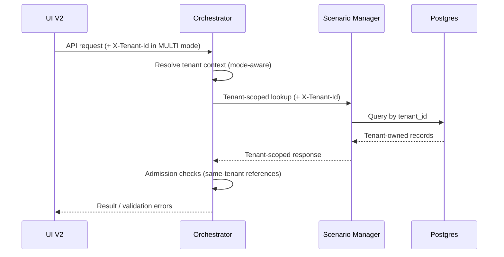

# Tenancy Foundations for SUT/Dataset/Simulation

> Status: proposal  
> Scope: Scenario Manager, Orchestrator, UI V2, shared runtime artifacts, Postgres metadata

## 1) Purpose

Define a minimal, enforceable tenancy model for the new SUT/Dataset/Simulation capabilities, without introducing full auth/RBAC yet.

The model must answer:

1. **What** is tenant scope in PocketHive.
2. **Why** we need it now.
3. **How** tenant context is propagated and validated.
4. **Where** the boundary is enforced in code and storage.

---

## 2) Why now

Production simulator workloads are team-specific and environment-specific:

1. Different teams will maintain different SUT catalogs and dataset spaces.
2. Simulations can run for days/weeks, so accidental cross-team data sharing is expensive.
3. We need controlled isolation before adding Org/Team/User/Role.

Without tenancy, a single global registry for SUTs/datasets/bindings creates:

1. naming collisions,
2. accidental cross-usage,
3. weak governance of "who can run what".

---

## 3) What is "tenant" in v1

`tenantId` is an opaque namespace key attached to all new control-plane metadata objects.

v1 semantics:

1. No org hierarchy yet (no built-in org/team/user tree).
2. No RBAC yet.
3. Tenant is a hard data boundary for metadata read/write and runtime admission.
4. Single-tenant deployments remain supported via fixed `tenantId=defaultTenant`.

---

## 4) Tenancy operating modes

Use one explicit deployment mode (no cascading fallback logic):

1. `SINGLE`
   - system injects one configured tenant id (`defaultTenant` or custom),
   - API callers do not need to provide tenant header.
2. `MULTI`
   - caller must provide `X-Tenant-Id` on tenant-scoped APIs,
   - missing tenant header fails fast (`400`).

Suggested config keys:

```yaml
pockethive:
  tenancy:
    mode: SINGLE # SINGLE | MULTI
    singleTenantId: defaultTenant
```

---

## 5) Where tenancy is enforced

## 5.1 Scenario Manager

Tenant scope applies to:

1. SUT registry entries,
2. DatasetSpace descriptors,
3. ScenarioBinding definitions,
4. SimulationProgram definitions.

API layer:

1. resolve tenant context per request,
2. require tenant-consistent references,
3. reject cross-tenant reference graphs.

## 5.2 Orchestrator

Tenant scope applies to:

1. admission checks before run creation,
2. simulation lifecycle operations,
3. runtime checkpoint records,
4. swarm metadata related to Simulation Program runs.

Orchestrator must pass tenant context on all Scenario Manager calls.

## 5.3 Persistence (Postgres)

All new tables are tenant-keyed:

1. `tenant_id` is mandatory,
2. external ids are unique per tenant (`UNIQUE(tenant_id, id)`),
3. foreign keys include `tenant_id` to enforce same-tenant relations.

## 5.4 Runtime artifact store

Artifact/reference storage should be tenant-scoped in path layout:

`/app/scenarios-runtime/tenants/<tenantId>/swarms/<swarmId>/...`

This keeps runtime payload snapshots and checkpoints isolated the same way as metadata.

## 5.5 UI V2

UI V2 owns:

1. tenant selection context,
2. sending `X-Tenant-Id` on API calls in `MULTI` mode,
3. showing active tenant in screens that edit SUTs/Datasets/Simulations.

## 5.6 AMQP transport boundary

Tenancy isolation in AMQP is enforced by exchange namespace per tenant.

Implementation note: this is intentionally deferred to PR 2 (tenancy foundation). Until then,
`docs/ARCHITECTURE.md` remains the SSOT for current AMQP routing/exchange contracts.

1. Control-plane exchange is tenant-scoped (for example `ph.<tenantId>.control`).
2. Work/hive exchange is tenant-scoped (for example `ph.<tenantId>.<swarmId>.hive`).
3. A swarm is attached to exactly one tenant exchange namespace for its full runtime.
4. Orchestrator/Swarm Controller provisioning must use tenant-scoped exchange names.
5. Tenant context in AMQP is carried by exchange choice, not by adding tenant segment to routing keys.

---

## 6) Where tenancy is NOT enforced (v1)

1. No auth/RBAC and no identity provider integration.
2. Worker business logic stays tenant-agnostic.

Note: AMQP routing keys can keep current shape, because tenant isolation is enforced by tenant-scoped exchanges.

---

## 7) How tenant context flows



---

## 8) Data invariants

Tenant safety rules:

1. `SimulationProgram`, `ScenarioBinding`, `DatasetSpace`, and `SUT` must share the same `tenantId`.
2. Cross-tenant references are invalid at create and update time.
3. Runtime snapshots freeze `tenantId` at run start.
4. Checkpoints and artifact references inherit the same `tenantId`.
5. A running swarm uses one tenant AMQP namespace only (control + work exchanges).
6. `swarmId` uniqueness is scoped to tenant (`UNIQUE(tenant_id, swarm_id)`), not global.

---

## 9) API contract (minimum)

1. New tenant-scoped endpoints include `tenantId` in response DTOs.
2. In `MULTI`, `X-Tenant-Id` is required on all tenant-scoped endpoints (including read-only list/get APIs).
3. Validation failures:
   - `400` for missing/invalid tenant context,
   - `404` for not-found within tenant scope,
   - `409` for cross-tenant reference conflicts.

---

## 10) Implementation map (where in code)

Current anchor points for tenancy integration:

1. `scenario-manager-service`
   - controllers under `io.pockethive.scenarios` (`ScenarioController`, `SutEnvironmentController`),
   - new tenant context resolver/filter,
   - tenant-aware services/repositories for new entities.
2. `orchestrator-service`
   - REST entrypoints under `io.pockethive.orchestrator.app` (`SwarmController`, simulation endpoints),
   - `ScenarioClient` / `ScenarioManagerClient` header propagation,
   - admission layer for cross-tenant validation.
3. `ui-v2`
   - API client utilities (`ui-v2/src/lib/*`) and page flows (SUTs/Datasets/Simulations),
   - central tenant state + request header injection.
4. shared runtime/artifacts
   - tenant segment in artifact directory layout and checkpoint persistence.

---

## 11) Rollout aligned to planned PR train

1. **PR 2 (tenancy foundation)**
   - add tenant context model + mode config (`SINGLE`/`MULTI`),
   - header propagation contracts,
   - tenant-scoped AMQP exchange naming convention,
   - `tenantId` fields in new DTO/domain objects,
   - no auth/RBAC.
2. **PR 3 (core simulation backend slice)**
   - tenant-aware Postgres persistence,
   - tenant-aware SM APIs and orchestrator admission,
   - orchestrator/controller provisioning bound to tenant-scoped exchanges,
   - same-tenant invariant enforcement.
3. **PR 4 (UI V2)**
   - tenant-aware UI flows for SUT/Dataset/Simulation management,
   - tenant context visible and consistently propagated.

---

## 12) Decisions

Decided:

1. `swarmId` is unique per tenant only.
2. Storage/artifact layout follows tenant-first prefix (for example `.../<tenantId>/<swarmId>/...` and `s3://.../<tenantId>/<swarmId>/...`).
3. `tenantId` uses a simple slug format:
   - regex: `^[a-z0-9-]+$`,
   - max length: 64,
   - reserved ids blocked: `all`, `default-system`.
4. In `MULTI`, `X-Tenant-Id` is explicit and mandatory everywhere for tenant-scoped APIs (including read-only list/get).
