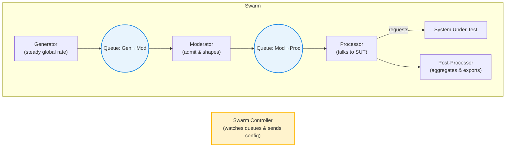
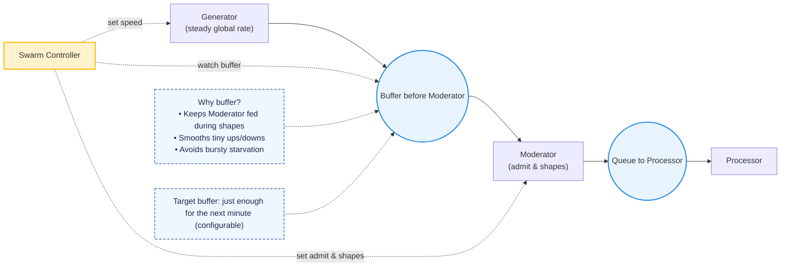
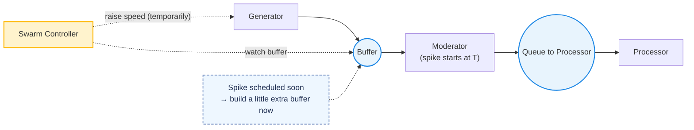
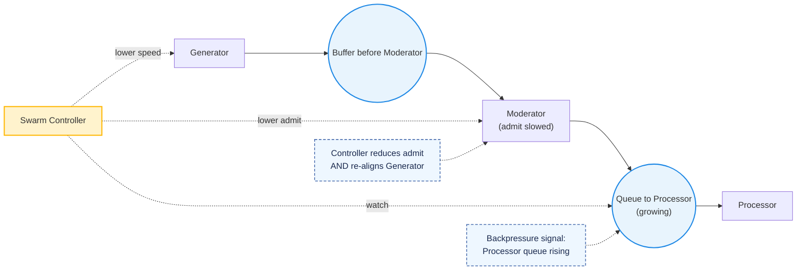

# PocketHive Swarm Traffic Shaping (Simple Overview)

*A friendly, non‑technical one‑pager about how we keep load smart and safe.*

---

## What is a Swarm?
A **Swarm** is an isolated set of small workers ("bees") that generate, shape, and process traffic to a **System Under Test (SUT)**. One central brain — the **Swarm Controller** — watches the queues and sends simple config updates so everything stays safe and realistic.

---

## Who does what (at a glance)
- **Generator** – creates messages from datasets at **one global speed** (deterministic; no local spikes/jitter).
- **Moderator** – decides how many messages **pass through** and can add safe **spikes/jitter**.
- **Processor** – talks to the SUT and emits results/metrics.
- **Post‑Processor** – aggregates results and exports summaries.
- **Swarm Controller** – the **single authority**: watches queue health and adjusts Generator speed and Moderator admit/shapes.

---

## How shaping works (plain English)
1. **Keep a small buffer** before the Moderator so shapes (spikes/jitter) never starve.
2. **Protect the SUT**: if the queue before the Processor grows, slow the Moderator.
3. **Stay balanced**: when the Moderator slows, also nudge the Generator down so the upstream buffer doesn’t explode.
4. **Recover smoothly** once healthy again (small steps, short pauses).

---

## How the buffer works (the "reservoir")
*Goal: keep a small queue before the Moderator so shaping never starves and remains smooth.*

---

## Prefill before a planned spike
*When a spike is scheduled soon, the Controller gently builds the buffer first.*

---

## Backpressure: protect the SUT and keep buffers sane
*If the queue to the Processor grows, we ease off the Moderator and align the Generator so the upstream buffer doesn’t explode.*

