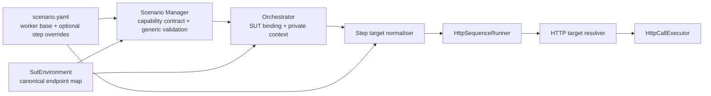

# HTTP Sequence Target Overrides Specification

> Status: **implemented / archived (verified)**
>
> Scope: HTTP Sequence config, SUT enrichment, validation, runtime target resolution, and observability
>
> Implementation: completed 2026-08-13

## Decision

Implement an additive HTTP Sequence contract:

- keep the existing required worker `baseUrl` as the normal target;
- allow a step to override it with either `sutEndpointId` or a hardcoded
  per-step `baseUrl`; and
- preserve current scenarios without adding fields to their steps.

This gives multi-host and multi-port journeys with minimal adoption work. Only
exceptional steps need new config.

The trade-off is one documented inheritance rule: a step with no override uses
the existing worker `baseUrl`. This is target selection, not error recovery. If
an authored override is invalid or fails, runtime MUST fail and MUST NOT fall
back to the worker URL.

This proposal does not add multi-SUT binding, endpoint discovery, failover,
load balancing, or live SUT rebinding.

## Goal

`HttpSequenceRunner` currently passes `HttpSequenceWorkerConfig.baseUrl` to
every call. A journey cannot call another host or port without creating another
worker.

The proposed resolution is:

```text
step.sutEndpointId present -> selected SUT endpoint baseUrl
step.baseUrl present       -> hardcoded step baseUrl
neither present            -> existing worker baseUrl
```

The first two forms are overrides. Both on one step is invalid.

## Hard rules

| Rule | Reason |
| --- | --- |
| Worker `baseUrl` remains required | Existing scenarios and behaviour remain valid |
| A step may declare `sutEndpointId`, per-step `baseUrl`, or neither | Supports two override forms plus the existing target |
| A step MUST NOT declare both override fields | No precedence ambiguity |
| A present override MUST be non-blank and valid | Blank does not mean absent |
| `sutEndpointId` MUST use a canonical `SutEnvironment.endpoints` map key | No duplicate endpoint identity |
| Selected endpoint kind MUST be HTTP or HTTPS and match its URI scheme | No protocol ambiguity or silent downgrade |
| A sequence using `sutEndpointId` MUST have an explicit `sutId` | No SUT discovery |
| Per-step `baseUrl` MUST be a literal absolute HTTP(S) base URI | Work-item data cannot change the authority |
| A failed override MUST NOT use worker `baseUrl` | Override is not a fallback attempt |
| Retry MUST reuse the exact target resolved before its first attempt | Retry cannot change routing |
| SUT binding and endpoint metadata MUST NOT be live mutable | A different SUT requires a new swarm |
| Authors MUST NOT provide `privateConfig` | Orchestrator owns runtime enrichment |

There is one inheritance level only: step to worker. Do not add template-level,
service-level, environment-default, or automatic endpoint fallback layers.

## Supported

- Existing journeys where every step uses worker `baseUrl`.
- A different named SUT endpoint on selected steps.
- A hardcoded base URL on selected steps.
- Mixing worker, SUT-managed, and hardcoded targets in one journey.
- Fixed base paths such as `https://example.test/customer-api`.
- Existing retry, extraction, setter, auth, and debug-capture behaviour.

## Out of scope

- More than one `sutId` per swarm.
- Absolute request URLs that bypass base-URI plus rendered-path validation.
- Templating a per-step `baseUrl`.
- DNS discovery, target health checks, failover, or weighted routing.
- Live edits to the selected SUT or its endpoint map.
- Changing the shared HTTP request-template contract.

## Domain model

| Canonical term | Status | Meaning | Owns or contains | Not the same as | Source | Allowed shorthand |
| --- | --- | --- | --- | --- | --- | --- |
| System Under Test (SUT) Environment | EXISTING | Concrete environment selected for a swarm | Stable SUT identity and named endpoint map | A sequence step | `docs/scenarios/SCENARIO_CONTRACT.md` and `SutEnvironment` | SUT environment |
| SUT Endpoint | EXISTING | Named protocol endpoint inside a SUT environment | `kind`, `baseUrl`, optional `upstreamBaseUrl` | A SUT environment | `docs/spec/sut-environments.schema.json` and `SutEndpoint` | endpoint when unambiguous |
| `sutEndpointId` | ADDED | Step override selecting one SUT Endpoint by map key | Logical SUT target for one step | `sutId`, `serviceId`, or a URL | This specification | NONE |
| Per-step `baseUrl` | ADDED | Step override containing one hardcoded HTTP base URI | Literal non-SUT target for one step | Worker `baseUrl` or complete request URL | This specification | NONE |
| HTTP Sequence target source | ADDED | Internal typed result of normalising one step | `WORKER_BASE_URL`, `SUT_ENDPOINT`, or `STEP_BASE_URL` | An authored mode field | This specification | target source |
| `privateConfig.authProfile.sut` | EXISTING | Orchestrator-owned runtime view of the selected canonical SUT Environment | Non-secret endpoint metadata for workers and auth rendering | Author-authored config | `docs/scenarios/SCENARIO_CONTRACT.md` | SUT context |

`sutId` selects the environment. `sutEndpointId` selects one endpoint inside
it. `serviceId` and `callId` select a request template. These identifiers are
not aliases.

## Authoring contract

This illustrative config exercises all three target sources:

```yaml
protocolVersion: "2.0.0"
template:
  bees:
    - role: http-sequence
      image: http-sequence:latest
      config:
        baseUrl: https://identity.uat.example.test:9443
        templateRoot: /app/scenario/templates/http
        serviceId: onboarding
        threadCount: 4
        steps:
          # Existing behaviour: uses worker baseUrl.
          - id: create-customer
            callId: create-customer

          # SUT-managed override.
          - id: open-account
            callId: open-account
            sutEndpointId: accounts-api

          # Literal override.
          - id: notify-audit
            callId: notify-audit
            baseUrl: http://audit-sandbox:9080/audit
```

The selected SUT keeps its existing shape:

```yaml
id: customer-platform-uat
name: Customer Platform UAT
type: uat
endpoints:
  accounts-api:
    kind: HTTPS
    baseUrl: https://accounts.uat.example.test:10443/api
```

Request templates remain unchanged. The sequence step owns target selection;
the shared template continues to own method, path, headers, body, auth
reference, and result rules.

### Backward compatibility

The scenario protocol remains `2.0.0`. The change is owned by the HTTP
Sequence capability contract, whose `capabilitiesVersion` moves from `1.1` to
`1.2`.

Existing scenario files remain valid because worker `baseUrl` remains required
and a step with neither override keeps the current behaviour. No compatibility
adapter, scenario rewrite, or alternate config shape is introduced.

At the typed worker-config boundary, each step is normalised once to an
internal `HttpSequenceTargetSource` enum/value object:

- no override -> `WORKER_BASE_URL`;
- `sutEndpointId` -> `SUT_ENDPOINT`;
- per-step `baseUrl` -> `STEP_BASE_URL`.

Runner logic uses that typed value and does not branch on raw configuration
strings.

### Private SUT context

When a swarm has `sutId`, Orchestrator continues to inject the canonical SUT
Environment at `privateConfig.authProfile.sut`. Authors cannot set or update
it. HTTP Sequence reuses this existing enrichment; this feature does not add or
migrate a private config path.

## Ownership and architecture



| Concern | Owner | Must not own |
| --- | --- | --- |
| SUT contract | `common/swarm-model` and canonical schema | Sequence execution |
| Capability publication and generic config validation | Scenario Manager | HTTP Sequence step semantics |
| Selected-SUT enrichment | Orchestrator | Per-step execution |
| Private config preservation and redaction | Worker SDK | Target choice |
| Step override validation and normalisation | HTTP Sequence config boundary | HTTP I/O |
| Target lookup and URI construction | Small HTTP target resolver port/adapter | Journey state |
| Step order, extraction, setters, retry | `HttpSequenceRunner` | URI joining |
| HTTP transport | `HttpCallExecutor` | SUT awareness |

This follows SOLID:

- the config boundary normalises authoring shape;
- the resolver owns target selection and URI construction;
- the runner owns journey behaviour and depends on the resolver port; and
- the executor receives one resolved URI and knows nothing about SUTs or
  overrides.

## Runtime behaviour

1. Scenario Manager validates protocol version and the generic capability
   config. Capability `1.2` publishes the additive step fields for authors.
2. Orchestrator resolves the existing worker `baseUrl` template as today.
3. When `sutId` is selected, Orchestrator injects the existing
   `privateConfig.authProfile.sut` context as today.
4. Before the first HTTP call, HTTP Sequence validates and normalises every
   step to one internal target source, including literal URI rules and selected
   endpoint lookup against the enriched SUT context. Any invalid target fails
   the journey before I/O.
5. For each step, the resolver selects exactly one base URI and joins the
   rendered template path.
6. The runner resolves the request URI once before retry. Every attempt uses
   that URI.

A live `steps` update is converted through the same typed config boundary.
Complete target resolution then runs before the next work item sends HTTP
traffic.

## Failure contract

| Condition | Result |
| --- | --- |
| Both override fields occur on one step | Reject validation; no precedence |
| An override field is present but blank | Reject validation; do not treat it as absent |
| `sutEndpointId` occurs without enriched selected-SUT context | Reject worker execution before I/O |
| SUT endpoint is missing or not HTTP-compatible | Reject worker execution before I/O |
| Per-step `baseUrl` is templated, relative, or non-HTTP(S) | Reject validation |
| Worker, SUT, or per-step base URI is invalid | Reject validation/bootstrap |
| Rendered path is absolute, scheme-relative, or escapes the base path | Fail the work item before I/O |
| Override resolution fails | Fail explicitly; never use worker `baseUrl` |
| Transport failure triggers retry | Retry the same resolved URI only |
| Public update contains `privateConfig` | Reject the update |

## Security and observability

- All base URIs MUST contain an authority and MUST NOT contain user-info,
  query, or fragment components.
- URI joining MUST preserve a configured base path. Do not concatenate strings
  in the executor.
- Redirect policy is unchanged by this feature. A separate contract change is
  required before redirect handling may change.
- Deployment policy MAY prohibit per-step hardcoded URLs. Denial MUST be
  explicit; runtime MUST NOT rewrite the target.
- Add `x-ph-http-seq-target-source` to result-step metadata through a shared
  constant. Add `x-ph-http-seq-sut-endpoint-id` only for SUT overrides.
- Debug capture records target source and optional endpoint id under existing
  capture/redaction limits.
- Metrics may label controlled `sutEndpointId` values, but MUST NOT label full
  URLs.
- `privateConfig` remains absent from status, config previews, evidence, and
  logs.

## Delivery record

1. Updated `docs/scenarios/SCENARIO_CONTRACT.md` and the HTTP Sequence capability
   contract first; keep scenario protocol `2.0.0` and bump capability version
   to `1.2`.
2. Published the additive authoring shape in Scenario Manager and added capability
   contract tests.
3. Reused the existing private SUT enrichment and retained its redaction boundary.
4. Added the typed target-source resolver, then updated runner,
   executor, debug capture, and status.
5. Kept unchanged `2.0.0` config as a compatibility regression and added one
   `2.0.0` mixed-target scenario.
6. Added upgrade notes and ran official-ingress end-to-end verification.

## Acceptance criteria

- Existing `2.0.0` scenarios run unchanged and use worker `baseUrl` for every
  step.
- A `2.0.0` scenario needs no new fields when all steps use worker `baseUrl`.
- One `2.0.0` journey can use worker `baseUrl`, a SUT endpoint on another host
  or port, and a hardcoded per-step base URL.
- An invalid SUT or literal override fails without sending traffic to worker
  `baseUrl`.
- All retries use the first resolved URI.
- HTTP Sequence reports the failing step index and field for conflicting,
  blank, unknown, or invalid overrides before sending HTTP traffic.
- Result metadata identifies target source without putting full URLs in metric
  labels.
- Private SUT context remains absent from public config and evidence.
- Unit tests cover normalisation, endpoint lookup, URI construction, retry
  stability, and no-fallback failures.
- An end-to-end test creates and runs the mixed-target scenario through the
  documented public ingress, not worker or backend service ports.

## Main trade-off

The concise contract uses absence to mean “use the existing worker target.”
That is a deliberate compatibility rule at one boundary, not a recovery
fallback. It keeps current scenarios clean and makes only exceptional routing
verbose. Strict mutual exclusion and fail-closed override handling prevent the
rule from becoming a fallback chain.

## Verification evidence

All checks ran in this workspace on 2026-08-13.

| Gate | Result |
| --- | --- |
| HTTP Sequence full reactor tests | PASS — 45 tests, 0 failures/errors |
| Scenario Manager full tests | PASS — 166 tests, 0 failures/errors; supplied `-Dpockethive.release.version=0.15.35` required by the test context |
| Capability catalogue contract | PASS — capability `1.2` and additive step description asserted |
| Integration acceptance | PASS — real Apache client called three ephemeral HTTP servers on distinct ports/base paths |
| Mutation testing | PASS — 81 mutations, 81 killed (100%); 95% line coverage, 100% test strength, and 0 uncovered mutants for target resolution/config boundaries |
| Bundle validation | PASS — public Scenario Manager ingress, protocol `2.0.0`, 0 errors/warnings |
| Live acceptance | PASS — public Orchestrator ingress created and started the mixed-target swarm; official debug tap observed three HTTP `200` results with `WORKER_BASE_URL`, `SUT_ENDPOINT` (`auth`), and `STEP_BASE_URL` |
| HiveMap review | PASS — targeted code-quality scan completed with no findings; the three earlier documentation findings were resolved with implementation evidence |

Mutation commands:

```bash
./mvnw -pl http-sequence-service -am -DskipTests install
./mvnw -f http-sequence-service/pom.xml -Pmutation test-compile org.pitest:pitest-maven:mutationCoverage
```

### Rapid Software Testing evaluation

| Charter | Evidence | Result |
| --- | --- | --- |
| Compatibility | Deserialize old JSON and use the old seven-argument `Step` constructor | PASS |
| Target routing | Worker, named SUT, and literal targets across hosts, ports, base paths, and query paths | PASS |
| Ambiguity / NFF | Both fields, blanks, missing SUT context, unknown endpoint, non-HTTP kind, and scheme mismatch fail explicitly | PASS |
| URI abuse | Reject absolute/scheme-relative paths, user-info, fragments, base queries, traversal, templated literals, invalid schemes, hosts, and ports | PASS |
| Timing | Resolve once before retry; every attempt receives the identical URI | PASS |
| No side effects on invalid config | Invalid later override prevents earlier steps from sending traffic | PASS |
| Observability | Result metadata exposes controlled source/endpoint id, not full target URLs | PASS |
| Contract ownership | Scenario protocol remains `2.0.0`; HTTP Sequence capability is `1.2`; nested semantics stay at the typed worker boundary | PASS |

The initial local stack bootstrap also exposed a host port collision on
WireMock (`8080`). The acceptance fixture was decoupled from WireMock and uses
three PocketHive service endpoints instead; no product fallback was added.
