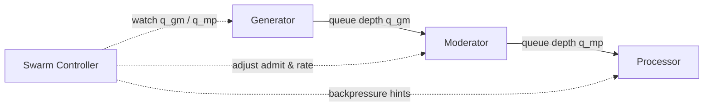

# Swarm Controller Queue Guard Plan

> Status: **implemented / archived**.  
> Historical implementation plan for Swarm Controller BufferGuard / queue guard.

> Scope: add controller + scenario changes so Generator `ratePerSec` is actively regulated to keep the Gen→Mod buffer inside a configurable bracket without breaking Moderator shaping.

## 1) Goals & Success Criteria

1. **Scenario-driven guard rails** — Operators express queue targets per scenario (`trafficPolicy.bufferGuard`) without editing code.
2. **Closed-loop control** — Swarm Controller monitors queue depth, smooths the signal, and adjusts Generator `ratePerSec` slowly enough to preserve Moderator determinism.
3. **Backpressure symmetry** — When downstream queues grow, the same guard framework (bracket + deltas) pulls both Moderator admit and Generator rate in sync.
4. **Telemetry transparency** — Metrics/logs/health make it obvious why the controller changed the rate and what the current queue bracket/measurement is.
5. **Safe rollout** — Feature is opt-in per scenario; default behavior stays unchanged until guards are configured.

## 2) Operating Model Overview



1. Scenario defines a **buffer guard** block with `targetDepth`, `minDepth`, `maxDepth`, growth/shrink step sizes (% of current `ratePerSec`), and damping windows.
2. Swarm Controller loop samples RabbitMQ queue depths every `samplePeriod` (default 5s), applies `movingAverageWindow`, and compares to the bracket.
3. If depth drifts outside `[minDepth, maxDepth]`, controller issues a `ratePerSec` override via the control-plane config topic using configured `adjustmentPct` limits.
4. When Moderator signals backpressure (queue before Processor high), the controller also narrows the buffer bracket to bleed down the upstream queue and coordinates `ratePerSec` + Moderator admit changes.

## 3) Scenario Configuration Additions

```yaml
trafficPolicy:
  bufferGuard:
    enabled: true
    queueAlias: genToMod             # aligns with routing utility alias
    targetDepth: 200                 # preferred steady depth (messages)
    minDepth: 120
    maxDepth: 280
    samplePeriod: 5s
    movingAverageWindow: 4           # number of samples
    adjust:
      maxIncreasePct: 10             # per decision relative to current ratePerSec
      maxDecreasePct: 15
      minRatePerSec: 50
      maxRatePerSec: 5000
    prefill:
      enabled: true
      lookahead: 2m                  # align with upcoming Moderator spike markers
      liftPct: 20
    backpressure:
      queueAlias: modToProc
      highDepth: 500
      recoveryDepth: 300
      moderatorReductionPct: 15
```

### Notes

- `queueAlias` aligns with the queue names defined in `docs/ARCHITECTURE.md` routing tables; no hard-coded strings.
- Operators can omit `prefill` or `backpressure` sections; defaults disable those behaviors.
- Scenario-manager UI/CLI must validate the schema before submitting plans.

## 4) Swarm Controller Changes

### 4.1 Telemetry + Config Plumbing

1. Extend controller config model to accept `trafficPolicy.bufferGuard` block (with validation, defaults, feature flag).
2. Add queue depth sampling abstraction:
   - Rabbit management API or control-plane metrics feed.
   - Per-alias sampler caches queue name + connection info.
   - Emits a structured event (`QueueDepthSample`) with raw value and moving average.
3. Publish new metrics: `buffer_guard_depth`, `buffer_guard_target`, `buffer_guard_rate_override`, `buffer_guard_state` (enum: `prefill`, `steady`, `draining`, `backpressure`).

### 4.2 Control Loop

1. **Steady-state guard**  
   - Compare smoothed depth `q̄` to `[minDepth, maxDepth]`.
   - If `q̄ < minDepth`, compute `delta = clamp(targetDepth - q̄, 0, maxIncreasePct * ratePerSec)` and increase `ratePerSec` gradually.
   - If `q̄ > maxDepth`, decrease similarly using `maxDecreasePct`.
   - Enforce absolute bounds `[minRatePerSec, maxRatePerSec]`.
2. **Prefill assistance**  
   - When scenario indicates a Moderator spike within `prefill.lookahead`, temporarily raise `targetDepth` by `liftPct`, capped by queue limits, then revert once spike starts.
3. **Backpressure integration**  
   - Monitor downstream queue alias; if above `highDepth`, enter `backpressure` state:
     - Reduce Moderator admit (existing mechanism) by `moderatorReductionPct`.
     - Force Generator `ratePerSec` toward `minRatePerSec` regardless of buffer reading until queue drops below `recoveryDepth`.
4. **State machine**  
   - Track states `DISABLED → PREFILL → STEADY → BACKPRESSURE → RECOVERY`.
   - Only emit config updates on state changes or when new `ratePerSec` differs by ≥1%.

### 4.3 Safety & Edge Cases

- If queue metrics missing for 3 consecutive samples, freeze `ratePerSec` and emit warning.
- If scenario toggles guard off mid-run, gracefully exit and hand control back to static `ratePerSec`.
- For multi-generator swarms, ensure overrides target the correct instance IDs provided in the scenario (align with `docs/ORCHESTRATOR-REST.md` contracts).

### 4.4 Feature Flag vs Scenario Opt-in

- Guard logic is globally gated by `POCKETHIVE_CONTROL_PLANE_SWARM_CONTROLLER_FEATURES_BUFFER_GUARD_ENABLED` (defaults to `true` via `application.yml`). Setting it to `false` disables **all** guard behaviour without touching scenarios—useful as an emergency kill-switch.
- Individual swarms still opt in via `trafficPolicy.bufferGuard.enabled`. Even with the feature flag on, no guard controller spins up unless the active scenario sets this flag to `true`.
- Document the relationship in operator runbooks so teams know they can leave the env var enabled everywhere and control guard usage entirely through scenarios.

## 5) Scenario & Tooling Updates

1. **Scenario schemas** — Update scenario-manager validation + JSON schemas to include the `trafficPolicy.bufferGuard` section with defaults and docs.
2. **Plan templates** — Provide example scenarios (e.g., `local-rest-two-moderators.yaml`) that showcase buffer guard usage.
3. **Operator docs** — Extend `docs/USAGE.md` and scenario authoring guides with guard tuning advice (how to pick target depth, step sizes, prefill strategies).
4. **CI coverage** — Add scenario fixtures that enable buffer guard and run through control-plane integration tests (RabbitMQ + Testcontainers) to ensure queue depth sampling and rate adjustments behave as expected.

## 6) Workstreams & Timeline

| Phase | Focus | Key Tasks |
|-------|-------|-----------|
| A | Config + schema | Define YAML/JSON schema, update scenario-manager validation, add feature flag in controller config. |
| B | Telemetry + control loop | Implement queue depth sampler, smoothing, state machine, and rate override plumbing; expose metrics/logs. |
| C | Prefill & backpressure integration | Hook into Moderator spike schedule + downstream queue monitoring; ensure coordinated adjustments. |
| D | Tooling & docs | Update sample scenarios, operator docs, and control-plane testing harness; add dashboards/panels for guard metrics. |

Each phase ends with targeted tests (unit + integration). Phase B requires RabbitMQ integration tests to verify rate changes obey clamps; Phase C adds e2e spike/backpressure scenarios.

## 7) Risks & Mitigations

- **Controller thrash** — Rapid rate toggling could destabilize Moderator shaping. → Use smoothing windows, hysteresis (`minDepth`, `maxDepth`), and minimum intervals between adjustments.
- **Metric gaps** — Missing queue telemetry would freeze the loop. → Add health alerts + fallback to last known good rate.
- **Operator confusion** — New config may be misused. → Ship defaults, linting, and scenario-manager guidance plus dashboards showing bracket vs actual depth.
- **Multi-tenant interference** — When multiple swarms share infrastructure, queue depth sampling must be scoped per swarm ID (already part of routing; ensure no cross-talk).

## 8) Acceptance Criteria

1. Scenario opt-in enables guard; default scenarios remain unchanged.
2. Controller logs/metrics clearly show guard state and resulting `ratePerSec` overrides.
3. Integration test demonstrates queue depth maintained within ±20% of target during steady state, and backpressure event results in coordinated slowdown and recovery.
4. Documentation updated (architecture overview, scenario authoring, runbooks) referencing `trafficPolicy.bufferGuard`.

## 9) Implementation Tasks (update as work completes)

- ### Phase A – Config + Schema
  - [x] Define `trafficPolicy.bufferGuard` schema (YAML + JSON) and publish docs/examples.
  - [x] Update scenario-manager validation + linting to enforce the schema and defaults.
  - [x] Add controller feature flag + config parsing with safe fallbacks.

- ### Phase B – Telemetry + Control Loop
  - [x] Implement queue-depth sampler and moving-average smoothing per queue alias.
  - [x] Build buffer guard state machine, clamped `ratePerSec` adjustments, and control-plane override plumbing.
  - [x] Expose guard metrics/logs (`buffer_guard_*`) and add dashboards/panels.

- ### Phase C – Prefill & Backpressure
  - [x] Wire Moderator spike schedule + guard lookahead for prefill behavior.
  - [x] Integrate downstream queue monitoring + coordinated Moderator/Generator slowdown on backpressure.
  - [x] Extend integration tests to cover spike prefill and backpressure recovery paths.

- ### Phase D – Tooling & Docs
  - [x] Add sample scenarios (e.g., `local-rest-two-moderators.yaml`) showcasing guard config.
  - [x] Update operator docs (`docs/USAGE.md`, scenario authoring guides) with tuning guidance.
  - [x] Document runbook steps + dashboards for monitoring guard performance.

Mark the checkboxes as each task ships so stakeholders can see progress inline with the plan.

## 10) Architecture & Exposure Follow-ups

- [x] Extract the guard logic into a reusable component/class rather than embedding it directly in `SwarmLifecycleManager`.
- [x] Move guard settings into the swarm-controller config/capabilities response so the UI can load them via the existing Capabilities endpoint (enforcing “plan data only, no fallback”).
