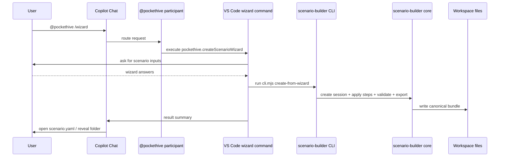

# PocketHive Chat Wizard Architecture

## Goal

This document explains how the installed PocketHive VS Code extension, the
`@pockethive` chat participant, and the scenario-builder backend are connected.

It is meant for design discussion, not as an end-user walkthrough.

## Short version

`@pockethive` is not a separate service.

It is a **chat participant contributed by the PocketHive VS Code extension**.
The participant is only the chat entry point. The actual scenario creation is
performed by the extension's wizard command and then delegated to the local
scenario-builder backend.

## Runtime flow

```mermaid
flowchart LR
    A[Developer in VS Code] --> B[Copilot Chat]
    B --> C[@pockethive participant]
    C --> D[VS Code command\npockethive.createScenarioWizard]
    D --> E[Wizard prompts in extension]
    E --> F[scenario-builder CLI]
    F --> G[scenario-builder core]
    G --> H[Canonical scenario bundle]
    H --> I[scenario.yaml + templates/http]
```

## Sequence



## Component mapping

### 1. Chat participant

The chat entry point is declared in:

- [`vscode-pockethive/package.json`](/home/sepa/PocketHive/vscode-pockethive/package.json)

Relevant section:

- `contributes.chatParticipants`
- `name: "pockethive"`

That is what makes `@pockethive` appear in Copilot Chat.

The runtime handler is implemented in:

- [`vscode-pockethive/src/chatParticipant.ts`](/home/sepa/PocketHive/vscode-pockethive/src/chatParticipant.ts)

Responsibilities:

- interpret `/wizard`, `/restBasic`, `/requestBuilder`, `/tutorial`
- render chat guidance and followups
- delegate real work to VS Code commands

### 2. Wizard command inside the extension

The actual guided scenario creation is implemented in:

- [`vscode-pockethive/src/scenarioWizard.ts`](/home/sepa/PocketHive/vscode-pockethive/src/scenarioWizard.ts)

Responsibilities:

- prompt the user for required inputs
- enforce a constrained wizard flow
- call the backend CLI
- open exported files for review

The command is registered from:

- [`vscode-pockethive/src/extension.ts`](/home/sepa/PocketHive/vscode-pockethive/src/extension.ts)

Main command:

- `pockethive.createScenarioWizard`

### 3. Backend entry point used by the extension

The extension does not write final scenario YAML directly.

Instead it calls:

- [`tools/scenario-builder-mcp/cli.mjs`](/home/sepa/PocketHive/tools/scenario-builder-mcp/cli.mjs)

That CLI is a thin adapter over the same local scenario-builder backend used by
the MCP POC.

### 4. Shared scenario-builder logic

The canonical authoring logic lives in:

- [`tools/scenario-builder-mcp/scenario-builder-core.mjs`](/home/sepa/PocketHive/tools/scenario-builder-mcp/scenario-builder-core.mjs)

Responsibilities:

- create the working scenario bundle
- apply wizard steps
- validate the bundle
- export canonical files

This layer maps directly to the PocketHive scenario contract. It is not a
separate scenario SSOT.

### 5. Output

The final output is written into the workspace as a normal PocketHive scenario
bundle, for example:

```text
scenarios/bundles/demo-rest-basic/
  scenario.yaml
```

or:

```text
scenarios/bundles/demo-request-builder/
  scenario.yaml
  templates/http/auth-call.yaml
```

## Design intent

This split is deliberate:

- `@pockethive` provides discoverable chat UX
- the VS Code command provides controlled wizard UX
- the backend core owns contract-aligned bundle generation

This keeps the logic reusable and avoids embedding PocketHive domain rules only
inside chat prompts.

## What this architecture is not

- It is not a second scenario model.
- It is not a free-form AI file editor.
- It is not a remote service dependency.
- It is not MCP-only; the extension can reuse the same backend without routing
  every action through Copilot.

## Discussion points for next iteration

1. Should `@pockethive` remain a light launcher, or should it become a richer
   conversational guide that can inspect partial wizard state?
2. Should the next UX layer be a chat participant only, or a mixed
   chat-participant + webview summary panel?
3. How far should capability-driven forms go before the wizard becomes too
   complex for new developers?
4. Which scenario families should become first-class templates after
   `rest-basic` and `rest-request-builder`?
