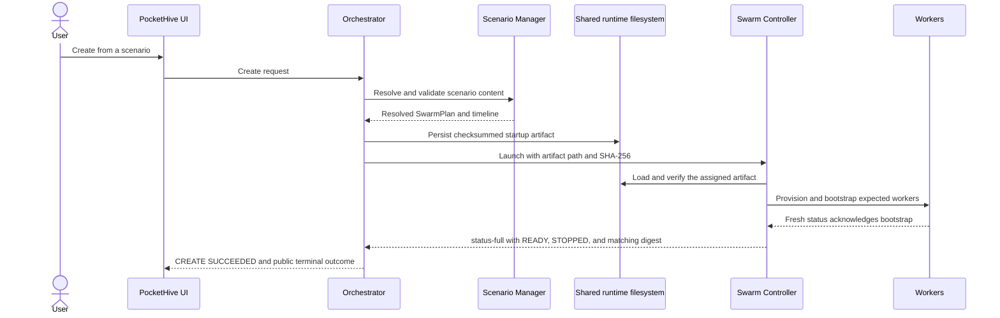
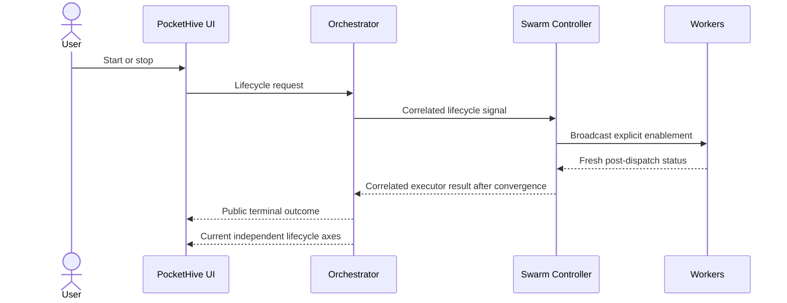
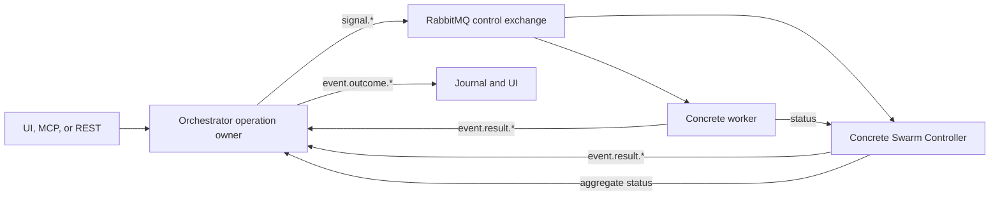
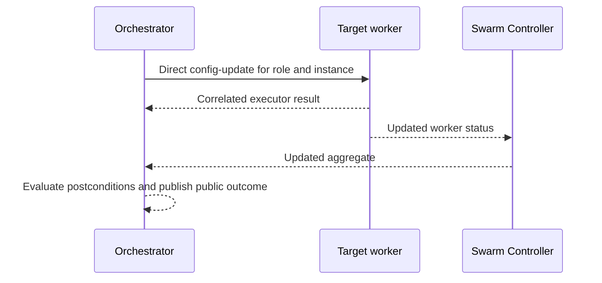
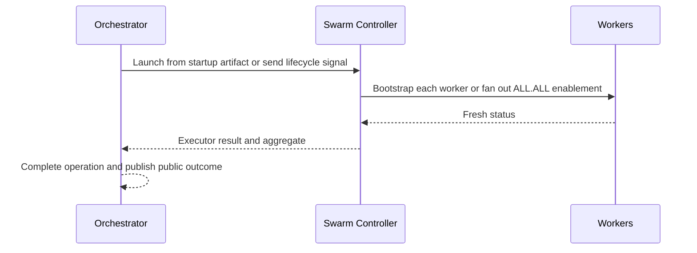

# Understand PocketHive system workflows

| Reader context | Details |
| --- | --- |
| Audience | Customers interpreting evidence, operators investigating asynchronous behavior, and contributors locating ownership |
| Prerequisites | Basic familiarity with scenarios, swarms, Hive, and Journal |
| Expected outcome | Explain lifecycle, control-plane evidence, and config propagation without confusing acceptance, executor evidence, terminal outcome, or current observation |
| Last verified source | `rewrite/lifecycle-control-plane` at `0524165e` (unreleased) |

This page maps the three workflows most often needed for diagnosis or change.
It stays conceptual; linked contracts own exact routes, envelopes, and schemas.

## Workflow traceability

| Workflow | Owning components | Canonical contract | Implementation entry points |
| --- | --- | --- | --- |
| Swarm lifecycle | Orchestrator owns intent and operations; Scenario Manager resolves validated content; Swarm Controller owns local execution and aggregate observation | [Orchestrator REST](../../ORCHESTRATOR-REST.md), [scenario contract](../../scenarios/SCENARIO_CONTRACT.md), [lifecycle schema](../../spec/swarm-lifecycle.schema.json), [control-event schema](../../spec/control-events.schema.json) | `SwarmController.java`, `ScenarioManagerClient.java`, `SwarmSignalListener.java`, `SwarmLifecycleManager.java` |
| Control-plane signals | `common/control-plane-core` defines shared routing; each producer and consumer owns its boundary | [AsyncAPI](../../spec/asyncapi.yaml), [control-event schema](../../spec/control-events.schema.json) | `ControlPlaneRouting.java`, `ControlPlaneRouteCatalog.java`, `ControlPlaneSignals.java`, then the relevant listener |
| Configuration propagation | Orchestrator owns targeted operations and public outcomes; target executors report results; Swarm Controller owns bootstrap and start/stop fan-out | [Orchestrator REST](../../ORCHESTRATOR-REST.md), [worker capabilities](../../architecture/workerCapabilities.md), [control-event schema](../../spec/control-events.schema.json) | `ComponentController.java`, `SwarmLifecycleManager.java`, `WorkerControlPlaneRuntime.java` |

Full repository paths and focused tests for these named entry points are indexed
in the [project map](../../PROJECT_MAP.md#platform-services).

## Read the evidence in layers

| Evidence | Proves | Does not prove |
| --- | --- | --- |
| Request acceptance | The Orchestrator accepted an asynchronous operation and assigned its correlation, idempotency key, operation URL, and deadline. | Dispatch or completion. |
| Executor result (`event.result.*`) | The targeted controller or worker produced correlated internal evidence. | Public success; the Orchestrator still evaluates the operation's postconditions. |
| Public terminal outcome (`event.outcome.*`) | The Orchestrator completed the operation as `Succeeded`, `Rejected`, `Failed`, or `TimedOut`. A `Succeeded` lifecycle outcome includes that command's canonical convergence checks. | That the runtime has remained unchanged since completion. |
| Fresh Snapshot and Scenario matches | The current controller/workload/health observation and expected worker set at the displayed timestamp. | The external SUT's business result. |
| Journal | Correlated requests, signals, executor evidence, terminal outcomes, and alerts retained for history. | Current aggregate freshness; controller `status-full` is not journaled. |

## 1. Swarm lifecycle

### Create from one startup artifact

Create does not start the workload. The immutable startup artifact is the sole
initialization input for the controller; there are no separate runtime
template/plan messages or RabbitMQ fallback. Create succeeds only after the
reported digest matches the launch record, controller state is `READY`,
workload state is `STOPPED`, and the complete expected worker set is fresh and
bootstrap-acknowledged.

### Start, stop, and remove

Start and Stop executor results are not dispatch receipts: the controller
waits for every expected worker to publish a fresh matching enablement state.
The Orchestrator then completes only the exactly correlated operation and
publishes its public outcome. A later fresh Snapshot remains useful to prove
the current state has not changed.

Remove uses immutable filesystem `request.json` and `result.json` records as
the authoritative controller handoff; the AMQP remove signal is only a
repeatable wake-up. The Orchestrator publishes `Succeeded` only after verifying
all required runtime, RabbitMQ, network-binding, directory, registry, and
durable-audit postconditions. There is no persistent `REMOVED` state: a
successful removal is retained in operation/Journal history and the active
swarm disappears from discovery.

Use [swarm lifecycle](../operators/swarm-lifecycle.md) for the procedure and
[observability](../operators/observability-troubleshooting.md) when evidence
stalls.

## 2. Control-plane signals

The routing key and envelope scope both identify the target. Lifecycle commands
address one concrete controller instance; config and status requests may use
the explicit `ALL` scope for fan-out. Workers publish status to their
controller, while the Orchestrator consumes controller aggregate status rather
than direct worker status in steady state. A status request returns
`status-full`, not a command result or public outcome.

Result and outcome ownership is fixed:

- the concrete executor reports `event.result.<command>...` using its own
  target scope;
- the Orchestrator evaluates that evidence against its operation and any
  required fresh observation; and
- the Orchestrator alone publishes
  `event.outcome.<command>.<swarmId>.orchestrator.<instance>`.

The controller's `status-full` contains the complete swarm aggregate and
updates the UI projection; it is not appended to Journal. Journal explains
command history, while Snapshot answers whether the latest aggregate is fresh.

Keep [`correlationId` and `idempotencyKey`](../../correlation-vs-idempotency.md)
distinct: one connects evidence, the other governs safe retries.

## 3. Configuration propagation

These paths have different owners and evidence; do not combine them.

### Targeted component update

The controller is not a relay. The worker validates allowed live fields and
returns internal result evidence directly. If enablement changed, the
Orchestrator also requires a fresh matching observation before publishing a
successful outcome. The worker's current state reaches the Orchestrator inside
the controller aggregate.

### Controller-owned bootstrap and fan-out

Bootstrap targets each concrete worker and clears pending acknowledgements from
fresh status. Start/stop uses swarm-wide `ALL.ALL`; dependency order is not a
current contract. The controller waits for convergence before its executor
result, and the Orchestrator owns the terminal outcome.

| Configuration path | Internal evidence | Public completion and current evidence |
| --- | --- | --- |
| Direct targeted update | Correlated result from the concrete worker | Orchestrator terminal outcome; for enablement, a fresh matching target observation is also required |
| Worker bootstrap | Fresh status clears each concrete pending acknowledgement | CREATE succeeds only when the complete planned set is fresh and bootstrap-acknowledged |
| Start/stop fan-out | Controller result after every expected worker converges | Orchestrator terminal outcome, then a fresh aggregate for current-state verification |

If these layers disagree, keep the original role, instance, scope,
`correlationId`, and `idempotencyKey`. Changing the target or logical-operation
identity starts a different operation.

## Work-plane topology

The scenario is the logical topology source of truth. At runtime:

- the Swarm Controller declares `ph.<swarmId>.hive`;
- it owns queues and routing keys named `ph.work.<swarmId>.<queueName>`, plus
  their bindings;
- workers consume and publish through IO resolved from the scenario; and
- controller `status-full` exposes runtime bindings so the application can
  relate the logical graph to concrete resources.

Workers do not redefine controller-owned topology. A linear pipeline is one
pattern; the graph can also branch or fan out.

**Verify:** the topology view relates the scenario graph to concrete runtime
bindings and worker scopes in a fresh aggregate. If they disagree, validate
`scenario.yaml`, inspect the controller aggregate, and then follow the
[scenario-role troubleshooting route](../operators/observability-troubleshooting.md#troubleshooting).

## Troubleshooting

Keep acceptance, executor result, terminal outcome, and fresh aggregate
evidence separate. Then follow the
[symptom matrix](../operators/observability-troubleshooting.md#troubleshooting);
inspect wire contracts only after customer evidence identifies that boundary.

## Next step

- Follow the [application journey](../ui/application-guide.md).
- Use [swarm lifecycle](../operators/swarm-lifecycle.md) for action evidence.
- Read [technical architecture](../../ARCHITECTURE.md) before changing behavior.
