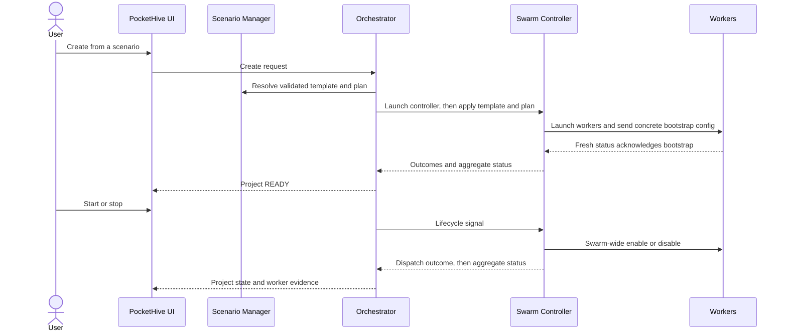
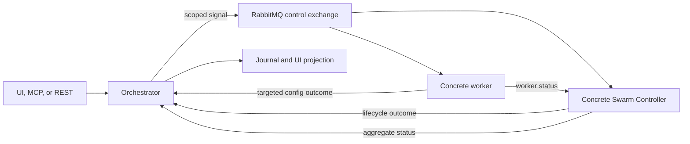
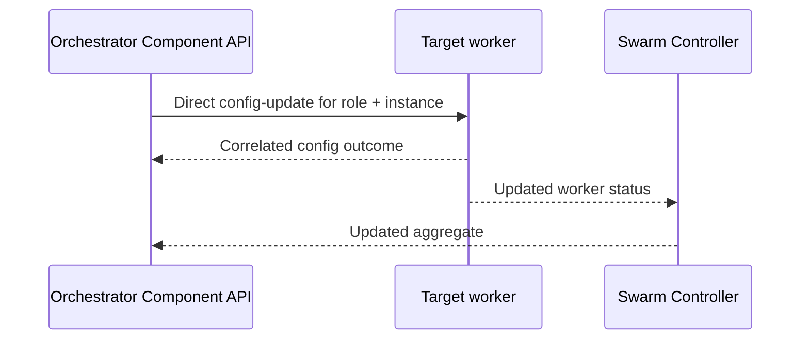
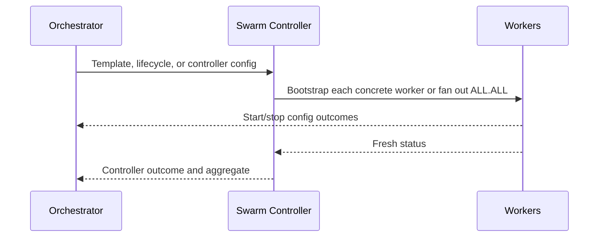

# Understand PocketHive system workflows

| Reader context | Details |
| --- | --- |
| Audience | Customers interpreting evidence, operators investigating asynchronous behavior, and contributors locating ownership |
| Prerequisites | Basic familiarity with scenarios, swarms, Hive, and Journal |
| Expected outcome | Explain lifecycle, control-plane evidence, and config propagation without confusing dispatch with convergence |
| Last verified PocketHive version | PocketHive `v0.15.35` |

This page maps the three workflows most often needed for diagnosis or change.
It stays conceptual; linked contracts own exact routes, envelopes, and schemas.

## Workflow traceability

| Workflow | Owning components | Canonical contract | Implementation entry points |
| --- | --- | --- | --- |
| Swarm lifecycle | Orchestrator owns intent; Scenario Manager prepares validated content; Swarm Controller owns local execution and aggregate state | [Orchestrator REST](../../ORCHESTRATOR-REST.md), [scenario contract](../../scenarios/SCENARIO_CONTRACT.md), [control-event schema](../../spec/control-events.schema.json), [AsyncAPI](../../spec/asyncapi.yaml) | `SwarmController.java`, `ScenarioManagerClient.java`, `SwarmSignalListener.java`, `SwarmLifecycleManager.java` |
| Control-plane signals | `common/control-plane-core` defines shared routing; each producer and consumer owns its boundary | [AsyncAPI](../../spec/asyncapi.yaml), [control-event schema](../../spec/control-events.schema.json) | `ControlPlaneRouting.java`, `ControlPlaneRouteCatalog.java`, `ControlPlaneSignals.java`, then the relevant listener |
| Configuration propagation | Orchestrator owns direct targeted updates; Swarm Controller owns bootstrap and start/stop fan-out; workers validate and apply | [Orchestrator REST](../../ORCHESTRATOR-REST.md), [worker capabilities](../../architecture/workerCapabilities.md), [control-event schema](../../spec/control-events.schema.json) | `ComponentController.java`, `SwarmLifecycleManager.java`, `WorkerControlPlaneRuntime.java` |

Full repository paths and focused tests for these named entry points are indexed in the
[architecture traceability table](../../ARCHITECTURE.md#12-workflow-traceability).

## Read the evidence in layers

| Evidence | Proves | Does not prove |
| --- | --- | --- |
| Request acceptance | The entry point accepted asynchronous work. | Controller or worker completion. |
| Correlated command outcome | The target processed the command at its documented boundary. | Later worker convergence. |
| Projected lifecycle state | A controller outcome reached the UI projection. | Aggregate freshness or complete role matching. |
| Fresh Snapshot and Scenario matches | Current aggregate health and expected worker state. | The external SUT's business result. |
| Journal | Correlated requests, signals, outcomes, and alerts. | Current aggregate freshness; controller `status-full` is not journaled. |

## 1. Swarm lifecycle

Create does not start workload. In `v0.15.35`, projected `READY` can follow the
template outcome before the Orchestrator independently accounts for the plan;
the controller still gates Start on template, plan, bootstrap acknowledgements,
and readiness. Start/stop outcomes prove controller processing and dispatch,
not that every worker converged. Require a fresh aggregate with the intended
worker state. Removal is separate and requires a correlated `Removed` outcome
plus later disappearance from Hive.

The controller's first full status establishes the runtime handshake. Template
and plan are then sent with separate correlations: the template defines worker
shape and the plan supplies resolved runtime configuration. Worker bootstrap is
addressed to each concrete role and instance, and fresh worker status clears
the controller's pending acknowledgement. This is why one early success or one
projected state cannot replace the complete aggregate.

Use [swarm lifecycle](../operators/swarm-lifecycle.md) for the procedure and
[observability](../operators/observability-troubleshooting.md) when evidence
stalls.

## 2. Control-plane signals

The routing key and envelope scope both identify the target. Lifecycle commands
address one controller instance; config and status requests may intentionally
use `ALL` for fan-out. Workers publish status to their controller, while the
Orchestrator consumes the controller aggregate rather than direct worker status.
A status request returns `status-full`, not a command outcome; alerts report
asynchronous failures and `status-delta` keeps changing state current.

Outcome ownership follows the target. A controller returns lifecycle or
controller-config outcomes. A worker targeted directly by the Orchestrator
returns its config outcome to the Orchestrator, while its status still travels
to the controller. The controller's `status-full` contains the complete swarm
aggregate and updates the UI projection; it is not appended to Journal. Journal
therefore explains command history, while Snapshot answers whether the latest
aggregate is fresh.

Keep [`correlationId` and `idempotencyKey`](../../correlation-vs-idempotency.md)
distinct: one connects evidence, the other governs safe retries.

## 3. Configuration propagation

These paths have different owners and evidence; do not combine them.

### Targeted component update

The controller is not a relay. The worker validates allowed live fields and
returns the immediate outcome directly; its later state reaches the Orchestrator
inside the controller aggregate.

### Controller-owned bootstrap and fan-out

Bootstrap targets each concrete worker and clears pending acknowledgements from
fresh status. Start/stop uses swarm-wide `ALL.ALL`; in `v0.15.35` it is not
ordered by topology dependency. Its controller outcome records dispatch, while
the later aggregate proves convergence.

| Configuration path | Immediate evidence | Later evidence |
| --- | --- | --- |
| Direct targeted update | Correlated outcome from the concrete worker at the Orchestrator | That worker's state in a later controller aggregate |
| Worker bootstrap | Fresh status clears each concrete pending acknowledgement | Aggregate contains every planned, bootstrapped worker |
| Start/stop fan-out | Controller lifecycle outcome records processing and dispatch; worker config outcomes return to the Orchestrator | Aggregate shows intended workers enabled or disabled |

If these layers disagree, keep the original role, instance, scope, and
correlation. Changing route or broadening the target would start a different
operation and make the original result harder to explain.

## Work-plane topology

The scenario is the logical topology source of truth. At runtime:

- the Swarm Controller declares `ph.<swarmId>.hive`;
- it owns queues and routing keys named `ph.<swarmId>.<queueName>`, plus their
  bindings;
- workers consume and publish through IO resolved from the scenario; and
- controller `status-full` exposes runtime bindings so the application can
  relate the logical graph to concrete resources.

Workers do not redefine controller-owned topology. A linear pipeline is one
pattern; the graph can also branch or fan out.

**Verify:** the topology view relates the scenario graph to concrete runtime
bindings and worker scopes in a fresh aggregate. If they disagree, validate
`scenario.yaml`, inspect the controller aggregate, and then follow the
[scenario-role troubleshooting route](../operators/observability-troubleshooting.md#troubleshooting).

## Troubleshooting

Keep acceptance, outcome, projection, and fresh aggregate evidence separate.
Then follow the [symptom matrix](../operators/observability-troubleshooting.md#troubleshooting);
inspect wire contracts only after customer evidence identifies that boundary.

## Next step

- Follow the [application journey](../ui/application-guide.md).
- Use [swarm lifecycle](../operators/swarm-lifecycle.md) for action evidence.
- Read [technical architecture](../../ARCHITECTURE.md) before changing behavior.
