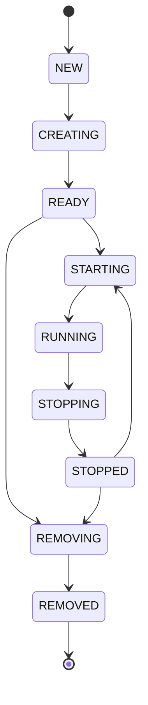

# Create, start, stop, and remove a swarm

| Reader context | Details |
| --- | --- |
| Audience | PocketHive operators and customers controlling an existing swarm |
| Prerequisites | Access to Hive, Snapshot, Scenario, and Journal for the selected environment |
| Expected outcome | Complete one lifecycle action using runtime evidence instead of treating request acceptance as completion |
| Last verified PocketHive version | PocketHive `v0.15.35` |

A swarm is one runtime instance created from a scenario. Lifecycle actions are
asynchronous: acceptance, controller dispatch, and worker convergence are
different evidence layers. The canonical distinction is in
[system workflows](../concepts/system-workflows.md#read-the-evidence-in-layers).

In `v0.15.35`, the Orchestrator can project `READY` after the template outcome
before independently accounting for the plan outcome. The Swarm Controller
still blocks Start until template, plan, bootstrap acknowledgements, and
readiness checks complete. Never use projected `READY` alone as readiness
proof.

## Lifecycle model

This is the complete internal model. Hive reads a cached controller projection
and may skip transitional labels such as `STARTING` or `STOPPING`; pending
action feedback and Journal events preserve that history. `FAILED` means an
operation could not complete. Stop or remove a failed swarm only when the
available state makes that action safe.

## State meanings

| State | Meaning | What to do |
| --- | --- | --- |
| `NEW` | The create request is registered. | Wait for creation to begin. |
| `CREATING` | Runtime resources and the controller are being configured. | Wait; use Journal if progress stalls. |
| `READY` | Creation is projected complete, but the workload is not running. | Require a fresh healthy Snapshot and live Scenario role matches before Start. |
| `STARTING` | Start was dispatched and workers are converging. | Wait for `RUNNING` plus fresh worker evidence. |
| `RUNNING` | Enablement was dispatched. | Verify the intended workers are live and enabled. |
| `STOPPING` | Stop was dispatched and workers are converging. | Wait for `STOPPED` plus fresh worker evidence. |
| `STOPPED` | Disablement was dispatched. | Verify workers are live and disabled before restart or removal. |
| `REMOVING` | Managed runtime resources are being deleted. | Wait for the correlated `Removed` outcome and disappearance from Hive. |
| `REMOVED` | Removal was reported. | Confirm the required evidence; no further lifecycle action is needed. |
| `FAILED` | A lifecycle step could not complete. | Read the issue and correlated Journal evidence before retrying or removing. |

## Actions and required evidence

| Action | Normal path | Completion evidence | Not sufficient |
| --- | --- | --- | --- |
| Create | `NEW → CREATING → READY` | Fresh healthy Snapshot plus one live Scenario role match for every planned worker | Request acceptance or projected `READY` alone |
| Start | `READY/STOPPED → STARTING → RUNNING` | `RUNNING` plus a fresh aggregate showing intended workers live and enabled | A successful start outcome alone |
| Stop | `RUNNING → STOPPING → STOPPED` | `STOPPED` plus a fresh aggregate showing intended workers live and disabled | A successful stop outcome alone |
| Remove | `READY/STOPPED → REMOVING → REMOVED` | Correlated `swarm-remove` outcome with status `Removed`, then disappearance from Hive | Disappearance alone; stale projections can be pruned without runtime cleanup |

Snapshot proves aggregate freshness, state, and health. Scenario maps planned
roles to runtime workers and labels them `enabled`/`disabled` and
`live`/`stale`. A disabled worker can show a red eye at `READY` or `STOPPED`;
the explicit labels and fresh aggregate, not color alone, determine success.

## Customer workflow

1. In **Hive**, select the swarm and open **Snapshot**; confirm state, health,
   and freshness.
2. Open **Scenario** and match each planned role to one live worker.
3. Run one lifecycle action and keep the swarm selected.
4. Verify the matching completion row above. For Remove, also open **Journal**
   and require the correlated `Removed` outcome.
5. If evidence stalls, preserve the swarm ID, timestamps, and latest structured
   outcome before troubleshooting.

Do not remove a `STARTING`, `RUNNING`, or `STOPPING` swarm as a shortcut. Stop
it first; governed reconciliation is a recovery path, not normal lifecycle.

## Troubleshooting

- Stuck during Create: correlate create, template, and plan outcomes, then find
  the missing role, image, SUT, volume, or readiness cause.
- Start/Stop state appears but workers disagree: treat the state as dispatch
  evidence and inspect the fresh aggregate for the worker that did not converge.
- Snapshot is stale: restore control-plane connectivity before trusting it.
- Action is disabled: check both lifecycle state and the user's grant scope.
- Remove lacks `Removed`: preserve the ID and use governed reconciliation;
  do not reuse the ID because it disappeared from Hive.

Follow [observability and troubleshooting](observability-troubleshooting.md)
for the evidence ladder and recovery matrix.

## Next step

- Run the [local source quickstart](../onboarding/quickstart-15min.md).
- Learn message ownership in [system workflows](../concepts/system-workflows.md).
- Diagnose a symptom with [observability and troubleshooting](observability-troubleshooting.md).
