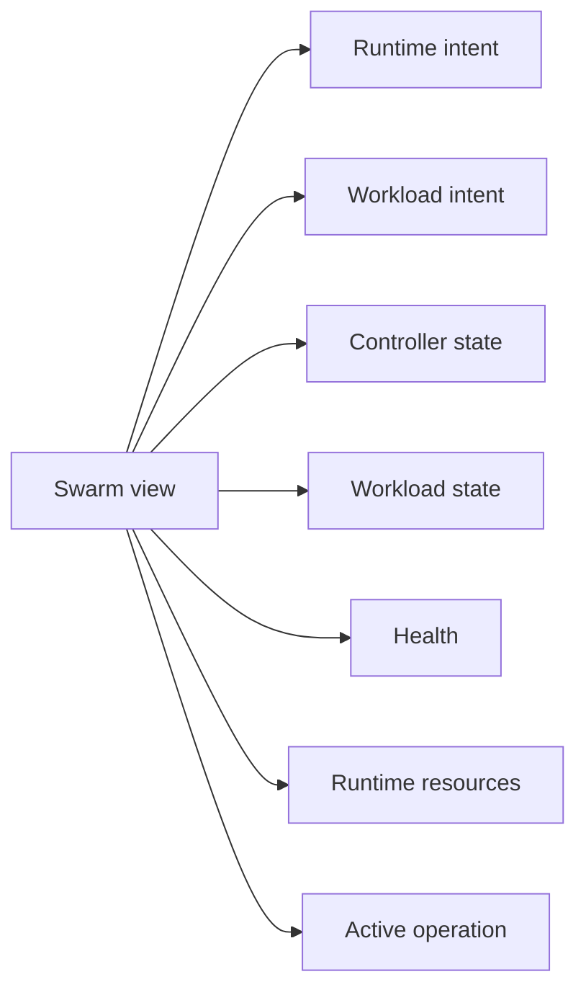

# Create, start, stop, and remove a swarm

| Reader context | Details |
| --- | --- |
| Audience | PocketHive operators and customers controlling an existing swarm |
| Prerequisites | Access to Hive, Snapshot, Scenario, and Journal for the selected environment |
| Expected outcome | Complete one lifecycle action using its operation record and fresh runtime evidence instead of treating request acceptance as completion |
| Candidate source tested | `rewrite/lifecycle-control-plane` at `0524165e` (unreleased) |

A swarm is one runtime instance created from a scenario. Lifecycle requests are
asynchronous. The accepted request, executor result, public terminal outcome,
and current runtime observation are related evidence, but they are not the same
state.

## Read the lifecycle as independent axes

PocketHive deliberately has no single authoritative swarm-state enum. Hive
renders these contract fields together:

| Axis | Values | Owner and meaning |
| --- | --- | --- |
| Runtime intent | `PRESENT`, `ABSENT` | Orchestrator-owned desired runtime presence |
| Workload intent | `RUNNING`, `STOPPED` | Orchestrator-owned desired workload enablement |
| Controller state | `PROVISIONING`, `READY`, `FAILED`, `UNKNOWN` | Controller observation cached by the Orchestrator |
| Workload state | `UNAVAILABLE`, `STARTING`, `RUNNING`, `STOPPING`, `STOPPED`, `UNKNOWN` | Aggregate observation of expected workers |
| Health | `HEALTHY`, `DEGRADED`, `FAILED`, `UNKNOWN` | Runtime health, independent of enablement |
| Runtime-resource state | `PRESENT`, `REMOVING`, `ABSENT`, `UNKNOWN` | Observation of managed resources |
| Operation state | `ACCEPTED`, `DISPATCHED`, `SUCCEEDED`, `REJECTED`, `FAILED`, `TIMED_OUT` | Progress of one Orchestrator-owned command |

For example, a healthy paused swarm normally has controller state `READY`,
workload state `STOPPED`, and health `HEALTHY`. A running workload may be
`RUNNING` while health is `DEGRADED`; do not collapse those facts into one
badge or infer one from another.

## Evidence ownership

The Orchestrator returns a `correlationId`, `operationUrl`, and public
`outcomeTopic` when it accepts a command. Poll that operation URL until it is
terminal.

- A controller or worker reports internal executor evidence on
  `event.result.*`.
- Only the Orchestrator publishes the public terminal `event.outcome.*`, after
  command-specific postconditions are satisfied or the operation fails or
  times out.
- A successful public outcome has `data.status=Succeeded`. Domain values such
  as `RUNNING`, `STOPPED`, and `REMOVING` are never terminal statuses.
- Snapshot and Scenario show the current observation after the operation. Keep
  checking timestamps so stale data is not mistaken for convergence.

## Actions and required evidence

| Action | Completion evidence | Current-state check | Not sufficient |
| --- | --- | --- | --- |
| Create | Operation `SUCCEEDED` / public `Succeeded` outcome after the startup-artifact digest matches, controller state is `READY`, workload state is `STOPPED`, and every expected worker is fresh and bootstrap-acknowledged | Fresh Snapshot; one matching live worker for every planned role | Request acceptance, controller container existence, or `READY` without the complete fresh worker set |
| Start | Operation `SUCCEEDED` / public `Succeeded` outcome after every expected worker reports fresh post-dispatch `enabled=true` | Fresh workload state `RUNNING`; intended workers enabled and live | Signal publication, executor result alone, or a stale `RUNNING` observation |
| Stop | Operation `SUCCEEDED` / public `Succeeded` outcome after every expected worker reports fresh post-dispatch `enabled=false` | Fresh workload state `STOPPED`; intended workers disabled and live | Signal publication, executor result alone, or a stale `STOPPED` observation |
| Remove | Operation `SUCCEEDED` / public `Succeeded` outcome only after filesystem result validation, resource and binding absence checks, registry removal, and durable terminal audit persistence | Swarm absent from a fresh list; a later fetch returns not found | Disappearance alone, a cleanup action list, or an accepted remove request |

Create does not start the workload. Start and Stop are idempotent no-ops when
the controller is ready and the workload already has the requested observed
state. Remove converges workload disablement as part of its own contract; this
guide still uses Stop before Remove for a deliberate, easily inspected
operator sequence, not because Remove requires a separate Stop command.

`REMOVED` is not a persistent swarm lifecycle state. After successful removal,
the active registration no longer exists; operation and Journal evidence hold
the history.

## Customer workflow

:::caution Current candidate is blocked at Connectivity

Require every **Connectivity** gate to report OK before submitting step 1. The
tested `0524165e` VM reports a
`swarm-lifecycle.schema.json#/$defs/RuntimeMetadata` resolution error, so this
UI procedure is the contract and qualification criterion for a future
corrected candidate, not a workflow completed at this source. Preserve the
error and stop before lifecycle mutation.

:::

1. Submit one action and retain its `correlationId` and `operationUrl`.
2. Poll that exact operation until it reaches a terminal state. Do not submit a
   different action while a lifecycle operation is non-terminal.
3. Require `SUCCEEDED` and the correlated Orchestrator outcome with
   `data.status=Succeeded`.
4. In **Snapshot**, verify the independent controller, workload, health, and
   resource fields with a fresh observation timestamp.
5. In **Scenario**, match the complete planned worker set to current runtime
   workers and verify their explicit `enabled` and `live` values.
6. For Remove, confirm the swarm is absent from a fresh Hive list after the
   terminal success. Retain the operation and Journal record as history.

The direct MCP `swarm_*` surface does not expose an operation-read tool. Its
`debug_journal` omits the Create outcome, exposes only a routed signal and/or
controller-internal result for Start and Stop rather than the Orchestrator's
public terminal outcome, and becomes unavailable after registry removal. The
resumable `workflow_deploy_*` path does follow successful Create and Start
operation records, and `workflow_verify_*` follows a successful Stop operation
before settlement; it still does not perform or prove Remove. Record the exact
tool path and evidence layer instead of weakening the lifecycle contract.

## Troubleshooting

- Create fails or times out: inspect the Create operation context,
  startup-artifact digest evidence, expected worker set, image, SUT, volume,
  and bootstrap acknowledgement named by the failure.
- Start or Stop fails: inspect the executor result and the operation's
  non-converged worker list; do not repeat the action against unchanged
  evidence.
- Snapshot is stale: restore control-plane connectivity before trusting its
  controller, workload, health, or worker fields.
- An action is rejected or disabled: inspect the active operation, explicit
  rejection context, lifecycle axes, and the user's grant scope.
- Remove is not `SUCCEEDED`: preserve the swarm ID, correlation, operation
  context, and Journal evidence. Do not reuse the ID or infer cleanup success
  from disappearance.

Follow [observability and troubleshooting](observability-troubleshooting.md)
for the evidence ladder and recovery matrix.

## Next step

- Run the [local source quickstart](../onboarding/quickstart-15min.md).
- Learn message ownership in [system workflows](../concepts/system-workflows.md).
- Diagnose a symptom with [observability and troubleshooting](observability-troubleshooting.md).
