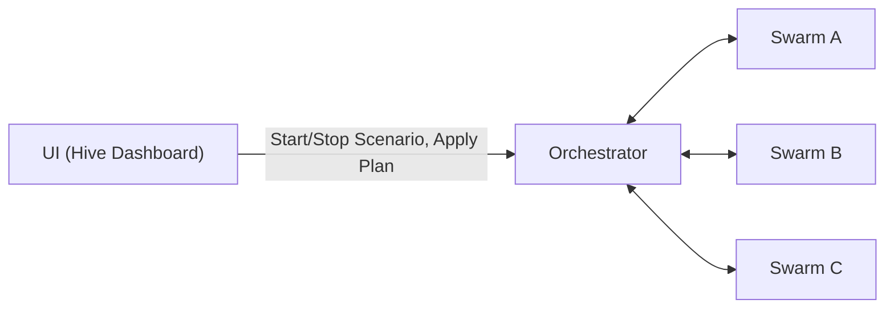

import {
  CoreConceptsExplorer,
  RedisBasicLoopExplorer,
  RedisMultiSwarmExplorer,
} from "@site/src/components/InteractivePocketHiveExplorer";
import useBaseUrl from "@docusaurus/useBaseUrl";

# Interactive PocketHive Overview

  

PocketHive is a RabbitMQ-centric load and behavior simulator that orchestrates swarms
of modular workers ("bees") to generate traffic, transform data, and emit results and telemetry.

## Key Ideas

- **Scenario Plan**: a declarative plan the Orchestrator applies to create and configure swarms.
- **Swarm**: a unit of execution made of small services forming a pipeline.
- **Control vs Work/Data**:
  - **Control**: commands, lifecycle, and configuration.
  - **Work/Data**: main business payload stream through the pipeline.
- **Observability first**: components emit logs and metrics for fast feedback.

## High-level Architecture

This page is split into three groups:

1. Core concepts.
2. Redis as a dataset database + basic loop.
3. Multi-swarm collaboration using Redis handoff lists.

## 1) Core Concepts

- **Orchestrator**: global control owner that creates and manages swarms.
- **Swarm**: one runtime group of connected components for a scenario execution.
- **Swarm Controller**: per-swarm manager responsible for local plan, worker status, and lifecycle actions.
- **Workers (bees)**: role-based processing containers in the work pipeline.
- **Control plane**: commands, outcomes, and status signals.
- **Work plane**: business payload flow (WorkItems) across queues and workers.

<CoreConceptsExplorer />

## 2) Redis as a Dataset Database

In most scenarios, Redis lists are used as a dataset-oriented state store.
Instead of treating Redis only as cache, workers read input records from lists, execute business operations,
and push updated records to target lists that represent the next state.

Example - in the `Auth` / `Topup` pattern inside a swarm:

- `Auth Txn` is a worker operation in a swarm.
- Based on the response/business rule, the record is moved from `Ready` to `TopUpNeeded`.
- `Topup Txn` performs the follow-up operation and writes the record back to `Ready`.

This gives explicit, observable state transitions in Redis.

<RedisBasicLoopExplorer />

## 3) Multi-Swarm Collaboration with Redis

Redis lists can also connect multiple swarms.
For example:

- one swarm reads from `Ready` and writes to `TopUpNeeded`,
- another swarm waits for data on `TopUpNeeded`, performs dedicated operations,
- and writes records back to `Ready`.

The same pattern can be reused for other asynchronous flows where one swarm waits for specific data states.

<RedisMultiSwarmExplorer />
