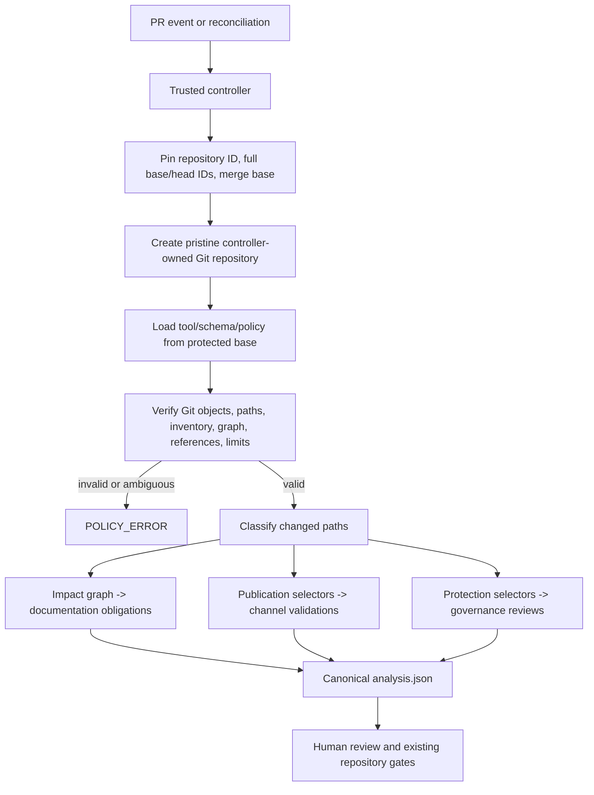

# PocketHive automated documentation foundation plan

| Field | Current decision |
| --- | --- |
| Status | In progress; local schema-v2 foundation implemented and stress-tested, but not merge-ready |
| Canonical architecture | [Documentation impact automation](../architecture/documentation-impact-automation.md) |
| Candidate branch | `agent/docs-impact-foundation` |
| Pinned integration base | `b0bca602`; compatibility reference only, not automation authority |
| Mode | `SHADOW` contract only; no shadow workflow is enabled |
| Current boundary | Local files and tests only; no commit, push, merge, workflow, check, app, or ruleset change |
| Merge decision | Blocked until the P0 decisions and evidence in this plan close |

This file tracks delivery. It does not define production behaviour, authorize a
merge, or replace Edenred/PocketHive review and security policies.

## 1. Outcome and safety posture

The intended first release is a deterministic, read-only action analyser. It
answers three independent questions for one exact protected base and candidate
head:

1. Which documentation targets are affected through reviewed component and
   integration routes?
2. Which documentation publication channels need validation because a bound
   document, channel content input, or producer changed?
3. Which protected/control owners must review the change?

It does not write documentation, execute candidate code, decide that prose is
correct, approve a pull request, or merge anything.

The safe terminal states are:

| State | Meaning |
| --- | --- |
| `NO_ACTION_REQUIRED` | The protected policy evaluated successfully and emitted no action; normal review still applies |
| `ACTION_REQUIRED` | At least one documentation, publication, or governance action needs work/review |
| `POLICY_ERROR` | A safe answer cannot be derived; all authoritative actions are cleared |

## 2. Current implementation status

The local candidate now contains:

- a closed schema-v2 policy and result contract;
- canonical enums and resource limits;
- protected-base policy/tool loading and strict Git identity/object/path checks;
- exact path inventory for all 2,042 current non-ignored candidate paths;
- 68 components and 71 impact nodes across all PocketHive apps, services, nine
  workers, shared contracts/adapters, infrastructure, delivery, CI, client
  integration, and focused tools;
- a directed acyclic graph with 110 explicit edges and mandatory per-change
  `STOP`/`CONTINUE` decisions;
- 95 registered documents, 40 documentation rules, and 12 additive protection
  rules;
- 9 typed publication channels with producer paths, content-input selectors,
  physical locator semantics, and 196 exact source-document bindings;
- channel-scoped publication validation for registered documents, future files
  under protected prefixes, material package inputs, and producer changes;
- fail-closed required-document deletion handling: only `MODIFY` can satisfy a
  documentation target;
- deterministic bounded output for documentation obligations, publication
  validations, and governance reviews;
- repository and generic regression tests, including a protected-base test in
  which a future unregistered Docusaurus page triggers repository, standalone
  site, and UI-image publication actions.

Current declared counts are review evidence only. The policy and executable are
unmerged, so they cannot yet be the protected authority that evaluates their
own candidate.

## 3. How an authoritative run would work

The controller must run no candidate command. Later artifact checks may execute
candidate-controlled tools only in a separate disposable, no-secret,
network-denied sandbox, with evidence written by a trusted outer process.

## 4. Stress-test findings

### 4.1 Closed in the local foundation

| Finding | Resolution |
| --- | --- |
| A new Docusaurus page was unregistered and returned no action | Required publication `contentInputPaths`; new pages now trigger channel validation without a document ID |
| Producer/material package changes did not trigger publication checks | Publication validation now matches producers and content inputs independently of the impact graph |
| Package locators were ambiguous | Added typed Docusaurus, archive, npm, VSIX, classpath, and image-filesystem locator kinds plus content roots and artifact selectors |
| Only a subset of published Markdown was registered | Bound all 46 current Docusaurus pages, 15 TCP docs in both JAR/image channels, 3 MCP npm docs, 16 POSIX archive docs, and 5 Windows archive docs; parity tests lock current manifests |
| The UI runtime image also carries `/docs/` but was not a separate channel | Added `ui-image-docs` with its Dockerfile/workflow and docs/docs-site inputs |
| Network Proxy Manager's direct UI client was hidden behind a transitive route | Added an explicit direct `STOP` edge to the UI |
| `.devcontainer` changes incorrectly produced MCP/VS Code documentation | Split a local-development component/node and target contributor guidance |
| UI ingress/image delivery shared the broad UI runtime node | Split `app-ui-delivery` and target deployment/usage guidance |
| WireMock changes targeted TCP Mock documentation | Narrowed WireMock code selectors and target WireMock's own packaged README |
| MCP self rules duplicated the downstream VS Code projection | Kept MCP-owned targets on the MCP rule and left VS Code to the explicit MCP-to-VS Code edge |
| Security/client paths could silently return no action | Added explicit protection for Amazon Q agent/rules, RabbitMQ, devcontainer, UI ingress, and existing client/control paths |

### 4.2 P0 blockers still open

| ID | Blocker | Required decision/evidence |
| --- | --- | --- |
| P0-1 | Integration-edge provenance is incomplete | Compare public contracts, HTTP clients, AMQP seams, and 106 internal Maven dependency relations; for each relevant relation, add an exact edge or an owned exclusion with evidence |
| P0-2 | Too many non-contract edges continue transitively | Gold-label each implementation/runtime/API/tool/observability `CONTINUE`; split public contract nodes or change to `STOP` unless the destination re-exposes the same contract |
| P0-3 | Forty-four registered docs have no upstream rule target | Add a closed `TARGETED` versus `VALIDATION_ONLY` disposition; map scenario, quickstart, moderator, SUT, Worker SDK, and other real projections to exact sources |
| P0-4 | Publication checks are declarations only | Implement fixed artifact-list/content checks for site, UI image, archives, npm, VSIX, TCP JAR, and TCP image; keep them outside the classifier |
| P0-5 | Windows/POSIX generated docs differ | Approve the difference or extract canonical `DEPLOY.md` sources; decide the Windows-only `HIVEFORGE.md` package behaviour |
| P0-6 | VSIX package evidence currently fails | Regenerate/reconcile the lifecycle TypeScript output, then verify the VSIX contents in an isolated stage |
| P0-7 | Documentation authorities conflict | Decide stdio versus HTTP MCP policy, retire stale plugin authority claims, fix version-matched UI Help links, and disposition legacy `docs/index.md` |
| P0-8 | Protected controller and reviewer independence do not exist | Implement controller-owned Git/runtime provenance, prove Windows/Linux data-only parity, and establish at least two accountable principals before any approval consumption |

These blockers are why the candidate must not be merged yet.

## 5. Delivery sequence

### AD-00 - Architecture and ownership decision

Status: reopened and in review.

1. Review the canonical architecture and this stress-test record.
2. Approve the three independent action lanes and protected-base trust model.
3. Approve owner roles, publication identities, and explicit exclusions.
4. Reject schema-v1 compatibility and any candidate-execution shortcut.

Gate: a human architecture/security decision records what is approved and what
remains blocked.

### AD-01A - Trust foundation

Status: local data-only foundation implemented; authoritative controller open.

1. Preserve strict Git/path/object validation.
2. Add controller-owned repository metadata and pinned Node/Git runtime
   evidence.
3. Add malicious config, alternate, promisor, hook, partial-history, and
   cross-platform fixtures.

Gate: the candidate tree can influence only data, never executable authority.

### AD-01B - Closed v2 contracts

Status: locally implemented; independent review open.

1. Review policy/result schemas and canonical projections.
2. Review publication trigger aggregation and bounds.
3. Add document-impact disposition to eliminate silent untargeted registry
   entries.
4. Confirm `POLICY_ERROR` clears all actions.

Gate: no missing, optional, or inferred safety decision remains in the schema.

### AD-01C - PocketHive map and seam gold labels

Status: structural candidate implemented; semantic review is the largest
remaining work item.

1. Build the evidence table from Maven dependencies, service clients, AMQP
   topology, UI/MCP/VS Code clients, Docker/package inputs, and public contracts.
2. For every relation, record `EDGE`, `EXCLUDED`, or `SPLIT_REQUIRED` with an
   owner and evidence reference.
3. Review every `CONTINUE` decision and high-fanout rule.
4. Label every currently untargeted document as exact upstream target or
   validation-only.
5. Add mutation fixtures for each promoted seam.

Gate: independent human gold labels match exact deterministic actions.

### AD-01D - Artifact and parity evidence

Status: core tests pass locally; package/platform evidence open.

1. Implement fixed checks for all nine publication channels.
2. Validate generated archive documentation and Windows/POSIX parity.
3. Repair and inspect VSIX packaging.
4. Add whole-map cases for lifecycle, scenario/SUT, auth, WorkItem/control,
   observability, delivery, publication, deletion, and mixed changes.
5. Prove byte-identical Windows/Linux data-only output.

Gate: exact action and artifact results match independent expectations.

### AD-02 - Advisory shadow, only after bootstrap

Status: blocked.

After AD-00/AD-01 approval and a one-time manually reviewed protected bootstrap,
run forward advisory shadow on later pull requests. Shadow output cannot block
merge. Required enforcement, model writing, MCP exposure, publishing, and a
Gate App remain separate future decisions.

## 6. Estimates in Codex/user effort

A Codex cycle means one bounded inspect/implement/test/evidence pass, including
correction of failures found in that pass. User time means active architecture,
security, ownership, and evidence review. It excludes elapsed CI or observation
time. These are not engineering-day estimates.

| Remaining packet | Codex effort | Your active review | Main uncertainty |
| --- | ---: | ---: | --- |
| Architecture/schema sync and document disposition | 1-2 cycles | 1-2 h | Which untargeted documents are intentional validation-only |
| AD-01C seam/selector gold labels | 4-8 cycles | 3-6 h | Maven/runtime relations and whether consumers re-expose contracts |
| AD-01D fixtures, artifact checks, and Windows/POSIX parity | 3-5 cycles | 1-2 h | VSIX generation and package-script parity decisions |
| Controller provenance and final bootstrap packet | 1-2 cycles | 0.5-1 h | Available protected runtime and independent reviewer identities |

Expected remaining effort to a safe advisory-shadow candidate: **9-17 Codex
cycles and about 5-10 hours of your active review**. Observation time after
bootstrap is additional but does not consume continuous active effort.

## 7. Acceptance criteria before merge

All items must be true:

- every current path has one inventory result and every material path one
  impact node;
- every relevant PocketHive integration has a reviewed edge or owned exclusion;
- every non-contract `CONTINUE` has evidence, and high fanout matches owner
  expectations;
- every registered document is explicitly `TARGETED` or `VALIDATION_ONLY`;
- every publication content/producer selector has manifest parity evidence;
- fixed checks inspect the actual output for all nine channels;
- required-document deletion and any policy error fail closed;
- no candidate code, workflow, policy, or dependency executes with repository
  authority;
- controller/Git/runtime identities are protected and reproducible;
- Windows/Linux canonical results match;
- owner identities support independent protected review;
- architecture, security, and one-time bootstrap reviews are complete;
- the original working tree remains untouched and the isolated candidate is
  compared with its recoverable baseline.

## 8. Next action

The next bounded packet is AD-01C, not merge:

1. generate the repository integration evidence matrix;
2. review the 110 live edges and all relevant omitted Maven/service relations;
3. convert each relation to `EDGE`, `EXCLUDED`, or `SPLIT_REQUIRED`;
4. add explicit document impact dispositions and exact upstream mappings;
5. rerun mutation, full classifier, and documentation-static validation;
6. prepare an evidence-only review packet for the user.

Do not create a workflow, required check, App, MCP adapter, model writer,
publisher, commit, push, or merge as part of this packet.
