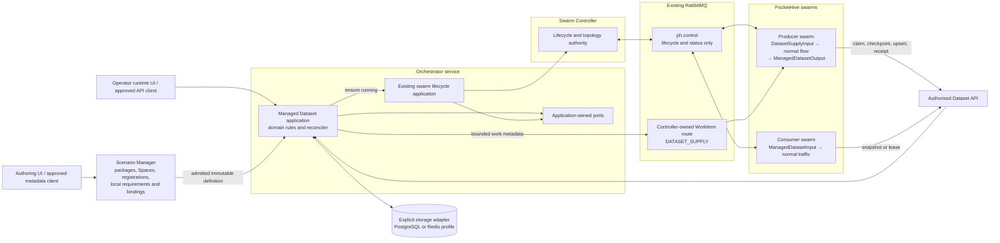
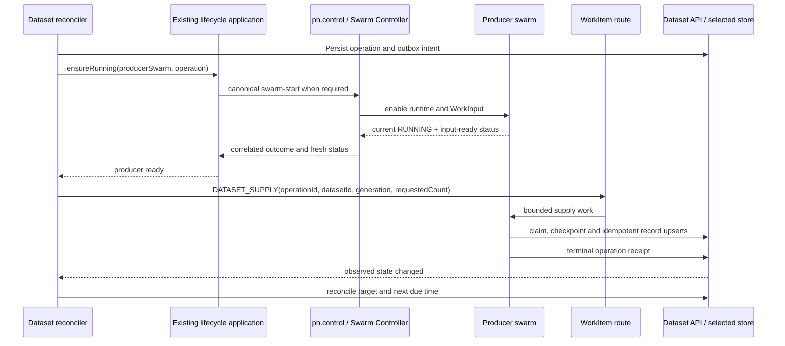

# Managed Datasets — Team Guide

Status: in progress — design-ready; cross-functional approval pending

**Design assessment: GREEN — ready for team approval. Implementation planning
remains behind the separate approval and implementation-readiness gates.**

This is a design-readiness result, not a claim that the feature already exists
or has passed production-scale testing. The implementation must still pass the
release gates defined in the assurance strategy, including the exact
50,000-record workload.

## The idea in one minute

A Managed Dataset is a durable, reusable collection of test records that one
PocketHive swarm can create and other swarms can use.

PocketHive stores each authoritative Dataset through the storage adapter
explicitly selected by its deployment registration. The standalone package
declares only required capabilities and supported profiles. PostgreSQL provides the
recommended full managed-records profile; Redis provides an explicit,
capability-gated collection profile and is never an implicit fallback. A
reconciler keeps the available supply close to an operator-defined target when
the selected profile supports that lifecycle. When more records are
needed, PocketHive first starts the configured producer swarm through the
existing RabbitMQ control plane. Only after that swarm reports that it is
running and ready does PocketHive send it a bounded `DATASET_SUPPLY` work item.
The producer runs its normal flow and commits the resulting records through the
Dataset API. The preferred Worker SDK integration is the `DATASET_UPSERT`
primary output. A worker that must retain RabbitMQ, Redis, or no primary output
may instead opt into the shared `managedDatasetPublisher` side-output
interceptor. Both forms use the same typed committer, idempotency key and
durable receipt. The interceptor stages an ineligible Dataset result, publishes
the primary output, then finalises Dataset eligibility under the explicit
`BOTH_REQUIRED_RECONCILED` policy. Partial success remains under reconciliation
and is never reported as completion.

Before either publisher runs, the business-aware producer applies one frozen
`SourceResultPolicy/v1`. It combines the protocol adapter's conclusive or
ambiguous transport result with the canonical `ResultRules` business code and
emits a closed outcome such as `COMPLETED`, `FAILED_WRONG_STATE`, `PENDING`,
`INVALID_RESPONSE`, or `UNCERTAIN`. An exhaustive content-based router may send
completed and conclusive failed records to different pre-authorised Datasets;
only completed records contribute to the primary supply target. HTTP and TCP
reuse the same evaluator and outcome contract, with explicit protocol-specific
extractors—never transport-success inference or dynamic Dataset names.

Consumer swarms read an immutable snapshot through a Managed Dataset input
adapter. A separately gated later profile may add explicit leases. Records
never travel on the control plane, and RabbitMQ is never the authoritative
record store.

## What the team is being asked to approve

Approve this architecture and its implementation plan:

- keep all swarm lifecycle events on PocketHive's existing `ph.control` plane;
- keep bounded Dataset production on PocketHive's existing controller-owned
  WorkItem route;
- keep Dataset definitions in independently versioned packages under
  `scenarios/managed-datasets/<datasetPackageId>/` and keep runtime state
  authoritative only in the deployment registration's explicitly selected
  storage adapter;
- implement `POSTGRESQL`/`MANAGED_RECORDS_V1` first and retain a separately
  qualified `REDIS`/`REDIS_COLLECTION_V1` extension behind the same
  application-owned storage port, with fail-fast capability validation and no
  adapter fallback;
- add Managed Dataset input/output adapters through the Worker SDK's existing
  extension points, plus one shared opt-in publisher interceptor for workers
  that must retain another primary output; and
- add one shared result evaluator and frozen exhaustive source-result routing
  contract for HTTP/TCP-capable producers; and
- prove the feature against the named functional, recovery, accessibility and
  50,000-record release gates before making a support claim.

## Why the bounded module is inside Orchestrator

Dataset runtime state is shared across swarms and outlives any individual
Swarm Controller. The team has ruled out another application container for the
first delivery. Hosting the authority as an isolated Orchestrator module avoids
per-swarm ownership and another distributed failure boundary while preserving
one transactional PostgreSQL commit for records, receipts and outbox intent.

This does not make Orchestrator a workload executor. Source/SUT calls,
generation, validation, migration and refill flows remain worker-owned.
Measured traffic uses worker-local hydrated views and never calls Orchestrator.
This is the sole approved co-location exception and creates no precedent for
another manager-hosted data-plane workload.
The module requires separate packages, schema, migrations, connection pool,
bounded executor and dependency tests so Dataset load cannot consume swarm-
lifecycle resources. Approval of this placement requires only a concise
architecture-rule clarification; its detailed behavior remains in the feature
specifications.

## Where each component sits



## One control plane, no new plane

Managed Datasets cross three existing interface boundaries. This does **not**
mean three planes. The only swarm control plane remains `ph.control`.

| Existing boundary | What it is | Carries | Must not carry |
|---|---|---|---|
| `ph.control` | PocketHive's single RabbitMQ swarm control plane | Swarm plan/start/stop/remove, approved live configuration, outcomes, status and alerts | Dataset records, leases or requested record counts |
| Controller-owned WorkItem route | Existing swarm data/work path; not a control plane | A bounded `DATASET_SUPPLY` request for an already-ready producer swarm | Swarm lifecycle commands or authoritative Dataset state |
| Dataset API + explicit storage adapter | Application boundary; not a message plane | Only operations guaranteed by the published adapter capability profile | RabbitMQ topology decisions, implicit adapter selection or semantic fallback |

The MVP adds no Dataset exchange, control queue, event bus or notification
lane. Event-driven wake-ups use existing application observations, and the
periodic repair sweep guarantees convergence when a wake-up is missed.

## Why start and supply are separate

The two messages answer different questions:

- `swarm-start`: **should this swarm runtime be active?**
- `DATASET_SUPPLY`: **what finite work should the active swarm perform?**

The WorkItem input is enabled by control-plane state. Sending work before a
fresh running/readiness result risks leaving the request unconsumed. Putting the
supply request inside `swarm-start` would mix runtime lifecycle with workload
arguments, make retries ambiguous and break the existing PocketHive contract.

The mandatory sequence is therefore:



If the producer is already `RUNNING` and its input is freshly confirmed ready,
the lifecycle application performs no new start. `RUNNING + IDLE` is a normal,
healthy hot-idle producer state.

For the MVP, use a dedicated producer swarm. If a later version allows several
features to demand the same swarm, persist one `SwarmRunDemand` per owner and
aggregate desired state. Do not use an in-memory reference count and do not let
the Dataset module stop a swarm still required by another owner.

## Responsibilities and boundaries

| Component | Owns | Does not own |
|---|---|---|
| Scenario Manager | Validate, draft, publish and retire standalone Dataset packages; own deployment-scoped Dataset Spaces and registrations; validate scenario-local `datasets/requirements.yaml`; map each requirement once per Scenario Binding | Cross-bundle consumer lists, runtime records, fill operations or RabbitMQ topology |
| Managed Dataset module in Orchestrator | Target, availability, records, operations, schedules, allocation, evidence and reconciliation decisions | Direct worker logic or swarm lifecycle implementation |
| Existing lifecycle application and Swarm Controller | Swarm desired state, canonical start/stop behavior, readiness and declared routes | Dataset target calculations or record truth |
| Producer swarm | Running the configured source flow for one bounded supply operation | Deciding the target or declaring queues |
| Consumer adapter | Background hydration or acquisition supported by the selected profile and local selection | Direct PostgreSQL/Redis access |
| PostgreSQL adapter | Full `MANAGED_RECORDS_V1` durable authority and outbox | Message delivery |
| Redis adapter (deferred) | Declared `REDIS_COLLECTION_V1` operations only after its separate qualification | Core MVP support or undeclared history, relational, outbox, lease or proof guarantees |
| RabbitMQ | Delivery of control events and bounded work | Proof that records were committed |

Scenario bundles remain independent: each declares only its own logical
Dataset requirements in `datasets/requirements.yaml`. A database-backed
Scenario Binding for that one scenario
maps each requirement to a Dataset; Orchestrator creates the immutable runtime
binding and workers hydrate it. No Dataset definition or scenario bundle keeps
a list of other consumer scenarios, and alias matching never registers one
automatically.

Dataset packages follow `DRAFT -> PUBLISHED -> RETIRED`. The Operator UI can
list and read real Scenario Manager state, create and edit drafts, delete only
an exact unreferenced draft, validate it, publish an immutable version, or
retire a version subject to authorisation and dependency checks. Dataset Space
and registration views follow the same real-data rule: editing an active object
creates a new version and removal means retirement, never destructive deletion
of frozen bindings, records or evidence. The release UI contains no embedded
authoring rows, adapter results or successful command fixtures. PocketHive MCP
exposes the same Scenario
Manager services as `dataset_package_list`, `dataset_package_validate`,
`dataset_package_upload`, `dataset_package_publish`, and
`dataset_package_retire`; agent mutations remain governed through HiveGate.
Upload requires explicit `CREATE_DRAFT` or `REPLACE_DRAFT` mode and cannot
overwrite or implicitly publish a published version.

A Dataset package is portable and contains no `datasetSpaceId`, deployment
alias or backend settings. A separate deployment-scoped
`DatasetRegistration/v1` binds one exact package version to one active Dataset
Space and explicitly selects its alias plus PostgreSQL/Redis adapter settings.
The shared Space owns only the SUT/authorisation/classification/quota/storage-
allowlist boundary. A Space policy update may block a registration but cannot
rewrite any Dataset package or silently move it to another Space or adapter.

Dataset definitions, schemas, mappings, policies, source metadata and Dataset
assets live in their independent package under
`scenarios/managed-datasets/<datasetPackageId>/`. Package paths are relative to
that package. A scenario's `datasets/` directory contains only its own
requirements and scenario-owned assets; it never copies the definition.
Scenario Manager validates paths and digests, and Orchestrator derives runtime
mount paths only when building the immutable plan.

The Dataset domain depends on small application ports, not RabbitMQ, HTTP, JDBC
or worker runtime classes. Typical ports are:

- inbound: `SetDatasetTarget`, `ReconcileDataset`, `CommitRecord`,
  `AcquireSnapshot`, `AcquireLease`, `ReleaseLease`;
- outbound: `DatasetStore`, `SwarmLifecyclePort`, `WorkDispatchPort`,
  `Clock`, `OperationEventPort`; and
- infrastructure adapters: PostgreSQL, Redis, the existing lifecycle application,
  Rabbit WorkItem publishing, the Dataset API and Worker SDK adapters.

This keeps the domain independently testable and follows dependency inversion:
infrastructure implements ports owned by the application core.

## Generic grouping and naming

Managed Datasets do not contain fixed company-specific fields. Each Dataset
definition declares its own typed classification fields and a `groupBy` list.
The UI allows an authorised author to add a custom field name and validates it
against that definition's schema.

The record schema is one Dataset's complete canonical field set. Each Dataset
package owns one or more `DatasetContract/v1` field subsets under its local
`contracts/` directory. Contracts are versioned with that Dataset package and
are never shared live objects across Datasets. A scenario's
`datasets/requirements.yaml` declares its required logical fields and local
slot wiring. Scenario Binding explicitly selects a concrete Dataset version and
one `datasetContractId` that contains those fields. Changing one package's
contract cannot affect another Dataset.

Templates may use declared values generically, for example
`<name>-{{vars.groupA}}-{{vars.groupB}}`. The Dataset feature treats these as
ordinary schema fields and does not know their organisation-specific meaning.

## State model operators can understand

There is no overloaded state called simply “Dataset status.” The UI presents
three independent runtime facts:

| Dimension | Values | Question answered |
|---|---|---|
| `SwarmRuntimeState` | `READY`, `STARTING`, `RUNNING`, `STOPPING`, `STOPPED`, `FAILED` | Can the producer swarm receive work? |
| `ProducerWorkState` | `IDLE`, `CLAIMED`, `EXECUTING`, `COMMITTING`, `FAILED`, `UNCERTAIN` | What is the producer doing now? |
| `DatasetAvailabilityState` | `INITIALISING`, `WARMING`, `READY`, `DEGRADED`, `STARVED`, `ERROR`, `AUTH_REQUIRED` | Can this Dataset safely support its declared use? |

The durable operation ledger provides finer detail such as waiting for swarm,
dispatched, running, committing, succeeded, partial, failed, cancelled and
uncertain. Record allocation is also separate: an eligible record may be
`AVAILABLE`, `LEASED`, `STANDBY` or `RETIRING`.

Examples:

| Scenario | What operators see | System decision |
|---|---|---|
| New Dataset, producer stopped | `STARTING`, then `RUNNING`; Dataset `WARMING` | Wait for fresh readiness, then dispatch the bounded supply operation |
| Producer running with no work | Swarm `RUNNING`, producer `IDLE` | Healthy hot-idle; dispatch only when a deficit exists |
| Minimum is met but target is not | Dataset `READY`, supply operation active | Consumer starts may proceed while supply converges |
| No safe records remain | Dataset `STARVED` | Block new use and start recovery; do not report ready from count alone |
| Producer outcome cannot be proved | Producer and operation `UNCERTAIN` | Retain the reservation and reconcile; never blindly create a second operation |
| Authorisation cannot be evaluated | Dataset `AUTH_REQUIRED` | Fail closed for new access while preserving authorised, still-valid local views according to policy |
| Target is reduced while records are leased | Dataset remains usable; surplus is visible | Stop new supply, let leases drain, then move deterministic surplus to standby/retiring |
| Control-plane readiness is stale | Swarm state is not accepted as current | Do not dispatch new supply until readiness is refreshed |

## How the target and scheduler work

`targetSize` is desired eligible inventory. It is not a traffic rate, scenario
schedule or `maxMessages` value.

```text
deficit = max(0, targetSize - eligibleRecords - pendingExpected)
```

- `eligibleRecords` includes both available and currently leased records, so
  normal use does not trigger unnecessary replacement.
- `pendingExpected` is the reserved output of active supply operations, so two
  reconcilers cannot both fill the same deficit.
- Supply work is split into bounded batches; the target may be 50,000 without
  creating one 50,000-record message.
- Every target edit increments an observed generation. Rapid edits coalesce to
  the latest target instead of replaying every intermediate size.

The scheduler uses two triggers:

1. an immediate reconciliation when a target, operation, record or lease event
   changes observed state; and
2. a periodic repair sweep for lost notifications, expired claims and uncertain
   operations.

PostgreSQL stores `nextReconcileAt`, operation identity, reservations, claims,
deadlines and retry policy. A reconciler claims a due row in a short fenced
transaction, calculates one decision, stores that decision and an outbox event,
then releases the lock before calling the lifecycle application or RabbitMQ.

The current worker `SchedulerWorkInput.maxMessages` counter is deliberately not
used: it is a worker-local dispatch cap and cannot prove durable Dataset size
after a restart.

## Changing the size while swarms run

Target changes are accepted immediately and converge asynchronously:

- increase: create only the new deficit under the latest generation;
- decrease: stop new supply and claims, preserve leased records, and move
  deterministic unleased surplus to `STANDBY` or `RETIRING`;
- repeated edits: converge directly to the latest accepted generation; and
- unsafe or unauthorised edit: reject it with no partial effect.

The UI shows desired size, eligible records, available records, leased records,
pending expected output, observed generation and the reason when convergence is
blocked. “Real time” therefore means immediate acceptance plus visible,
measurable convergence—not synchronous creation or deletion of thousands of
records.

## Reuse and “add back”

The architecture names two allocation modes so future behavior cannot become
ambiguous. The MVP requires the first; the second remains deferred unless its
separate acceptance gates pass:

1. `SHARED` is the only admitted MVP mode. Many swarms use an immutable published
   revision non-destructively. Records never leave the Dataset, so there is
   nothing to add back.
2. `EXCLUSIVE_LEASE` is used only where concurrent reuse is unsafe. Acquire and
   release update allocation state, not membership. Each lease has a holder,
   opaque token, expiry and monotonically increasing fencing epoch. A stale
   holder cannot release or overwrite a newer lease.

RabbitMQ acknowledgement/requeue is transport recovery, not Dataset return
semantics. A business-level release always goes through the Dataset API.

Consumer workers hydrate snapshots or leases before measured traffic and use a
bounded local view on the request path. They do not query PostgreSQL or the
Dataset API for each simulated request.

## Delivery, recovery and evidence

Rabbit delivery is at least once. Publisher confirms prove acceptance by the
broker; consumer acknowledgements prove handling of one delivery. Neither
proves that Dataset records were committed.

Correctness comes from:

- stable `operationId`, `datasetGeneration`, `recordId`, `correlationId` and
  idempotency keys;
- unique constraints and idempotent upserts;
- an outbox committed with domain state;
- durable checkpoints and terminal operation receipts;
- bounded retry with the same operation identity; and
- reconciliation of partial or uncertain outcomes against the selected
  adapter's qualified authority semantics.

The supply message acknowledgement may show that the producer accepted the
request. Only the Dataset receipt and committed records complete the operation.
After a crash, the reconciler resumes or redrives the same identity rather than
inventing a new request.

Logs and control status contain identifiers and counts, never record bodies,
credentials, lease tokens or secrets. Workers use scoped service identities and
the Dataset API; they do not receive direct database credentials.

Agentic tools and AI assistants remain untrusted clients. Via HiveGate they may
use the explicit Dataset-package draft/upload/publish/retire commands, status
reads and bounded proof under separate least-privilege permissions,
idempotency and quotas. Package commands mutate definition lifecycle only;
they cannot mutate Dataset record/business state, become authority, publish
Rabbit messages or bypass the product API.

## The 50,000-record requirement

The design is intended for a 50,000-record qualification profile through
bounded batches, paged hydration and local immutable views. That is a design
target, not yet a measured support claim.

Release qualification must use the exact deployment profile and prove:

- 50,000 eligible records plus agreed safety headroom;
- representative maximum record size and classification shape;
- at least two concurrent consumer swarms;
- shared snapshot and, if shipped, exclusive lease behavior;
- target increase and decrease during active use;
- producer crash, duplicate delivery, restart and outbox recovery;
- stale lease fencing and safe return;
- no record bodies on `ph.control` or in logs;
- bounded API latency, database lock time, worker memory and hydration time;
- no request-time Dataset API calls during measured traffic; and
- a sustained soak with documented p95/p99 thresholds and zero correctness
  violations.

## What the operator experience must show

The Dataset inventory and detail views must answer, without requiring log
inspection:

1. Is this Dataset safe to use now?
2. What is its desired size and observed supply?
3. Is the producer swarm running, and is it idle or executing work?
4. Is a target change still converging, blocked or failed?
5. Which swarms use this Dataset, in which allocation mode and revision?
6. What operation or evidence explains the current result?

Status changes are announced through a restrained live region; errors include
plain-language recovery guidance. Keyboard focus remains visible, tables reflow
or become labelled cards at narrow widths, and color is never the only status
indicator. Design review does not constitute production WCAG conformance.

## Design approval checklist

| Team concern | Design result |
|---|---|
| Existing control plane owns every swarm lifecycle event | **GREEN** |
| Supply is part of the swarm without becoming a lifecycle command | **GREEN** |
| Component placement and decision flow are explicit | **GREEN** |
| Dataset, producer and swarm states cannot be confused | **GREEN** |
| Scheduling and missed-event recovery are durable | **GREEN** |
| Live increase/decrease behavior is deterministic | **GREEN** |
| 50,000 records and two-swarm reuse have a measurable release gate | **GREEN** |
| “Add back” semantics are explicit and not delegated to RabbitMQ | **GREEN** |
| SOLID and hexagonal boundaries are defined | **GREEN** |
| Operator and agentic interfaces cannot become authority | **GREEN** |

**Decision:** the idea is coherent and complete enough to show the team and
approve for implementation planning. Production readiness remains deliberately
gated on implementation, security, accessibility, recovery and capacity
evidence; those are testable delivery criteria, not unresolved architecture.

## Gate status

| Gate | Current result | What closes it |
|---|---|---|
| `G-DESIGN-READY-v1` | **PASS — green** | Coherent concept, design specification and team review baseline |
| `G-TEAM-APPROVED-v1` | `NOT_EVALUATED` | Product, Architecture, Security, Operations, UX and QA approve placement, ownership and non-claims |
| `G-IMPLEMENTATION-READY-v1` | `NOT_EVALUATED` | Approve contracts, ports/adapters, first source/SUT profile, measurable outcomes and named owners |
| `G-M1-INTERNAL-v1` | `NOT_RUN` | Implement and fault-test the official-ingress M1 slice against independent system ledgers |
| `dataset-qualified-core` | `NOT_RUN` | Pass applicable correctness, capacity, endurance, non-interference, security, recovery, UX and accessibility evidence |

This is design evidence only; executable contracts, implementation,
browser/accessibility and runtime evidence remain `NOT_RUN`.

## Detailed companions

- [Lifecycle and architecture specification](managed-test-data-lifecycle-generic-spec.md)
- [SUT, Dataset Space and Simulation Program architecture](../architecture/sut-dataset-simulation-model.md)

## Research basis

The design applies established patterns rather than treating external guidance
as a PocketHive contract:

- [Hexagonal Architecture](https://alistair.cockburn.us/hexagonal-architecture/)
  for application-owned ports and replaceable infrastructure adapters;
- [Kubernetes controller pattern](https://kubernetes.io/docs/concepts/architecture/controller/)
  for durable desired-versus-observed reconciliation;
- [AWS transactional outbox guidance](https://docs.aws.amazon.com/prescriptive-guidance/latest/cloud-design-patterns/transactional-outbox.html)
  for committing domain state and publication intent together;
- [RabbitMQ confirms and acknowledgements](https://www.rabbitmq.com/docs/confirms)
  for explicit at-least-once delivery boundaries;
- [PostgreSQL `SKIP LOCKED`](https://www.postgresql.org/docs/current/sql-select.html)
  for short, competing scheduler claims without holding locks during external
  work;
- [WCAG 2.2 status messages](https://www.w3.org/WAI/WCAG22/Understanding/status-messages.html)
  for accessible asynchronous progress and outcome communication; and
- [Rapid Software Testing foundations](https://rapid-software-testing.com/what-are-the-foundations-of-rst/)
  for risk-led investigation, independent oracles and evidence confidence.

These references explain the selected patterns. PocketHive architecture,
canonical schemas and contracts remain authoritative when terminology or
implementation guidance differs.
