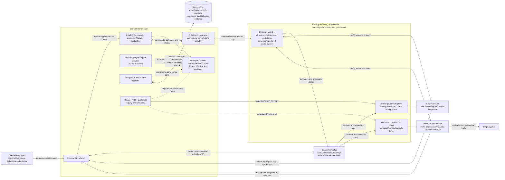
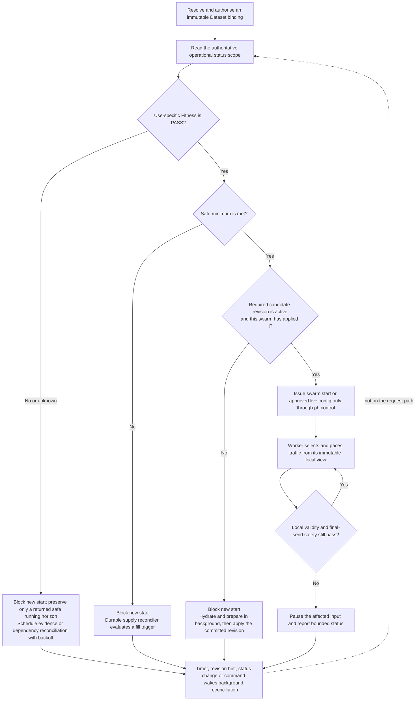

# Managed Datasets — Team Design Overview

Status: proposed architecture for internal concept approval; not implemented,
capacity-qualified, or approved for release

Detailed sources:

- `managed-test-data-lifecycle-generic-spec.md`
- `managed-datasets-operator-ui-design-spec.md`
- `managed-test-data-assurance-strategy.md`

## Decision requested

Approve the Managed Dataset direction and a small pre-implementation learning
slice. Do not approve a delivery estimate or release claim yet. The learning
slice must prove the control-plane integration, live target state transitions,
recovery, and two-swarm reuse at bounded scale. The release gate—not the
learning slice—must prove the exact 50,000-record profile described below.

## Direct answers to the review

| Review question | Design decision |
|---|---|
| Must swarm control use the existing RabbitMQ control plane? | **Yes—non-negotiable.** Template, plan, start, stop, remove, approved live configuration, status requests, outcomes, status and alerts use the existing `ph.control` exchange and per-component control queues. Managed Datasets introduce no parallel swarm control queue. |
| Can 50,000 records be shared and reused? | The proposed reusable MVP has a 50,000 eligible-record target and supports concurrent `SHARED` use by at least two swarms. Records stay in each worker's bounded local, read-only view and are reused after a local selection cycle; they are not removed and “added back.” This capacity becomes a support claim only after the named 50,000-record qualification passes. |
| Is today's Redis behaviour preserved? | Yes, unchanged and opt-in. `REDIS_DATASET` destructively pops with `LPOP`; a separately configured `REDIS` output can later `LPUSH`/`RPUSH` a value into a list. That loop is not an atomic borrow/return guarantee and has no qualified 50,000-record claim. Exact FIFO/LIFO, consumable, exclusive and state-loop semantics remain on Redis for the MVP. |
| Is today's CSV behaviour preserved? | Yes, unchanged and opt-in. A worker loads its configured CSV file, reads sequentially and may rotate locally; after a worker restart it begins from row zero. This is not a shared durable pool, an add-back contract or a qualified 50,000-record path. |
| Can the target size change while swarms run? | **Proposed: yes, conditionally and with bounded convergence rather than instant mutation.** This changes desired eligible inventory, not physical database or external-entity count. An authorised, immutable Supply Policy version requests the change. A higher target opens one durable fill-to-target cycle only when it exceeds both the prior target and current effective supply. A lower target first stops new reservations, prepares a non-authoritative transition manifest, then commits and applies one canonical revision that moves deterministic surplus `READY` records to `STANDBY`; it never silently deletes an external entity or invalidates an in-flight safe view. Unsafe or infeasible changes are rejected with zero effect. |
| Where is the data? | Scenario Manager persists authored immutable definitions. Managed Dataset PostgreSQL stores the admitted definition snapshot/digest plus authoritative records, candidate/active policy state, schedules, operations and evidence. Workers hold bounded, immutable local projections. RabbitMQ carries control, work instructions and metadata-only hints—never record values or credentials. |

The Managed Dataset feature does not exist in the current implementation. The
statements above are requirements for the proposed feature unless explicitly
described as existing Redis or control-plane behaviour.

## Component placement and message paths

The Swarm Controller exclusively owns the WorkItem and Dataset-hint queue and
binding topology used here. Existing components continue to declare their own
control queues through PocketHive's current control-plane pattern. The Dataset
module publishes supply only to the exact controller-issued route. Source
results and worker hydration use authorised Orchestrator APIs. A Rabbit
acknowledgement proves message handling only; PostgreSQL receipts prove Dataset
state. The dashed “implements” arrows point inward because infrastructure
adapters depend on application-owned ports; they are not domain dependencies.

## Runtime decision flow

## State scenarios

There is deliberately no single overloaded “Dataset state.” Operators see
separate facts so a healthy store cannot hide unfit data or an uncertain source
operation.

| State dimension | Values | Meaning |
|---|---|---|
| Module availability | `READY`, `RECONCILING`, `DEGRADED`, `UNAVAILABLE` | Can the Orchestrator Dataset module currently make authoritative decisions? |
| Operational status-scope health | `INITIALISING`, `WARMING`, `READY`, `DEGRADED`, `STARVED`, `ERROR`, `AUTH_REQUIRED` | Server-composed condition for this exact scope and use. `READY` requires safe minimum, Fitness, validity and distribution; it does not mean the target is full. The underlying facts remain visible separately. |
| Record eligibility | `READY`, `STANDBY`, `QUARANTINED`, `RETIRED` | State of one record. Record `READY` means eligible for a new selection; it is not the same fact as status-scope health `READY`. `STANDBY` is valid reserve, not deletion. |
| Use-specific Fitness | `PASS`, `FAIL`, `UNKNOWN` | Is this exact revision suitable for this declared use and environment? A count alone never produces `PASS`. |
| Supply operation | `RESERVED`, `QUEUED`, `RUNNING`, `SUCCEEDED`, `PARTIAL`, `FAILED`, `TIMED_OUT`, `CANCELLED`, `UNCERTAIN` | What happened to one source operation? `UNCERTAIN` retains its reservation and is reconciled, not blindly retried. |
| Running decision | `CONTINUE`, `CONTINUE_UNTIL`, `PAUSE`, `UNKNOWN`, `NOT_APPLICABLE` | What may an already-running binding do? This is separate from whether a new swarm may start. |
| Start decision | `ALLOW`, `BLOCK`, `UNKNOWN` | Whether one exact new swarm binding may start against its authoritative status, Fitness and applied revision. |
| Policy convergence | `STABLE`, `FILLING_TO_TARGET`, `APPLYING_SMALLER_VIEW`, `BLOCKED`, `PAUSED`, `UNKNOWN` | Whether requested/candidate, active and swarm-applied policy targets have converged. Command acceptance alone is not convergence. |
| Decommission | `ACTIVE`, `DRAINING`, `TOMBSTONED`, `EXTERNAL_RECONCILING`, `RETIRED` | How is a Dataset safely withdrawn and its external lifecycle completed? |

Common scenarios:

| Scenario | New start | Existing safe traffic | System action |
|---|---|---|---|
| First fill below minimum during the allowed warm-up window | Blocked | Not applicable | `WARMING`; create bounded supply work |
| Minimum met, below target | Allowed only when Fitness and activation also pass | Continue | `READY`; replenish only when the watermark or a target increase opens a fill cycle |
| Below minimum but a prior local view is still safe | Blocked | Continue only to the returned safe boundary | `DEGRADED`; replenish and re-evaluate |
| No safe eligible data after the warm-up/recovery grace, or Fitness fails | Blocked | Pause affected input | `STARVED`; fail closed |
| Current evidence unavailable | Blocked | At most `CONTINUE_UNTIL` on the exact prior approved view | Fitness `UNKNOWN`; reconcile before activation |
| Provider outcome cannot be proven | Unaffected unless reserve/health is exhausted | Safe data may continue | Operation `UNCERTAIN`; retain capacity and inspect provider truth |
| Supply is administratively paused | Depends on existing safe data and Fitness | May continue safely | Stop new claims; do not pretend to cancel an external call |
| Target raised or lowered | No wiring restart | Current safe view remains atomic | Activate a new policy version and converge through the lifecycle reconciler |
| Target change is unsafe or exceeds a bound | Existing state is unchanged | Existing safe traffic follows its current decision | Reject the command with a bounded reason; create no policy, record, queue or external effect |

Target decisions use the prior target, the current effective supply and the new
target—never the new target alone:

| Change | Current effective supply | Result |
|---|---:|---|
| First policy | Below new target | Open `INITIAL_DEMAND` unless paused |
| New target is higher than prior | Below new target | Open one `TARGET_INCREASE` cycle |
| New target is higher than prior | At or above new target | No fill cycle |
| Target unchanged and no prior fill remains open | Below the active low watermark | Normal `LOW_WATERMARK` cycle only |
| Target unchanged and the replaced version had an open fill | Below the unchanged target | Continue the fill intent as `POLICY_REPLACEMENT_CONTINUATION`, even above the low watermark |
| New target is lower than prior | Any | Hold new reservations during transition; never open `TARGET_INCREASE`. Move eligible surplus to `STANDBY`; after convergence, ordinary low-watermark policy may run if genuinely below the new low watermark. |

## How scheduling works

PocketHive has three different timing mechanisms:

1. **Dataset lifecycle reconciler — proposed, durable.** Runs inside the Managed
   Dataset module independently of scenarios. PostgreSQL stores fill cycles,
   policy versions, refresh/validation deadlines, reservations, attempts,
   backoff and fences. Fair bounded reconciliation decides whether to supply,
   refresh, validate, replace or retire data. RabbitMQ only delivers the
   resulting bounded work. Concretely, a due row is claimed with a database
   fence; the reconciler reads the active policy and current counts; one
   transaction reserves capacity and writes the operation plus outbox; the
   relay sends `DATASET_SUPPLY` on the leased WorkItem route; and the typed API
   receipt updates cycle accounting and the next due row. After a crash, claim
   expiry and outbox replay resume that same identity. Per-scope fairness and
   bounded backoff prevent one failing Dataset from monopolising the loop.
2. **Scenario timeline — existing, controller-local.** Applies planned swarm and
   worker steps such as start, stop or configuration at their offsets. Every
   resulting swarm control event uses `ph.control`. Its current in-memory
   recovery limitations remain a separate platform non-claim.
3. **Traffic pacer — existing, worker-local.** `ratePerSec` controls how often a
   worker emits traffic. `maxMessages` is a finite-run safety cap, not Dataset
   size. Approved live rate changes arrive through the control plane.

Dataset target size is therefore an inventory level—not a transaction count,
traffic rate, scheduler limit or number of times a reusable record may be used.

## Approval boundary

This revision is suitable for a cross-functional concept decision. It is not
implementation-ready until the canonical API/event schemas, policy-activation
contract, 50,000-record manifest, owner/SLO decisions and executable evidence
plan are approved. It is not release-ready until the exact implementation
passes the two-swarm 50,000-record capacity, live-resize, recovery,
non-interference, security and Redis-regression gates.
