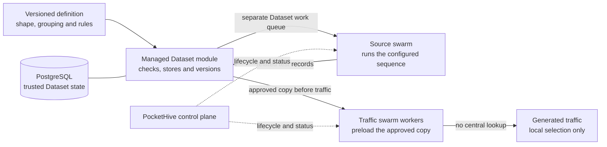

# Managed Datasets — Team Design Overview

Status: proposal for internal concept discussion; not implementation or release
approval

Detailed sources:

- `managed-test-data-lifecycle-generic-spec.md`
- `managed-datasets-operator-ui-design-spec.md`
- `managed-test-data-assurance-strategy.md`

This document explains the idea in platform-neutral language. The detailed
sources remain authoritative.

## Decision requested

Approve Managed Datasets as the direction for pre-implementation contract and
discovery work. This allows the team to select one representative non-sensitive
workflow, close the detailed and machine-readable contracts, and assign named
owners. It does not authorise an implementation estimate, implementation,
architecture or security qualification, production delivery, or release.

## The idea

One PocketHive swarm prepares a related set of test records. PocketHive checks
and stores them as a controlled, reusable **Managed Dataset**. Other swarms
download an approved copy before a test and use it locally while generating
traffic. A **swarm** is a group of PocketHive workers; a **group** or **cohort**
is a set of records that shares configured characteristics.

The expected value is less repeated setup, fewer invalid test starts, safer
reuse across swarms, and more trustworthy performance measurements because a
measured request does not depend on a central Dataset lookup.

## High-level design

RabbitMQ moves work and notifications between components. PostgreSQL, not a
queue or message, remains the trusted record of Dataset state.

## How it works

1. **Define** the record shape, relationships, workflow, grouping, validity,
   access and intended use.
2. **Prepare and check** limited-size batches of related record sets; validate
   and record the outcome for each set independently.
3. **Store and version** accepted sets, assign their validated group, and create
   a revision only when stored state changes.
4. **Preload and use** the exact approved revision on authorised workers before
   traffic, then select locally.
5. **Maintain and prove** validity and, where the source profile supports it,
   refresh, replacement and cleanup without exposing record values.

## Configurable grouping — proposed contract

PocketHive must not hard-code organisation- or workflow-specific grouping
fields. It must also not encode them into, or recover them by parsing, a Dataset
name.

The proposal keeps a stable Dataset identity and adds a versioned, bounded
**Grouping Schema** defining permitted names, types, required values and
selectable values. Existing template variables may supply candidate values;
the Managed Dataset module validates them and assigns the canonical group.

The contract keeps three facts separate:

- the Dataset definition owns the grouping schema;
- each committed related record set receives one immutable, validated group
  assignment; and
- each consumer binding freezes the exact group it will use.

For the first slice, selection is one complete, exact group—no wildcards,
ranges, partial matches, multiple values or silent reclassification. A group
never grants access or replaces the existing Dataset, partition and pool scope.
Schema changes require explicit compatibility, migration or replacement rules.

This grouping contract is not yet part of the authoritative specifications,
UI or assurance evidence. Those sources must be amended and reassessed before
the design can pass an implementation-readiness gate.

## RabbitMQ responsibility

The design reuses the qualified RabbitMQ broker and PocketHive topology tools,
but not an existing control queue for Dataset work.

| Lane | Responsibility |
|---|---|
| Existing control plane | Swarm start, stop, configuration and status only |
| Dataset work queue (canonical WorkItem lane) | Durable source work on a controller-owned, limited queue |
| Dataset notification lane | Bounded, metadata-only notice that a newer revision may exist |
| PostgreSQL and outbox | Dataset truth and durable publication intent |

Supply work uses the existing WorkItem RabbitMQ namespace; revision notices use
an isolated Dataset RabbitMQ namespace. Separate identities, connections and
limits prevent Dataset work from sharing a control queue; no bridge or fallback
connects the lanes. A broker-wide resource alarm can still affect both.
RabbitMQ messages never contain record values, credentials or source response
bodies.

## What the first learning slice must prove

Use one controlled, non-sensitive fake source and test system shaped like the
selected workflow, one record shape, one grouping schema, one shared Dataset
and two concurrent traffic swarms. Agree numeric targets first. Evidence must
show:

- each consumer receives only the exact configured group and revision;
- restarts, retries and redelivery neither lose accepted state nor repeat an
  uncontrolled source effect;
- invalid, incomplete or stale data blocks new use;
- no record values or credentials appear in messaging, logs, UI, agent tools or
  proof;
- measured traffic performs no central Dataset I/O; and
- Dataset activity stays within the agreed control-plane and traffic limits.

## Before estimating or implementing

The team must close:

- **Workflow and data:** source sequence, related-record shape, grouping schema,
  representative consumers and concurrent-use assumptions.
- **Safety and operations:** access, validity, retention, cleanup, supported
  infrastructure and recovery ownership.
- **Success and accountability:** numeric outcomes, baseline, evidence, named
  owners and approval dates.

**Recommended outcome:** approve concept and pre-implementation contract work
only. Update the detailed specifications, machine contracts, UI and assurance
coverage, then return for implementation-readiness review before estimating or
implementing.
