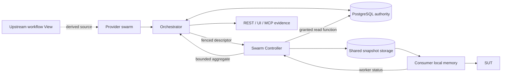

# Managed Datasets — Team Brief

Status: proposed Release 1; architecture and canonical contracts require approval

## Decision required

Approve Managed Dataset Release 1 as a PostgreSQL-backed durable option that
provider swarms create and compatible consumer swarms select explicitly.
Existing `REDIS_DATASET`, `CSV_DATASET` and direct `SCHEDULER` adapters remain
unchanged.

Trade-off: local snapshots, leases and one restricted Controller reader add
background work but keep Dataset authority off the measured path. Arbitrary
queries, reclamation, payload mutation and exactly-once claims are excluded.

## Why this matters

Managed Dataset lets one swarm create reusable, schema-valid
system-under-test (SUT) records for many consumers instead of recreating them.

## Proposal

- A provider run creates one named Managed Dataset per output binding. Every
  provider binding selects exactly one `SCHEDULER`, `CSV`, `REDIS` or
  `MANAGED_DATASET` source, with no switching or fallback.
- A consumer selects one exact Dataset, Group and optional View during Create
  Swarm, or explicit empty arrays when none is required.
- PostgreSQL is authoritative. Orchestrator grants; the Controller reads one
  bounded function and publishes an atomic revision. Workflow claims return
  identity, state and lease only, including derived input; workers resolve
  immutable payload from local memory.
- Revision hints mark a binding dirty. Controller reconciliation publishes only
  the latest revision after a required minimum interval; worker background polls
  load it. Failure preserves the old safe snapshot.
- Workers report through the Controller. Full status retains bounded reporter
  detail; deltas contain only small binding aggregates and digests. Orchestrator
  derives the three status planes for REST, UI and PocketHive Model Context
  Protocol (MCP). Group status remains visible with no consumer; evidence never
  claims SUT acceptance or exactly-once.

## Where it sits

```mermaid
flowchart LR
  P[Provider swarm] --> O[Orchestrator]
  U[Upstream workflow View] -. derived source .-> P
  O <--> PG[(PostgreSQL authority)]
  O -->|fenced descriptor| SC[Swarm Controller]
  SC -->|granted read function| PG
  SC --> FS[(Shared snapshot storage)]
  FS --> C[Consumer local memory]
  C --> SUT[SUT]
  C -->|worker status| SC
  SC -->|bounded aggregate| O
  O --> E[REST / UI / MCP evidence]
```

| Concern | Owner |
|---|---|
| Definition, schemas, grouping, Views and transitions | Dataset Definition in Scenario Manager |
| Source, Groups, allocation, lifecycle and mappings | Provider Scenario Binding |
| Requirements and exact selection | Consumer template/binding and Create Swarm |
| Records, state, leases, lineage, grants and read models | Orchestrator Managed Dataset module |
| Snapshot read, file publication and worker status aggregate | Swarm Controller |

## Essential definitions

| Term | Status | Plain meaning | Not the same as |
|---|---|---|---|
| Managed Dataset | Proposed | Named durable records from one provider run, reusable by consumers | A Redis list or queue |
| Dataset Space | Proposed | Versioned definitions and schemas used by Scenario Bindings | A runtime Dataset |
| Group | Proposed | Frozen partition by schema-defined fields | A name or runtime filter |
| `REPLAY` | Proposed | Immutable records with shared or exclusive allocation | Workflow state |
| `WORKFLOW` | Proposed | Immutable records plus typed state, Views and transitions | Free-form tags or queries |
| View | Proposed | Materialised selection over Record State | A copied or separate Dataset |
| Derivation | Proposed | One leased workflow record creates bounded downstream records | Outcome routing or clone |
| Group Availability | Proposed | Group authority health, with or without consumers | Publication or consumption health |
| Publication Status | Proposed | Publication health for one binding | Worker loading or use |
| Consumption Status | Proposed | Evidence of worker load, selection and SUT attempt | SUT acceptance or audit proof |

## Example

One provider creates a workflow Dataset. Another consumes its `ready` View under
`EXCLUSIVE_LEASE`. `SUCCESS` atomically creates `1..N` downstream records and
updates upstream state; other outcomes create none.

## Included / not included

| Included | Not included |
|---|---|
| `REPLAY + SHARED` or `EXCLUSIVE_LEASE` | Queue/pop or use-count semantics |
| `WORKFLOW + EXCLUSIVE_LEASE` | Free-form tags, selectors or payload replacement |
| Scheduler, finite CSV/Redis import and bounded derived source/publication | Source fallback, rotation or destructive Redis pop |
| Closed four-case Outcome Mapping with no default | SUT-result inference or reconciliation |
| One atomic bounded derivation destination | Multi-destination fan-out or arbitrary cross-Dataset transactions |
| Operational consumption evidence | Audit proof or exactly-once claims |
| Non-expiring records and bounded fill-to-target | Record expiry, reclamation or purge |

## Release boundary

Release 1 includes both replay modes, mutable workflow, all four sources and
bounded Derivation. M2a shared replay is only the foundation; mutable workflow
and the M2c/M2d capabilities remain required. All operational gates must pass.

## Main trade-off

Local snapshots keep workers database-free and the measured path fast. The
single Controller needs a restricted credential and explicit publication and
recovery. Full snapshots trade simplicity for operating-horizon bandwidth,
filesystem operations and all-worker restart fan-out; admission must fund them.
Loaded workers may survive a short Controller outage, which is continuity rather
than high availability. Derivation and `EXCLUSIVE_LEASE` still require
concurrency, failure and soak qualification.

## Next step

Approve the Release 1 model, then complete the M0 executable Scenario, worker,
API, WorkItem, status and snapshot contracts before runtime implementation.

## Technical detail

- [Managed Test Data Release 1 Specification](managed-test-data-lifecycle-generic-spec.md)
