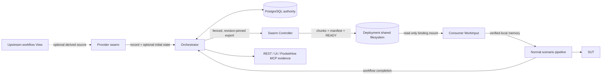

# Managed Datasets — Team Design Brief

Status: in progress; proposed MVP and canonical contract approval pending

## Decision

Approve the [Managed Test Data MVP Specification](managed-test-data-lifecycle-generic-spec.md)
as the normative design for durable, reusable test records.

```text
provider binding -> exactly one SCHEDULER, CSV, REDIS or MANAGED_DATASET source
provider run -> one named Managed Dataset with one or more frozen Groups
consumer binding -> one exact Dataset/Group or workflow View/transition
Swarm Controller -> one verified per-swarm publication
consumer input -> verified local memory -> normal scenario pipeline
```

Managed Dataset is additive. Existing `REDIS_DATASET`, `CSV_DATASET` and
direct `SCHEDULER` adapters remain unchanged. Every I/O binding names exactly
one adapter; there is no migration, source switching or fallback.

A scenario that needs no Managed Dataset declares
`managedDatasetRequirements: []`; Create Swarm sends
`datasetSelections: []`. Otherwise every requirement has one exact selection.

## Domain model

A provider swarm can create reusable SUT records once for many consumer
swarms. A Dataset keeps its human-readable `name` and opaque `datasetId`.
Records may be partitioned by arbitrary schema-defined Group keys; these are
not PocketHive fields. `UNGROUPED` creates one internal Group.

Every Dataset freezes one Profile and one allocation contract:

| Profile | Record model | Allocation |
|---|---|---|
| `REPLAY` | Immutable reusable payload | `SHARED` or `EXCLUSIVE_LEASE` |
| `WORKFLOW` | Immutable payload plus separately versioned mutable Record State, fixed Views and declared transitions | `EXCLUSIVE_LEASE` only |

`WORKFLOW` is the bounded mutable capability required for current use cases.
One consumer requirement names one View and exactly one `transitionId`. A
completion supplies one complete next-state object. Orchestrator validates the
live lease, expected state revision, permitted paths, state schema and target
View, then updates state, materialised memberships and lease atomically.

Use Record State and named, overlapping Views for outcome and retry queues.
Views select the same record; they do not copy or move it. Create another
Dataset only when the output records need their own identity, schema,
allocation, retention or lifecycle. The bounded derived-source operation below
is the only cross-Dataset MVP transaction.

A scenario-owned Outcome Normaliser emits exactly one closed class:
`SUCCESS`, `RETRYABLE_FAILURE`, `TERMINAL_FAILURE` or `UNKNOWN`. Its terminal
Outcome Mapping handles all four classes with no default and produces one
complete next state. PocketHive validates that declared mapping; it does not
parse SUT responses or claim the classification is business-correct.

Payload replacement, arbitrary selectors or patches, free-form tags,
multi-destination fan-out and exact Dataset clone are deferred. A future clone
operation must pin one immutable source revision; transformation or enrichment
uses the derived source instead.

## Configuration ownership

| Owner | Owns |
|---|---|
| `scenarios/managed-dataset/<name>/` | Dataset Definition: name, version, Profile, grouping, `record.schema.yaml`, and workflow state schema, Views and transitions |
| `scenarios/dataset-contracts/<name>/<version>/` | One immutable reusable `schema.yaml`; roots pin exact versions and may add local `$defs` |
| Scenario Manager Dataset Space | Package validation, restricted JSON Schema compilation, dependencies and opaque digests |
| Provider Scenario Binding | Definition, exactly one source, concrete Groups, provider-only templates/mappings, allocation, lifecycle, supply and capacity |
| Consumer Scenario Template | Required Profile/access/allocation; workflow View, exact transition, completion role and release policy |
| Consumer Scenario Binding | Validates and freezes requirements against one SUT Environment and Dataset Space |
| Create Swarm | One exact compatible selection per `bindingRef`, or an explicit empty array |
| Deployment profile | Orchestrator client, Redis connection contracts, storage adapter/reference, clock-health reference and every count/rate/byte/memory limit |
| Operator runbook | Capacity horizon, thresholds, response, backup/restore and escalation; never direct file or PostgreSQL deletion |

Only Scenario Manager reads the mounted registries. Invalid, remote, ranged,
cyclic or changed published schema contracts fail; a failed reload publishes
nothing and leaves the last valid registry revision active. This is
transaction safety, not version fallback.

Example workflow requirement:

```yaml
managedDatasetRequirements:
  - bindingRef: inputRecords
    datasetDefinitionId: shared-records
    profile: WORKFLOW
    access: READ_STATE_TRANSITION
    allocation:
      type: EXCLUSIVE_LEASE
      acquireBatchSize: 10
      maximumHeldRecordLeases: 20
      acquireInterval: PT1S
    workflow:
      viewId: ready
      transitionId: attempt-complete
      allowReleaseUnchanged: false
      completionRole: dataset-completion
      completionLagTolerance: PT30S
```

## Provider sources

Each provider binding selects exactly one source:

| Source | MVP behaviour |
|---|---|
| `SCHEDULER` | Renewable. Group-scoped grants stage complete cohorts; grant completion publishes at most one new payload revision. |
| `CSV` | Finite. Validate and import one mounted provider-bundle artifact in stable row order. |
| `REDIS` | Finite. Copy one referenced list to a bounded provider-owned staging key and import that immutable copy in stable index order. Never pop or change the live list. |
| `MANAGED_DATASET` | Renewable derived work. Lease one exact upstream `WORKFLOW` View selected at Create Swarm and create bounded independent records in one downstream Dataset. |

Finite imports bind one content fingerprint and publish all Groups atomically
after complete validation. Redis validates each `MULTI/EXEC` result, applies a
bounded TTL and removes only its owned staging key after success or failure.
Copy, expiry, cleanup, collision or fingerprint failure blocks the run; there
is no fallback.

For `MANAGED_DATASET`, one frozen upstream requirement and one downstream
output are mandatory. `SUCCESS` creates the configured bounded `1..N` records;
every other Outcome creates zero. One PostgreSQL transaction validates both
bindings, commits destination records, initial state/View membership and
lineage, changes the upstream state and releases its lease. Any failure changes
neither Dataset. Exact replay is idempotent; changed or stale replay fails.

## Runtime and storage


```mermaid
flowchart LR
  U[Upstream workflow View] -. optional derived source .-> P
  P[Provider swarm] -->|record + optional initial state| O[Orchestrator]
  O <--> PG[(PostgreSQL authority)]
  O -->|fenced, revision-pinned export| SC[Swarm Controller]
  SC -->|chunks + manifest + READY| FS[(Deployment shared filesystem)]
  FS -->|read-only binding mount| WI[Consumer WorkInput]
  WI -->|verified local memory| S[Normal scenario pipeline]
  S --> SUT[SUT]
  S -->|workflow completion| O
  O --> E[REST / UI / PocketHive MCP evidence]
```

PostgreSQL is authoritative for Managed Dataset records and revisions,
publication grants, Record State, View membership, leases, imports, refill,
derivation lineage and idempotency. Snapshot files and worker memory are
derivative only.

For each admitted binding, the Swarm Controller exports one exact revision via
authenticated Orchestrator REST and publishes one immutable physical snapshot
under its swarm directory. It writes bounded RFC 8785 NDJSON chunks, a closed
manifest and `READY` last, durably flushes them, verifies digests and atomically
publishes the revision. Publications are single-flight and later revisions
coalesce.

The deployment owns the storage adapter, path and access modes. The Controller
gets read-write access only to its swarm directory. Only applicable consumer-
input workers get a read-only binding mount; other workers get no Dataset
mount. Invalid or unhealthy storage fails provisioning. Scenario authors never
choose paths or permissions.

Workers verify `READY`, manifest, chunks, schema and whole digest, then load an
immutable local snapshot before readiness. The measured path uses only local
memory. It makes no filesystem, PostgreSQL, Controller, Orchestrator or
credential-provider call. Workflow state and lease eligibility always come
from bounded background authority claims, never from snapshot files.

Already-loaded safe workers may continue during Controller or filesystem
outage. New or restarted workers remain unready. Cross-swarm file caching,
object storage, Redis snapshot cache, a new distribution service and direct
Controller/worker PostgreSQL access are deferred.

## Evidence and safety

Every selected WorkItem carries one structured `MANAGED_DATASET_CONTEXT` in
the normal JSON body. It is not a broker header or observability context. The
SDK preserves it and validates Dataset, Group, revision, Profile, allocation,
validity and any lease/View/state revision immediately before SUT network I/O.

Orchestrator alone derives `ManagedDatasetConsumptionStatus`; REST, UI and MCP
return the same read model. `CONSUMING` requires fresh matching evidence across:

1. PostgreSQL authority revision and record-schema digest;
2. active Swarm Controller publication manifest and whole digest;
3. every expected consumer-input worker loading that exact publication;
4. local selection and the same frozen identity at the guarded SUT boundary;
5. a valid lease for exclusive use; and
6. for workflow, the claimed state revision and authority-confirmed exact
   transition or explicitly allowed unchanged release, including the accepted
   Outcome class and frozen mapping digest; and
7. for derivation, the frozen source/destination bindings and atomically
   committed downstream count.

Missing, stale, partial or mismatched evidence is never green. This proves the
selected Dataset contract and declared mapping reached the scenario boundaries;
it does not expose Outcome codes or record identities and does not prove SUT
acceptance, business correctness, exactly-once delivery or audit truth.

## MVP release gate

M0 must first establish one canonical executable owner for the Scenario,
worker capability, API/error, WorkItem Context, status, snapshot and restricted
schema contracts. `datasetProposalZbig.md` is non-normative input.

Production release then requires:

- database constraint, lock-order, isolation, fencing and idempotency tests;
- source, grouping, schema, lease, closed Outcome Mapping, transition,
  derivation lineage/atomicity, restart and failure tests;
- typed-mount, digest, filesystem outage and every-node reschedule tests;
- capacity admission for count, byte, logical mutation-rate, snapshot,
  filesystem, memory, idempotency and concurrency limits;
- comparison with an equivalent preloaded-memory fixture at maximum approved
  size/fan-out: throughput and p95/p99 overhead each at most 2%; and
- a target-scale 24-hour soak plus an approved retention/capacity runbook.

`EXCLUSIVE_LEASE` and snapshot publication are specified, not yet production-
qualified. Implementation starts only after Dataset Space/Scenario Binding and
the M0 contract pack are approved.
