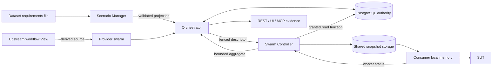

# Managed Datasets — Team Brief

Status: proposed Release 1; architecture and canonical contracts require approval

## Decision required

Approve the Managed Dataset Release 1 architecture and staged delivery: one
shared-replay MVP, one required mutable-workflow parity increment, then the
remaining sources and Derivation. Provider swarms create durable records and
compatible consumer swarms select them explicitly.
Existing `REDIS_DATASET`, `CSV_DATASET` and direct `SCHEDULER` adapters remain
unchanged.

Trade-off: local snapshots, leases and one restricted Controller reader add
background work but keep Dataset authority off the measured path. Arbitrary
queries, reclamation, payload mutation and exactly-once claims are excluded.
Scenario descriptors stay on Protocol v2; consumer dependencies use one
independently versioned Scenario Bundle requirements file.

## Why this matters

Managed Dataset lets one swarm create reusable, schema-valid
system-under-test (SUT) records for many consumers instead of recreating them.

## Proposal

- A provider run creates one named Managed Dataset per output binding. Every
  Release 1 provider binding selects exactly one `SCHEDULER`, `CSV`, `REDIS` or
  `MANAGED_DATASET` source, with no switching or fallback. The MVP enables only
  `SCHEDULER + REPLAY + SHARED`.
- A consumer dependency uses non-empty `datasets/requirements.yaml` and selects
  one exact Dataset, Group and optional View during Create Swarm. File absence
  plus `datasetSelections: []` is valid only when the Scenario has no Managed
  Dataset consumer input or derived source; a provider-only scenario may still
  create its Dataset through an explicit output binding. Requirements and those
  input/source bindings map one-to-one.
- PostgreSQL is authoritative. Orchestrator grants; the Controller reads one
  bounded function and publishes an atomic revision. Workflow claims return
  identity, state and lease only, including derived input; workers resolve
  immutable payload from local memory.
- Revision hints mark a binding dirty. Controller reconciliation publishes only
  the latest revision. A minimum start interval and single-flight export bound
  the rate; worker background polls load it. After atomic activation, the
  Controller records a fenced Snapshot Activation Confirmation. Its predecessor
  marker remains outside the revision until safe deletion is acknowledged.
  Each binding has an explicit limit for deletion acknowledgements not yet
  stored, including after predecessor files are deleted. The next publication
  reserves one place; exhaustion blocks only that binding. Orchestrator retains
  the confirmation indefinitely and starts a full replay-evidence period when
  acknowledgement is stored. Absent proof keeps required evidence and any
  retained revision protected. A never-completed export releases its authority
  reservation only through fenced terminal abandonment. Completed or
  activation-uncertain work stays reserved for recovery, and staging remains
  filesystem-accounted until qualified cleanup.
- Workers report through the Controller. Full status retains bounded reporter
  detail; deltas contain only small binding aggregates and digests. Orchestrator
  derives the three status planes for REST, UI and PocketHive Model Context
  Protocol (MCP). Group status remains visible with no consumer; evidence never
  claims SUT acceptance or exactly-once.

## Where it sits

```mermaid
flowchart LR
  R[Dataset requirements file] --> SM[Scenario Manager]
  SM -->|validated projection| O[Orchestrator]
  P[Provider swarm] --> O
  U[Upstream workflow View] -. derived source .-> P
  O <--> PG[(PostgreSQL authority)]
  O -->|fenced descriptor| SC[Swarm Controller]
  SC -->|granted read function| PG
  SC --> FS[(Shared snapshot storage)]
  FS --> C[Consumer local memory]
  C --> SUT[SUT]
  C -->|worker status| SC
  SC -->|bounded aggregate| O
  O --> E[REST / UI / MCP evidence]
```

| Concern | Owner |
|---|---|
| Definition, schemas, grouping, Views and transitions | Dataset Definition in Scenario Manager |
| Source, Groups, allocation, lifecycle and mappings | Provider Scenario Binding |
| Consumer requirements | Dataset Requirements Document validated by Scenario Manager |
| Exact Dataset/Group/View selection | Create Swarm and the frozen Scenario Binding |
| Records, state, leases, lineage, grants and read models | Orchestrator Managed Dataset module |
| Snapshot read, file publication, retention cleanup and worker status aggregate | Swarm Controller |
| Requirements file schema, parsing, validation and `artifactDigest` evidence | Scenario Manager |
| Requirements-version/digest handshake and frozen selections | Scenario Manager and Orchestrator |

## Essential definitions

| Term | Status | Plain meaning | Not the same as |
|---|---|---|---|
| Managed Dataset | Proposed | Named durable records from one provider run, reusable by consumers | A Redis list or queue |
| Dataset Space | Proposed | Versioned definitions and schemas used by Scenario Bindings | A runtime Dataset |
| Group | Proposed | Frozen partition by schema-defined fields | A name or runtime filter |
| `REPLAY` | Proposed | Immutable records with shared or exclusive allocation | Workflow state |
| `WORKFLOW` | Proposed | Immutable records plus typed state, Views and transitions | Free-form tags or queries |
| View | Proposed | Materialised selection over Record State | A copied or separate Dataset |
| Derivation | Proposed | One leased workflow record creates bounded downstream records | Outcome routing or clone |
| Snapshot Activation Confirmation | Proposed | Orchestrator record of one fenced Controller's durable snapshot switch | Publication completion or deactivation marker |
| Snapshot Deletion Acknowledgement | Proposed | Idempotent authority evidence that the Controller safely removed the predecessor revision | Deactivation marker or delete request |
| Dataset Requirements Document | Proposed | Optional versioned `datasets/requirements.yaml`; when present it declares one or more consumer needs | `scenario.yaml` or a concrete Dataset selection |
| Group Availability | Proposed | Group authority health, with or without consumers | Publication or consumption health |
| Publication Status | Proposed | Publication health for one binding | Worker loading or use |
| Consumption Status | Proposed | Evidence of worker load, selection and SUT attempt | SUT acceptance or audit proof |

## Example

One scheduled provider creates a named Dataset with schema-defined Groups.
Several consumer swarms select one exact Group and replay its records from local
memory. MCP shows whether the expected revision was published, loaded, selected
and carried to the SUT-attempt boundary.

## Included / not included

| Included | Not included |
|---|---|
| `REPLAY + SHARED` or `EXCLUSIVE_LEASE` | Queue/pop or use-count semantics |
| `WORKFLOW + EXCLUSIVE_LEASE` | Free-form tags, selectors or payload replacement |
| Scheduler, finite CSV/Redis import and bounded derived source/publication | Source fallback, rotation or destructive Redis pop |
| Closed four-case Outcome Mapping with no default | SUT-result inference or reconciliation |
| One atomic bounded derivation destination | Multi-destination fan-out or arbitrary cross-Dataset transactions |
| Operational consumption evidence | Audit proof or exactly-once claims |
| Non-expiring records and bounded fill-to-target | Record expiry, reclamation or purge |
| Versioned bundle requirements extension with fail-closed admission | A Scenario Protocol migration or silently ignored file |

## Delivery boundary

| Boundary | Included | Completion rule |
|---|---|---|
| Shared-replay MVP | `SCHEDULER + REPLAY + SHARED`, Groups, exact/empty selection, local snapshots and REST/MCP evidence | M0, M1a, M2a and M3a pass |
| Mutable parity | `SCHEDULER + WORKFLOW + EXCLUSIVE_LEASE`, Record State, Views, transitions and Outcome Mapping | M1b, M2b and mutable M3b gates pass |
| Release 1 extensions | Replay exclusive, finite CSV/Redis import and bounded Managed Dataset Derivation | M2c, M2d and their M3b gates pass |
| Release 1 completion | Shared MVP, mutable workflow, replay exclusive, CSV, Redis, Managed Dataset Derivation, read-only UI and full qualification | Every named target and M3b gate passes |

Fencing, activation confirmation, abandonment, retention, capacity, recovery,
security and evidence remain required in the MVP. Unsupported capabilities are
not advertised and fail admission; PocketHive never substitutes one.

Required order: `M0 -> M1a -> M2a -> M3a`, then
`M1b -> M2b -> mutable M3b`, then `M2c and M2d -> their M3b gates`.
The capability catalogue controls availability; it cannot redefine Release 1.
The M3b UI only projects the Orchestrator status model; it adds no status logic.

## Main trade-off

Local snapshots keep workers database-free and the measured path fast. The
single Controller needs a restricted credential and explicit publication and
recovery. Full snapshots trade simplicity for operating-horizon bandwidth,
Controller/worker filesystem operations, safe retention and all-worker restart
fan-out; admission must fund them.
Loaded workers may survive a short Controller outage, which is continuity rather
than high availability. Derivation and `EXCLUSIVE_LEASE` still require
concurrency, failure and soak qualification. Existing Scenario Protocol v2
bundles need no migration and remain creatable in either rolling-upgrade order.
Only Managed Dataset discovery and admission are disabled until Scenario Manager
and Orchestrator both advertise requirements version 1.

## Next step

Approve the Release 1 model and staged delivery. M0 defines
`datasets/requirements.yaml` version 1, its single Scenario Manager parser and
validator, the tagged `ABSENT`/`PRESENT` projection, authoring-contract
advertisement and the fail-closed Scenario Manager/Orchestrator version and
`artifactDigest` handshake. Runtime preparation uses the exact validated bundle
snapshot; a changed digest forces explicit rediscovery, never reselection.
Existing v2 bundles remain unchanged. A present empty, invalid, unsupported or
silently ignored document fails admission. Complete the MVP executable
contracts, then deliver shared replay. Mutable parity and each remaining Release
1 extension receive their own contract gate before implementation.

## Technical detail

- [Managed Test Data Release 1 Specification](managed-test-data-lifecycle-generic-spec.md)
