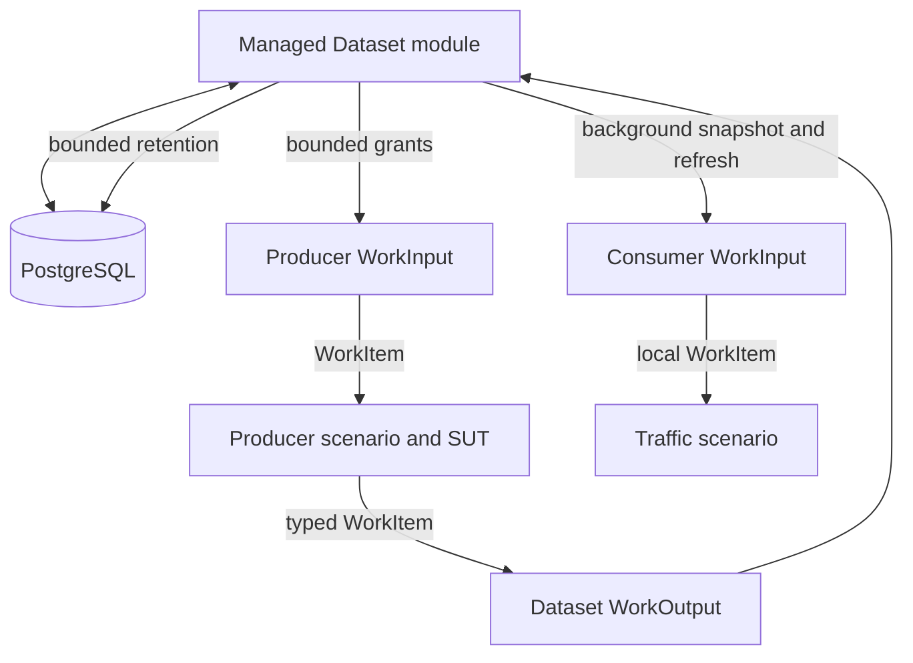

# Managed Datasets — MVP Decisions

Status: in progress — 24/7 and HA-compatible design tightened; team and contract approval pending

The [normative specification](managed-test-data-lifecycle-generic-spec.md)
defines the exact behavior, acceptance criteria, and tests. This page explains
the design choices.

## Decision requested

Approve a PostgreSQL-backed, continuously renewable vertical slice that uses
PocketHive's native
`WorkInput -> WorkItem -> worker -> WorkItem -> WorkOutput` pipeline.

```mermaid
flowchart TD
  API["Managed Dataset module"] <--> PG[(PostgreSQL)]
  API -->|bounded grants| IN["Producer WorkInput"]
  IN -->|WorkItem| P["Producer scenario and SUT"]
  P -->|typed WorkItem| OUT["Dataset WorkOutput"]
  OUT --> API
  API -->|background snapshot and refresh| C["Consumer WorkInput"]
  C -->|local WorkItem| T["Traffic scenario"]
  API -->|bounded retention| PG
```

## Key decisions

### Use native worker I/O

- Producer entry: `MANAGED_DATASET_REFILL` input.
- Producer commit: `MANAGED_DATASET` output.
- Consumer source: `MANAGED_DATASET` input.
- Existing `WorkItem`, worker lifecycle, Rabbit topology, and status remain.
- Each worker still has exactly one input and one output; multi-stage producers
  use separate Rabbit-connected bees.

There is no Dataset-specific Rabbit lane or multi-output interceptor.

### Keep the documented Dataset model

Dataset definitions stay in the SUT-scoped Dataset Space described by the
PocketHive architecture proposal. Scenario I/O config names a logical
`bindingRef`; Scenario Binding freezes exact Space, Dataset, schema, policy,
access, and SUT versions before runtime.

This removes the proposed Dataset package, registration, and duplicate
`requirements.yaml` lifecycles. Runtime never resolves a live alias.

### Keep SUT behavior in the scenario bundle

Provisioning requests and result mapping are scenario behavior. Producer config
may use resolved `sut`, `vars`, bundle templates, and private `authRef` data.
Unknown context fails before provisioning; credentials never enter Dataset
metadata or `WorkItem`.

This avoids a generic SUT workflow language inside Orchestrator.

### Include continuous renewal, defer reconciliation

The MVP atomically grants only missing renewal-ready slots. Expiring records
leave that count before they become unsafe, so the refill swarm creates
replacements early. Active grants count against `maximumReady`, and retained
old rows remain under separate row/byte quotas.

Consumers rotate verified snapshots before expiry and perform a final local
validity check. The Dataset module later purges expired rows in small bounded
database batches. It never calls the SUT during refresh or purge.

A full reconciler would also need SUT state discovery, revalidation,
correction, deprovision, compensation, live target changes, and producer
lifecycle management. That is a later workflow capability, not this MVP.
The required expiry replacement and database housekeeping do not inspect or
repair SUT state.

### Make ambiguity visible

Every SUT mutation uses a stable idempotency key. `COMPLETED` commits a record;
`FAILED` releases its reservation; `UNCERTAIN` retains capacity and is not
blindly retried. Automatic mutating refill is rejected if the SUT lacks a real
idempotency mechanism.

Broker acknowledgement or network success is not business evidence. Only a
durable Dataset receipt completes a grant.

Bounded failure, unusable-result, and uncertainty budgets stop a broken
provider from driving an endless 24/7 mutation loop. Opening the circuit blocks
refill visibly; it does not trigger automatic cleanup or reconciliation.

### Keep traffic local

The consumer input hydrates and verifies an immutable snapshot in the
background, then selects records locally. A newer view is built off-thread and
atomically replaces the old view before its records become unsafe. Measured
request threads make no Dataset API, database, Redis, or credential-provider
call. Validity metadata stays in the canonical `WorkItem`; the SDK checks it
locally at each hop so an item that expires in a queue is dropped before the
SUT call and reported instead of silently replaced.

The MVP accepts only synthetic, non-secret records suitable for the existing
`WorkItem` path.

### Bound configuration before runtime

Scenario authors set Dataset intent: `bindingRef`, consumer rate, and selection.
A versioned platform profile owns polling/backoff, claim, hydration, memory,
connection, clock, retention, and request limits, and bounds the Dataset's
declared renewal lead. Admission reserves aggregate capacity across resolved
replicas and rejects a Dataset whose largest expiry cohort cannot be replaced
inside the proven renewal window. Values are not clamped or replaced.

Memory admission covers both the active and next snapshot plus buffers and
measured runtime overhead. The 55,000 × 4,096-byte example is about 429.7 MiB
for two encoded views per consumer before Java overhead.

Refill clients back off with jitter, and simultaneous snapshot hydration is
staggered and bounded. Claim/commit, hydration, and retention have separate
bulkheads so Dataset work cannot consume Orchestrator control/journal capacity.
Refill SUT calls are rate-bounded, reported separately, and included in the
run's total load budget. Effective limits remain visible in product status.

### Define the 24/7 boundary

Any run that can outlive its expiring records must name at least one qualified
refill binding. PocketHive does not discover or start one implicitly. The
Swarm Controller's existing AMQP-derived aggregate proves worker liveness,
while bounded Dataset claim heartbeats and receipts prove path health and
progress. PostgreSQL remains authoritative across process restart, and a
consumer rehydrates a current safe snapshot before resuming.

This supports continuous data operation in the existing PocketHive deployment.
PostgreSQL remains authoritative, and durable leases and fences are required
to stop competing module replicas from applying the same housekeeping work.
Safe local snapshots provide bounded outage tolerance. Replica safety remains
an evidence gate; the current deployment is not highly available, and full
Orchestrator active-active operation, backup restore, and multi-region failover
are not qualified.

## Scope boundary

Included:

- PostgreSQL and immutable reusable records;
- fixed minimum/target/maximum supply;
- proactive expiry refill, snapshot rotation, bounded retention, and recovery;
- bounded grants, durable receipts, local snapshots, and readiness;
- explicit authorisation, idempotency, audit, and product status.

Deferred:

- generic SUT reconciliation, correction, revalidation, and deprovision;
- live target changes and automatic producer start/stop;
- Redis authority, exclusive/consumable records, sensitive data, and HA
  deployment and qualification;
- multi-output and generic protocol-result engines.

Unsupported choices fail; nothing falls back.

## Approval gates

Implementation is blocked until the team approves:

1. one executable schema/API source;
2. worker enum, config, capability, and error contracts;
3. one deterministic idempotent SUT double;
4. the security model and uncertainty-resolution authority;
5. a reproducible aggregate capacity/lifecycle profile and admission formula;
6. expiry, refresh, retention, restart, replica-safety, control-SLO, and
   24-hour soak evidence.

The candidate profile of 50,000 target records, 55,000 maximum, two consumer
swarms, and 1,000 requests/second remains unverified until tested across at
least two expiry/refill cycles and one purge cycle.
