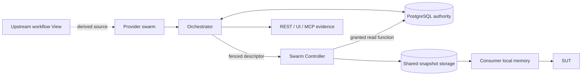

# Managed Datasets — Team Brief

Status: proposed MVP; architecture and canonical contracts require approval

## Decision required

Approve Managed Dataset as a PostgreSQL-backed, durable test-data option that
provider swarms create and compatible consumer swarms select explicitly.
Existing `REDIS_DATASET`, `CSV_DATASET` and direct `SCHEDULER` adapters remain
unchanged.

Trade-off: verified local snapshots, one least-privilege Controller database
reader and leases add background machinery, but keep Dataset authority off the
measured request path. Arbitrary queries, record expiry/reclamation, payload
mutation and exactly-once claims are not included.

## Why this matters

Reusable system-under-test (SUT) data is often tied to Redis or recreated.
Managed Dataset lets one swarm create schema-valid records for many consumers.

Workflow outcomes remain Record State and named Views. Processing creates a new
Dataset only for records with independent schema, identity or lifecycle.

## Proposal

- A provider run creates one named Managed Dataset per output binding.
- Every provider binding selects exactly one `SCHEDULER`, `CSV`, `REDIS` or
  `MANAGED_DATASET` source. There is no source switching or fallback.
- A consumer selects one exact Dataset, Group and optional View during Create
  Swarm, or explicit empty arrays when none is required.
- PostgreSQL is authoritative. Orchestrator grants a frozen publication; the
  Swarm Controller reads it through one bounded database function, publishes an
  atomic file naming the completed revision, and workers use local memory on the
  measured path.
- REST, UI and PocketHive Model Context Protocol (MCP) expose the same evidence
  without claiming SUT acceptance or exactly-once delivery.

## Where it sits

```mermaid
flowchart LR
  P[Provider swarm] --> O[Orchestrator]
  U[Upstream workflow View] -. derived source .-> P
  O <--> PG[(PostgreSQL authority)]
  O -->|fenced descriptor| SC[Swarm Controller]
  SC -->|granted read function| PG
  SC --> FS[(Shared snapshot storage)]
  FS --> C[Consumer local memory]
  C --> SUT[SUT]
  O --> E[REST / UI / MCP evidence]
```

| Concern | Owner |
|---|---|
| Dataset name, Profile, schemas, grouping, Views and transitions | Dataset Definition in Scenario Manager Dataset Space |
| Source, concrete Groups, allocation, lifecycle and mappings | Provider Scenario Binding |
| Required Profile, allocation, View and transition | Consumer Scenario Template and Binding |
| Exact Dataset selection | Create Swarm |
| Records, state, leases, lineage and idempotency | Orchestrator Managed Dataset module in PostgreSQL |
| Publication grant and activation generation | Orchestrator Managed Dataset module |
| Snapshot read and publication | Swarm Controller using the explicit PostgreSQL function adapter and deployment-owned storage |

## Essential definitions

| Term | Status | Plain meaning | Not the same as |
|---|---|---|---|
| Managed Dataset | Proposed | Named durable records created by one provider run and reusable by compatible consumers | A Redis list or queue |
| Dataset Space | Proposed | Versioned registry of Dataset Definitions and Schema Contracts used by Scenario Bindings | A runtime Dataset |
| Group | Proposed | Frozen partition using arbitrary schema-defined key fields | A Dataset name or runtime filter |
| `REPLAY` | Proposed | Immutable reusable records with shared or exclusive allocation | Mutable workflow state |
| `WORKFLOW` | Proposed | Immutable records plus versioned Record State, fixed Views and declared transitions | Free-form tags or queries |
| View | Proposed | Materialised selection over Record State | A copied or separate Dataset |
| Derivation | Proposed | One leased workflow record creates bounded independent records in one downstream Dataset | Outcome routing or Dataset clone |

## Example

One provider creates a workflow Dataset. Another consumes its `ready` View under
`EXCLUSIVE_LEASE`. `SUCCESS` atomically creates `1..N` downstream records and
updates upstream state; other outcomes create none.

## Included / not included

| Included | Not included |
|---|---|
| `REPLAY + SHARED` or `EXCLUSIVE_LEASE` | Queue/pop or use-count semantics |
| `WORKFLOW + EXCLUSIVE_LEASE` | Free-form tags, selectors or payload replacement |
| Scheduler, finite CSV/Redis import and derived source | Source fallback, rotation or destructive Redis pop |
| Closed four-case Outcome Mapping with no default | SUT-result inference or reconciliation |
| One atomic bounded derivation destination | Multi-destination fan-out or arbitrary cross-Dataset transactions |
| Operational consumption evidence | Audit proof or exactly-once claims |
| Non-expiring records and bounded fill-to-target | Record expiry, reclamation or purge |

## Main trade-off

Local snapshots keep workers database-free and the measured path fast. The
single active Controller needs a restricted database credential and explicit
publication, activation and recovery. Loaded workers may continue through a
short Controller outage; this is continuity, not Controller high availability.
Derivation remains M2d and does not block shared replay. It and
`EXCLUSIVE_LEASE` require concurrency, failure and soak qualification.

## Next step

Approve the model, then complete the M0 executable Scenario, worker, API,
WorkItem, status and snapshot contracts before runtime implementation.

## Technical detail

- [Managed Test Data MVP Specification](managed-test-data-lifecycle-generic-spec.md)
