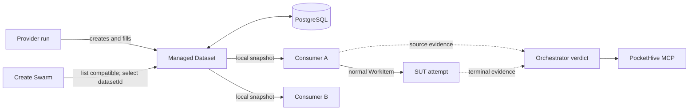

# Managed Datasets — Team Brief

Status: proposed MVP; team and canonical contract approval pending

## Decision required

Approve the [Managed Test Data MVP Specification](managed-test-data-lifecycle-generic-spec.md)
as the normative design for shared, renewable test data with strict consumption
evidence.

## Why this matters

One provider can create expensive System Under Test (SUT) records once for many
consumer swarms. Consumers read locally, while PocketHive Model Context
Protocol (MCP) reports whether each qualified path used the selected Dataset.

## Proposal

- One provider run creates each Managed Dataset; many consumers may share it.
- Create Swarm lists SUT-compatible Datasets and requires an explicit
  `datasetId` for each consumer binding.
- Orchestrator owns PostgreSQL records and evidence; consumers use local
  snapshots.
- MCP returns `CONFORMING`, `NON_CONFORMING`, or
  `INSUFFICIENT_EVIDENCE` from Orchestrator without recomputation or fallback.

## Where it sits

```mermaid
flowchart LR
  P["Provider run"] -->|creates and fills| MD["Managed Dataset"]
  MD <--> PG[("PostgreSQL")]
  CS["Create Swarm"] -->|list compatible; select datasetId| MD
  MD -->|local snapshot| A["Consumer A"]
  MD -->|local snapshot| B["Consumer B"]
  A -->|normal WorkItem| SUT["SUT attempt"]
  A -. source evidence .-> E["Orchestrator verdict"]
  SUT -. terminal evidence .-> E
  E --> MCP["PocketHive MCP"]
```

| Concern | Owner |
|---|---|
| Definitions and compatibility requirements | Scenario Manager |
| Candidate listing, admission, and run snapshot | Orchestrator |
| Records, provider provenance, supply, availability, and verdict | Managed Dataset module |
| Provider lifecycle and SUT behaviour | Existing swarm lifecycle and provider scenario |
| Local snapshots, guards, and counters | Worker SDK |
| Agent-facing evidence | PocketHive MCP, read-only |

## Essential definitions

| Term | Status | Plain meaning |
|---|---|---|
| `Managed Dataset` | PROPOSED | Shared runtime record pool created by one provider run and usable by many consumers |
| `Dataset Space` | PROPOSED | Versioned SUT-scoped namespace containing Dataset definitions, not runtime records |
| `Scenario Binding` | PROPOSED | Frozen scenario, SUT, Dataset requirements, schema, policy, and access |
| `Qualification Evidence` | PROPOSED | Human-approved record showing one exact build and workload met the required profile |
| `TrustedClock` | PROPOSED | Explicit calibrated clock used for expiry guards |
| `Managed Dataset Selection Claim` | PROPOSED | Digest-protected `WorkItem` metadata identifying the selected Dataset record and validity |
| `Managed Dataset Evidence Frame` | PROPOSED | Cumulative source or terminal report containing counters and checksums, not records |
| `Managed Dataset Consumption Evidence` | PROPOSED | Orchestrator verdict for one consumer run, binding, Dataset, and exact time window |

## Key design choices

### Provider creates; consumers select

Provider admission creates the Dataset idempotently from the provider run and
output binding. A new run creates a new Dataset; ownership never transfers.
The Scenario Binding declares requirements, not a provider. Create Swarm lists
compatible Datasets, requires one `datasetId`, then Orchestrator revalidates and
freezes the Dataset and separate provider/consumer qualifications. It never
chooses or substitutes a Dataset.

### Sharing is native

Supply thresholds apply once to the shared pool. Each consumer has an
independent snapshot, authorisation, and evidence window. One consumer cannot
change the Dataset or another consumer's view.

Dataset availability is canonical: `READY`, `DEGRADED`, or `UNAVAILABLE`.
Consumers use it instead of monitoring the provider. Their local clock,
snapshot, authorisation, and qualification affect only their own run. An
unavailable candidate appears disabled and admission rejects it.

### Keep the measured path local

Consumers rotate checked snapshots in the background. Request threads select
locally and add a digest-protected Selection Claim to the normal `WorkItem`.
Every SDK hop preserves it; the final expiry guard runs before the SUT call.

### Prove the MVP boundary

`ONE_TO_ONE` proof compares cumulative counts and Selection Claim checksums at
the Dataset source and terminal SUT boundary. Intermediate workers validate the
claim but emit no accounting frames.

MCP requires exact run, binding, and window scope and returns Orchestrator's
verdict unchanged, with no fallback evidence. It proves PocketHive's Dataset
path, not SUT business correctness or resistance to a malicious worker.

## Included / not included

| Included | Not included |
|---|---|
| One provider and many consumers per Dataset | Multiple providers or provider transfer |
| Explicit SUT-compatible Dataset selection | Automatic selection or provider lifecycle |
| PostgreSQL authority and local snapshots | Redis authority |
| Bounded refill and expiry guards | SUT reconciliation or deprovision |
| Human-approved qualification | Sensitive, exclusive, or one-use records |
| One-to-one MCP evidence | Complex-topology proof or HA qualification |

## Main trade-off

Operators must start a provider and select its Dataset. A new provider run
creates a new Dataset; consumers need new admission to move. This avoids
provider discovery, ownership transfer, live rebinding, and fallback logic.

## Next step

M0 must approve closed creation, candidate-listing, Create Swarm, claim, frame,
verdict, REST, MCP, and capacity contracts. Release requires a two-consumer
sharing test plus security, restart, expiry, evidence, and 24-hour soak proof.
