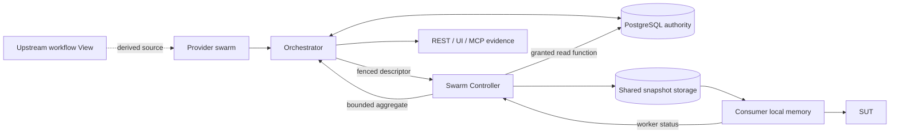

# Managed Datasets — Team Brief

Status: proposed Release 1; architecture and canonical contracts require approval

## Decision required

Approve Managed Dataset Release 1 as a PostgreSQL-backed durable option that
provider swarms create and compatible consumer swarms select explicitly.
Existing `REDIS_DATASET`, `CSV_DATASET` and direct `SCHEDULER` adapters remain
unchanged.

Trade-off: local snapshots, leases and one restricted Controller reader add
background work but keep Dataset authority off the measured path. Arbitrary
queries, reclamation, payload mutation and exactly-once claims are excluded.
Runtime adapter behaviour is additive, but activation requires one planned
offline Scenario Protocol migration.

## Why this matters

Managed Dataset lets one swarm create reusable, schema-valid
system-under-test (SUT) records for many consumers instead of recreating them.

## Proposal

- A provider run creates one named Managed Dataset per output binding. Every
  provider binding selects exactly one `SCHEDULER`, `CSV`, `REDIS` or
  `MANAGED_DATASET` source, with no switching or fallback.
- A consumer selects one exact Dataset, Group and optional View during Create
  Swarm, or explicit empty arrays when none is required.
- PostgreSQL is authoritative. Orchestrator grants; the Controller reads one
  bounded function and publishes an atomic revision. Workflow claims return
  identity, state and lease only, including derived input; workers resolve
  immutable payload from local memory.
- Revision hints mark a binding dirty. Controller reconciliation publishes only
  the latest revision. A minimum start interval and single-flight export bound
  the rate; worker background polls load it. After atomic activation, the
  Controller records a fenced Snapshot Activation Confirmation. Its predecessor
  marker remains outside the revision until safe deletion is acknowledged.
  Each binding has an explicit limit for deletion acknowledgements not yet
  stored, including after predecessor files are deleted. The next publication
  reserves one place; exhaustion blocks only that binding. Orchestrator retains
  the confirmation indefinitely and starts a full replay-evidence period when
  acknowledgement is stored. Absent proof keeps required evidence and any
  retained revision protected.
- Workers report through the Controller. Full status retains bounded reporter
  detail; deltas contain only small binding aggregates and digests. Orchestrator
  derives the three status planes for REST, UI and PocketHive Model Context
  Protocol (MCP). Group status remains visible with no consumer; evidence never
  claims SUT acceptance or exactly-once.

## Where it sits

```mermaid
flowchart LR
  P[Provider swarm] --> O[Orchestrator]
  U[Upstream workflow View] -. derived source .-> P
  O <--> PG[(PostgreSQL authority)]
  O -->|fenced descriptor| SC[Swarm Controller]
  SC -->|granted read function| PG
  SC --> FS[(Shared snapshot storage)]
  FS --> C[Consumer local memory]
  C --> SUT[SUT]
  C -->|worker status| SC
  SC -->|bounded aggregate| O
  O --> E[REST / UI / MCP evidence]
```

| Concern | Owner |
|---|---|
| Definition, schemas, grouping, Views and transitions | Dataset Definition in Scenario Manager |
| Source, Groups, allocation, lifecycle and mappings | Provider Scenario Binding |
| Requirements and exact selection | Consumer template/binding and Create Swarm |
| Records, state, leases, lineage, grants and read models | Orchestrator Managed Dataset module |
| Snapshot read, file publication, retention cleanup and worker status aggregate | Swarm Controller |
| Maintenance Epoch record, phases, fencing token and bounded swarm commands | Orchestrator |
| Final inventory, frozen plans and protocol cutover | Deployment upgrade workflow |
| Epoch bundle-mutation and swarm-activation gates | Scenario Manager and Orchestrator |

## Essential definitions

| Term | Status | Plain meaning | Not the same as |
|---|---|---|---|
| Managed Dataset | Proposed | Named durable records from one provider run, reusable by consumers | A Redis list or queue |
| Dataset Space | Proposed | Versioned definitions and schemas used by Scenario Bindings | A runtime Dataset |
| Group | Proposed | Frozen partition by schema-defined fields | A name or runtime filter |
| `REPLAY` | Proposed | Immutable records with shared or exclusive allocation | Workflow state |
| `WORKFLOW` | Proposed | Immutable records plus typed state, Views and transitions | Free-form tags or queries |
| View | Proposed | Materialised selection over Record State | A copied or separate Dataset |
| Derivation | Proposed | One leased workflow record creates bounded downstream records | Outcome routing or clone |
| Snapshot Activation Confirmation | Proposed | Orchestrator record of one fenced Controller's durable snapshot switch | Publication completion or deactivation marker |
| Snapshot Deletion Acknowledgement | Proposed | Idempotent authority evidence that the Controller safely removed the predecessor revision | Deactivation marker or delete request |
| Scenario Protocol Maintenance Epoch | Proposed | Orchestrator-owned phased upgrade fence with one monotonic token and frozen plan | Normal editing, lifecycle bypass or dual-major runtime |
| Group Availability | Proposed | Group authority health, with or without consumers | Publication or consumption health |
| Publication Status | Proposed | Publication health for one binding | Worker loading or use |
| Consumption Status | Proposed | Evidence of worker load, selection and SUT attempt | SUT acceptance or audit proof |

## Example

One provider creates a workflow Dataset. Another consumes its `ready` View under
`EXCLUSIVE_LEASE`. `SUCCESS` atomically creates `1..N` downstream records and
updates upstream state; other outcomes create none.

## Included / not included

| Included | Not included |
|---|---|
| `REPLAY + SHARED` or `EXCLUSIVE_LEASE` | Queue/pop or use-count semantics |
| `WORKFLOW + EXCLUSIVE_LEASE` | Free-form tags, selectors or payload replacement |
| Scheduler, finite CSV/Redis import and bounded derived source/publication | Source fallback, rotation or destructive Redis pop |
| Closed four-case Outcome Mapping with no default | SUT-result inference or reconciliation |
| One atomic bounded derivation destination | Multi-destination fan-out or arbitrary cross-Dataset transactions |
| Operational consumption evidence | Audit proof or exactly-once claims |
| Non-expiring records and bounded fill-to-target | Record expiry, reclamation or purge |
| One persisted offline new-major Maintenance Epoch | Concurrent v2/new-major support or implicit empty requirements |

## Release boundary

Release 1 includes both replay modes, mutable workflow, all four sources and
bounded Derivation. M2a shared replay is only the foundation; mutable workflow
and the M2c/M2d capabilities remain required. All operational gates must pass.

## Main trade-off

Local snapshots keep workers database-free and the measured path fast. The
single Controller needs a restricted credential and explicit publication and
recovery. Full snapshots trade simplicity for operating-horizon bandwidth,
Controller/worker filesystem operations, safe retention and all-worker restart
fan-out; admission must fund them.
Loaded workers may survive a short Controller outage, which is continuity rather
than high availability. Derivation and `EXCLUSIVE_LEASE` still require
concurrency, failure and soak qualification. Scenario Protocol activation is
planned downtime, not a highly available upgrade.

## Next step

Approve the Release 1 model. M0 then activates required
`managedDatasetRequirements` under a new Scenario Protocol major. One persisted
Maintenance Epoch blocks bundle mutation and public swarm create/start while
final inventory, validation, exact v2 swarm drain and digest-checked cutover run.
Only the upgrade workflow may use the fenced epoch-bound command to drain or
restore a captured swarm from its frozen plan; stale tokens, phases or plans
conflict.
Pre-switch failure keeps the prior validator and roots selected and restores the
drained set from frozen v2 plans within a declared bound. Post-switch recreation
failure remains gated until explicit resume or rollback within the same bound.
Scenario Manager remains the only authoring validator with preserved
version/digest evidence. Complete the remaining
executable contracts before runtime implementation.

## Technical detail

- [Managed Test Data Release 1 Specification](managed-test-data-lifecycle-generic-spec.md)
