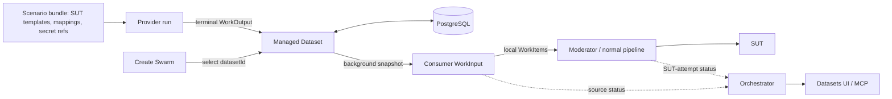

# Managed Datasets — Team Brief

Status: in progress; proposed MVP and canonical contract approval pending

## Decision required

Approve the [Managed Test Data MVP Specification](managed-test-data-lifecycle-generic-spec.md)
as the normative design for shared, renewable test data.

The MVP uses one clear relationship:

```text
provider run creates Managed Dataset; consumer run selects Managed Dataset
```

## Why this matters

Redis-style consumable lists are a poor fit when several swarms need the same
expensive synthetic SUT records. Managed Datasets make records reusable through
local snapshots and keep control services off the measured path.

## Proposal

- One provider run creates one Managed Dataset per output binding. Worker
  restart keeps it; a new run creates a new Dataset.
- Create Swarm lists SUT-compatible Datasets. The operator selects one exact
  `datasetId` per consumer `bindingRef`; it never falls back.
- PostgreSQL owns lifecycle state; consumers use atomically replaced local
  snapshots.
- Refill replaces expiring records before they become unsafe. It is driven by
  expiry and target supply, not consumer request rate.
- One Orchestrator model reports source and SUT-attempt activity. Missing status
  is `UNKNOWN`; telemetry never blocks traffic.

## Where it sits


```mermaid
flowchart LR
  B["Scenario bundle: SUT templates, mappings, secret refs"] --> P["Provider run"]
  P -->|"terminal WorkOutput"| D["Managed Dataset"]
  D <--> PG[("PostgreSQL")]
  CS["Create Swarm"] -->|"select datasetId"| D
  D -->|"background snapshot"| C["Consumer WorkInput"]
  C -->|"local WorkItems"| M["Moderator / normal pipeline"]
  M --> SUT["SUT"]
  C -.->|"source status"| O["Orchestrator"]
  M -.->|"SUT-attempt status"| O
  O --> V["Datasets UI / MCP"]
```

| Concern | Owner |
|---|---|
| Definitions and binding requirements | Scenario Manager |
| Candidate listing, frozen selection and status | Orchestrator |
| Records, refill state, grants, receipts and availability | Managed Dataset module |
| Provider lifecycle | Existing swarm lifecycle and operator |
| Local snapshot, selection and source status | Managed Dataset `WorkInput` |
| Context guard and SUT-attempt status | Worker SDK |
| Presentation | Datasets UI through REST; PocketHive MCP |
| SUT traffic pacing | Moderator |
| PostgreSQL HA, backup and failover | Deployment infrastructure |

## Essential definitions

| Term | Status | Plain meaning |
|---|---|---|
| `WorkInput` | EXISTING | Adapter supplying normal `WorkItem`s; it does not pace the SUT. |
| `WorkOutput` | EXISTING | Adapter that publishes or persists a worker result. |
| `Managed Dataset` | PROPOSED | Reusable immutable records created by one provider run. |
| `Scenario Binding` | PROPOSED | Frozen scenario, SUT, Dataset, schema, policy and access requirements; not a provider link. |
| `Managed Dataset Context` | PROPOSED | Seven-field WorkItem metadata carrying Dataset, binding, snapshot, record and timing to the final local guard. |
| `ManagedDatasetConsumptionStatus` | PROPOSED | One current operational view of selection, SUT attempts, rejects and telemetry freshness. It is not SUT acceptance proof. |

## Key design choices

The first provider bee obtains bounded `MANAGED_DATASET_REFILL` work; the
terminal bee persists mapped results through `MANAGED_DATASET`. One `bindingRef`
joins them. Templates, mappings and secret references stay in the bundle.

The consumer declares `bindingRef`, `ratePerSec` and observation timings;
Create Swarm injects `datasetId`. Moderator shapes traffic. Reading never pops,
reserves or counts records.

Each WorkItem carries only `schemaVersion`, `datasetId`, `bindingRef`,
`snapshotRevision`, `recordId`, `selectedAt` and `usableUntil`. The Worker SDK
rejects invalid, expired or mismatched context before SUT invocation.

Source and SUT guards report bounded cumulative counters. Orchestrator derives
separate rates and freshness; MCP returns its model unchanged and UI uses REST.
Ids are never per-record dimensions and boundary counts need not match.

## Included / not included

| Included | Not included |
|---|---|
| Shared records, exact selection, refill and snapshots | Pop/depletion, use counts or checkout |
| Idempotent restart and replica safety | SUT reconciliation or automatic provider lifecycle |
| Dataset Context and Consumption Status | Audit, SUT acceptance or exactly-once proof |

## Product view

`READY` means usable, not consumed. Datasets show supply, bindings, consumption
and freshness; detail shows snapshot safety, separate rates/counts and rejects.
States are `CONSUMING`, `DEGRADED`, `NOT_CONSUMING` and `UNKNOWN`; run state is
separate. Text/icons accompany colour. This proves flow to the SUT-attempt
boundary, not SUT acceptance.

## Main trade-off

This MVP is maintainable because it does not model each use. The cost is a
strict dependency: shared records must be safe for concurrent repeated use.
Scenarios that need exclusive or stateful records require a later, different
allocation model.

## Next step

Approve M0 contracts, then implement authority, adapters and the one status
model. Release against the functional, freshness, UI/MCP, accessibility,
overhead, overload, replica and soak gates in the normative specification.
