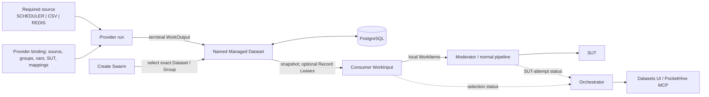

# Managed Datasets — Team Brief

Status: in progress; proposed MVP and canonical contract approval pending

## Decision required

Approve the [Managed Test Data MVP Specification](managed-test-data-lifecycle-generic-spec.md)
as the normative design for shared test data with an explicit provider source
and record allocation.

```text
provider binding selects SCHEDULER, CSV or REDIS
provider run creates one named Managed Dataset
consumer run selects one exact Dataset Group
```

An ungrouped Dataset has one internal Group, so simple cases still select only
the Dataset in Create Swarm. A swarm with no Managed Dataset input supplies the
explicit empty selection `datasetSelections: []`.

## Why this matters

A provider swarm can create accounts, cards or other SUT objects once and make
traffic-ready records available to many consumer swarms. Records may be
partitioned by arbitrary schema-defined keys, not PocketHive fields.

Managed Dataset is additive. `REDIS_DATASET` remains supported and unchanged.
Each bee I/O binding explicitly selects one adapter and never migrates,
substitutes or falls back.

## MVP design

- One provider run creates one named Managed Dataset per output binding. Worker
  restart keeps it; a new run creates a new Dataset.
- Every provider binding chooses exactly one source: renewable `SCHEDULER`,
  finite mounted `CSV` or a finite immutable `REDIS` list snapshot. There is no
  omission, mixing, switching or fallback.
- A Dataset Definition owns its name, record schema and explicit `UNGROUPED` or
  bounded `GROUPED` fields. The provider binding resolves concrete Groups from
  literals or only its non-secret `vars` and `sut` context before work.
- The Dataset Definition bundle has one Draft 2020-12 root record schema. It may
  compose exact versioned Dataset Schema Contracts and local `$defs`; Scenario
  Manager compiles and freezes one schema digest with the Dataset.
- Provider results populate an assigned frozen Group; they cannot create or
  move Groups. Create Swarm freezes one compatible exact Dataset/Group per
  consumer requirement.
- One allocation mode applies to the whole Dataset. `SHARED` permits concurrent
  reuse. `EXCLUSIVE_LEASE` keeps the Dataset shareable but makes each record
  available to only one consumer WorkItem until durable release or expiry.
- PostgreSQL owns Managed Dataset authority. Workers use authenticated
  Orchestrator REST in the background and dispatch locally from verified Group
  snapshots and, when required, bounded prefetched Record Leases.

## Configuration ownership

| Location | Owns |
|---|---|
| `scenarios/managed-dataset/<name>/` | One `dataset.yaml`, its root `record.schema.yaml`, required name/version, and `UNGROUPED` or `GROUPED` fields |
| `scenarios/dataset-contracts/<name>/<version>/` | One immutable reusable `schema.yaml`; root record schemas pin exact versions |
| Scenario Manager Dataset Space registry | Validates mounted packages, compiles the complete schema graph and stores its dependency versions and digest |
| Provider Scenario Binding | Dataset Definition reference, exactly one Provider Source, concrete Groups, provider-only templates, mappings, one Dataset allocation policy, lifecycle, supply and capacity policy |
| Consumer Scenario Template | Required `managedDatasetRequirements` array: compatibility, `READ`, allocation mode and local lease bounds; empty when no Managed Dataset is required |
| Consumer Scenario Binding | Validates and freezes the Template requirements against one SUT Environment and Dataset Space |
| Deployment profile | Managed Dataset client settings and bounds; Redis connection contracts containing endpoint, TLS, topology and credential reference |
| Frozen Managed Dataset | Resolved definition, compiled schema digest, Group ids/keys, provider provenance and policy |
| Create Swarm selection | Required array: one exact Dataset or Group per Managed Dataset `bindingRef`, or empty when none is required |

These registries share the existing `scenarios` mount alongside
`scenarios/bundles/<name>/`. Only Scenario Manager reads them. Orchestrator
receives the resolved definition and schema digest; workers never search
mounted contract files. Invalid, unversioned, ranged, remote or cyclic
references fail without selecting another contract. A failed reload publishes
nothing, leaves the last valid registry revision active and reports the exact
errors. Scenario Manager creates the digest once from its persisted complete
schema artifact; every downstream component compares that opaque value.

```yaml
managedDatasetRequirements:
  - bindingRef: inputRecords
    datasetDefinitionId: shared-records
    access: READ
    allocation:
      type: EXCLUSIVE_LEASE
      acquireBatchSize: 10
      maximumHeldRecordLeases: 20
      acquireInterval: PT1S
```

The Definition is the only grouping schema. `name` is a non-secret display
label; `datasetId` is identity. The Template requirement contains no runtime ids
or provider templates; the Binding freezes it and the bee references it by
`bindingRef`. `SHARED` uses only `allocation.type`. A swarm needing no Managed
Dataset uses `managedDatasetRequirements: []` and `datasetSelections: []`.

The Provider Source is configured once in the provider binding, outside the
Dataset Definition and bee blocks:

| Source | MVP contract |
|---|---|
| `SCHEDULER` | Renewable, Group-scoped authority grants drive provider work. |
| `CSV` | One mounted provider-bundle artifact is parsed and imported once in stable row order. |
| `REDIS` | One `connectionRef` and list name; the list is copied to a provider-run staging key and imported once in stable index order. The live list is never popped or changed. |

`CSV` and `REDIS` are non-expiring finite imports. PocketHive validates the
complete source first, binds its content fingerprint once and publishes all
Groups atomically only after every item is stored. A changed restart fails.
Existing direct `SCHEDULER`, `CSV_DATASET` and `REDIS_DATASET` inputs remain
separate and unchanged.

The deployment profile owns each referenced Redis endpoint, TLS mode, topology
and credential reference; provider configuration does not duplicate them.

## Runtime flow


```mermaid
flowchart LR
  PS["Required source<br/>SCHEDULER | CSV | REDIS"] --> P["Provider run"]
  B["Provider binding: source, groups, vars, SUT, mappings"] --> P
  P -->|"terminal WorkOutput"| D["Named Managed Dataset"]
  D <--> PG[("PostgreSQL")]
  CS["Create Swarm"] -->|"select exact Dataset / Group"| D
  D -->|"snapshot; optional Record Leases"| C["Consumer WorkInput"]
  C -->|"local WorkItems"| M["Moderator / normal pipeline"]
  M --> SUT["SUT"]
  C -.->|"selection status"| O["Orchestrator"]
  M -.->|"SUT-attempt status"| O
  O --> V["Datasets UI / PocketHive MCP"]
```

The provider's first and terminal bees receive source work and persist results
for one frozen Group. `SCHEDULER` work uses refill grants driven by expiry and
target supply, not traffic rate. `CSV` and `REDIS` use one bounded idempotent
import; restart resumes the same items, and a bad or incomplete import exposes
no records. Dataset creation freezes provider, binding version and source type;
the first finite import binds the content fingerprint because the provider
input cannot compute it earlier.

The consumer bee references its requirement and declares rate, SUT-attempt role
and safety bounds; Moderator still shapes traffic. In `EXCLUSIVE_LEASE`, the
consumer input acquires in the background and dispatches each lease once. The
SDK releases after role completion and output handoff. Failure holds the record
until authority expiry; no renewal or fallback exists. Active leases do not
create refill demand.

## Safety and evidence

Each WorkItem carries one structured global header in its JSON body with the
Dataset/Group/binding identity, revision, record validity and allocation. An
exclusive item also carries lease id and expiry. It is not a broker or
observability header. One SDK guard blocks invalid identity, time or lease
immediately before network I/O.

Orchestrator alone derives `ManagedDatasetConsumptionStatus`. PocketHive MCP
returns that same read model and can show that:

1. the consumer selected a snapshot whose compiled record-schema digest matches
   the frozen Dataset;
2. it selected from the frozen `datasetId + groupId + allocation`; and
3. valid context with the same identity reached the SUT-attempt boundary,
   including a live matching Record Lease when required.

Selection and guard report bounded counters through existing status. Missing or
stale evidence is `UNKNOWN`, never green. Reporting cannot block traffic and
does not claim SUT acceptance or exactly-once delivery.

## Product view and MVP boundary

The existing Datasets area shows the named parent, bounded Groups, safe Group
keys, per-Group supply/availability and consumers. `READY` means that a Group
can supply records; `CONSUMING` means a consumer is selecting that Group and
reaching the SUT-attempt boundary.

| Included | Deferred |
|---|---|
| One required `SCHEDULER`, `CSV` or `REDIS` Provider Source | Multiple sources, source switching/fallback, CSV rotation, Redis pop or finite-source refill |
| Immutable records with explicit `SHARED` or durable `EXCLUSIVE_LEASE` allocation | Pop, depletion, use counts, lease renewal/transfer or exactly-once claims |
| Explicit empty requirements/selections for swarms with no Managed Dataset | Optional bindings or implicit Dataset selection |
| Provider-only Group template resolution | Runtime-created or result-derived Groups and live regrouping |
| Exact versioned schema composition and Dataset-local `$defs` | `latest`, ranges, remote schema lookup, mixed per-record schemas or live schema upgrade |
| Scheduler refill, atomic finite imports, per-Group snapshots and availability | Multi-Group selection, filters, joins and per-Group policy/ACL overrides |
| REST/UI/MCP operational evidence | SUT reconciliation, audit proof and automatic provider lifecycle |

## Next step

Approve M0 contracts first, then implement authority, adapters and the one
status model. Release only after the normative specification's functional,
isolation, freshness, UI/MCP, overload, restart and soak gates pass.
