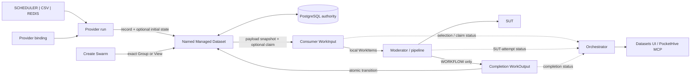

# Managed Datasets — Team Brief

Status: in progress; proposed MVP and canonical contract approval pending

## Decision required

Approve the [Managed Test Data MVP Specification](managed-test-data-lifecycle-generic-spec.md)
as the normative design for durable shared test data.

```text
provider binding selects exactly one SCHEDULER, CSV or REDIS source
provider run creates one named Managed Dataset
consumer run selects one exact Dataset Group or workflow View
```

An ungrouped Dataset has one internal Group. A swarm that needs no Managed
Dataset uses `managedDatasetRequirements: []` and `datasetSelections: []`.

## Why this matters

A provider swarm can create SUT objects once and make traffic-ready records
available to many consumer swarms. Records may be partitioned by arbitrary
schema-defined keys; these are not PocketHive fields.

Managed Dataset is additive. Existing `REDIS_DATASET` remains supported and
unchanged. Every bee I/O binding explicitly selects one adapter; PocketHive
never migrates, substitutes or falls back between adapters or sources.

## MVP design

Every Dataset freezes one Profile:

| Profile | Payload and state | Consumer allocation |
|---|---|---|
| `REPLAY` | Immutable reusable record payload; no Record State | `SHARED` or `EXCLUSIVE_LEASE` |
| `WORKFLOW` | Immutable record payload plus separately versioned mutable Record State, fixed named Views and declared State Transitions | `EXCLUSIVE_LEASE` only |

`WORKFLOW` preserves the mutable-dataset capability needed by existing flows,
but bounds it. A consumer claims a current member of one named View. Its
declared completion supplies one complete next-state object. Orchestrator
checks the live lease, expected state revision, allowed changed paths, state
schema and target View, then updates state, materialised View memberships and
lease in one transaction.

Free-form tags, arbitrary selectors or patches, payload replacement, inferred
SUT outcomes and cross-Dataset transactions remain outside the MVP.

The rest of the design is common:

- One provider run creates one named Dataset per Managed Dataset output
  binding. Process restart keeps the run; a new provider run creates a new
  Dataset.
- Every provider binding chooses exactly one source: renewable `SCHEDULER`,
  finite mounted `CSV`, or a finite immutable `REDIS` list snapshot.
- A Dataset Definition owns name, Profile, grouping, root record schema and,
  for `WORKFLOW`, root state schema, Views and State Transitions.
- Root schemas may compose exact immutable Dataset Schema Contract versions and
  local `$defs`. Scenario Manager compiles and freezes separate record/state
  digests.
- The provider binding resolves concrete Groups before work and maps each
  record plus, for `WORKFLOW`, its complete initial state. Results cannot create
  or move Groups.
- PostgreSQL is authoritative only for Managed Dataset. Workers use
  authenticated Orchestrator REST for bounded background work and keep the
  measured request path local.

`EXCLUSIVE_LEASE` is specified but not production-qualified. Production
approval requires concurrency, saturation, transition/release failure, expiry,
restart, authority-outage and 24-hour soak gates to pass.

## Configuration ownership

| Location | Owns |
|---|---|
| `scenarios/managed-dataset/<name>/` | `dataset.yaml`, `record.schema.yaml` and, for `WORKFLOW`, `state.schema.yaml`; name, version, Profile, grouping, Views and transitions |
| `scenarios/dataset-contracts/<name>/<version>/` | One immutable reusable `schema.yaml`; record and state roots pin exact versions |
| Scenario Manager Dataset Space registry | Package validation, complete schema compilation, dependency versions and opaque digests |
| Provider Scenario Binding | Definition reference, exactly one Provider Source, concrete Groups, provider-only templates, record/initial-state mappings, Dataset allocation, lifecycle, supply and capacity policy |
| Consumer Scenario Template | Required `managedDatasetRequirements`: Profile/access, allocation, and for `WORKFLOW` one View, allowed transitions and completion role |
| Consumer Scenario Binding | Validates and freezes Template requirements against one SUT Environment and Dataset Space |
| Create Swarm selection | One exact compatible Dataset/Group or workflow View per `bindingRef`; an explicit empty array when none is required |
| Deployment profile | REST client settings, Redis connection contracts and positive Dataset/record/state/byte/View-membership limits |
| Operator runbook | Retention horizon, logical and physical capacity forecasts, thresholds, response, backup/restore coordination and escalation; never direct PostgreSQL deletion |

Only Scenario Manager reads the mounted registries. Orchestrator receives
resolved definitions and compiled artifacts; workers never search mounted
files. Invalid, unversioned, ranged, remote or cyclic references fail. A bad
reload publishes nothing and leaves the last valid registry revision active;
this is transaction safety, not schema-version fallback.

Example workflow requirement:

```yaml
managedDatasetRequirements:
  - bindingRef: inputRecords
    datasetDefinitionId: shared-records
    profile: WORKFLOW
    access: READ_STATE_TRANSITION
    allocation:
      type: EXCLUSIVE_LEASE
      acquireBatchSize: 10
      maximumHeldRecordLeases: 20
      acquireInterval: PT1S
    workflow:
      viewId: available
      allowedTransitionIds: [complete]
      allowReleaseUnchanged: false
      completionRole: dataset-completion
      completionLagTolerance: PT30S
```

`REPLAY` instead uses `access: READ`, forbids the `workflow` block and permits
`SHARED` or `EXCLUSIVE_LEASE`. Requirements contain no runtime ids, source
settings or provider templates. The bee references one requirement by
`bindingRef`.

The Provider Source exists once in the provider binding:

| Source | MVP contract |
|---|---|
| `SCHEDULER` | Renewable; Group-scoped authority grants drive provider work. |
| `CSV` | One mounted provider-bundle artifact is validated and imported once in stable row order. |
| `REDIS` | One deployment `connectionRef` and list name; PocketHive copies the list and imports the fixed copy once in stable index order. It never pops or changes the live list. |

Finite imports bind one content fingerprint and publish every Group atomically
after all items pass validation. Existing direct `SCHEDULER`, `CSV_DATASET` and
`REDIS_DATASET` inputs remain separate and unchanged.

## Runtime flow


```mermaid
flowchart LR
  PS["SCHEDULER | CSV | REDIS"] --> P["Provider run"]
  B["Provider binding"] --> P
  P -->|"record + optional initial state"| D["Named Managed Dataset"]
  D <--> PG[("PostgreSQL authority")]
  CS["Create Swarm"] -->|"exact Group or View"| D
  D -->|"payload snapshot + optional claim"| C["Consumer WorkInput"]
  C -->|"local WorkItems"| M["Moderator / pipeline"]
  M --> SUT["SUT"]
  M -->|"WORKFLOW only"| W["Completion WorkOutput"]
  W -->|"atomic transition"| D
  C -.->|"selection / claim status"| O["Orchestrator"]
  M -.->|"SUT-attempt status"| O
  W -.->|"completion status"| O
  O --> V["Datasets UI / PocketHive MCP"]
```

`REPLAY + SHARED` selects round-robin from a verified local payload snapshot.
Every exclusive consumer prefetches bounded authority leases in the
background. `WORKFLOW` claims also carry current Record State and its revision;
state eligibility never comes from a stale shared snapshot. Failure leaves the
record unavailable until a valid retry, an explicitly allowed unchanged
release or fixed expiry. No renewal or fallback exists. Active leases do not
create refill demand.

Replay keeps the schema-valid record as the normal WorkItem payload. Workflow
uses one fixed payload object with `record` and `recordState`; state remains
normal template data, never a header or observability field.

## Safety and MCP evidence

Each WorkItem carries one structured global header inside the normal JSON body.
It contains Dataset, Group, binding, Profile, payload revision, record validity
and allocation; a workflow item also contains View, lease and claimed state
revision. It is neither a broker header nor observability context. The SDK
preserves it and validates it immediately before SUT network I/O.

Orchestrator alone derives `ManagedDatasetConsumptionStatus`. UI and
PocketHive MCP return the same read model. `CONSUMING` requires fresh evidence
that:

1. the selected payload snapshot matches the frozen record-schema digest;
2. source and SUT boundaries report the same frozen Dataset, Group, Profile,
   optional View and allocation;
3. an exclusive attempt used a live matching Record Lease; and
4. for `WORKFLOW`, a completion reporter confirms an allowed transition or
   explicitly allowed unchanged release for the claimed state revision.

Missing, mismatched or stale evidence is never green. This proves which
Dataset contract reached the scenario boundaries; it does not prove SUT
business acceptance, exactly-once delivery or correctness of a declared
business transition.

Orchestrator atomically reserves deployment-wide Dataset, record,
record/state-byte and View-membership capacity. Exhaustion rejects new creation
or supply without eviction or impact to existing safe consumers. MVP has no
purge state machine; production requires an approved retention/capacity
runbook for the declared operating horizon.

## MVP boundary

| Included | Deferred |
|---|---|
| `REPLAY`: immutable payload with `SHARED` or durable `EXCLUSIVE_LEASE` | Pop/depletion, use counts, lease renewal/transfer and exactly-once claims |
| `WORKFLOW`: versioned Record State, fixed Views, declared transitions and exclusive claims | Free-form tags, arbitrary selectors/patches, runtime-created Views/transitions, payload replacement and cross-Dataset transactions |
| One required `SCHEDULER`, `CSV` or `REDIS` source | Multiple sources, switching/fallback, CSV rotation, Redis pop and finite-source refill |
| Explicit empty requirements/selections | Optional bindings or implicit Dataset selection |
| Frozen Groups and provider-only template resolution | Runtime/result-created Groups and live regrouping |
| Exact versioned schema composition and local `$defs` | `latest`, ranges, remote lookup, mixed per-record schemas and live schema upgrade |
| REST/UI/MCP operational evidence | SUT reconciliation, audit proof and automatic provider lifecycle |
| Storage limits plus operator runbook | Dataset retirement, purge, automatic deletion and direct PostgreSQL deletion |

## Next step

Approve M0 contracts first. Release only after the normative functional,
isolation, mutation, evidence, storage-exhaustion, restart, failure and soak
gates pass and the operator retention/capacity runbook is approved.
