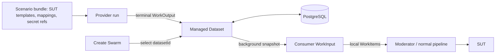

# Managed Datasets — Team Brief

Status: in progress; proposed MVP and canonical contract approval pending

## Decision required

Approve the [Managed Test Data MVP Specification](managed-test-data-lifecycle-generic-spec.md)
as the normative design for shared, renewable test data.

The MVP uses one clear relationship:

```text
provider run creates Managed Dataset; consumer run selects Managed Dataset
```

## Why this matters

Current Redis Dataset inputs behave like consumable lists. That model is a poor
fit when several swarms need the same expensive synthetic SUT records for
continuous traffic.

Managed Datasets make records immutable and reusable. One provider creates a
Dataset once; compatible consumers share it through local snapshots. This
removes record depletion and keeps PostgreSQL, Orchestrator and credential
providers off the measured request path.

## Proposal

- One provider run creates one Managed Dataset for each Dataset output
  binding. Restarting a worker preserves that logical run; starting a new run
  creates a new Dataset.
- Create Swarm lists compatible Datasets for the selected SUT. The operator
  selects one exact `datasetId` for each consumer `bindingRef`.
- Consumers stay pinned to that id and never fall back to another Dataset or
  provider.
- PostgreSQL owns records and lifecycle state. Consumers dispatch from verified
  immutable local snapshots replaced atomically in the background.
- Refill replaces expiring records before they become unsafe. It is driven by
  expiry and target supply, not consumer request rate.

## Where it sits


```mermaid
flowchart LR
  B["Scenario bundle: SUT templates, mappings, secret refs"] --> P["Provider run"]
  P -->|"terminal WorkOutput"| D["Managed Dataset"]
  D <--> PG[("PostgreSQL")]
  CS["Create Swarm"] -->|"select datasetId"| D
  D -->|"background snapshot"| C["Consumer WorkInput"]
  C -->|"local WorkItems"| M["Moderator / normal pipeline"]
  M --> SUT["SUT"]
```

| Concern | Owner |
|---|---|
| Dataset definitions and binding requirements | Scenario Manager |
| Candidate listing, admission and frozen selection | Orchestrator |
| Records, refill state, grants, receipts and availability | Managed Dataset module |
| Provider start, stop and restart | Existing swarm lifecycle and operator |
| Local snapshot, selection and dispatch | Managed Dataset `WorkInput` |
| SUT traffic pacing | Moderator |
| PostgreSQL HA, backup and failover | Deployment infrastructure |

## Essential definitions

| Term | Status | Plain meaning |
|---|---|---|
| `WorkInput` | EXISTING | Adapter that supplies normal PocketHive `WorkItem`s; it does not pace the SUT. |
| `WorkOutput` | EXISTING | Adapter that publishes or persists a worker result. |
| `Managed Dataset` | PROPOSED | Shared immutable runtime records created by one provider run and reusable by many consumers. |
| `Scenario Binding` | PROPOSED | Frozen scenario, SUT, Dataset, schema, policy and access requirements. It is not a provider link. |
| `Managed Dataset Selection Claim` | PROPOSED | Small prebuilt metadata that carries Dataset, record and expiry identity to the final local safety check. It is not consumption evidence. |

## Key design choices

Provider configuration is split across the pipeline. The first bee uses a
`MANAGED_DATASET_REFILL` input to obtain bounded refill work. The terminal bee
uses a separate `MANAGED_DATASET` output to persist mapped results. The same
`bindingRef` joins both ends. The SUT request, response template and result
mapping remain in the scenario bundle; secrets remain references.

The consumer uses a `MANAGED_DATASET` input. Its adapter block contains
`bindingRef` and `ratePerSec`; Create Swarm injects the selected `datasetId`
into frozen runtime configuration. `ratePerSec` supplies work. Moderator still
shapes SUT traffic.

Sharing is deliberate. Records are never popped, checked out, counted by use
or invalidated from SUT outcomes. Scenario owners must confirm their SUT
contract tolerates repeated concurrent use.

For continuous operation, Orchestrator replicas coordinate background work
with PostgreSQL leases and fencing. Existing consumers continue from a safe
snapshot during temporary control-plane failure. `READY` permits admission;
`DEGRADED` permits already admitted safe traffic; `UNAVAILABLE` stops new
admission and unsafe local dispatch. There is no automatic provider failover.

## Included / not included

| Included | Not included |
|---|---|
| Shared reusable records and explicit selection | Redis pop/depletion semantics |
| Bounded proactive refill and expiry overlap | Use counts, checkout or bounded-use records |
| Atomic local snapshots and backpressure | SUT reconciliation or outcome-driven retirement |
| Idempotent grants, receipts, restart and replica safety | Automatic provider lifecycle or multi-region active-active |
| Local Selection Claim for expiry safety | MVP qualification, evidence frames, MCP consumption verdicts or approvals |

## Main trade-off

This MVP is maintainable because it does not model each use. The cost is a
strict dependency: shared records must be safe for concurrent repeated use.
Scenarios that need exclusive or stateful records require a later, different
allocation model.

## Next step

Approve M0 closed contracts, then implement PostgreSQL authority and the three
Worker SDK adapters. Release requires sharing, refill, expiry, restart,
temporary outage, overload, replica-fencing and 24-hour soak tests from the
normative specification.
