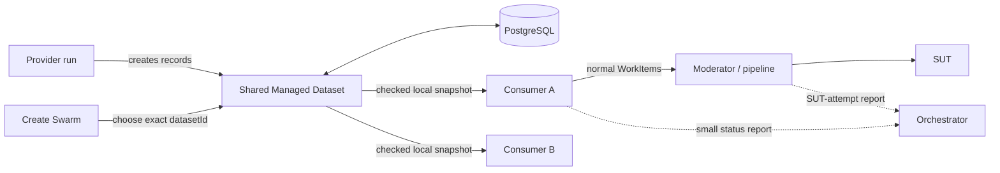

# Managed Datasets — Plain-language Guide

Status: in progress; proposed MVP, implementation and approval pending

For exact requirements, see the
[Managed Test Data MVP Specification](managed-test-data-lifecycle-generic-spec.md).

## One-minute version

Managed Datasets let several test swarms safely reuse synthetic SUT records
that are slow or expensive to create.

```text
Provider run -> creates a Managed Dataset
Consumer run -> selects that Managed Dataset
```

Records are not items in a queue. Reading a record does not remove or reserve
it. PocketHive does not count uses or guess from a SUT response that a record
has become invalid.

## The flow



PostgreSQL is authoritative. Consumers select locally from a checked, read-only
snapshot. Measured requests call no control-plane service or credential
provider.

## Important names

| Name | Status | Meaning |
|---|---|---|
| `WorkInput` | EXISTING | Adapter that supplies PocketHive work items. |
| `WorkOutput` | EXISTING | Adapter that publishes or saves a result. |
| `Managed Dataset` | PROPOSED | Shared immutable runtime records created by one provider run; not a queue. |
| `Scenario Binding` | PROPOSED | Frozen scenario, SUT, Dataset, schema and access requirements; not a provider selection. |
| `Managed Dataset Context` | PROPOSED | Small Dataset, binding, snapshot, record and timing label carried with a WorkItem. |
| `ManagedDatasetConsumptionStatus` | PROPOSED | One current view showing whether a consumer selects safe records and reaches the SUT-attempt boundary. |

## How creation works

The provider's first bee receives bounded refill work; its terminal bee saves
mapped results. One `bindingRef` joins both to `datasetId`. Templates, mappings
and secret references stay in the bundle. Worker restart preserves the run and
Dataset; a new run creates both anew. The Dataset module never starts a provider.

## How consumers select and share

Create Swarm lists SUT-compatible Datasets. The operator selects one exact
`datasetId` per `bindingRef`; Orchestrator freezes it and never substitutes.
`ratePerSec` supplies work but does not deplete records or drive refill.
Moderator paces the SUT. The scenario owner must confirm that repeated,
concurrent use is safe.

## How refill stays safe

Each Dataset has explicit minimum, target and maximum levels. Expiring records
trigger refill early; replacement headroom lets old and new records overlap.
PocketHive rejects unsafe capacity settings. Exact retries return the earlier
answer; a timed-out grant releases its slot and rejects late results.

## How continuous traffic behaves

A consumer verifies a complete immutable snapshot before one atomic swap.
Existing readers finish on the old view. Failed refresh keeps that view only
while its records remain safe.

| State | Plain meaning |
|---|---|
| `READY` | Target supply and background health are within limits; new and existing use is allowed. |
| `DEGRADED` | Minimum safe supply remains, but target or background health is late; existing safe traffic continues and new admission stops. |
| `UNAVAILABLE` | Safe supply, integrity, authorisation or the local snapshot is insufficient; admission and affected dispatch stop. |

Leases and fencing give one Orchestrator replica each background job.
Infrastructure owns PostgreSQL high availability. Consumers continue through a
control-plane outage only from safe snapshots; bounded queues apply backpressure.

## How PocketHive shows consumption

`READY` means a Dataset can supply safe records. `CONSUMING` means an active
consumer selects them and valid context reaches the SUT-attempt boundary.

Each WorkItem carries only version, Dataset, binding, snapshot revision, record
id, selection time and usable-until time. The final SDK guard rejects invalid,
expired or mismatched context before calling the SUT.

Workers report small cumulative counters in the background. Orchestrator owns
the status; UI reads REST and MCP returns the same object. Each
swarm/run/binding stays separate, with safety, rates, rejects and freshness.

| Consumption state | Plain meaning |
|---|---|
| `CONSUMING` | Fresh source and terminal activity, safe snapshot, correct identity and all expected workers reporting. |
| `DEGRADED` | Traffic still reaches the boundary, but refresh, rejection, pipeline delay or partial reporting needs attention. |
| `NOT_CONSUMING` | Fresh mature status shows that an active binding is not selecting or reaching the boundary. |
| `UNKNOWN` | Status is missing, stale, restarting or the run is intentionally inactive. PocketHive does not guess. |

Run state is separate. Text/icons accompany colour. Reporting never blocks
traffic; telemetry/UI contain no record values, credentials or record ids.
Status proves operational flow to the boundary, not SUT acceptance, use limits
or exactly-once delivery.

## MVP boundary

Included: sharing, explicit selection, bounded refill, local snapshots, context
rejection, UI/MCP status, restart recovery, replica safety and continuous-use
tests.

Excluded: checkout/use limits, SUT reconciliation, automatic provider
lifecycle, sensitive records, multi-region active-active and audit-grade
delivery evidence. Evidence frames, approvals and exact-use proof remain
future work and cannot slow the measured path.
