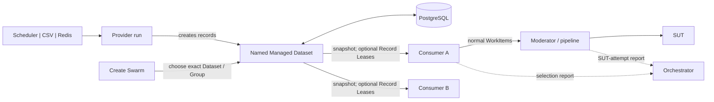

# Managed Datasets — Plain-language Guide

Status: in progress; proposed MVP, implementation and approval pending

For exact requirements, see the
[Managed Test Data MVP Specification](managed-test-data-lifecycle-generic-spec.md).

## One-minute version

Managed Datasets let several test swarms reuse synthetic SUT records that are
slow or expensive to create.

```text
Provider binding -> chooses Scheduler, CSV or Redis
Provider run -> creates one named Managed Dataset
Consumer run -> selects one exact Dataset Group
```

A provider swarm creates SUT objects once and shares traffic-ready records with
many consumer swarms. Arbitrary schema-defined keys may partition records; they
are not PocketHive fields. Ungrouped data uses one internal Group.

Managed Dataset is a new option alongside Redis Dataset. Redis support and
behaviour do not change. Each bee input/output explicitly chooses one adapter;
PocketHive never silently switches between them.

Records are reusable, not queue items. `SHARED` allows concurrent reuse;
`EXCLUSIVE_LEASE` reserves a record for one WorkItem until durable release or
expiry. Neither mode removes records, counts uses or reads validity from a SUT
response.

## Where configuration lives

| Place | Plain meaning |
|---|---|
| `scenarios/managed-dataset/<name>/` | A Dataset Definition bundle containing `dataset.yaml` and one root `record.schema.yaml`. It defines the required name, version, complete record shape and grouping fields. |
| `scenarios/dataset-contracts/<name>/<version>/` | An exact version of a reusable record-shape contract. Its required `schema.yaml` is immutable. |
| Scenario Manager | Loads the mounted packages, checks every reference and compiles one frozen schema digest. Runtime workers do not search these folders. |
| Provider Scenario Binding | Chooses the Definition, exactly one Provider Source, concrete Group values, one allocation policy, lifecycle and supply. Group values may use literals or only this provider's non-secret `vars` and `sut` context. |
| Consumer Scenario Template | Owns a required `managedDatasetRequirements` array with compatibility, `READ`, allocation mode and local lease bounds; it is empty when no Managed Dataset is needed. |
| Consumer Scenario Binding | Checks and freezes those requirements against one SUT Environment and Dataset Space. |
| Deployment profile | Owns Managed Dataset client limits and Redis connection contracts: endpoint, TLS, topology and credential reference. |
| Create Swarm | Uses a required `datasetSelections` array: one exact compatible Dataset or Group per requirement, or empty when there are none. |

Both registries share the existing `scenarios` mount alongside
`scenarios/bundles/<name>/`. The root record schema may combine several exact
contract versions and local `$defs`. Local definitions change with their
Dataset Definition; reusable or independently versioned definitions belong in
`dataset-contracts`. `latest`, ranges, remote lookup and fallback are not
supported. A bad reload publishes nothing and reports its errors; the last
valid registry revision remains active. Scenario Manager creates the schema
digest once, and all runtime components compare that opaque value rather than
rebuilding it.

A consumer requirement names a Dataset Definition, not a runtime Dataset or
Dataset Schema Contract:

```yaml
managedDatasetRequirements:
  - bindingRef: inputRecords
    datasetDefinitionId: shared-records
    access: READ
    allocation:
      type: EXCLUSIVE_LEASE
      acquireBatchSize: 10
      maximumHeldRecordLeases: 20
      acquireInterval: PT1S
```

`SHARED` uses only `allocation.type`. A swarm needing no Managed Dataset uses
`managedDatasetRequirements: []` and `datasetSelections: []`. The worker
references one requirement by `bindingRef`; the Binding freezes it. The
Definition remains the only grouping schema, and consumers never run provider
templates. `name` is a display label, `datasetId` is Dataset identity and
`groupId` identifies one partition.

Every provider binding has exactly one source:

| Source | What it does |
|---|---|
| `SCHEDULER` | Creates renewable provider work from bounded refill grants. |
| `CSV` | Reads one mounted provider-bundle file once, in stable row order. |
| `REDIS` | Uses one `connectionRef` and list name, copies the list and reads that fixed copy once in stable index order. The live list is not popped or changed. |

Provider Source selection and source-specific references live only in the
provider binding. They are not part of the Dataset Definition, a consumer
requirement or a bee block. A missing source, more than one source or an
unsupported source fails before the swarm starts; PocketHive never switches
source. The deployment profile owns referenced Redis endpoint, TLS, topology
and credential details; the provider binding does not repeat them. Existing
direct `SCHEDULER`, `CSV_DATASET` and `REDIS_DATASET` inputs remain separate
and unchanged.

## The flow



PostgreSQL is authoritative. Consumers select locally from a checked read-only
Group snapshot; measured requests call no control-plane or credential service.

## How creation and sharing work

The provider's first and terminal bees receive bounded source work and save
mapped results to one frozen Group. `SCHEDULER` refills renewable data from
authority grants. `CSV` and `REDIS` are finite, non-expiring imports: PocketHive
validates the whole source, binds its content fingerprint once, stages every
mapped record and publishes all Groups atomically. Invalid or incomplete input
exposes no partial Dataset, an exact restart resumes without duplicating
records, and changed content fails.

Restart preserves the provider run and Dataset; a new run creates a new
Dataset. Create Swarm freezes one exact compatible Dataset/Group/allocation per
requirement. Each Group owns its supply, snapshot and availability. Traffic
rate never drives scheduler refill, and Moderator still paces the SUT.
Background adapters use authenticated Orchestrator REST; workers never connect
to PostgreSQL.

For `EXCLUSIVE_LEASE`, the consumer input acquires a bounded local pool and
dispatches each lease once. The SDK releases after SUT-role completion and
output handoff. Failure or crash holds the record until authority expiry. There
is no renewal or fallback, and active leases do not trigger refill.

## Continuous traffic

A consumer verifies a complete immutable Group snapshot before one atomic
swap. The snapshot's compiled record-schema digest must match the frozen
Dataset. Existing readers finish on the old view. Failed refresh keeps that
view only while its records remain safe.

| Group state | Plain meaning |
|---|---|
| `READY` | Target supply and background health are within limits; admission and use are allowed. |
| `DEGRADED` | Minimum safe supply remains, but target or background health is late; existing safe traffic continues and new admission stops. |
| `UNAVAILABLE` | Safe supply, integrity, authorisation or snapshot safety is insufficient; admission and affected dispatch stop. |

The Dataset parent shows total supply and the worst Group state; each Group
keeps its own state. Background-work leases protect Orchestrator jobs. Record
Leases prevent two WorkItems holding one record. Temporary lease saturation
pauses the affected consumer; it is not record loss.

## How PocketHive proves the selected data is used

`READY` means the Group can supply safe records. `CONSUMING` means a consumer
selects that exact Group and its valid identity reaches the SUT-attempt boundary.

Each WorkItem carries one structured global header in its JSON body with:

```text
schemaVersion, datasetId, groupId, bindingRef, snapshotRevision,
recordId, selectedAt, usableUntil, allocation
```

It is not an observability or broker header. One declared SUT-attempt bee calls
the SDK guard immediately before network I/O. The guard blocks bad identity,
time or, for exclusive use, lease id/expiry.

Selection and guard report bounded counters through existing status.
Orchestrator owns the calculation; UI and PocketHive MCP use the same read
model. MCP shows the matching compiled schema, consumer selection and
SUT-boundary activity for the same frozen
`datasetId + groupId + allocation`, including lease validity when required. A
schema mismatch stops dispatch and cannot return `CONSUMING`.

| Consumption state | Plain meaning |
|---|---|
| `CONSUMING` | Fresh consumer-input and SUT-attempt activity for the exact Group, with a safe snapshot and all expected workers reporting. |
| `DEGRADED` | Valid attempts continue, but refresh, rejection, pipeline delay or partial reporting needs attention. |
| `NOT_CONSUMING` | Fresh mature status shows that an active binding is not selecting or reaching the boundary. |
| `UNKNOWN` | Status is missing, stale, restarting or intentionally inactive. PocketHive does not guess. |

This is operational evidence, not proof that the SUT accepted a request or that
delivery was exactly once. Reporting never blocks traffic and exposes no record
values or credentials.

## Sensible MVP boundary

Included: one required `SCHEDULER`, `CSV` or `REDIS` Provider Source; immutable
records with `SHARED` or `EXCLUSIVE_LEASE`; explicit empty requirements for
swarms that need no Dataset; Dataset-defined grouping fields; exact versioned
schema composition and local definitions; provider-only template resolution;
exact Group selection; scheduler refill; atomic finite imports; per-Group
snapshots; local safety checks; UI/MCP evidence; restart and replica safety.

Deferred: runtime-created or result-derived Groups, multi-Group queries,
filters, per-Group policy/ACL overrides, schema ranges, remote lookup,
per-record or live schema changes, use counts, Record Lease renewal or transfer,
multiple sources, source switching/fallback, CSV rotation, Redis pop or finite
source refill, SUT reconciliation, automatic provider lifecycle, exact-use
claims and audit-grade proof.
