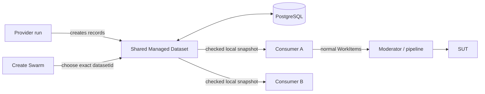

# Managed Datasets — Plain-language Guide

Status: in progress; proposed MVP, implementation and approval pending

For exact requirements, see the
[Managed Test Data MVP Specification](managed-test-data-lifecycle-generic-spec.md).

## One-minute version

Managed Datasets let several test swarms safely reuse synthetic SUT records
that are slow or expensive to create.

```text
Provider run -> creates a Managed Dataset
Consumer run -> selects that Managed Dataset
```

Records are not items in a queue. Reading a record does not remove or reserve
it. PocketHive does not count uses or guess from a SUT response that a record
has become invalid.

## The flow



PostgreSQL is authoritative. Consumers select locally from a checked, read-only
snapshot. Measured requests call no control-plane service or credential
provider.

## Important names

| Name | Status | Meaning |
|---|---|---|
| `WorkInput` | EXISTING | Adapter that supplies PocketHive work items. |
| `WorkOutput` | EXISTING | Adapter that publishes or saves a result. |
| `Managed Dataset` | PROPOSED | Shared immutable runtime records created by one provider run; not a queue. |
| `Scenario Binding` | PROPOSED | Frozen scenario, SUT, Dataset, schema and access requirements; not a provider selection. |
| `Managed Dataset Selection Claim` | PROPOSED | Prebuilt Dataset, record and expiry label; not proof of SUT processing. |

## How creation works

The provider is a normal pipeline. Its first bee receives bounded refill work
through a Managed Dataset `WorkInput`; its terminal bee saves mapped results
through a separate Managed Dataset `WorkOutput`. The same `bindingRef` joins
both ends to the created `datasetId`.

SUT templates and mappings stay in the scenario bundle; secrets stay as
references. Worker restart preserves the provider run and Dataset. A new run
creates both anew. The Dataset module never starts or replaces a provider.

## How consumers select and share

Create Swarm lists SUT-compatible Datasets. The operator selects one exact
`datasetId` for each `bindingRef`; Orchestrator rechecks and freezes it. If it
becomes unsafe, PocketHive stops instead of substituting another Dataset.

The consumer input includes `bindingRef` and `ratePerSec`. The rate supplies
work; it neither depletes records nor drives refill. Moderator paces the SUT.

The scenario owner must confirm that the SUT contract allows repeated,
concurrent record use. Unique or single-use work is outside this design.

## How refill stays safe

Each Dataset has explicit minimum, target and maximum ready levels. Expiring
records stop counting as renewal-ready before they expire. That early warning
creates refill work, giving the provider time to create replacements.

Replacement headroom lets old and new records overlap. PocketHive rejects
batch, capacity or headroom settings that cannot replace the largest expiry
group in time.

Exact grant and result retries return the earlier answer; changed replay fails.
A timed-out grant releases its slot and rejects a late result without SUT
investigation or repair.

## How continuous traffic behaves

A consumer verifies a complete immutable snapshot before one atomic swap.
Existing readers finish on the old view. Failed refresh keeps that view only
while its records remain safe.

| State | Plain meaning |
|---|---|
| `READY` | Target supply and background health are within limits; new and existing use is allowed. |
| `DEGRADED` | Minimum safe supply remains, but target or background health is late; existing safe traffic continues and new admission stops. |
| `UNAVAILABLE` | Safe supply, integrity, authorisation or the local snapshot is insufficient; admission and affected dispatch stop. |

Database leases and fencing give one Orchestrator replica each background job.
PostgreSQL HA belongs to infrastructure. During temporary control-plane
failure, admitted consumers continue from verified safe snapshots.

Queues and in-flight work are bounded. Backpressure pauses dispatch at the
limit. Metrics alert on refill, expiry, snapshot, queue, database and lease
risk.

## MVP boundary

The MVP includes shared reusable records, explicit Dataset selection, bounded
refill, local snapshots, idempotent restart recovery, replica coordination and
continuous-operation tests.

It excludes checkout, use limits, SUT reconciliation, automatic provider
lifecycle, sensitive records and multi-region active-active operation. The
previous qualification and consumption-evidence design, including evidence
frames, approvals, window calculations, MCP verdicts and governance coupling,
moves to a future milestone so it cannot create an MVP bootstrap cycle or slow
the measured path.
