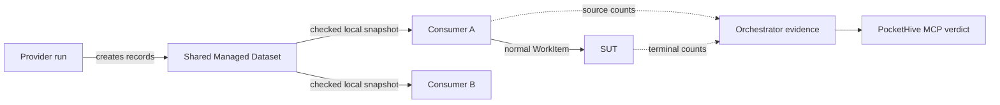

# Managed Datasets — Plain-language Guide

Status: proposed MVP; implementation and approval pending

For exact requirements, see the
[Managed Test Data MVP Specification](managed-test-data-lifecycle-generic-spec.md).

## One-minute version

Managed Datasets let test swarms share synthetic System Under Test (SUT)
records that are slow to create.

The model has two steps:

```text
Provider run -> creates a Managed Dataset
Consumer swarm -> selects that Managed Dataset
```

One provider owns each Dataset; many consumers may use it. Consumers do not
configure the provider, copy the Dataset, or change its records.

Create Swarm shows SUT-compatible Datasets. The operator chooses one exact
`datasetId` per Dataset input. PocketHive rechecks it and never substitutes.

## The flow



Orchestrator stores the Dataset in PostgreSQL. Consumers select from their own
checked local snapshots, so measured requests do not call PostgreSQL or
Orchestrator. Normal PocketHive worker I/O remains unchanged.

## Important names

| Name | Status | Meaning |
|---|---|---|
| `Managed Dataset` | PROPOSED | Shared runtime record pool created by one provider and usable by many consumers |
| `Dataset Space` | PROPOSED | Versioned SUT-specific catalogue of Dataset definitions |
| `Scenario Binding` | PROPOSED | Frozen scenario, SUT, Dataset requirements, schema, and access |
| `Qualification Evidence` | PROPOSED | Human-approved record proving one exact build and workload met the required profile |
| `TrustedClock` | PROPOSED | Calibrated clock used to stop unsafe expiry decisions |
| `Managed Dataset Selection Claim` | PROPOSED | Digest-protected `WorkItem` metadata identifying the selected record and validity |
| `Managed Dataset Evidence Frame` | PROPOSED | Cumulative source or terminal report containing counts and checksums, never records |
| `Managed Dataset Consumption Evidence` | PROPOSED | Orchestrator verdict for one consumer run, binding, Dataset, and time window |

After first use, this guide shortens the last three names to Selection Claim,
Evidence Frame, and Consumption Evidence.

## How creation and selection work

Provider admission creates one Managed Dataset per Managed Dataset output.
Retrying the same run and output returns the same `datasetId`; a new run creates
a new Dataset. Ownership never changes.

The consumer declares required shape and access. Create Swarm lists exact
SUT-bound matches and disables unavailable ones. Orchestrator rechecks SUT,
Dataset Space, schema, access, provider qualification, and availability,
validates consumer qualification, then freezes both. Bindings may share the
same Dataset.

## How sharing and refill stay safe

Each Dataset has one shared minimum, target, and maximum supply. The provider
receives only missing slots. Stable idempotency keys make retries safe;
uncertain SUT effects retain bounded capacity and are not retried blindly.

The Dataset module reports one availability result:

| Availability | Meaning |
|---|---|
| `READY` | New and existing consumers may use the Dataset |
| `DEGRADED` | Existing consumers may continue while records remain safe; new admission stops |
| `UNAVAILABLE` | Admission and selection stop |

Reason codes explain provider, supply, qualification, storage, contract, or
safety failure. Consumer clock, snapshot, authorisation, and qualification
failures affect only that run.

## How consumers stay fast and safe

Each consumer rotates checked snapshots in the background. A failed refresh
keeps the current view only while its records remain safe. Each selection adds
a Selection Claim to the `WorkItem`; workers preserve it and the final guard
rejects expired data. An unsafe TrustedClock stops only that consumer.

## What MCP can prove

MVP proof covers a `ONE_TO_ONE` path with one Dataset source and one final SUT
boundary. These boundaries send background Evidence Frames with counts and
Selection Claim checksums. Intermediate workers only validate the claim.

Orchestrator compares source and terminal populations. Each consumer run,
binding, Dataset, and window remains separate.

| Verdict | Meaning |
|---|---|
| `CONFORMING` | Complete qualified evidence shows the selected Dataset reached the SUT boundary without observed loss, duplication, invalid claims, or expiry |
| `NON_CONFORMING` | Complete evidence proves a contract violation |
| `INSUFFICIENT_EVIDENCE` | Evidence is missing, late, unqualified, inactive, or unsupported; this never passes |

MCP requires exact swarm, run, binding, start, and end. It returns the frozen
`datasetId` and Orchestrator verdict unchanged, with no fallback. This proves
PocketHive's Dataset path, not SUT business correctness.

## Example

A card provider creates one Dataset. Two payment swarms select it and use
separate local snapshots. MCP may return different verdicts because their
evidence remains separate; neither result changes the Dataset.

## MVP boundary

Included: one provider and many consumers, explicit SUT-compatible selection,
bounded refill, local snapshots, qualification, restart safety, and MCP proof.

Deferred: multiple providers, ownership transfer, automatic selection or
provider lifecycle, SUT reconciliation, sensitive or one-use data, Redis
authority, complex-topology proof, and high-availability qualification.

Owners must approve closed creation, listing, Create Swarm, claim, frame,
verdict, REST, MCP, security, and capacity contracts. Release requires sharing,
expiry, restart, evidence, security, and 24-hour soak tests.
