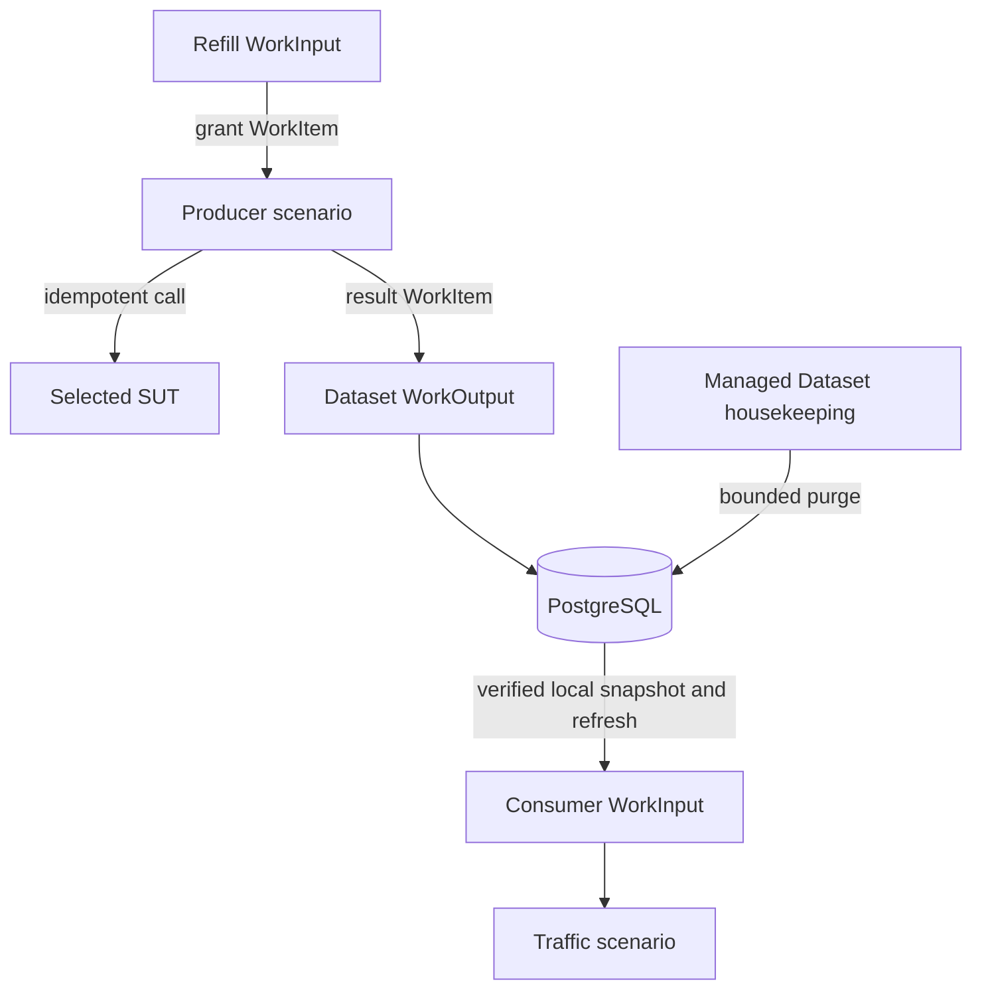

# Managed Datasets, explained

Status: in progress — 24/7 and HA-compatible design tightened

See the [MVP specification](managed-test-data-lifecycle-generic-spec.md) for
exact behavior and tests.

## Why this is needed

Some tests need thousands of synthetic cards, accounts, or users that are slow
to create but can be reused by several swarms. Managed Datasets provide one
durable, controlled store instead of making each scenario manage its own data.
The store can continuously replace expiring records during long-running tests.

## How it works

- The Dataset Space defines data for one SUT Environment.
- Scenario config names a logical `bindingRef`.
- Scenario Binding freezes the exact Dataset and SUT versions before runtime.
- The producer receives missing slots through `MANAGED_DATASET_REFILL` input.
- Its final bee commits through `MANAGED_DATASET` output.
- Consumers use `MANAGED_DATASET` input and select records from local memory.

This is the normal PocketHive `WorkInput`, `WorkItem`, and `WorkOutput` model.
Existing Rabbit `work.in/out`, worker status `workIn/workOut`, and swarm control
remain unchanged.

## SUT configuration

Provisioning behavior stays in the producer scenario bundle. It may use the
selected `sut`, `vars`, request templates, result mappings, and private auth
configuration. Missing context fails before the swarm starts. Credentials are
never stored in the bundle, Dataset, or `WorkItem`.

## Refill safety

Each Dataset has fixed `minimumReady`, `targetReady`, and `maximumReady` values.
For expiring data, records stop counting as renewal-ready before their expiry,
so the refill input receives replacement slots early. The Dataset API reserves
only those missing slots, including active reservations in the maximum.
Multiple producers therefore cannot oversupply.

Every SUT mutation uses a stable idempotency key:

| Outcome | Meaning |
|---|---|
| `COMPLETED` | Valid record committed with a durable receipt |
| `FAILED` | Conclusively produced no usable record; reservation released |
| `UNCERTAIN` | Effect may have happened; reservation retained and no blind retry |

Automatic mutating refill is rejected if the SUT cannot support idempotency.
Repeated failures, unusable results, or unresolved uncertainty open a visible
refill circuit instead of creating an endless mutation loop.

Scenario authors choose the Dataset and consumer rate, not database or network
tuning. PocketHive owns and enforces claim, polling, snapshot, memory, and
connection limits. It checks aggregate replicas, memory, refill capacity,
expiry bursts, retention, and database demand before startup. Unsafe or
oversized configuration fails; refill retries are delayed and spread out
rather than synchronised. Memory checks include both the active and next
snapshot during an atomic refresh.

Refill calls are rate-bounded, reported separately, and included in the total
load sent to the SUT; they are not invisible background traffic.

## Continuous operation

- An expiring long-running test must explicitly include a qualified refill
  binding. PocketHive does not guess or start one automatically.
- Consumers build a new snapshot in the background and switch to it atomically
  before the old records become unsafe.
- Every selection performs a final local expiry check; it never queries
  PostgreSQL or Orchestrator on the measured request path.
- Expiry metadata travels with the `WorkItem` and is checked again before each
  worker invocation. Data that expires in a queue is reported as dropped and
  never sent to the SUT.
- Expired rows are removed later in small bounded batches. Snapshot hydration,
  refill, and retention cannot consume the database capacity reserved for
  normal Orchestrator control and journals.
- After restart, PostgreSQL remains authoritative and consumers rehydrate a
  current safe snapshot before traffic resumes.

This supports continuously running tests within PocketHive's existing
deployment availability. PostgreSQL remains authoritative, and durable leases
and fences are required to prevent competing Dataset module replicas from
applying the same housekeeping work. A consumer may use its current local
snapshot only while it remains safe. The design is HA-compatible but remains
unverified; the current deployment is not HA-qualified, and backup restore is
separate work.

## Why reconciliation is deferred

The MVP refills expiring data to a fixed target and cleans up its own database.
A full reconciler would inspect and repair SUT state, revalidate or correct
records, deprovision SUT data, change live targets, and manage producer
lifecycle. That is a later workflow capability.

## Consumer readiness

Consumers download and verify a revision in the background, then switch to it
atomically. A failed refresh can use the current view only while it remains
safe. Traffic uses local data, so measured requests do not call Orchestrator or
PostgreSQL.

- `READY`: renewal target met; refill and consumer views are healthy.
- `DEGRADED`: safe traffic can continue, but renewal, refresh, purge, or uncertainty is late.
- `STARVED`: too few safe records; the dependent consumer input stops.
- `BLOCKED`: authorisation, clock, schema, quota, storage, service, refill circuit, or uncertainty prevents progress.

There is no fallback to another Dataset, old snapshot, CSV, or Redis.

## MVP boundary

Included: PostgreSQL, reusable synthetic records, proactive bounded refill,
expiry-safe snapshot rotation, bounded retention, durable receipts, readiness,
authorisation, and audit.

Deferred: generic SUT reconciliation/correction/deprovision, live target
changes, automatic producer start/stop, Redis authority, exclusive/one-use
records, multi-output, sensitive data, HA deployment and qualification, and
backup restore.

Before implementation, the team must approve the executable schemas/API,
worker contracts, security model, idempotent SUT double, aggregate
lifecycle/capacity profile, and evidence plan. Continuous-use approval requires
at least a 24-hour resource soak, two expiry/refill cycles, and one purge cycle.
